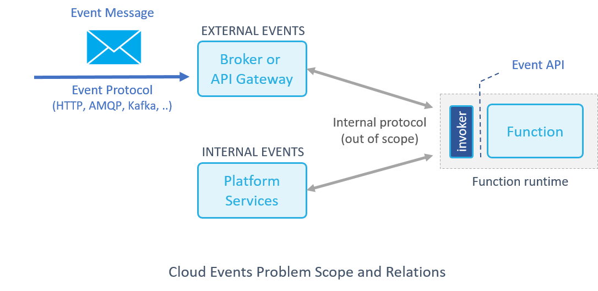

# THIS PROPOSAL IS BEING WORKED ON [HERE](https://github.com/cloudevents/spec)
# This document is kept around for posterity

# Cloud-Native Events 

**In This Document**
- [Overview and Problem Scope](#overview-and-problem-scope)
- [Event Message and Protocol](#event-message-and-protocol)
- [Event Consumer API](#event-consumer-api)
- [Micro-Batch Considerations](#micro-batch-considerations)
- [Event Routing](#event-routing)
- [Differences with open-events](#differences-with-open-events)


## Overview and Problem Scope 

In a cloud-native and serverless world the communication between services and functions is done through events and messages, the following document propose a common way to describe and publish an event (the event message and protocol), and a common way to consume an event (the Event API).

This common definition can allow function portability across platforms and interactions between services on different platforms. 

This document is based on the [Cloud-Native Event Mapping (CNEM)](https://docs.google.com/document/d/1dFfnWnbRDTvGwpwaBsvXRlw0ZyL3xYl7iXhYqbAPJjk/edit?usp=sharing) paper



**The are two types of events:**
- **External events** - derived from an external services or users, the message format and protocol should be agreed on and potentially have a spec
- **Internal events** - events that can be generated by a cloud platform (e.g. object/DB changes, scheduled notifications), those may have custom message formats and protocols which are invisible to the serverless user. 

External events require pre-defined event structure, this structure may contain protocol specific considerations (the way end-point addresses, authentication, and attributes are passed may differ between protocols such as http, kafka, mqtt, etc.) 

External events go through a gateway/router/broker which may embed more metadata into the message such as message arrival time, unique ID, identity/authentication info, etc. 

The events are consumed by the serverless function through language specific consumer APIs, those normalize the different types of external or internal events to a common and easy to use API. The APIs may be optimized to the target language data types. 

Internal or external events may be structured, use protocol specific encoding, or compile time encoding (e.g. protobuf), in such cases the use of standard body + content-type may not be appropriate (adds redundant serialization/deserialization overhead) and a prefered approach would be to deliver a typed **attribute** map to the function instead of an encoded **body** payload.  


 
## Event Message and Protocol 

Events can be pushed to the platform through various industry standard protocol (HTTP, AMQP, MQTT, SMTP, ..), Open source protocols (Kafka, NATS, ..), or platform/vendor specific protocols (AWS Kinesis, Azure ??, GCP ??, ..) .

Event messages can be generalized as having destination, header and body. Some protocols don't support headers in such cases a pseudo header can be emulated from protocol specific attributes, taken from parts of the body (e.g. within the payload have header length, header, body), or other metadata (e.g. the content type and schema will probably be unique per stream topic and can be stored in ZK/etcd). 

Headers are optional, header elements can be added by the gateway and/or by the function invoker (e.g. if a message doesn't contain a timestamp or an ID the gateway or invoker should add one)

Secure protocols would authenticate the client, and should embed the client identity information as additional message headers 

The event message structure:
- **path** - string - The destination end-point address (e.g. URL) or target topic 
- **headers** - map[string]string - a key/value list with some predefined key (see below), header elements can be appended by the gateway and/or invoker
- **body** - []byte - a payload with event specific data encoded by the format specified in the  “content-type” header (text/json/xml/bin..) 

Pre-defined **Headers**, provided by the client or added by the gateway/broker/invoker: 

- **event-id** - Required, unique ID of the event, used for invocation logging and tracking 
- **event-type** - Required, identify the unique event class/kind/ver 
  - apiVersion - Api namespace and version (similar to k8s approach)
  - class - event model sync | async | stream | ..
  - Kind - the event sub-type (e.g. GitHub webhook message) 
- **content-type** - Required if contain a body, the body encoding scheme (e.g. application/json)
- **created-at** - RFC 3339, Timestamp of event creation generated by the client.
- **source** - the source resource which published the event 
- **source-identity** - the Identity of the origin (should have been authenticated by the messaging or gateway system)
- **source-type** - the type of the event source  
- **method** - the (http) method used in the call
- **log-level** - the level of logging that the publisher may want to log this specific event (e.g. debug)
- **receipt-queue** - an optional return end-point for completion events

the event body schema is specific to the event kind+version (if the event schema changes we need to advance a event version number)
> for HTTP compliance may need to add some x-..


## Event Consumer API

The event API provide a language specific interface for retrieving the data from internal/external events in a developer friendly way. 

The message payload can be delivered unstructured (using an encoded body) or structured (a map of attributes/fields), for some protocols delivering structured message save an extra layer of serialization/deserialization as well as simplify the developer API (skip the unmarshal part)

Golang Event API Example
```golang
type Event interface {
	// Unique ID of the event 
	GetID() string 
	// Event Source class, kind, apiVersion 
	GetEventType() EventType
	// Event Source address (e.g. origin host IP:port, origin stream, ..)   
	GetSourceAddress() string 
	// Source identity (e.g. user name, authenticated by a gateway)  
	GetSourceIdentity() string
	// Content type e.g. application/json 
	GetContentType() string
	// byte array of content, encoding defined by content type 
	GetBody() []byte
	// Get header(s) (e.g. HTTP, AMQP, or anything injected by the source)
	GetHeader(key string) string
	GetHeaders() map[string]string
	// Get attribute(s), use structured attrs or decode the body for the user 
	// Allow functions to ignore the specific event encoding (does the decoding based on the content-type)  
	// Or used when event is structured/decoded (or there is no body to decode, e.g. DB results, RPC calls ..)  
	// also have convenience methods: GetAttributeByteSlice, GetAttributeString, GetAttributeInt
	GetAttribute(key string) interface{}
	// can consider having a prefix/match string input, to return all the attrs under a tree leaf 
	GetAttributes() map[string]interface{}
	// Original event timestamp or gateway timestamp (if origin timestamp not specified) 
	GetTimestamp() time.Time
	// Logical path requested by the event (e.g. HTTP request path, stream name, etc.) 
	GetPath() string
	// URL object for HTTP requests, for developer convenience 
	GetURL() URL
	// HTTP or transport method 
	GetMethod() string
	// Translate event to a json byte array (i.e. to a similar structure suggested by open-events)
	AsJson() []byte 
}
``` 

## Micro-Batch Considerations 

For various streaming and asynchronous implementations the client may push one event at a time, but the function may want to process multiple events per invocation and obtain higher efficiency. There needs to be a mechanism to trigger a function with an array of events. 

An example implementation can be to indicate in the event type that it's a list type and pass a “records” list object where each record holds its own headers, body or attributes. 

## Event Routing 

Once the event structure, protocol, and API are well defined it is becoming trivial to route from one type to another, or even route internal events to external clouds. 

It can be accomplished by simply writing a serverless function which listens on the source event, opens a connection to the destination protocol and maps every incoming event (received through event API) to an event message over the destination protocol. 

## Differences with open-events

- the event message content is very similar in both proposals, the key difference is that open-events suggests two layers of serialization, the HTTP body is of type JSON, and the data can be of different type (e.g. XML, protobuf, bin, ..), while this proposal suggest to put all metadata in headers (e.g. HTTP, AMQP, etc.). The challanges with open-events approach are:
  - it forces us to unmarshal the events twice, say a message is encoded with binary format like avro/protobuf/flatbuffers.. instead of using it as is we must encode/decode the json followed by encode/decode to/from base64 followed by decode to the language struct this will take significant amount of CPU/overhead.    
  - it adds complexity: e.g. an existing event source that just send an HTTP body need to re-format the message and embed the body as a nested object under the event, also cant use postman or other tools as-is. in this proposal each layer or intermidiate gateway can add metadata headers without reformatting the body
  - every change to the metadata require advancing event schema version vs simply adding a new header 
  - we can decide to allow both approaches to coexist, a user can choose if he wants double serialization or not (it wont impact the consumer API just the performance/complexity), note the Consumer API **AsJson()** method can generate a serialized version 
- in this proposal, there are few additional metadata elements, e.g.:
  - the Event Type has **apiVersion** allowing event schema changes and **class** (which can be optional) 
  - it renamed "resource" to "source" since resource sounds ambiguous, plus it adds **source-identity**
- in this proposal, the message can be consumed serialized (via Body) or de-serialized (via attributes), very useful when the function runtime already hold a de-serialized version of the event (e.g. used proto-buf, DB client API, ..)
- in this proposal, gateways/brokers/invokers can append headers (e.g. a gateway authenticated a user and adds the user ID, the client didnt provide a unique ID we supplement one, the gateway can add client transport info such as client browser etc.)
