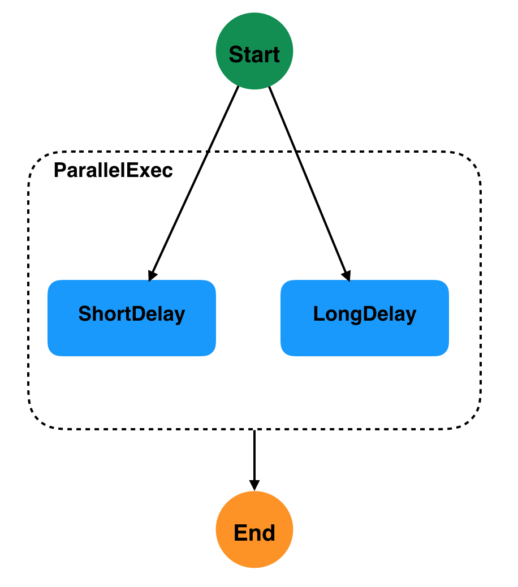
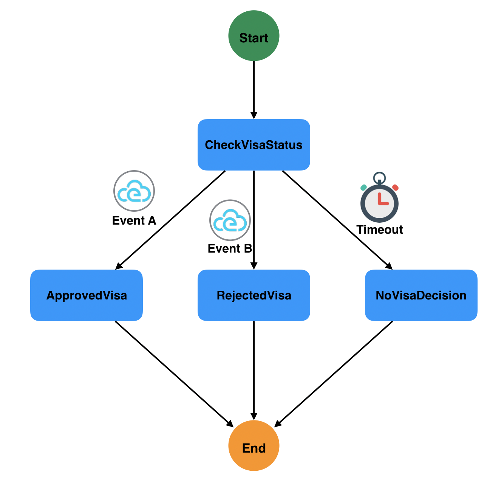
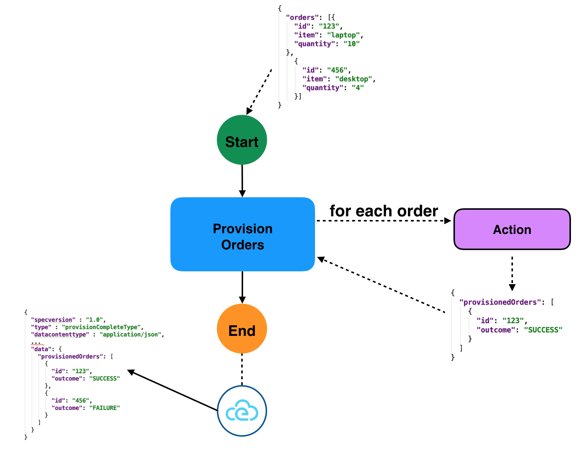
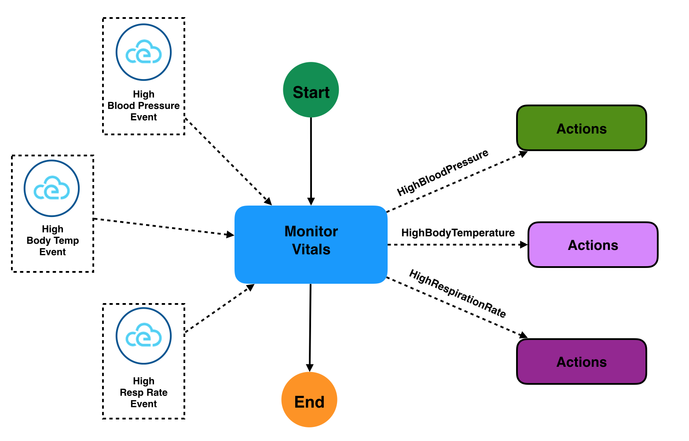
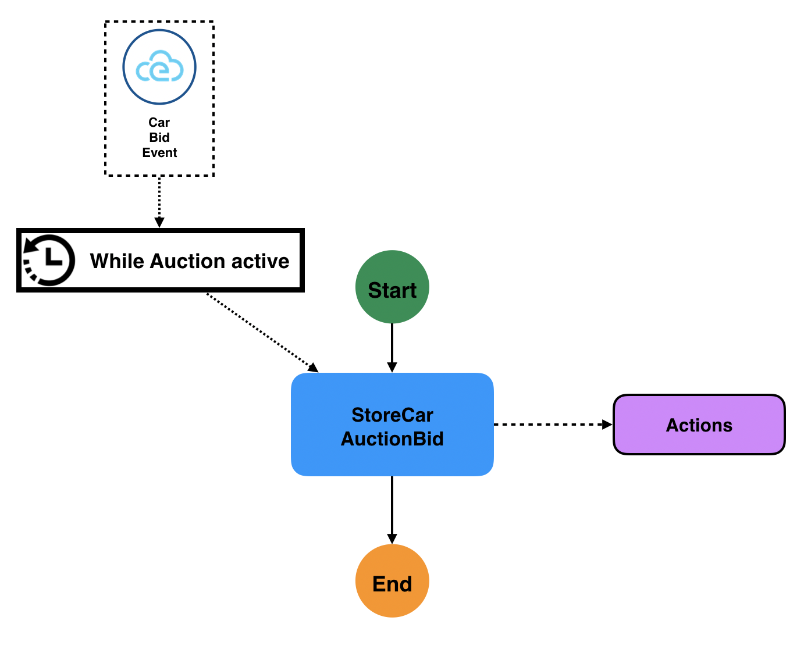

# Examples

## Table of Contents

- [Hello World](#Hello-World-Example)
- [Greeting](#Greeting-Example)
- [Event-based greeting](#Event-Based-Greeting-Example)
- [Solving Math Problems (ForEach state)](#Solving-Math-Problems-Example)
- [Parallel Execution](#Parallel-Execution-Example)
- [Event Based Transitions (Event-based Switch)](#Event-Based-Transitions-Example)
- [Applicant Request Decision (Data-based Switch + SubFlow states)](#Applicant-Request-Decision-Example)
- [Provision Orders (Error Handling)](#Provision-Orders-Example)
- [Monitor Job for completion (Polling)](#Monitor-Job-Example)
- [Send CloudEvent on Workflow Completion](#Send-CloudEvent-On-Workfow-Completion-Example)
- [Monitor Patient Vital Signs (Event state)](#Monitor-Patient-Vital-Signs-Example)
- [Finalize College Application (Event state)](#Finalize-College-Application-Example)
- [Perform Customer Credit Check (Callback state)](#Perform-Customer-Credit-Check-Example)
- [Handle Car Auction Bids (Scheduled start Event state)](#Handle-Car-Auction-Bids-Example)

### Hello World Example

#### Description

This example uses two inject states. The "Hello" state statically injects the following JSON into its data input:

```json
{
  "result": "Hello"
}
```

which then becomes the data input of the transition "World" state.
The "World" state merges its data input with it's injected JSON and uses a filter to set its data output to the
value of the "result" property. Since it is an end state, it's data output becomes the workflow data output:

```text
"Hello World!"
```

#### Workflow Definition

<table>
<tr>
    <th>JSON</th>
    <th>YAML</th>
</tr>
<tr>
<td valign="top">

```json
{  
"id": "helloworld",
"version": "1.0",
"name": "Hello World Workflow",
"description": "Static Hello World",
"states":[  
  {  
     "name":"Hello",
     "type":"inject",
     "start": {
       "kind": "default"
     },
     "data": {
        "result": "Hello"
     },
     "transition": {
       "nextState": "World"
     }
  },
  {  
     "name":"World",
     "type":"inject",
     "data": {
        "result": " World!"
     },
     "stateDataFilter": {
       "dataOutputPath": "$.result"
     },
     "end": {
       "kind": "default"
     }
  }
]
}
```

</td>
<td valign="top">

```yaml
id: helloworld
version: '1.0'
name: Hello World Workflow
description: Static Hello World
states:
- name: Hello
  type: inject
  start:
    kind: default
  data:
    result: Hello
  transition:
    nextState: World
- name: World
  type: inject
  data:
    result: " World!"
  stateDataFilter:
    dataOutputPath: "$.result"
  end:
    kind: default
```

</td>
</tr>
</table>

#### Workflow Diagram

<p align="center">

</p>

### Greeting Example

#### Description

This example shows a single Operation state with one action that calls the "greeting" function.
The workflow data input is assumed to be the name of the person to greet:

```json
{
  "greet": {
    "name": "John"
  }
}
```

The results of the action is assumed to be the full greeting for the provided persons name:

```json
{
  "payload": {
    "greeting": "Welcome to Serverless Workflow, John!"
  }
}
```

The states action data filter selects the greeting object from the function return to be placed into the state data.
Then the states state data filter selects only the greeting object to be returned as its data output, which
becomes the workflow data output (as it is an end state):

```text
   "Welcome to Serverless Workflow, John!"
```

#### Workflow Definition

<table>
<tr>
    <th>JSON</th>
    <th>YAML</th>
</tr>
<tr>
<td valign="top">

```json
{  
"id": "greeting",
"version": "1.0",
"name": "Greeting Workflow",
"description": "Greet Someone",
"functions": [
  {
     "name": "greetingFunction",
     "resource": "functionResourse"
  }
],
"states":[  
  {  
     "name":"Greet",
     "type":"operation",
     "start": {
       "kind": "default"
     },
     "actionMode":"sequential",
     "actions":[  
        {  
           "functionRef": {
              "refName": "greetingFunction",
              "parameters": {
                "name": "$.greet.name"
              }
           },
           "actionDataFilter": {
              "dataResultsPath": "$.payload.greeting"
           }
        }
     ],
     "stateDataFilter": {
        "dataOutputPath": "$.greeting"
     },
     "end": {
       "kind": "default"
     }
  }
]
}
```

</td>
<td valign="top">

```yaml
id: greeting
version: '1.0'
name: Greeting Workflow
description: Greet Someone
functions:
- name: greetingFunction
  resource: functionResourse
states:
- name: Greet
  type: operation
  start:
    kind: default
  actionMode: sequential
  actions:
  - functionRef:
      refName: greetingFunction
      parameters:
        name: "$.greet.name"
    actionDataFilter:
      dataResultsPath: "$.payload.greeting"
  stateDataFilter:
    dataOutputPath: "$.greeting"
  end:
    kind: default
```

</td>
</tr>
</table>

#### Workflow Diagram

<p align="center">

</p>

### Event Based Greeting Example

#### Description

This example shows a single Event state with one action that calls the "greeting" function.
The event state consumes cloud events of type "greetingEventType". When an even with this type
is consumed, the Event state performs a single action that calls the defined "greeting" function.

For the sake of the example we assume that the cloud event we will consume has the format:

```json
{
    "specversion" : "1.0",
    "type" : "greetingEventType",
    "source" : "greetingEventSource",
    "data" : {
      "greet": {
          "name": "John"
        }
    }
}
```

The results of the action is assumed to be the full greeting for the provided persons name:

```json
{
  "payload": {
    "greeting": "Welcome to Serverless Workflow, John!"
  }
}
```

Note that in the workflow definition you can see two filters defined. The event data filter defined inside the consume element:

```json
{
  "eventDataFilter": {
    "dataOutputPath": "$.data.greet"
  }
}
```

which is triggered when the greeting event is consumed. It extracts its "data.greet" of the event and
merges it with the states data.

The second, a state data filter, which is defined on the event state itself:

```json
{
  "stateDataFilter": {
     "dataOutputPath": "$.payload.greeting"
  }
}
```

filters what is selected to be the state data output which then becomes the workflow data output (as it is an end state):

```text
   "Welcome to Serverless Workflow, John!"
```

#### Workflow Definition

<table>
<tr>
    <th>JSON</th>
    <th>YAML</th>
</tr>
<tr>
<td valign="top">

```json
{  
"id": "eventbasedgreeting",
"version": "1.0",
"name": "Event Based Greeting Workflow",
"description": "Event Based Greeting",
"events": [
 {
  "name": "GreetingEvent",
  "type": "greetingEventType",
  "source": "greetingEventSource"
 }
],
"functions": [
  {
     "name": "greetingFunction",
     "resource": "functionResourse"
  }
],
"states":[  
  {  
     "name":"Greet",
     "type":"event",
     "start": {
       "kind": "default"
     },
     "eventsActions": [{
         "eventRefs": ["GreetingEvent"],
         "eventDataFilter": {
            "inputPath": "$.data.greet"
         },
         "actions":[  
            {  
               "functionRef": {
                  "refName": "greetingFunction",
                  "parameters": {
                    "name": "$.greet.name"
                  }
               }
            }
         ]
     }],
     "stateDataFilter": {
        "dataOutputPath": "$.payload.greeting"
     },
     "end": {
       "kind": "default"
     }
  }
]
}
```

</td>
<td valign="top">

```yaml
id: eventbasedgreeting
version: '1.0'
name: Event Based Greeting Workflow
description: Event Based Greeting
events:
- name: GreetingEvent
  type: greetingEventType
  source: greetingEventSource
functions:
- name: greetingFunction
  resource: functionResourse
states:
- name: Greet
  type: event
  start:
    kind: default
  eventsActions:
  - eventRefs:
    - GreetingEvent
    eventDataFilter:
      inputPath: "$.data.greet"
    actions:
    - functionRef:
        refName: greetingFunction
        parameters:
          name: "$.greet.name"
  stateDataFilter:
    dataOutputPath: "$.payload.greeting"
  end:
    kind: default
```

</td>
</tr>
</table>

#### Workflow Diagram

<p align="center">

</p>

### Solving Math Problems Example

#### Description

In this example we show how to iterate over some data input using the ForEach state.
The state will iterate over a collection of simple math expressions which are
passed in as the workflow data input:

```json
    {
      "expressions": ["2+2", "4-1", "10x3", "20/2"]
    }
```

The ForEach state will execute a single defined operation state for each math expression. The operation
state contains an action which calls a serverless function which actually solves the expression
and returns its result.

Results of all math expressions are accumulated into the data output of the ForEach state which become the final
result of the workflow execution.

#### Workflow Definition

<table>
<tr>
    <th>JSON</th>
    <th>YAML</th>
</tr>
<tr>
<td valign="top">

```json
{  
"id": "solvemathproblems",
"version": "1.0",
"name": "Solve Math Problems Workflow",
"description": "Solve math problems",
"functions": [
{
  "name": "solveMathExpressionFunction",
  "resource": "functionResourse"
}
],
"states":[  
{
 "name":"Solve",
 "start": {
  "kind": "default"
},
 "type":"foreach",
 "inputCollection": "$.expressions",
 "inputParameter": "$.singleexpression",
 "outputCollection": "$.results",
 "states": [
{  
    "name":"GetResults",
    "type":"operation",
     "start": {
       "kind": "default"
    },
    "actionMode":"sequential",
    "actions":[  
       {  
          "functionRef": {
             "refName": "solveMathExpressionFunction",
             "parameters": {
               "expression": "$.singleexpression"
             }
          }
       }
    ],
    "end": {
      "kind": "default"
    }
}
 ],
 "stateDataFilter": {
    "dataOutputPath": "$.results"
 },
 "end": {
   "kind": "default"
 }
}
]
}
```

</td>
<td valign="top">

```yaml
id: solvemathproblems
version: '1.0'
name: Solve Math Problems Workflow
description: Solve math problems
functions:
- name: solveMathExpressionFunction
  resource: functionResourse
states:
- name: Solve
  start:
    kind: default
  type: foreach
  inputCollection: "$.expressions"
  inputParameter: "$.singleexpression"
  outputCollection: "$.results"
  states:
  - name: GetResults
    type: operation
    start:
      kind: default
    actionMode: sequential
    actions:
    - functionRef:
        refName: solveMathExpressionFunction
        parameters:
          expression: "$.singleexpression"
    end:
      kind: default
  stateDataFilter:
    dataOutputPath: "$.results"
  end:
    kind: default
```

</td>
</tr>
</table>

#### Workflow Diagram

<p align="center">

</p>

### Parallel Execution Example

#### Description

This example uses a parallel state to execute two branches (simple wait states) at the same time.
The completionType type is set to "and", which means the parallel state has to wait for both branches
to finish execution before it can transition (end workflow execution in this case as it is an end state).

#### Workflow Definition

<table>
<tr>
    <th>JSON</th>
    <th>YAML</th>
</tr>
<tr>
<td valign="top">

```json
{  
"id": "parallelexec",
"version": "1.0",
"name": "Parallel Execution Workflow",
"description": "Executes two branches in parallel",
"states":[  
  {  
     "name":"ParallelExec",
     "type":"parallel",
     "start": {
       "kind": "default"
     },
     "completionType": "and",
     "branches": [
        {
          "name": "Branch1",
          "states": [
            {
                "name":"ShortDelay",
                 "type":"delay",
                 "start": {
                    "kind": "default"
                },
                 "timeDelay": "PT15S",
                 "end": {
                   "kind": "default"
                 }
            }
          ]
        },
        {
          "name": "Branch2",
          "states": [
             {
                 "name":"LongDelay",
                  "type":"delay",
                  "start": {
                     "kind": "default"
                  },
                  "timeDelay": "PT2M",
                  "end": {
                    "kind": "default"
                  }
             }
          ]
        }
     ],
     "end": {
       "kind": "default"
     }
  }
]
}
```

</td>
<td valign="top">

```yaml
id: parallelexec
version: '1.0'
name: Parallel Execution Workflow
description: Executes two branches in parallel
states:
- name: ParallelExec
  type: parallel
  start:
    kind: default
  branches:
  completionType: and
  - name: Branch1
    states:
    - name: ShortDelay
      type: delay
      start:
        kind: default
      timeDelay: PT15S
      end:
        kind: default
  - name: Branch2
    states:
    - name: LongDelay
      type: delay
      start:
        kind: default
      timeDelay: PT2M
      end:
        kind: default
  end:
    kind: default
```

</td>
</tr>
</table>

#### Workflow Diagram

<p align="center">

</p>


### Event Based Transitions Example

#### Description

In this example we use an Event-based Switch state to wait for arrival
of the "VisaApproved", or "VisaRejected" Cloud Events. Depending on which type of event happens,
the workflow performs a different transition. If none of the events arrive in the defined 1 hour timeout
period, the workflow transitions to the "HandleNoVisaDecision" state. 

#### Workflow Definition

<table>
<tr>
    <th>JSON</th>
    <th>YAML</th>
</tr>
<tr>
<td valign="top">

```json
{  
"id": "eventbasedswitch",
"version": "1.0",
"name": "Event Based Switch Transitions",
"description": "Event Based Switch Transitions",
"events": [
{
    "name": "visaApprovedEvent",
    "type": "VisaApproved",
    "source": "visaCheckSource"
},
{
    "name": "visaRejectedEvent",
    "type": "VisaRejected",
    "source": "visaCheckSource"
}
],
"states":[  
  {  
     "name":"CheckVisaStatus",
     "type":"switch",
     "start": {
        "kind": "default"
     },
     "eventConditions": [
        {
          "eventRef": "visaApprovedEvent",
          "transition": {
            "nextState": "HandleApprovedVisa"
          }
        },
        {
          "eventRef": "visaRejectedEvent",
          "transition": {
            "nextState": "HandleRejectedVisa"
          }
        }
     ],
     "eventTimeout": "PT1H",
     "default": {
        "nextState": "HandleNoVisaDecision"
     }
  },
  {
    "name": "HandleApprovedVisa",
    "type": "subflow",
    "workflowId": "handleApprovedVisaWorkflowID",
    "end": {
      "kind": "default"
    }
  },
  {
      "name": "HandleRejectedVisa",
      "type": "subflow",
      "workflowId": "handleRejectedVisaWorkflowID",
      "end": {
        "kind": "default"
      }
  },
  {
      "name": "HandleNoVisaDecision",
      "type": "subflow",
      "workflowId": "handleNoVisaDecisionWorkfowId",
      "end": {
        "kind": "default"
      }
  }
]
}
```

</td>
<td valign="top">

```yaml
id: eventbasedswitch
version: '1.0'
name: Event Based Switch Transitions
description: Event Based Switch Transitions
events:
- name: visaApprovedEvent
  type: VisaApproved
  source: visaCheckSource
- name: visaRejectedEvent
  type: VisaRejected
  source: visaCheckSource
states:
- name: CheckVisaStatus
  type: SWITCH
  start:
    kind: DEFAULT
  eventConditions:
  - eventRef: visaApprovedEvent
    transition:
      nextState: HandleApprovedVisa
  - eventRef: visaRejectedEvent
    transition:
      nextState: HandleRejectedVisa
  eventTimeout: PT1H
  default:
    nextState: HandleNoVisaDecision
- name: HandleApprovedVisa
  type: SUBFLOW
  workflowId: handleApprovedVisaWorkflowID
  end:
    kind: DEFAULT
- name: HandleRejectedVisa
  type: SUBFLOW
  workflowId: handleRejectedVisaWorkflowID
  end:
    kind: DEFAULT
- name: HandleNoVisaDecision
  type: SUBFLOW
  workflowId: handleNoVisaDecisionWorkfowId
  end:
    kind: DEFAULT
```

</td>
</tr>
</table>

#### Workflow Diagram

<p align="center">

</p>


### Applicant Request Decision Example

#### Description

This example shows off the switch state and the subflow state. The workflow is started with application information data as input:

```json
    {
      "applicant": {
        "fname": "John",
        "lname": "Stockton",
        "age": 22,
        "email": "js@something.com"
      }
    }
```

We use the switch state with two conditions to determine if the application should be made based on the applicants age.
If the applicants age is over 18 we start the application (subflow state). Otherwise the workflow notifies the
 applicant of the rejection.

#### Workflow Definition

<table>
<tr>
    <th>JSON</th>
    <th>YAML</th>
</tr>
<tr>
<td valign="top">

```json
{  
   "id": "applicantrequest",
   "version": "1.0",
   "name": "Applicant Request Decision Workflow",
   "description": "Determine if applicant request is valid",
   "functions": [
     {
        "name": "sendRejectionEmailFunction",
        "resource": "functionResourse"
     }
   ],
   "states":[  
      {  
         "name":"CheckApplication",
         "type":"switch",
         "start": {
            "kind": "default"
         },
         "dataConditions": [
            {
              "path": "$.applicant.age",
              "value": "18",
              "operator": "greaterthanorequals",
              "transition": {
                "nextState": "StartApplication"
              }
            },
            {
              "path": "$.applicant.age",
              "value": "18",
              "operator": "lessthan",
              "transition": {
                "nextState": "RejectApplication"
              }
            }
         ],
         "default": {
            "nextState": "RejectApplication"
         }
      },
      {
        "name": "StartApplication",
        "type": "subflow",
        "workflowId": "startApplicationWorkflowId",
        "end": {
          "kind": "default"
        }
      },
      {  
        "name":"RejectApplication",
        "type":"operation",
        "actionMode":"sequential",
        "actions":[  
           {  
              "functionRef": {
                 "refName": "sendRejectionEmailFunction",
                 "parameters": {
                   "applicant": "$.applicant"
                 }
              }
           }
        ],
        "end": {
          "kind": "default"
        }
    }
   ]
}
```

</td>
<td valign="top">

```yaml
id: applicantrequest
version: '1.0'
name: Applicant Request Decision Workflow
description: Determine if applicant request is valid
functions:
- name: sendRejectionEmailFunction
  resource: functionResourse
states:
- name: CheckApplication
  type: switch
  start:
    kind: default
  dataConditions:
  - path: "$.applicant.age"
    value: '18'
    operator: greaterthanorequals
    transition:
      nextState: StartApplication
  - path: "$.applicant.age"
    value: '18'
    operator: lessthan
    transition:
      nextState: RejectApplication
  default:
    nextState: RejectApplication
- name: StartApplication
  type: subflow
  workflowId: startApplicationWorkflowId
  end:
    kind: default
- name: RejectApplication
  type: operation
  actionMode: sequential
  actions:
  - functionRef:
      refName: sendRejectionEmailFunction
      parameters:
        applicant: "$.applicant"
  end:
    kind: default
```

</td>
</tr>
</table>

#### Workflow Diagram

<p align="center">

</p>

### Provision Orders Example

#### Description

In this example we show off the states error handling capability. The workflow data input that's passed in contains
missing order information that causes the function in the "ProvisionOrder" state to throw a runtime exception. With the "onError" expression we
can transition the workflow to different error handling states depending on the error thrown. Each type of error
in this example is handled by simple delay states, each including an error data filter which sets the exception info as their
data output. If no error is caught the workflow can transition to the "ApplyOrder" state.

Workflow data is assumed to me:

```json
    {
      "order": {
        "id": "",
        "item": "laptop",
        "quantity": "10"
      }
    }
```

The data output of the workflow contains the information of the exception caught during workflow execution.

#### Workflow Definition

<table>
<tr>
    <th>JSON</th>
    <th>YAML</th>
</tr>
<tr>
<td valign="top">

```json
{  
"id": "provisionorders",
"version": "1.0",
"name": "Provision Orders",
"description": "Provision Orders and handle errors thrown",
"functions": [
  {
     "name": "provisionOrderFunction",
     "resource": "functionResourse"
  }
],
"states":[  
  {  
    "name":"ProvisionOrder",
    "type":"operation",
    "start": {
      "kind": "default"
    },
    "actionMode":"sequential",
    "actions":[  
       {  
          "functionRef": {
             "refName": "provisionOrderFunction",
             "parameters": {
               "order": "$.order"
             }
          }
       }
    ],
    "onError": [
       {
         "expression": {
            "language": "spel",
            "body": "name eq 'MissingOrderIdException'"
         },
         "transition": {
           "nextState": "MissingId"
         }
       },
       {
         "expression": {
           "language": "spel",
           "body": "name eq 'MissingOrderItemException'"
         },
         "transition": {
           "nextState": "MissingItem"
         }
       },
       {
        "expression": {
          "language": "spel",
          "body": "name eq 'MissingOrderQuantityException'"
        },
        "transition": {
          "nextState": "MissingQuantity"
        }
       }
    ],
    "stateDataFilter": {
       "dataOutputPath": "$.exception"
    },
    "transition": {
       "nextState":"ApplyOrder"
    }
},
{
   "name": "MissingId",
   "type": "subflow",
   "workflowId": "handleMissingIdExceptionWorkflow",
   "end": {
     "kind": "default"
   }
},
{
   "name": "MissingItem",
   "type": "subflow",
   "workflowId": "handleMissingItemExceptionWorkflow",
   "end": {
     "kind": "default"
   }
},
{
   "name": "MissingQuantity",
   "type": "subflow",
   "workflowId": "handleMissingQuantityExceptionWorkflow",
   "end": {
     "kind": "default"
   }
},
{
   "name": "ApplyOrder",
   "type": "subflow",
   "workflowId": "applyOrderWorkflowId",
   "end": {
     "kind": "default"
   }
}
]
}
```

</td>
<td valign="top">

```yaml
id: provisionorders
version: '1.0'
name: Provision Orders
description: Provision Orders and handle errors thrown
functions:
- name: provisionOrderFunction
  resource: functionResourse
states:
- name: ProvisionOrder
  type: operation
  start:
    kind: default
  actionMode: sequential
  actions:
  - functionRef:
      refName: provisionOrderFunction
      parameters:
        order: "$.order"
  onError:
  - expression:
      language: spel
      body: name eq 'MissingOrderIdException'
    transition:
      nextState: MissingId
  - expression:
      language: spel
      body: name eq 'MissingOrderItemException'
    transition:
      nextState: MissingItem
  - expression:
      language: spel
      body: name eq 'MissingOrderQuantityException'
    transition:
      nextState: MissingQuantity
  stateDataFilter:
    dataOutputPath: "$.exception"
  transition:
    nextState: ApplyOrder
- name: MissingId
  type: subflow
  workflowId: handleMissingIdExceptionWorkflow
  end:
    kind: default
- name: MissingItem
  type: subflow
  workflowId: handleMissingItemExceptionWorkflow
  end:
    kind: default
- name: MissingQuantity
  type: subflow
  workflowId: handleMissingQuantityExceptionWorkflow
  end:
    kind: default
- name: ApplyOrder
  type: subflow
  workflowId: applyOrderWorkflowId
  end:
    kind: default
```

</td>
</tr>
</table>

#### Workflow Diagram

<p align="center">

</p>

### Monitor Job Example

#### Description

In this example we submit a job via an operation state action (serverless function call). It is assumed that it takes some time for
the submitted job to complete and that it's completion can be checked via another separate serverless function call.

To check for completion we first wait 5 seconds and then get the results of the "CheckJob" serverless function.
Depending on the results of this we either return the results or transition back to waiting and checking the job completion.
This is done until the job submission returns "SUCCEEDED" or "FAILED" and the job submission results are reported before workflow
finishes execution.

In the case job submission raises a runtime error, we transition to a SubFlow state which handles the job submission issue.


#### Workflow Definition

<table>
<tr>
    <th>JSON</th>
    <th>YAML</th>
</tr>
<tr>
<td valign="top">

```json
{
  "id": "jobmonitoring",
  "version": "1.0",
  "name": "Job Monitoring",
  "description": "Monitor finished execution of a submitted job",
  "functions": [
    {
      "name": "submitJob",
      "resource": "submitJobResource"
    },
    {
      "name": "checkJobStatus",
      "resource": "checkJobStatusResource"
    },
    {
      "name": "reportJobSuceeded",
      "resource": "reportJobSuceededResource"
    },
    {
      "name": "reportJobFailed",
      "resource": "reportJobFailedResource"
    }
  ],
  "states":[  
    {  
      "name":"SubmitJob",
      "type":"operation",
      "start": {
         "kind": "default"
      },
      "actionMode":"sequential",
      "actions":[  
      {  
          "functionRef": {
            "refName": "submitJob",
            "parameters": {
              "name": "$.job.name"
            }
          },
          "actionDataFilter": {
            "dataResultsPath": "$.jobuid"
          }
      }
      ],
      "onError": [
      {
        "expression": {
            "language": "spel",
            "body": "$.exception != null"
        },
        "errorDataFilter": {
          "dataOutputPath": "$.exception"
        },
        "transition": {
          "nextState": "SubmitError"
        }
      }
      ],
      "stateDataFilter": {
          "dataOutputPath": "$.jobuid"
      },
      "transition": {
          "nextState":"WaitForCompletion"
      }
  },
  {
      "name": "SubmitError",
      "type": "subflow",
      "workflowId": "handleJobSubmissionErrorWorkflow",
      "end": {
        "kind": "default"
      }
  },
  {
      "name": "WaitForCompletion",
      "type": "delay",
      "timeDelay": "PT5S",
      "transition": {
        "nextState":"GetJobStatus"
      }
  },
  {  
      "name":"GetJobStatus",
      "type":"operation",
      "actionMode":"sequential",
      "actions":[  
      {  
        "functionRef": {
            "refName": "checkJobStatus",
            "parameters": {
              "name": "$.jobuid"
            }
          },
          "actionDataFilter": {
          "dataResultsPath": "$.jobstatus"
          }
      }
      ],
      "stateDataFilter": {
          "dataOutputPath": "$.jobstatus"
      },
      "transition": {
          "nextState":"DetermineCompletion"
      }
  },
  {  
    "name":"DetermineCompletion",
    "type":"switch",
    "dataConditions": [
      {
        "path": "$.jobstatus",
        "value": "SUCCEEDED",
        "operator": "equals",
        "transition": {
          "nextState": "JobSucceeded"
        }
      },
      {
        "path": "$.jobstatus",
        "value": "FAILED",
        "operator": "equals",
        "transition": {
          "nextState": "JobFailed"
        }
      }
    ],
    "default": {
        "nextState": "WaitForCompletion"
    }
  },
  {  
      "name":"JobSucceeded",
      "type":"operation",
      "actionMode":"sequential",
      "actions":[  
      {  
        "functionRef": {
            "refName": "reportJobSuceeded",
            "parameters": {
              "name": "$.jobuid"
            }
        }
      }
      ],
      "end": {
        "kind": "default"
      }
  },
  {  
    "name":"JobFailed",
    "type":"operation",
    "actionMode":"sequential",
    "actions":[  
    {  
        "functionRef": {
          "refName": "reportJobFailed",
          "parameters": {
            "name": "$.jobuid"
          }
        }
    }
    ],
    "end": {
      "kind": "default"
    }
  }
  ]
}
```

</td>
<td valign="top">

```yaml
id: jobmonitoring
version: '1.0'
name: Job Monitoring
description: Monitor finished execution of a submitted job
functions:
- name: submitJob
  resource: submitJobResource
- name: checkJobStatus
  resource: checkJobStatusResource
- name: reportJobSuceeded
  resource: reportJobSuceededResource
- name: reportJobFailed
  resource: reportJobFailedResource
states:
- name: SubmitJob
  type: operation
  start:
    kind: default
  actionMode: sequential
  actions:
  - functionRef:
      refName: submitJob
      parameters:
        name: "$.job.name"
    actionDataFilter:
      dataResultsPath: "$.jobuid"
  onError:
  - expression:
      language: spel
      body: "$.exception != null"
    errorDataFilter:
      dataOutputPath: "$.exception"
    transition:
      nextState: SubmitError
  stateDataFilter:
    dataOutputPath: "$.jobuid"
  transition:
    nextState: WaitForCompletion
- name: SubmitError
  type: subflow
  workflowId: handleJobSubmissionErrorWorkflow
  end:
    kind: default
- name: WaitForCompletion
  type: delay
  timeDelay: PT5S
  transition:
    nextState: GetJobStatus
- name: GetJobStatus
  type: operation
  actionMode: sequential
  actions:
  - functionRef:
      refName: checkJobStatus
      parameters:
        name: "$.jobuid"
    actionDataFilter:
      dataResultsPath: "$.jobstatus"
  stateDataFilter:
    dataOutputPath: "$.jobstatus"
  transition:
    nextState: DetermineCompletion
- name: DetermineCompletion
  type: switch
  dataConditions:
  - path: "$.jobstatus"
    value: SUCCEEDED
    operator: equals
    transition:
      nextState: JobSucceeded
  - path: "$.jobstatus"
    value: FAILED
    operator: equals
    transition:
      nextState: JobFailed
  default:
    nextState: WaitForCompletion
- name: JobSucceeded
  type: operation
  actionMode: sequential
  actions:
  - functionRef:
      refName: reportJobSuceeded
      parameters:
        name: "$.jobuid"
  end:
    kind: default
- name: JobFailed
  type: operation
  actionMode: sequential
  actions:
  - functionRef:
      refName: reportJobFailed
      parameters:
        name: "$.jobuid"
  end:
    kind: default
```

</td>
</tr>
</table>

#### Workflow Diagram

<p align="center">

</p>

### Send CloudEvent On Workfow Completion Example

#### Description

This example shows how we can produce a CloudEvent on completion of a workflow. Let's say we have the following
workflow data:

```json
{
  "orders": [{
    "id": "123",
    "item": "laptop",
    "quantity": "10"
  },
  {
      "id": "456",
      "item": "desktop",
      "quantity": "4"
    }]
}
```

Our workflow in this example uses a ForEach state to provision the orders in parallel. The "provisionOrder" function
used is assumed to have the following results:

```json
{
  "provisionedOrders": [
      {
        "id": "123",
        "outcome": "SUCCESS"
      }
  ]
}
```

After orders have been provisioned the ForEach states defines the end property which stops workflow execution.
It defines its end definition to be of type "event" in which case a CloudEvent will be produced which can be consumed
by other orchestration workflows or other interested consumers. 
Note that we define the event to be produced in the workflows "events" property.
The data attached to the event contains the information on provisioned orders by this workflow. So the produced
CloudEvent upon completion of the workflow could look like:

```json
{
  "specversion" : "1.0",
  "type" : "provisionCompleteType",  
  "datacontenttype" : "application/json",
  ...
  "data": {
    "provisionedOrders": [
        {
          "id": "123",
          "outcome": "SUCCESS"
        },
        {
          "id": "456",
          "outcome": "FAILURE"
        }
      ]
  }
}
```

#### Workflow Definition

<table>
<tr>
    <th>JSON</th>
    <th>YAML</th>
</tr>
<tr>
<td valign="top">

```json
{
"id": "sendcloudeventonprovision",
"version": "1.0",
"name": "Send CloudEvent on provision completion",
"events": [
{
    "name": "provisioningCompleteEvent",
    "type": "provisionCompleteType",
    "source": "provisionCompleteSource"
}
],
"functions": [
{
    "name": "provisionOrderFunction",
    "resource": "functionResourse"
}
],
"states": [
{
    "name": "ProvisionOrdersState",
    "type": "foreach",
    "start": {
       "kind": "default"
    },
    "inputCollection": "$.orders",
    "inputParameter": "$.singleorder",
    "outputCollection": "$.results",
    "states": [
    {
        "name": "DoProvision",
        "type": "operation",
        "start": {
          "kind": "default"
        },
        "actionMode": "sequential",
        "actions": [
        {
            "functionRef": {
                "refName": "provisionOrderFunction",
                "parameters": {
                    "order": "$.order"
                }
            }
        }
        ],
        "end": {
            "kind": "default"
        }
    }
    ],
    "stateDataFilter": {
        "dataOutputPath": "$.provisionedOrders"
    },
    "end": {
        "kind": "event",
        "produceEvent": {
            "eventRef": "provisioningCompleteEvent",
            "data": "$.provisionedOrders"
        }
    }
}
]
}
```

</td>
<td valign="top">

```yaml
id: sendcloudeventonprovision
version: '1.0'
name: Send CloudEvent on provision completion
events:
- name: provisioningCompleteEvent
  type: provisionCompleteType
  source: provisionCompleteSource
functions:
- name: provisionOrderFunction
  resource: functionResourse
states:
- name: ProvisionOrdersState
  type: foreach
  start:
    kind: default
  inputCollection: "$.orders"
  inputParameter: "$.singleorder"
  outputCollection: "$.results"
  states:
  - name: DoProvision
    type: operation
    start:
      kind: default
    actionMode: sequential
    actions:
    - functionRef:
        refName: provisionOrderFunction
        parameters:
          order: "$.order"
    end:
      kind: default
  stateDataFilter:
    dataOutputPath: "$.provisionedOrders"
  end:
    kind: event
    produceEvent:
      eventRef: provisioningCompleteEvent
      data: "$.provisionedOrders"
```

</td>
</tr>
</table>

#### Workflow Diagram

<p align="center">

</p>

### Monitor Patient Vital Signs Example

#### Description

In this example a hospital patient is monitored by a Vial Sign Monitoring system. This device can produce three different Cloud Events, namely
"High Body Temperature", "High Blood Pressure", and "High Respiration Rate".
Our workflow which needs to take proper actions depending on the event the Vital Sign Monitor produces needs to start
if any of these events occur. For each of these events a new instance of the workflow is started.

Since the hospital may include many patients that are being monitored it is assumed that all events include a patientId context attribute in the event
 message. We can use the value of this context attribute to associate the incoming events with the same patient as well as
 use the patient id to pass as parameter to the functions called by event activities. Here is an example of such event:

```json
{
    "specversion" : "1.0",
    "type" : "org.monitor.highBodyTemp",
    "source" : "monitoringSource",
    "subject" : "BodyTemperatureReading",
    "id" : "A234-1234-1234",
    "time" : "2020-01-05T17:31:00Z",
    "patientId" : "PID-12345",
    "data" : {
      "value": "98.6F"
    }
}
```

As you can see the "patientId" context attribute of the event includes our correlation key which is the unique
patient id. If we set it to be the correlation key in our events definition, all events that are considered must
have the matching patient id.

#### Workflow Definition

<table>
<tr>
    <th>JSON</th>
    <th>YAML</th>
</tr>
<tr>
<td valign="top">

```json
{
"id": "patientVitalsWorkflow",
"name": "Monitor Patient Vitals",
"version": "1.0",
"events": [
{
    "name": "HighBodyTemperature",
    "type": "org.monitor.highBodyTemp",
    "source": "monitoringSource",
    "correlationToken": "patientId"
},
{
    "name": "HighBloodPressure",
    "type": "org.monitor.highBloodPressure",
    "source": "monitoringSource",
    "correlationToken": "patientId"
},
{
    "name": "HighRespirationRate",
    "type": "org.monitor.highRespirationRate",
    "source": "monitoringSource",
    "correlationToken": "patientId"
}
],
"functions": [
{
    "name": "callPulmonologist",
    "type": "function",
    "resource": "callPulmonologistResource"
},
{
    "name": "sendTylenolOrder",
    "type": "function",
    "resource": "sendTylenolOrderFunction"
},
{
    "name": "callNurse",
    "type": "function",
    "resource": "callNurseResource"
}
],
"states": [
{
"name": "MonitorVitals",
"type": "event",
"start": {
    "kind": "default"
},
"exclusive": true,
"eventsActions": [{
        "eventRefs": ["HighBodyTemperature"],
        "actions": [{
            "functionRef": {
                "refName": "sendTylenolOrder",
                "parameters": {
                    "patientid": "$.patientId"
                }
            }
        }]
    },
    {
        "eventRefs": ["HighBloodPressure"],
        "actions": [{
            "functionRef": {
                "refName": "callNurse",
                "parameters": {
                    "patientid": "$.patientId"
                }
            }
        }]
    },
    {
        "eventRefs": ["HighRespirationRate"],
        "actions": [{
            "functionRef": {
                "refName": "callPulmonologist",
                "parameters": {
                    "patientid": "$.patientId"
                }
            }
        }]
    }
],
"end": {
    "kind": "terminate"
}
}]
}
```

</td>
<td valign="top">

```yaml
id: patientVitalsWorkflow
name: Monitor Patient Vitals
version: '1.0'
events:
- name: HighBodyTemperature
  type: org.monitor.highBodyTemp
  source: monitoringSource
  correlationToken: patientId
- name: HighBloodPressure
  type: org.monitor.highBloodPressure
  source: monitoringSource
  correlationToken: patientId
- name: HighRespirationRate
  type: org.monitor.highRespirationRate
  source: monitoringSource
  correlationToken: patientId
functions:
- name: callPulmonologist
  type: function
  resource: callPulmonologistResource
- name: sendTylenolOrder
  type: function
  resource: sendTylenolOrderFunction
- name: callNurse
  type: function
  resource: callNurseResource
states:
- name: MonitorVitals
  type: event
  start:
    kind: default
  exclusive: true
  eventsActions:
  - eventRefs:
    - HighBodyTemperature
    actions:
    - functionRef:
        refName: sendTylenolOrder
        parameters:
          patientid: "$.patientId"
  - eventRefs:
    - HighBloodPressure
    actions:
    - functionRef:
        refName: callNurse
        parameters:
          patientid: "$.patientId"
  - eventRefs:
    - HighRespirationRate
    actions:
    - functionRef:
        refName: callPulmonologist
        parameters:
          patientid: "$.patientId"
  end:
    kind: terminate
```

</td>
</tr>
</table>

#### Workflow Diagram

<p align="center">

</p>

### Finalize College Application Example

#### Description

In this example our workflow is instantiated when all requirements of a college application are completed.
These requirements include a student submitting an application, the college receiving the students SAT scores, as well
as a student recommendation letter from a former teacher.

We assume three Cloud Events "ApplicationSubmitted", "SATScoresReceived" and "RecommendationLetterReceived".
Each include the applicant id in their "applicantId" context attribute, so we can use it to associate these events with an individual applicant.

Our workflow is instantiated and performs the actions to finalize the college application for a student only
when all three of these events happened (in no particular order).

#### Workflow Definition

<table>
<tr>
    <th>JSON</th>
    <th>YAML</th>
</tr>
<tr>
<td valign="top">

```json
{
"id": "finalizeCollegeApplication",
"name": "Finalize College Application",
"version": "1.0",
"events": [
{
    "name": "ApplicationSubmitted",
    "type": "org.application.submitted",
    "source": "applicationsource",
    "correlationToken": "applicantId"
},
{
    "name": "SATScoresReceived",
    "type": "org.application.satscores",
    "source": "applicationsource",
    "correlationToken": "applicantId"
},
{
    "name": "RecommendationLetterReceived",
    "type": "org.application.recommendationLetter",
    "source": "applicationsource",
    "correlationToken": "applicantId"
}
],
"functions": [
{
    "name": "finalizeApplicationFunction",
    "type": "function",
    "resource": "finalizeApplicationResource"
}
],
"states": [
{
    "name": "FinalizeApplication",
    "type": "event",
    "start": {
       "kind": "default"
    },
    "exclusive": false,
    "eventsActions": [
        {
            "eventRefs": [
                "ApplicationSubmitted",
                "SATScoresReceived",
                "RecommendationLetterReceived"
            ],
            "actions": [
                {
                    "functionRef": {
                        "refName": "finalizeApplicationFunction",
                        "parameters": {
                            "student": "$.applicantId"
                        }
                    }
                }
            ]
        }
    ],
    "end": {
        "kind": "terminate"
    }
}
]
}
```

</td>
<td valign="top">

```yaml
id: finalizeCollegeApplication
name: Finalize College Application
version: '1.0'
events:
- name: ApplicationSubmitted
  type: org.application.submitted
  source: applicationsource
  correlationToken: applicantId
- name: SATScoresReceived
  type: org.application.satscores
  source: applicationsource
  correlationToken: applicantId
- name: RecommendationLetterReceived
  type: org.application.recommendationLetter
  source: applicationsource
  correlationToken: applicantId
functions:
- name: finalizeApplicationFunction
  type: function
  resource: finalizeApplicationResource
states:
- name: FinalizeApplication
  type: event
  start:
    kind: default
  exclusive: false
  eventsActions:
  - eventRefs:
    - ApplicationSubmitted
    - SATScoresReceived
    - RecommendationLetterReceived
    actions:
    - functionRef:
        refName: finalizeApplicationFunction
        parameters:
          student: "$.applicantId"
  end:
    kind: terminate
```

</td>
</tr>
</table>

#### Workflow Diagram

<p align="center">

</p>

### Perform Customer Credit Check Example

#### Description

In this example our serverless workflow needs to integrate with an external microservice to perform
a credit check. We assume that this external microservice notifies a human actor which has to make 
the approval decision based on customer information. Once this decision is made the service emits a CloudEvent which 
includes the decision information as part of its payload.
The workflow waits for this callback event and then triggers workflow transitions based on the 
credit check decision results.

The workflow data input is assumed to be:

```json
{
  "customer": {
    "id": "customer123",
    "name": "John Doe",
    "SSN": 123456,
    "yearlyIncome": 50000,
    "address": "123 MyLane, MyCity, MyCountry",
    "employer": "MyCompany"
  }
}
```

The callback event that our workflow will wait on is assumed to have the following formats.
For approved credit check, for example:

```json
{
  "specversion" : "1.0",
  "type" : "creditCheckCompleteType",  
  "datacontenttype" : "application/json",
  ...
  "data": {
    "creditCheck": [
        {
          "id": "customer123",
          "score": 700,
          "decision": "Approved",
          "reason": "Good credit score"
        }
      ]
  }
}
```

And for denied credit check, for example:

```json
{
  "specversion" : "1.0",
  "type" : "creditCheckCompleteType",  
  "datacontenttype" : "application/json",
  ...
  "data": {
    "creditCheck": [
        {
          "id": "customer123",
          "score": 580,
          "decision": "Denied",
          "reason": "Low credit score. Recent late payments"
        }
      ]
  }
}
```

#### Workflow Definition

<table>
<tr>
    <th>JSON</th>
    <th>YAML</th>
</tr>
<tr>
<td valign="top">

```json
{
    "id": "customercreditcheck",
    "version": "1.0",
    "name": "Customer Credit Check Workflow",
    "description": "Perform Customer Credit Check",
    "functions": [
        {
            "name": "callCreditCheckMicroservice",
            "resource": "creditCheckResource",
            "type": "microservice"
        },
        {
            "name": "sendRejectionEmailFunction",
            "resource": "rejectEmailResource"
        }
    ],
    "events": [
        {
            "name": "CreditCheckCompletedEvent",
            "type": "creditCheckCompleteType",
            "source": "creditCheckSource",
            "correlationToken": "customerId"
        }
    ],
    "states": [
        {
            "name": "CheckCredit",
            "type": "callback",
            "start": {
               "kind": "default"
            },
            "action": {
                "functionRef": {
                    "refName": "callCreditCheckMicroservice",
                    "parameters": {
                        "customer": "$.customer"
                    }
                }
            },
            "eventRef": "CreditCheckCompletedEvent",
            "timeout": "PT15M",
            "transition": {
                "nextState": "EvaluateDecision"
            }
        },
        {
            "name": "EvaluateDecision",
            "type": "switch",
            "dataConditions": [
                {
                    "path": "$.creditCheck.decision",
                    "value": "Approved",
                    "operator": "equals",
                    "transition": {
                        "nextState": "StartApplication"
                    }
                },
                {
                    "path": "$.creditCheck.decision",
                    "value": "Denied",
                    "operator": "equals",
                    "transition": {
                        "nextState": "RejectApplication"
                    }
                }
            ],
            "default": {
                "nextState": "RejectApplication"
            }
        },
        {
            "name": "StartApplication",
            "type": "subflow",
            "workflowId": "startApplicationWorkflowId",
            "end": {
                "kind": "default"
            }
        },
        {
            "name": "RejectApplication",
            "type": "operation",
            "actionMode": "sequential",
            "actions": [
                {
                    "functionRef": {
                        "refName": "sendRejectionEmailFunction",
                        "parameters": {
                            "applicant": "$.customer"
                        }
                    }
                }
            ],
            "end": {
                "kind": "default"
            }
        }
    ]
}
```

</td>
<td valign="top">

```yaml
id: customercreditcheck
version: '1.0'
name: Customer Credit Check Workflow
description: Perform Customer Credit Check
functions:
- name: callCreditCheckMicroservice
  resource: creditCheckResource
  type: microservice
- name: sendRejectionEmailFunction
  resource: rejectEmailResource
events:
- name: CreditCheckCompletedEvent
  type: creditCheckCompleteType
  source: creditCheckSource
  correlationToken: customerId
states:
- name: CheckCredit
  type: callback
  start:
    kind: default
  action:
    functionRef:
      refName: callCreditCheckMicroservice
      parameters:
        customer: "$.customer"
  eventRef: CreditCheckCompletedEvent
  timeout: PT15M
  transition:
    nextState: EvaluateDecision
- name: EvaluateDecision
  type: switch
  dataConditions:
  - path: "$.creditCheck.decision"
    value: Approved
    operator: equals
    transition:
      nextState: StartApplication
  - path: "$.creditCheck.decision"
    value: Denied
    operator: equals
    transition:
      nextState: RejectApplication
  default:
    nextState: RejectApplication
- name: StartApplication
  type: subflow
  workflowId: startApplicationWorkflowId
  end:
    kind: default
- name: RejectApplication
  type: operation
  actionMode: sequential
  actions:
  - functionRef:
      refName: sendRejectionEmailFunction
      parameters:
        applicant: "$.customer"
  end:
    kind: default
```

</td>
</tr>
</table>

#### Workflow Diagram

<p align="center">

</p>

### Handle Car Auction Bids Example

#### Description

In this example our serverless workflow needs to handle bits for an online car auction. The car auction has a specific start
and end time. Bids are only allowed to be made during this time period. All bids before or after this time should not be considered.
We assume that the car auction starts at 9am UTC on March 20th 2020 and ends at 3pm UTC on March 20th 2020.

Bidding is done via an online application and bids are received as events are assumed to have the following format:

```json
{
  "specversion" : "1.0",
  "type" : "carBidType",  
  "datacontenttype" : "application/json",
  ...
  "data": {
    "bid": [
        {
          "carid": "car123",
          "amount": 3000,
          "bidder": {
            "id": "xyz",
            "firstName": "John",
            "lastName": "Wayne",
          }
        }
      ]
  }
}
```

#### Workflow Definition

<table>
<tr>
    <th>JSON</th>
    <th>YAML</th>
</tr>
<tr>
<td valign="top">

```json
{
    "id": "handleCarAuctionBid",
    "version": "1.0",
    "name": "Car Auction Bidding Workflow",
    "description": "Store a single bid whole the car auction is active",
    "functions": [
        {
            "name": "StoreBidFunction",
            "resource": "storeBidResource",
            "type": "function"
        }
    ],
    "events": [
        {
            "name": "CarBidEvent",
            "type": "carBidMadeType",
            "source": "carBidEventSource"
        }
    ],
    "states": [
        {
          "name": "StoreCarAuctionBid",
          "type": "event",
          "start": {
              "kind": "scheduled",
              "schedule": {
                "interval": "2020-03-20T09:00:00Z/2020-03-20T15:00:00Z"
              }
          },
          "exclusive": true,
          "eventsActions": [
            {
                "eventRefs": ["CarBidEvent"],
                "actions": [{
                    "functionRef": {
                        "refName": "StoreBidFunction",
                        "parameters": {
                            "bid": "$.bid"
                        }
                    }
                }]
            }
          ],
          "end": {
              "kind": "terminate"
          }
        }
    ]
}
```

</td>
<td valign="top">

```yaml
id: handleCarAuctionBid
version: '1.0'
name: Car Auction Bidding Workflow
description: Store a single bid whole the car auction is active
functions:
- name: StoreBidFunction
  resource: storeBidResource
  type: function
events:
- name: CarBidEvent
  type: carBidMadeType
  source: carBidEventSource
states:
- name: StoreCarAuctionBid
  type: event
  start:
    kind: scheduled
    schedule:
      interval: 2020-03-20T09:00:00Z/2020-03-20T15:00:00Z
  exclusive: true
  eventsActions:
  - eventRefs:
    - CarBidEvent
    actions:
    - functionRef:
        refName: StoreBidFunction
        parameters:
          bid: "$.bid"
  end:
    kind: terminate
```

</td>
</tr>
</table>

#### Workflow Diagram

<p align="center">

</p>
