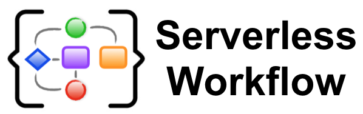

# Serverless Workflow

Serverless applications are becoming increasingly complex. Nowdays they have to coordinate, manage, and define
the execution order (steps) for countless functions triggered by as many events.

Workflows have become key components of serverless applications as they excel at orchestration and coordination
of their functional flow. 

The goal of the Serverless Workflow sub-group is two-fold:
- Come up with a standard language for users to specify their serverless application workflow, as well as 
- Provide a Cloud Provider agnostic API to integrate Workflows into the ecosystem.

This will facilitate the portability of serverless applications across different vendor platforms.

Serverless Workflow is a vendor-neutral and portable specification which meets these goals.

## Serverless Workflow Documents

The following documents are available:

|                               |                                 Latest Release                                  |                                    Working Draft                                    |
| :---------------------------- | :-----------------------------------------------------------------------------: | :---------------------------------------------------------------------------------: |
| **Core Specification:**       |
| Serverless Workflow           |                    |          [master](https://github.com/cncf/wg-serverless/blob/master/workflow/spec/spec.md)  |

## Community

We have an growing community working together to build a dynamic serverless workflow
ecosystem. Community contributions are welcome and much needed to move this specification forward. 

To learn about current community efforts and how to contribute 
reference the [Serverless Workflow Community doc](community/readme.md).

As a CNCF member project, we abide by the [CNCF Code of Conduct](https://github.com/cncf/foundation/blob/master/code-of-conduct.md).
You can find the Serverless Workflow specification Governance information [here](governance/readme.md).
  
## Communication

- Email: [cncf-wg-serverless](mailto:cncf-wg-serverless@lists.cncf.io)
- Subscription: [https://lists.cncf.io/g/cncf-wg-serverless](https://lists.cncf.io/g/cncf-wg-serverless)
- Community Slack Channel: [https://slack.cncf.io/](https://slack.cncf.io/) #serverless-workflow
