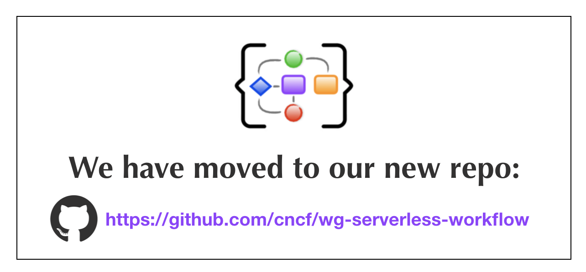

 

Serverless applications are becoming increasingly complex.
Often they contain complex business logic to define, coordinate, and manage the execution
order of a large amount of serverless functions and events that can trigger those functions.

Workflows have become a key component of serverless applications as they provide
clear separation between business and orchestration logic.

Serverless Workflow is a specification that defines the model for workflows
responsible for orchestrating event-driven serverless applications.

Main goals of the specification include:

- To facilitate Serverless Workflow portability across different vendor platforms
- To be completely vendor neutral
- To support both stateless and stateful Serverless Workflow orchestration
- To define a light-weight and powerful Serverless Workflow model

Serverless Workflow is hosted by the [Cloud Native Computing Foundation's](https://cncf.io/) (CNCF) [Serverless Working Group](https://github.com/cncf/wg-serverless). It was proposed as a Cloud Native sandbox level project on [March 3, 2020](https://github.com/cncf/toc/pull/376).

## Serverless Workflow Documents

The following documents are available:

|| Latest Release | Working Draft |
| :--- | :--- | :--- |
| **Core Specification:** | | |
| Serverless Workflow| [v0.1](https://github.com/cncf/wg-serverless/blob/v0.1/workflow/spec/spec.md) | [master](https://github.com/cncf/wg-serverless/blob/master/workflow/spec/spec.md)  |
| **Additional Documentation:** | | |
| Model JSON Schema | [v0.1](https://github.com/cncf/wg-serverless/blob/v0.1/workflow/spec/schema/serverless-workflow-schema-v01.json) | [master](https://github.com/cncf/wg-serverless/blob/master/workflow/spec/schema/serverless-workflow-schema.json) |

## Community

We have an growing community working together to build a dynamic serverless workflow
ecosystem. Community contributions are welcome and much needed to foster specification growth.

To learn about current community efforts and how to contribute
reference the [Serverless Workflow Community doc](community/readme.md).

As a CNCF member project, we abide by the [CNCF Code of Conduct](https://github.com/cncf/foundation/blob/master/code-of-conduct.md).
You can find the Serverless Workflow specification Governance information [here](governance/readme.md).
  
## Communication

- Email: [cncf-wg-serverless](mailto:cncf-wg-serverless@lists.cncf.io)
- Subscription: [https://lists.cncf.io/g/cncf-wg-serverless](https://lists.cncf.io/g/cncf-wg-serverless)
- Community Slack Channel: [https://slack.cncf.io/](https://slack.cncf.io/) #serverless-workflow

## Meeting time

See the [CNCF public events calendar](https://www.cncf.io/community/calendar/).

The Serverless Workflow sub-group meets on the first Monday every month
at 10AM PT (USA Pacific).

Join from PC, Mac, Linux, iOS or Android: https://zoom.us/my/cncfserverlesswg

Or iPhone one-tap :

    US: +16465588656,,3361029682#  or +16699006833,,3361029682#

Or Telephone:

    Dial:
        US: +1 646 558 8656 (US Toll) or +1 669 900 6833 (US Toll)
        or +1 855 880 1246 (Toll Free) or +1 877 369 0926 (Toll Free)

Meeting ID: 336 102 9682

International numbers available:
https://zoom.us/zoomconference?m=QpOqQYfTzY_Gbj9_8jPtsplp1pnVUKDr

NOTE: Please use \*6 to mute/un-mute your phone during the call.

World Time Zone Converter:
http://www.thetimezoneconverter.com/?t=9:00%20am&tz=San%20Francisco&

## Meeting Minutes

The minutes from our calls are available
[here](https://docs.google.com/document/d/1xwcsWQmMiRN24a7o7oy9MstzMroAup31oOkM5Dru1jQ/edit#).

Periodically, the group may have in-person meetings that coincide with a major
conference. Please see the
[meeting minutes](https://docs.google.com/document/d/1xwcsWQmMiRN24a7o7oy9MstzMroAup31oOkM5Dru1jQ/edit#)
for any future plans.
