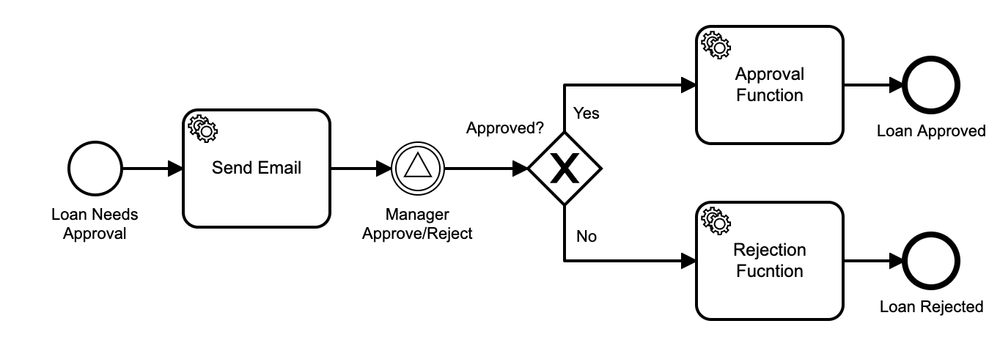
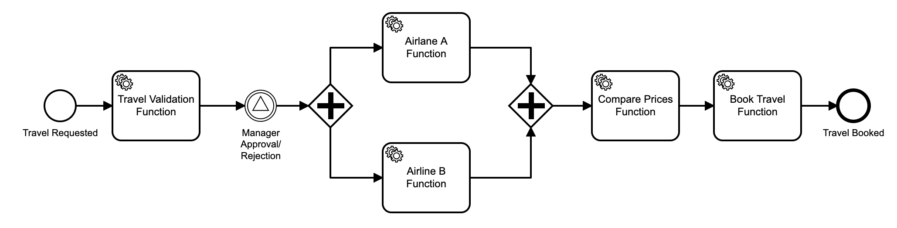

# References

State machines/Workflows have a long history in software design and development. The goal of this section is to list other tools and languages that had been used to define orchestration between different actors (software and human). The main intention here is to make sure that we cover as many use cases as possible leveraging existing approaches to avoid pitfalls from the past.

- [Workflow Patterns](#Workflow-Patterns)
- [Business Process Model and Notation](#Business-Process-Model-and-Notation)
- [Mistral Workflow Language](#Mistral-Workflow-Language)
- [Amazon States Language](#Amazon-States-Language)
- [Huawei FunctionGraph workflow definition](#Huawei-FunctionGraph-workflow-definition)
- [Flogo](#Flogo)
- [Alibaba FunctionFlow](#Alibaba-FunctionFlow)

## Workflow Patterns
The research of the [Workflow Patterns Initiative](http://www.workflowpatterns.com/) provides a thorough examination of the various perspectives (control flow, data, resource, and exception handling) that need to be supported by a workflow language.

## Business Process Model and Notation

[Business Process Modeling and Notation (BPMN)](https://www.omg.org/spec/BPMN/) was standardized by Object Management Group (OMG) in collaboration with companies such as: IBM, Red Hat, Oracle, SAP, TIBCO, Software AG, among others. The latest version of the specification has even been [adopted by the ISO](https://www.iso.org/standard/62652.html) and provides a rich set of constructs to define workflows in a technology-agnostic way. One of the main advantages of the BPMN spec is that it visually defines how a workflow should look like and most importantly, it defines the execution semantics of such workflows. [This article](https://www.esentri.com/bpmn-and-serverless-workflows/) describes how BPMN can be used for serverless workflows.

  
BPMN model

  
  BPMN provides the following entities to define workflows:

- Tasks: Orchestrate interactions between systems and people
- User Task
  - Service Task
  - Business Rule Task
- Events: Emitting and catching events that are relevant to a workflow instance
  - Condition Events
  - Message Event: Enable communication between different workflow instances
    - Throw
    - Catch  
  - Timer Events  
- Gateways: Enable fork/join behaviors based on certain condition
  - Exclusive
  - Parallel
  - Complex  
- Aggregation: Provide a mechanism to deal with complexity when workflows become to large to understand
  - Embedded Sub Process
  - Call Activity

The [BPMN specification](https://www.omg.org/spec/BPMN/) provides XML Schemas for defining and validating workflow definitions.

  
BPMN examples

  Here are BPMN diagrams covering two examples listed in the [Serverless Workflow Specification - Use Cases](usecases.md) section:

  **Loan Approval Workflow**

  

  You can find the BPMN XML which can be executed in a number of Open Source and Proprietary engines [here](media/references/loan-approval-workflow.bpmn)

  **Travel Booking Workflow**

  

  You can find the BPMN XML which can be executed in a number of Open Source and Proprietary engines [here](media/references/travel-booking-workflow.bpmn)

## Mistral Workflow Language

[Mistral Workflow Language](https://docs.openstack.org/mistral/latest/user/wf_lang_v2.html) is a YAML-based task graph description. Unless a dependency (link/transition/requirement) is expressed between two tasks, all unconnected tasks in the workflow description would be executed. If a transition links one task to another, its execution depends on the predecessor. With transitions, successors of a task can be identified to create workflow graphs (type: *direct*). With dependencies, required tasks can be identified to create a dependency graph (type: *reverse*). Each workflow activation maintains a context and completes one task at a time. However, at the end of each task, the task may define more than one task to continue with (fork concurrent branches) and at the beginning of a task, the task may wait on the completion of other tasks (join). The workflow concludes when all branches/tasks have completed.

  
Workflow Language details

  A workflow describes a task graph, i.e. it consists of tasks that can be linked with transitions.

**Workflow:**

- type (direct or reverse)
- description
- input (required input parameters and optional default values)
- output (construct an output from the final context content)
- output-on-error (same as output but when the workflow goes into error)
- task-defaults (defaults for all tasks, unless tasks overwrites)
  - pause-before
  - wait-before
  - wait-after
  - timeout
  - retry
  - concurrency

    *direct-only*
  - on-error (list of tasks which will run if the task has completed with an error)
  - on-success (list of tasks which will run if the task has completed successfully)
  - on-complete (regardless if successful or not)

    *reverse-only*
  - requires (for reverse workflows that express requires-dependencies instead of on-xxx forward control)
- tasks (dictionary of all tasks)

**Task:**

- name
- description
- action or workflow, otherwise it's a no-op
- input (constructs action/subworkflow input parameters from the context of the task) 
- publish (decides which action/subworkflow outputs are put into the context)
- publish-on-error
- with-items (processes items of a collection, i.e. the action/workflow executes multiple times)
- keep-result (can be used to discard the action/subworkflow output)
- target (which worker should execute the task)
- pause-before
- wait-before
- wait-after
- fail-on
- timeout
- retry (with count, delay, break-on, continue-on)
- concurrency (max concurrent actions, see with-items)

## Amazon States Language

[Amazon States Language](https://states-language.net/spec.html) is a JSON-based DSL to define AWS Step Functions, a workflow-like execution of AWS Lambda serverless functions. The language has inspired the original draft of the serverless workflows specification. The copyright lies with Amazon.com Inc. or Affiliates and the license excludes modification or merging of the specification. The workflow is orchestrated by the engine that invokes the serverless functions (resources) referenced by the workflow.

## Huawei FunctionGraph workflow definition

[Huawei FunctionGraph workflow definition](https://support.huaweicloud.com/en-us/productdesc-functiongraph/functiongraph_01_0100.html) has served as [initial draft](https://github.com/cncf/wg-serverless/commit/e42aaabb2c5dd78d0bd638b5cc8be0cd771101a4#diff-bc18ddd43c9fef122edf80ec220f04bb) of this specification and is very similar to the Amazon States Language.

## Flogo

[TIBCO's (Project Flogo&trade;)](http://www.flogo.io) defines applications as triggers, handlers and actions to create workflows. Its [current support for AWS Lambda](https://tibcosoftware.github.io/flogo/labs/flogo-lambda/) wraps the entire workflow as an embedded application into a single Lambda function.

## Alibaba FunctionFlow

FunctionFlow defines workflows of steps using yaml arrays and a simple control logic that starts with the first step in the array, allows jumps with goto and ending a flow either by reaching the last step in the array or by marking a step as the end of the flow.

  
FunctionFlow FDL (Flow Definition Language) model

  The language is documented [here](https://help.aliyun.com/document_detail/122492.html).
  The following entities have been extracted from [fnf examples](https://github.com/awesome-fnf).

  Each flow activation maintains a context addressable with XPath (JSONPath). The event that has triggered the execution is provided in $.input, outputs of serverless functions are available in $.local and unless outputMappings are specified, $.local is passed on.

flow:

- steps lists the steps to be executed (using goto)
- outputMappings to map the workflow output to a response

step types:

- task (invoke serverless function)
  - resourceArn that points to the function
  - inputMappings to map input data to parameters of the serverless function
  - retry to retry on errors or outcomes that retry the execution with backing-off intervals and number of attempts
  - catch to jump to a different state upon errors
- succeed (an end state)
- fail (an end state)
- wait
- pass (useful for mapping of data)
- choice
  - inputMappings
  - choices (condition + goto)
  - default
- parallel
- foreach
  - inputMappings
  - iterationMapping (to define branching)

  

## Others

If you know other related tools, languages, projects that can help this specification to be better, more scoped and serve a wide range of use cases please feel free to get in touch or send a PR to this section.
