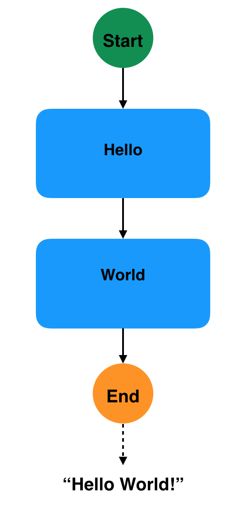
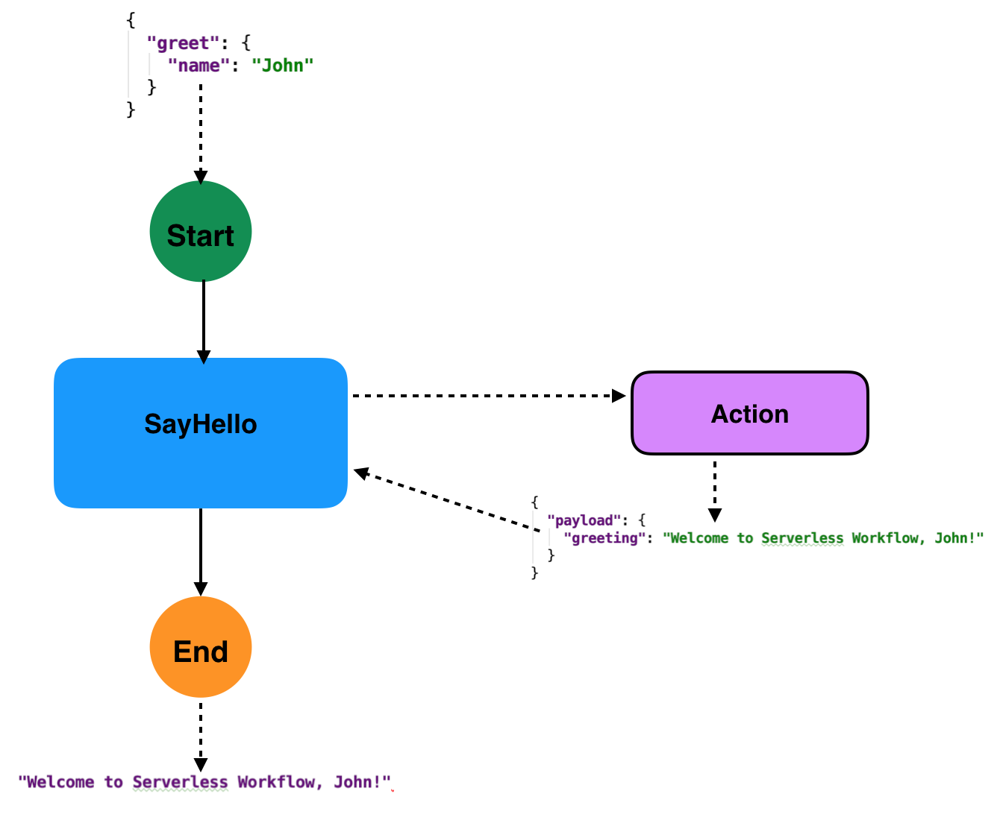
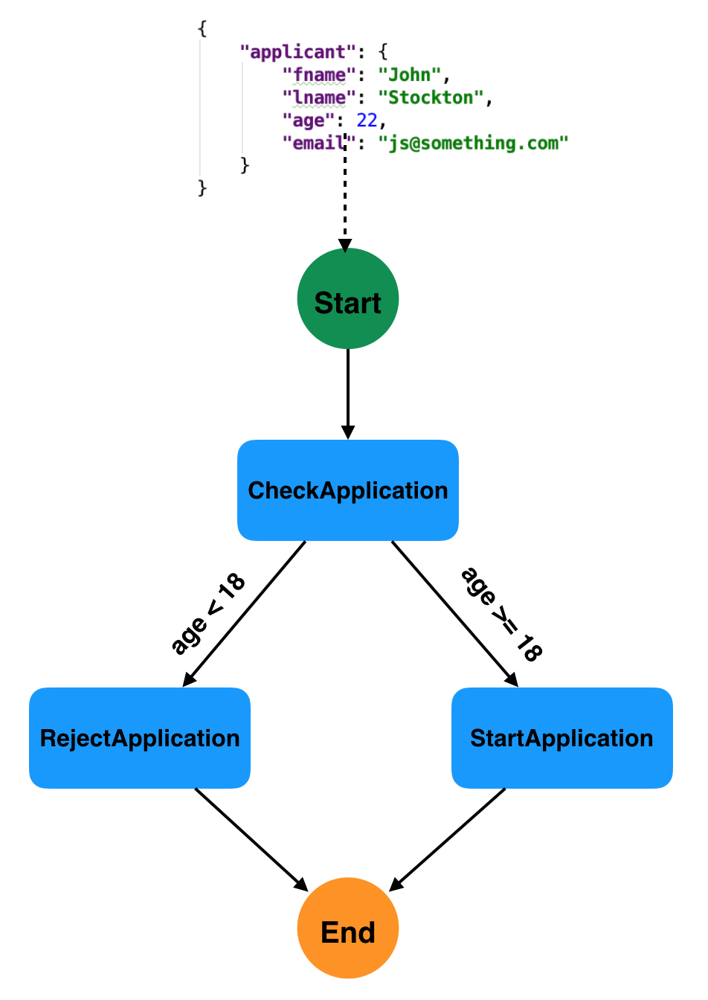
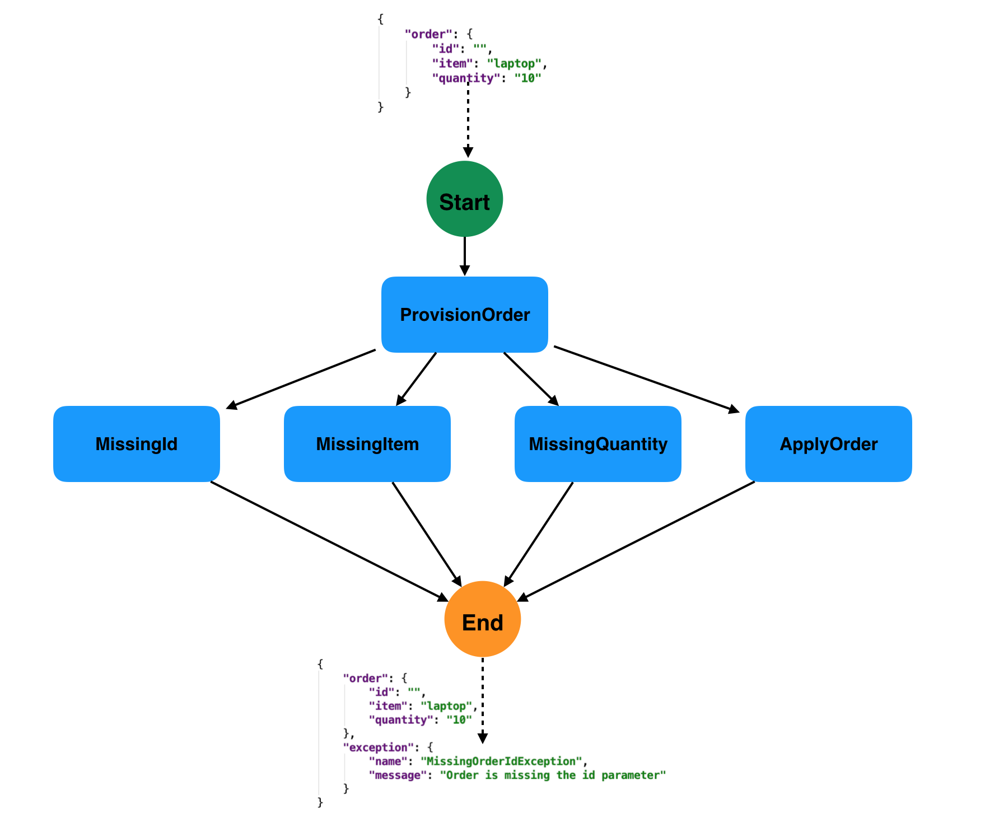
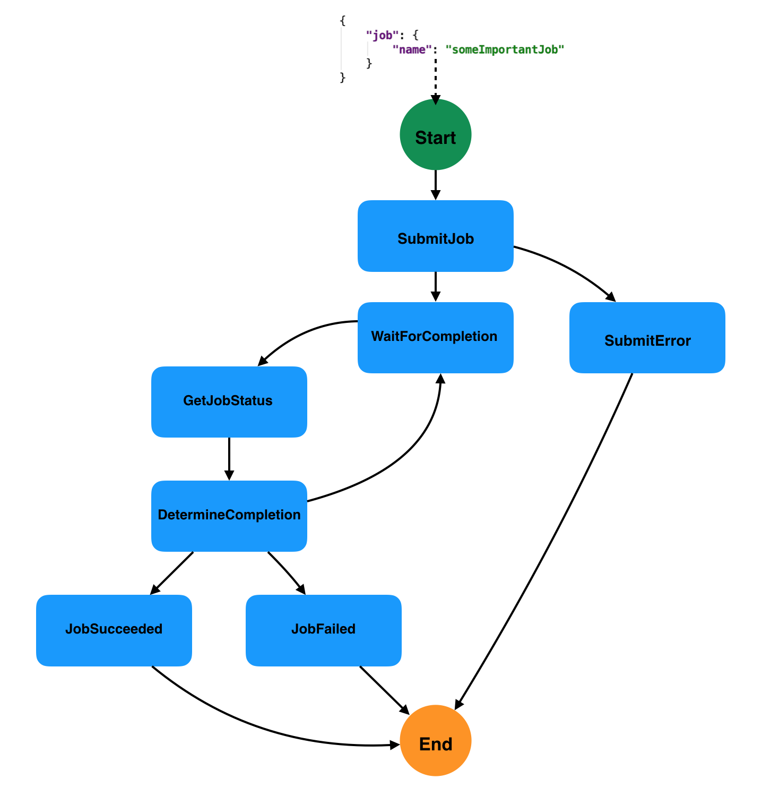

## Serverless Workflow Specification - Examples

## Table of Contents

- [Hello World](#Hello-World-Example)
- [Greeting](#Greeting-Example)
- [Solving Math Problems (Looping)](#Solving-Math-Problems-Example)
- [Parallel Execution](#Parallel-Execution-Example)
- [Applicant Request Decision (Switch + SubFlow)](#Applicant-Request-Decision-Example)
- [Provision Orders (Error Handling)](#Provision-Orders-Example)
- [Monitor Job for completion (Polling)](#Monitor-Job-Example)


### Hello World Example

#### Description

This example uses two relay states. The "Hello" state statically injects the following JSON into its data input:

```json
{
  "result": "Hello"
}
```

which then becomes the data input of the transition "World" state.
The "World" state merges its data input with it's injected JSON and uses a filter to set its data output to the 
value of the "result" property. Since it is an end state, it's data output becomes the workflow data output:

```
"Hello World!"
```

#### Workflow JSON

```json
{  
   "name": "Hello World Workflow",
   "description": "Static Hello World",
   "startsAt": "Hello",
   "states":[  
      {  
         "name":"Hello",
         "type":"RELAY",
         "inject": {
            "result": "Hello"
         },
         "transition": {
           "nextState": "World"
         }
      },
      {  
         "name":"World",
         "type":"RELAY",
         "inject": {
            "result": " World!"
         },
         "filter": {
           "outputPath": "$.result"
         },
         "end": true 
      }
   ]
}
```

#### Worfklow Diagram

<p align="center">

</p>

### Greeting Example

#### Description

This example shows a single Operation state with one action that calls the "greeting" function. 
The workflow data input is assumed to be the name of the person to greet:

```json
{
  "greet": {
    "name": "John"
  }
}
```

The results of the action is assumed to be the full greeting for the provided persons name:

```json
{
  "payload": {
    "greeting": "Welcome to Serverless Workflow, John!"
  }
}
```

The state filter merges the action results into its output, and then uses outputPath to only return the greeting as its data
output, which then becomes the data output of the workflow itself (as it is the end state).

```
   "Welcome to Serverless Workflow, John!" 
```

#### Workflow JSON

```json
{  
   "name": "Greeting Workflow",
   "description": "Greet Someone",
   "startsAt": "Greet",
   "actionDefs": [
      {
        "name": "GreetingAction",
        "function": {
            "name": "greetingFunction",
            "resource": "functionResourse",
            "parameters": {
               "name": "$.greet.name"
            }
         }
       }
   ],
   "states":[  
      {  
         "name":"Greet",
         "type":"OPERATION",
         "actionMode":"SEQUENTIAL",
         "actions":["GreetingAction"],
         "filter": {
            "resultPath": "$.out",
            "outputPath": "$.out.payload.greeting"
         },
         "end": true
      }
   ]
}
```
#### Worfklow Diagram

<p align="center">

</p>

### Solving Math Problems Example

#### Description

In this example we show off looping in an Operation state. The state will loop over a collection of simple math expressions which are 
passed in as the workflow data input:

```json
    {
      "expressions": ["2+2", "4-1", "10x3", "20/2"]
    }
```

The operation state contains an action which calls the serverless function that solves the math expression and returns its answer.

The results of the action is assumed to be the answer, for example for the first expression:

```
"4"
```

The state filter is then used to only return the results of the solved math expressions which becomes the workflow data output:


```json
["4", "3", "30", "10"]
```

#### Workflow JSON

```json
{  
   "name": "Solve Math Problems Workflow",
   "description": "Solve math problems",
   "startsAt": "Solve",
   "actionDefs": [
     {
        "name": "MathAction",
        "function": {
           "name": "solveMathExpressionFunction",
           "resource": "functionResourse",
           "parameters": {
             "expression": "$."
           }
        }
       }
   ],
   "states":[  
      {  
         "name":"Solve",
         "type":"OPERATION",
         "actionMode":"SEQUENTIAL",
         "actions":["MathAction"],
         "loop": {
             "inputCollection": "$.expressions",
             "outputCollection": "$.answers"
         },
         "filter": {
            "outputPath": "$.answers"
         },
         "end": true
      }
   ]
}
```

#### Worfklow Diagram

<p align="center">

</p>

### Parallel Execution Example

#### Description

This example uses a parallel state to execute two branches (simple wait states) at the same time. 
Note that the waitForCompletion flag is set to "false" so as soon as the "ShortDelay" delay state finishes,
the workflow complete execution. If waitForCompletion was set to true, the workflow would complete after both
of the branches are done.

#### Workflow JSON

```json
{  
   "name": "Parallel Execution Workflow",
   "description": "Executes two branches in parallel",
   "startsAt": "ParallelExec",
   "states":[  
      {  
         "name":"ParallelExec",
         "type":"PARALLEL",
         "branches": [
            {
              "name": "Branch1",
              "startsAt": "ShortDelay",
              "states": [
                {
                    "name":"ShortDelay",
                     "type":"DELAY",
                     "timeDelay": "PT15S",
                     "end": true
                }
              ],
              "waitForCompletion": false
            },
            {
              "name": "Branch2",
              "startsAt": "LongDelay",
              "states": [
                 {
                     "name":"LongDelay",
                      "type":"DELAY",
                      "timeDelay": "PT2M",
                      "end": true
                 }      
              ],
              "waitForCompletion": false
            }
         ],
         "end": true
      }
   ]
}
```

#### Worfklow Diagram

<p align="center">

</p>

### Applicant Request Decision Example

#### Description

This example shows off the switch state and the subflow state. The workflow is started with application information data as input:

```json
    {
      "applicant": {
        "fname": "John",
        "lname": "Stockton",
        "age": 22,
        "email": "js@something.com"
      }
    }
```

We use the switch state with two choices to determine if the application should be made based on the applicants age. 
If the applicants age is over 18 we start the application (subflow state). Otherwise the workflow notifies the 
 applicant of the rejection. 

#### Workflow JSON

```json
{  
   "name": "Applicant Request Decision Workflow",
   "description": "Determine if applicant request is valid",
   "startsAt": "CheckApplication",
   "actionDefs": [
     {
        "name": "RejectOrderAction",
        "function": {
           "name": "sendRejectionEmailFunction",
           "resource": "functionResourse",
           "parameters": {
             "applicant": "$.applicant"
           }
        }
     }
   ],
   "states":[  
      {  
         "name":"CheckApplication",
         "type":"SWITCH",
         "choices": [
            {
              "path": "$.applicant.age",
              "value": "18",
              "operator": "GreaterThanEquals",
              "transition": {
                "nextState": "StartApplication"
              }
            },
            {
              "path": "$.applicant.age",
              "value": "18",
              "operator": "LessThan",
              "transition": {
                "nextState": "RejectApplication"
              }
            }
         ],
         "default": "RejectApplication"
      },
      {
        "name": "StartApplication",
        "type": "SUBFLOW",
        "workflowId": "startApplicationWorkflowId",
        "end": true
      },
      {  
        "name":"RejectApplication",
        "type":"OPERATION",
        "actionMode":"SEQUENTIAL",
        "actions":["RejectOrderAction"],
        "end": true
    }
   ]
}
```

#### Worfklow Diagram

<p align="center">

</p>

### Provision Orders Example

#### Description

In this example we show off the states error handling capability. The workflow data input that's passed in contains 
missing order information that causes the function in the "ProvisionOrder" state to throw a runtime exception. With the "onError" conditions we
can transition the workflow to different error handling states depending on the error thrown. Each type of error 
in this example is handled by simple delay states, each including a data filter which sets the exception info as their 
data output. If no error is caught the workflow can transition to the "ApplyOrder" state.

Workflow data is assumed to me:
```json
    {
      "order": {
        "id": "",
        "item": "laptop",
        "quantity": "10"
      }
    }
```

The data output of the workflow contains the information of the exception caught during workflow execution.

#### Workflow JSON

```json
{  
   "name": "Provision Orders",
   "description": "Provision Orders and handle errors thrown",
   "startsAt": "ProvisionOrder",
   "actionDefs": [
    {
       "name": "ProvisionOrderAction",
       "function": {
          "name": "provisionOrderFunction",
          "resource": "functionResourse",
          "parameters": {
            "order": "$.order"
          }
       }
    }
   ],
   "states":[  
      {  
        "name":"ProvisionOrder",
        "type":"OPERATION",
        "actionMode":"SEQUENTIAL",
        "actions":["ProvisionOrderAction"],
        "filter": {
           "resultPath": "$.exception"
        },
        "onError": [
           {
             "condition": {
                "expressionLanguage": "spel",
                "body": "$.exception.name is 'MissingOrderIdException'"
             },
             "transition": {
               "nextState": "MissingId"
             }
           },
           {
             "condition": {
               "expressionLanguage": "spel",
               "body": "$.exception.name is 'MissingOrderItemException'"
             },
             "transition": {
               "nextState": "MissingItem"
             }
           },
           {
            "condition": {
              "expressionLanguage": "spel",
              "body": "$.exception.name is 'MissingOrderQuantityException'"
            },
            "transition": {
              "nextState": "MissingQuantity"
            }
           }
        ],
        "transition": {
           "nextState":"ApplyOrder"
        }
    },
    {
       "name": "MissingId",
       "type": "SUBFLOW",
       "workflowId": "handleMissingIdExceptionWorkflow",
       "end": true
    },
    {
       "name": "MissingItem",
       "type": "SUBFLOW",
       "workflowId": "handleMissingItemExceptionWorkflow",
       "end": true
    },
    {
       "name": "MissingQuantity",
       "type": "SUBFLOW",
       "workflowId": "handleMissingQuantityExceptionWorkflow",
       "end": true
    },
    {
       "name": "ApplyOrder",
       "type": "SUBFLOW",
       "workflowId": "applyOrderWorkflowId",
       "end": true
    }
   ]
}
```

#### Worfklow Diagram

<p align="center">

</p>

### Monitor Job Example

#### Description

In this example we submit a job via an operation state action (serverless function call). It is assumed that it takes some time for 
the submitted job to complete and that it's completion can be checked via another separate serverless function call.
 
To check for completion we first wait 5 seconds and then get the results of the "CheckJob" serverless function. 
Depending on the results of this we either return the results or transition back to waiting and checking the job completion. 
This is done until the job submission returns "SUCCEEDED" or "FAILED" and the job submission results are reported before workflow
finishes execution.

In the case job submission raises a runtime error, we transition to a SubFlow state which handles the job submission issue.


#### Workflow JSON

```json
{  
   "name": "Job Monitoring",
   "description": "Monitor finished execution of a submitted job",
   "startsAt": "SubmitJob",
   "states":[  
      {  
        "name":"SubmitJob",
        "type":"OPERATION",
        "actionMode":"SEQUENTIAL",
        "actions":[  
           {  
              "function": {
                 "name": "submitJob",
                 "resource": "submitJobResource",
                 "parameters": {
                   "name": "$.job.name"
                 }
              }
           }
        ],
        "filter": {
           "resultPath": "$.jobuid"
        },
        "onError": [
           {
             "condition": {
                "expressionLanguage": "spel",
                "body": "$.exception != null"
             },
             "transition": {
               "nextState": "SubmitError"
             }
           }
        ],
        "transition": {
           "nextState":"WaitForCompletion"
        }
    },
    {
       "name": "SubmitError",
       "type": "SUBFLOW",
       "workflowId": "handleJobSubmissionErrorWorkflow",
       "end": true
    },
    {
       "name": "WaitForCompletion",
       "type": "DELAY",
       "timeDelay": "PT5S",
       "transition": {
          "nextState":"GetJobStatus"
       }
    },
    {  
        "name":"GetJobStatus",
        "type":"OPERATION",
        "actionMode":"SEQUENTIAL",
        "actions":[  
           {  
              "function": {
                 "name": "checkJobStatus",
                 "resource": "checkJobStatusResource",
                 "parameters": {
                   "name": "$.jobuid"
                 }
              }
           }
        ],
        "filter": {
           "resultPath": "$.jobstatus"
        },
        "transition": {
           "nextState":"DetermineCompletion"
        }
    },
    {  
     "name":"DetermineCompletion",
     "type":"SWITCH",
     "choices": [
         {
           "path": "$.jobstatus",
           "value": "SUCCEEDED",
           "operator": "Equals",
           "transition": {
             "nextState": "JobSucceeded"
           }
         },
         {
           "path": "$.jobstatus",
           "value": "FAILED",
           "operator": "Equals",
           "transition": {
             "nextState": "JobFailed"
           }
         }
      ],
      "default": "WaitForCompletion"
   },
   {  
       "name":"JobSucceeded",
       "type":"OPERATION",
       "actionMode":"SEQUENTIAL",
       "actions":[  
          {  
             "function": {
                "name": "reportJobSuceeded",
                "resource": "reportJobSuceededResource",
                "parameters": {
                  "name": "$.jobuid"
                }
             }
          }
       ],
       "end": true
   },
   {  
      "name":"JobFailed",
      "type":"OPERATION",
      "actionMode":"SEQUENTIAL",
      "actions":[  
         {  
            "function": {
               "name": "reportJobFailed",
               "resource": "reportJobFailedResource",
               "parameters": {
                 "name": "$.jobuid"
               }
            }
         }
      ],
      "end": true
  }
  ]
}
```

#### Worfklow Diagram

<p align="center">

</p>