## Serverless Workflow Specification - Notation

Notation shown here is meant to facilitate interchange of Serverless workflow diagrams between tools.
It does not facilitate interchange of color information and it can vary from tool to tool. 

It's important to say that serverless workflow notation does not ascertain the workflow is syntactically or semantically correct.

### Notation Depiction

Serverless workflow notation specifies the depiction of each of its elements.

| Kind | Depiction | Info |
| --- | --- | --- |
| Workflow |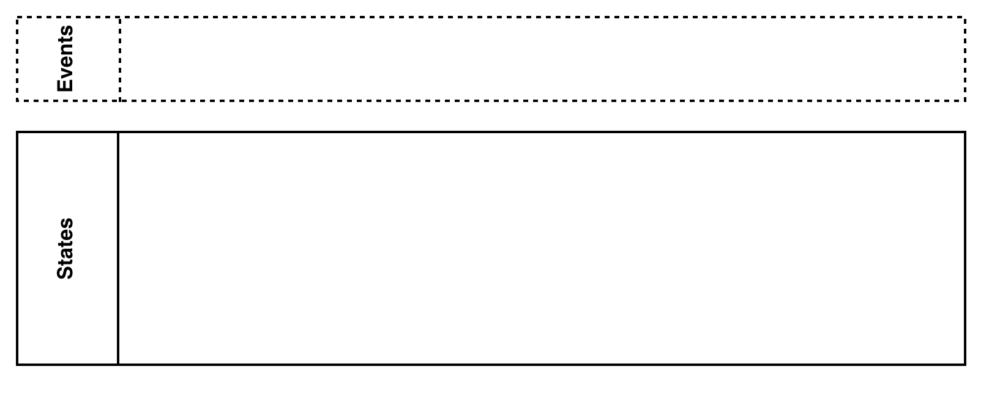 | Workflow consists of two sections, Events and States. <br>  Events section can only include Trigger Events. <br> State Section incldues all workflow states. <br> If no trigger events are defined <br> the Events section does not have to be displayed.  |
| Trigger Event |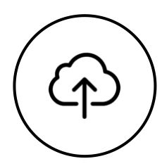 | Trigger Events have to be placed inside the <br> "Events" section of the workflow. |
| Event State |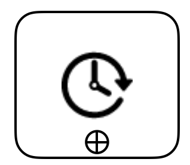 | Includes actions. <br> Can be expaded if the "+" icon is clicked. | 
| Operation State |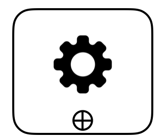 | Includes actions. <br> Can be expaded if the "+" icon is clicked.  | 
| Switch State |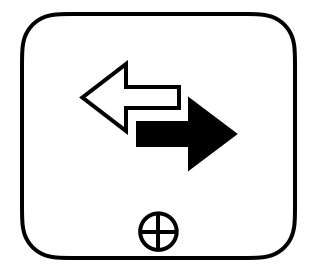 | Includes choices. <br> Can be expaded if the "+" icon is clicked.  | 
| Delay State |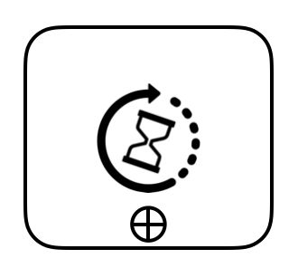 | Waits amount of time, then transitions to next state. | 
| Parallel State |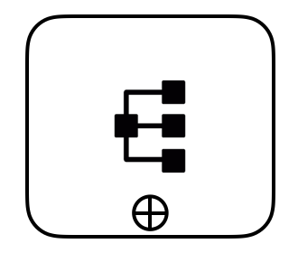 | Includes branches. <br> Can be expaded if the "+" icon is clicked. | 
| States Connector |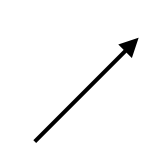 | Connector used to denote a transition <br> between two states. | 
| Event Connector |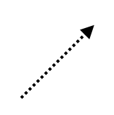 | Connector used to denote utilization of events by event states | 
| Event |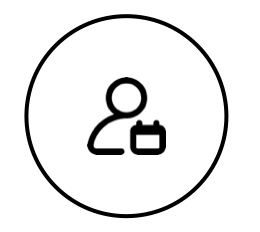 | Single event  | 
| Action |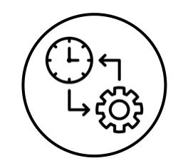 | Single action | 
| Choice |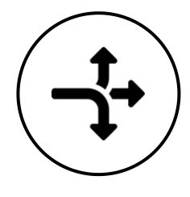 | Single choice | 
| Branch |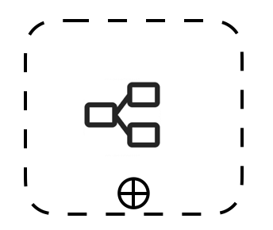 | Single branch | 

#### Start State Depiction
Any state can be a starting state of the workflow. The start state is determined by the "starts-at" property of the 
 workflow definition.
Notation of the start state include an additional element in its top-left corner:

| Kind | Depiction | 
| --- | --- | 
| Start Event State |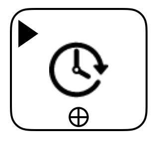 | 
| Start Operation State |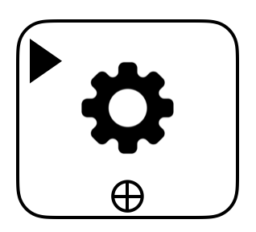 |  
| Start Switch State |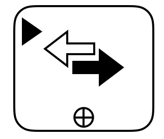 |  
| Start Delay State |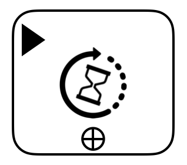 |  
| Start Parallel State |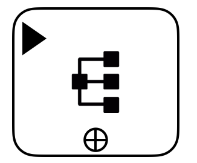 | 

#### End State Depiction
Any state can also be an end state of the workflow. The end state is determined by the states "end" property (if set to true).
Notation of the end state includes an additional element in its top-left corner:

| Kind | Depiction | 
| --- | --- | 
| End Event State |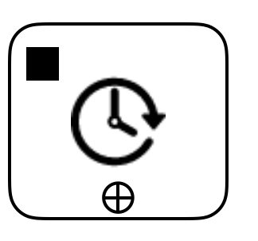 | 
| End Operation State |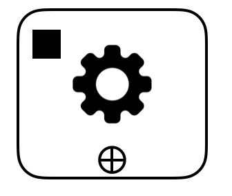 |  
| End Switch State |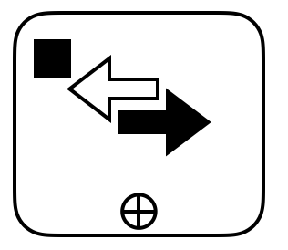 |  
| End Delay State |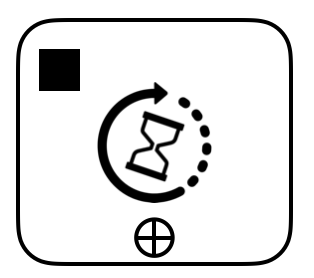 |  
| End Parallel State |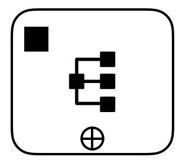 | 


#### Expaded States

Operation, Event, Switch, and Parallel states can be expanded and collapset to display and model their inner nodes.
They must be in its expaded state in order to further model their inner nodes. States in expanded mode can
be resized to arbitrary with/height. Clicking on the "+" icon minimizes the expanded state.

| Kind | Depiction | 
| --- | --- |
| Expanded Operation State | |  
| Expanded Event State | |  
| Expanded Switch State |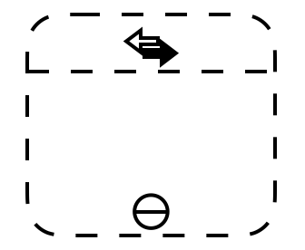 |  
| Expanded Parallel State |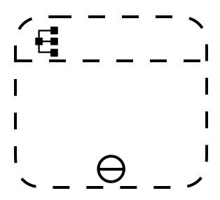 | 

#### Labels

Labels can be added to all elements of the serverless workflow notation. 
They should be localged cenetered and underneith the element icon. 
By default the label should represent the name of the element it is for. Here are some examples 
of elements with labels:


| Kind | Depiction |
| --- | --- | 
| Trigger Event with Label |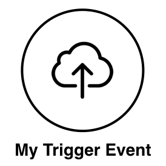 |  
| Start Event State with Label |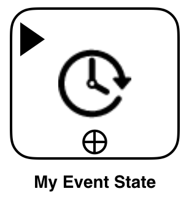 |  
| State Connector with Label |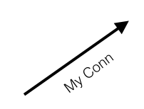 | 


#### Examples

##### Hello World
For this example we have three simple operation states. There are no trigger events defined:

```json
{  
   "name": "Hello World Workflow",
   "starts-at": "Hello World",
   "states":[  
      {  
         "name":"Hello World",
         "type":"OPERATION",
         "start":true,
         "action-mode":"Sequential",
         "actions":[  
            {  
               "name": "callHello",
               "function":"hello"
            }
         ],
         "next-state":"Update Args"
      },
      {  
         "name":"Update Args",
         "type":"OPERATION",
         "start":false,
         "action-mode":"Sequential",
         "InputPath":"$.payload",
         "ResultPath":"$.ifttt.value1",
         "OutputPath":"$.ifttt",
         "actions":[  

         ],
         "next-state":"Save Result"
      },
      {  
         "name":"Save Result",
         "type":"OPERATION",
         "start":false,
         "action-mode":"Sequential",
         "actions":[  
            {  
               "name": "saveResult",
               "function":"save_resut"
            }
         ],
         "end": "true"
      }
   ]
}
```

Using the provided notation we can depict this serverless workflow as follows:

<p align="center">
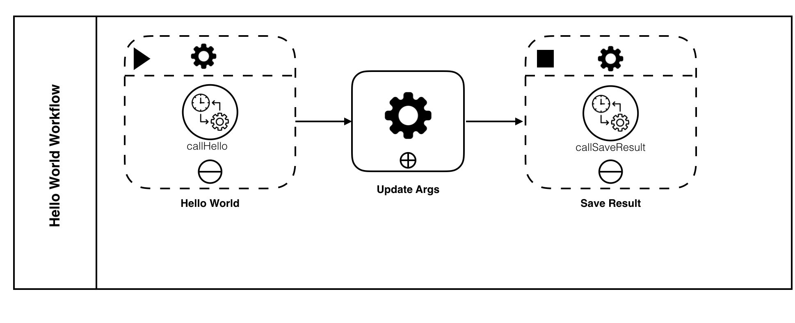
</p>


##### Simple Streaming Video

In this example we define two trigger events, and our workflow includes two event states (all expanded) and an operation state (expaded).
The workflow beginds in the "When video uploaded" event state (the starting event) which waits on the 
incomind "Video Uploaded" event. Upon its arrival it calls the "Start Avalyzing" action and transitions 
to the "After video analyzed" state which calls the transcoding service. After that the workflow 
waits for the "Transcoding Completed" event which will trigger an action to update the db and then completes:


```json
{  
   "name": "Simple Video Streaming",
   "starts-at": "When video uploaded",
   "trigger-defs": [
      {
        "name": "Video Uploaded",
        "source": "example event source",
        "type": "example event type"
      },
      {
        "name": "Transcoding Completed",
        "source": "example event source",
        "type": "example event type"
      }
   ],
   "states":[  
      {  
         "name":"When video uploaded",
         "type":"EVENT",
         "start":true,
         "events":[  
            {  
               "name": "Start Analyzing",
               "event-expression": "name eq 'Video Uploaded'",
               "actions": [
                  {
                    "function": {
                      "name": "Call analyzing example function",
                      "type": "example analyzing func type"
                    }
                  }
               ],
               "next-state":"After video analyzed"
            }
         ]
      },
      {  
          "name":"After video analyzed",
          "type":"OPERATION",
          "actions":[  
              {
                  "function": {
                    "name": "Call Transcoding Service",
                    "type": "example transcoding func type"
                   }
              }
           ],
           "next-state": "When Transcoding completed"
        },
        {  
         "name":"When Transcoding completed",
         "type":"EVENT",
         "events":[  
            {  
               "name": "Update DB",
               "event-expression": "name eq 'Transcoding Completed'",
               "actions": [
                  {
                    "function": {
                      "name": "Call update db example function",
                      "type": "example update db func type"
                    }
                  }
               ],
               "end": "true"
            }
         ]
      }
   ]
}
```

<p align="center">
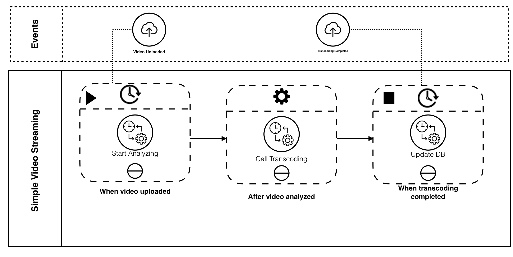
</p>