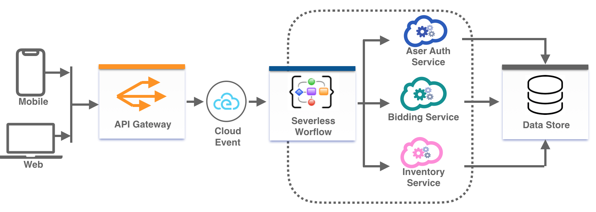

## Serverless Workflow Specification - Use Cases

Use cases for the Serverless Workflow Specification highly depend on the reference implementations 
and the ecosystem available during workflow execution (available functions/services/events, etc).

As mentioned in the [main specification document](spec.md) one of the main benefits of Serverless Workflows
is that they provide clear separation of business and orchestration logic in your serverless apps.

Developers can focus on solving business logic inside functions and utilize workflows to define function invocations,
 react to events, as well as provide data management for different microservices. 
 
So what can you automate with Serverless Workflows? You can get some ideas from the use cases below.

## Table of Contents

- [Online Vehicle Auction](#Online-Vehicle Auction)

## Online Vehicle Auction
You can use Serverless Workflows to coordinate all of the steps of an Online Vehicle Auction. 
These can include:
* Authentication of users making bids.
* Communication with Bidding and Inventory services
* Make decisions to start/end the auction under certain conditions

