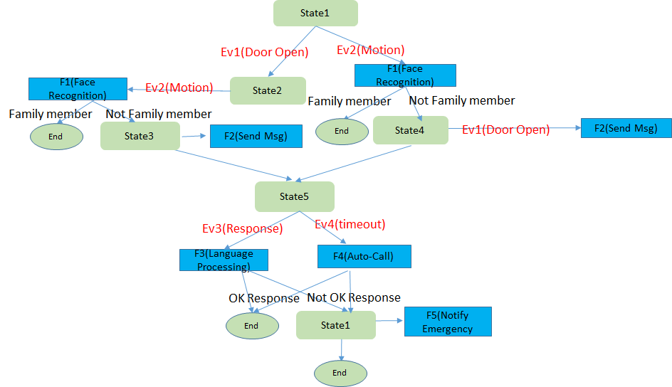
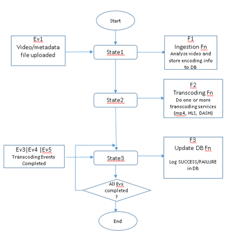

## Serverless Workflow Specification - Use Cases

### Home Monitoring Use Case

A home security and monitoring system involves exterior door open sensor,
window open sensor, exterior motion detectors, etc. in the house. The system
could work as follows.

1. When the door open or window open is triggered, it will wait to see whether
there will be a motion event. If there is no motion event, then it is a false
alarm. If a motion event is received, face recognition is done. If it is a
family member, it is a false alarm. Otherwise a text and email with the face
image are sent to the two contacts on file. Then it will wait for response
from the contacts.
---If there is no response within the predefined time period, it will initiate
an auto-call to the customer and do voice recognition to get the customer's
response. If the customer's response is OK, it is a false alarm. If the
customer's response is NOT OK or the customer gives the wrong secret code,
a notification message is sent to the Emergency Services (fire, police and
ambulance).
---If a response is received within the predefined time period, natural language
processing on the response will be initiated. If the response is OK, it is a
false alarm. If the response is NOT OK or the customer gives the wrong secret
code, a notification message is sent to the Emergency Services (fire, police
and ambulance).

1. When the motion sensor is triggered, face recognition is done. If it is a
family member, it is a false alarm. Otherwise it will wait to see whether there
will be a door open or window open event. If there is no door open or window
open event, then it is a false alarm. If a door/window open event is received,
a text and email message with the face image are sent to the two contacts on
file. Then it will wait for response from the contacts.
---If there is no response within the predefined time period, it will initiate
an auto-call to the customer and do voice recognition to get the customer's
response. If the customer's response is OK, it is a false alarm. If the
customer's response is NOT OK or the customer gives the wrong secret code,
a notification message is sent to the Emergency Services (fire, police and
ambulance).
---If a response is received within the predefined time period, natural language
processing on the response will be initiated. If the response is OK, it is a
false alarm. If the response is NOT OK or the customer gives the wrong secret
code, a notification message is sent to the Emergency Services (fire, police
and ambulance).

The following diagram shows the flow for a basic home monitoring application

### Loan Approval Use Case

Every loan approval process begins with a customer entering his/her particulars
along with the desired loan information. This information is typically entered
via the web and the resulting form data is then stored in a DB or storage.

The following diagram shows the flow for a basic loan approval application.

**'Ev1'** illustrates the resulting storage or DB event.
**'Ev1'** causes **'State1'** to invoke function **'F1'**. Function **'F1'**
sends an email to an approving authority (Manager) and the flow transitions
to **'State2'**. The approving authority reaches a decision (based upon credit
scores and other factors) and updates the decision via storage/DB/API GW.

**'Ev2'** illustrates the decision event.**'Ev2'** causes the flow to
transition to **'State3'**.

**'State3'** invokes function '**F2'** (loan approval function) if **'Ev2'**
indicated loan approval or function **'F3'** (loan rejection function) if
**'Ev2'** indicated loan rejection. After executing either **'F2'** or **'F3'**,
the flow transitions to **'End'** state.

### Employee Travel Booking Use Case

The following diagram shows the basic flow for an employee travel booking.

The flow waits in **'State1'** waiting for an event. **'Ev1'** is typically
a storage or DB event when an employee submits the travel request form. Upon
receiving **'Ev1'**, **'State1'** executes function **'F1'** and transitions to
**'State2'**.

In **'State2'**, the flow is waiting for an approval / rejection event
**'Ev2'** from the employee's manager. **'Ev2'** could be a storage/DB/API GW
event depending on the implementation. Upon receiving **'Ev2'**, the workflow
transitions to the next state **'Approved ?'**.

In this state, the flow checks the results of **'Ev2'**. If **'Ev2'** result
is "Reject", the flow ends. If **'Ev2'** result is "**Approved**", then the
flow transitions to **'State3'**.

**'State3'** invokes multiple functions **'F2'** and **'F3'** to check the
prices of various airlines. Once **'F2'** and **'F3'** complete, the flow
transitions to **'State4'** with the results of **'F2'** and **'F3'**

In **'State4'**, function **'F4'** is invoked. **'F4'** does a comparison of the
results obtained from **'State3'**. In addition to price, other factors such as
time may be considered in evaluating the best flight. Once **'F4'** completes,
the flow transitions to **'State5'**.

**'State5'** invoked **'F5'** which completes the travel booking. After **'F5'**
completes the flow ends.

### Streaming Video-on-Demand Use Case

The following diagram illustrates the basic flow for streaming VOD.

**'Ev1'** occurs when video with metadata has been uploaded to storage. This
causes **'State1'** to invoke the ingestion function **'F1'** and transition to
**'State2'**. Function **'F1'** is responsible for parsing the metadata file,
validate metadata file (E.g. make sure the source video file exists), analyze
the source video file and finally pass the results of the analysis to
**'State2'**.

**'State2'** executes function **'F2'**. Function **'F2'** queues the video file
to different transcoding services (specified in the metadata) and then
transitions to **'State3'**.

Events **'Ev3'**, **'Ev4'** and **'Ev5**' are all event completion events from
the transcoding services. This could be a notification event, etc. When either
of **'Ev3'**, **'Ev4'** or **'Ev5'** is received, **'State3'** executes
function **'F3'** which updates a database with success/failure depending upon
the results present in the event. When all the events **'Ev3'**, **'Ev4'** and
**'Ev5'** are received, the flow ends.

### Loan Approval With a Long-Running Service Use Case

A loan approval process begins when a user submits an online form. Then it
performs some steps such as validating customer details, etc. At a certain
stage, it is necessary to perform a background check on the customer, which is
done by invoking an external service. This service can take a long time to
complete (e.g. 2 days). Until this step is completed, the flow can continue
performing other steps in the process and waits when the results of background
check is required. Once the background check is completed, that service sends
back the results with a correlation Id, which is used by the runtime to inject
the message into the correct process instance.

The following diagram illustrates the basic flow for the loan approval
long-running service.

### Translation Service Evaluation Use Case

In case of Artificial Intelligence services, specific service has different
characteristics, strength, and weakness among providers. As an
example, this use case presents translation service evaluation flow among
providers using an ambiguous sentence.

In order to evaluate Translation Service in each provider, the flow uses an
ambiguous sentence:

> The professor lectures to the student with the cat

It may be that the professor is lecturing with the cat, or
that the student has the cat.

The flow translates this ambiguous sentence into another language once, and
translate it back to English again. Then, the user compares the original
ambiguous sentence with the final result to see if the ambiguous semantics
is retained.

The following diagram illustrates the basic flow for the translation service.

Flow:

1. Parallel branch for AWS
    - Sequence of Action: [ translate forward &rarr; translate backward &rarr;
      post result to slack ]
2. Parallel branch for Azure
    - Sequence of Action: [ translate forward &rarr; translate backward &rarr;
      post result to slack ]
3. Parallel branch for GCP
    - Sequence of Action: [ translate forward &rarr; translate backward &rarr;
      post result to slack ]
4. Parallel branch for IBM
    - Sequence of Action: [ translate forward &rarr; translate backward &rarr;
      post result to slack ]

