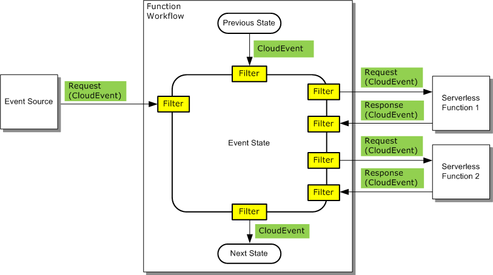
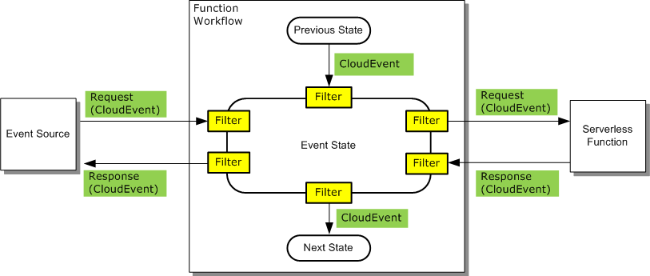
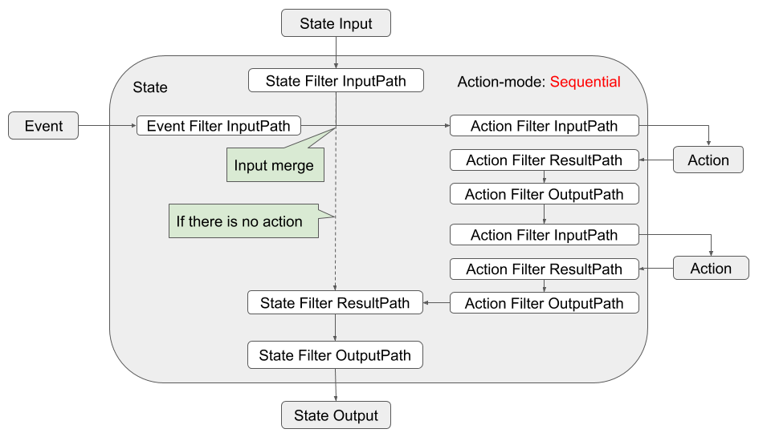

# Serverless Workflow Specification

## Abstract

Serverless applications are becoming increasingly complex. Nowdays they have to coordinate, manage, and define
the execution order (steps) for countless functions triggered by as many events.

When we are dealing with large number of functions, managing their execution is not a simpler task. 
For example we have to coordinate functions and event triggers, orchestrate function execution (sequential,  parallel, 
in branches depending on different event triggers), etc.

Workflows have become key components of serverless applications as they excel at orchestration and coordination
of their functional flow. 

The goal of the Serverless Workflow sub-group is to come up with a standard way for users to specify their serverless application workflow, as well as help facilitate 
portability of serverless applications across different vendor platforms.

Serverless Workflow is a vendor-neutral and portable specification which meets these goals.

## Status of this document

This document is a working draft.

## Table of Contents

- [Introduction](#Introduction)
- [Use Cases](#Use-Cases)
- [Specification Details](#Specification-Details)
    - [Workflow Model](#Workflow-Model)
    - [Workflow Definition](#Workflow-Definition)
- [Extending](#Extending)
- [Examples](#Examples)
- [Reference](#Reference)


## Introduction

Serverless Workflow can be used to:

* **Orchestrate serverless application logic**: serverless applications are typicall event-driven and can be 
very hard to manage. Serverless Workflow groups the application events and functions into a coherent unit and 
simplifies orchestration of the app logic.
* **Define and coordinate application control flow**: allow the users to define the execution/operation
control flow and how/which functions are to be invoked on arrival of events.
* **Define and manage application data flow**: allows the users to define how data is passed and filtered from incoming events to states, 
rom states to functions, from one function to another function, and from one state to another state.

### Functional Scope
Serverless Workflow allows users to:

1. Define and orchestrate steps/states involved in a serverless application.
2. Define which functions are executed in each step.
3. Define which event or combination of events trigger function execution.
4. Define function execution behavior (sequential, parallel, etc).
5. Specify information filtering throughout the execution of the serverless workflow.
6. Define error conditions with retries.
7. If a function is triggered by two or more events, define what label/key should be used to correlate those events to the same serverless workflow instance.

Following example illustrates a Serverless Workflow that involves events
and functions. It specifies the interaction between events, states and functions to be invoked.

<p align="center">

</p>

## Use Cases
You can find different Serverless Workflow usescases [here](spec-usecases.md)

## Specification Details

In sections below we describe all each section of the Serverless Workflow in details. We first show properties in table format, 
and you can also click on the "Click to view JSON Schema" to see the detailed definision defines with [JSON Schema](https://json-schema.org/).

You can find the entire schema document [here](schema/serverless-workflow-schema-01.json). Please note just like this document, this is also
work in progress.

### Workflow Model
Serverless Workflow can be viewed as a collection of states and the transitions and branching between these states.
Each state could have associated events and/or functions. Serverless Workflow may be invoked from a CLI command or triggered dynamically upon arrival of events from event sources. 
An event from an event source may also be associated with a specific state within a Serverless Workflow. 
States within a Serverless Workflow can wait on the arrival of an event or events from one or more event sources before performing their associated action and progressing to the next state. 
See the [Transitions](#Transitions) section for more details on workflow state progressions.

Additional workflow functionality includes:

* Results from a cloud function can be used to initiate retry operations or determine which function to execute next or which state to transition to.

* Provide a way to filter and transform the JSON event payload as it progresses through the Serverless Workflow.

* Provide a way for the application developer to specify a unique field in the event that can be used to correlate events from the event sources to the same serverless workflow instance

A Serverless Workflow can be naturally modeled as a state machine. 
Specification of a workflow is called a workflow template. 
Instantiation of the workflow template is called a workflow instance.

### Workflow Definition

Here we define details of the Serverless Workflow definitions:

| Parameter | Description | Type | Required |
| --- | --- |  --- | --- |
| id | Workflow unique identifier. | string |yes |
| name | Workflow name | string |yes |
| description | Workflow description | string |no |
| version | Workflow version | string |no |
| schemaVersion | Serverless Workflow schema version | string |no |
| startsAt |State name which is the starting state | string |yes |
| execStatus |Workflow execution status | string |no |
| [triggerDefs](#Trigger-Definition) |Array of workflow triggers | array | no |
| [states](#State-Definition) | Array of workflow states | array | yes |
| extensions | Array of workflow custom extension | array | no |

<details><summary><strong>Click to view JSON Schema</strong></summary>
<p>

```json
{
    "$id": "https://wg-serverless.org/workflow.schema",
    "$schema": "http://json-schema.org/draft-07/schema#",
    "description": "Vendor-neutral and portable specification that standardizes the definition of serverless application flows",
    "type": "object",
    "properties": {
        "id": {
          "type": "string",
          "description": "Workflow unique identifier",
          "pattern": "$[a-zA-Z0-9\\-\\.]+^",
          "minLength": 1
        },
        "name": {
          "type": "string",
          "description": "Workflow name",
          "minLength": 1
        },
        "description": {
          "type": "string",
          "description": "Workflow description"
        },
        "version": {
          "type": "string",
          "description": "Workflow version",
          "minLength": 1
        },
        "schemaVersion": {
          "type": "string",
          "description": "Serverless Workflow schema version"
        },
        "startsAt": {
            "type": "string",
            "description": "State name which is the starting state"
        },
        "execStatus": {
            "type" : "string",
            "enum": ["Success", "Fail", "Timeout", "Invalid"],
            "description": "Execution status"
        },
        "triggerDefs": {
            "type": "array",
            "description": "Trigger Definitions",
            "items": {
                "type": "object",
                "$ref": "#/definitions/triggerevent"
            }
        },
        "states": {
            "type": "array",
            "description": "State Definitions",
            "items": {
                "type": "object",
                "anyOf": [
                    { "$ref": "#definitions/delaystate" },
                    { "$ref": "#definitions/eventstate" },
                    { "$ref": "#definitions/operationstate" },
                    { "$ref": "#definitions/parallelstate" },
                    { "$ref": "#definitions/switchstate" }
                ]
            }
        },
        "extensions": {
          "type": "array",
          "description": "Workflow Extensions",
          "items": {
            "type": "object"
          }
        }
    },
    "required": ["id", "name", "version", "startsAt", "states"]
}
```

</p>
</details>

### Trigger Definition

Triggers define incoming events which can be associated with invocation of one or more states.
If there are multiple events involved in an application workflow, a 'correlationToken', which is used to correlate an event with other 
events for same workflow instance, must be specified in that event trigger.

| Parameter | Description | Type | Required |
| --- | --- | --- | --- |
| name | Unique trigger name | string |yes |
| source |CloudEvent source | string | yes |
| type |CloudEvent type | string | yes |
| correlationToken | path used for event correlation | string | no |

<details><summary><strong>Click to view JSON Schema</strong></summary>


```json
{
    "type": "object",
    "properties": {
        "name": {
            "type": "string",
            "description": "Trigger unique name"
        },
        "source": {
            "type": "string",
            "description": "CloudEvent source"
        },
        "type": {
            "type": "string",
            "description": "CloudEvent type"
        },
        "correlationToken": {
            "type": "string",
            "description": "Path used for event correlation."
        }
    },
    "required": ["name", "source", "type"]
}
```

</details>

### State Definition

States define building blocks of the Serverless Workflow. The specification defines six different types of states:
- **[Event State](#Event-state)**: Used to wait for events from event sources and
    then to invoke one or more functions to run in sequence or in parallel.

- **[Operation State](#Operation-State)**: Allows one or more functions to run in sequence
    or in parallel without waiting for any event.

- **[Switch State](#Switch-State)**: Permits transitions to multiple other states (eg.
    Different function results in the previous state trigger
    branching/transition to different next states).

- **[Delay State](#Delay-State)**: Causes the workflow execution to delay for a
    specified duration or until a specified time/date.

- **[Parallel State](#Parallel-State)**: Allows a number of states to execute in
    parallel.
    
- **[SubFlow State](#SubFlow-State)**: Allows execution of a sub-workflow.   
    
We will start defining each individual state:

### Event State

| Parameter | Description | Type | Required |
| --- | --- | --- | --- |
| id | Unique state id | string | no |
| name | State name | string | yes |
| type |start type | string | yes |
| end |Is this state an end state | boolean | no |
| [events](#eventstate-eventdef) |Array of event | array | yes |
| [filter](#Filter-Definition) |State data filter | object | yes |
 
<details><summary><strong>Click to view JSON Schema</strong></summary>
<p>

```json
{
    "type": "object",
    "description": "This state is used to wait for events from event sources and then to invoke one or more functions to run in sequence or in parallel.",
    "properties": {
        "id": {
            "type": "string",
            "description": "Unique state id",
            "minLength": 1
        },
        "name": {
            "type": "string",
            "description": "State name"
        },
        "type": {
            "type" : "string",
            "enum": ["EVENT"],
            "description": "State type"
        },
        "end": {
            "type": "boolean",
            "default": false,
            "description": "Is this an end state"
        },
        "events": {
            "type": "array",
            "description": "Event State Definitions",
            "items": {
                "type": "object",
                "$ref": "#/definitions/event"
            }
        },
        "filter": {
          "$ref": "#/definitions/filter"
        }
    },
    "required": ["name", "type", "events", "filter"]
}
```

</p>
</details>

Event state can hold one or more events definitions, so let's define those:

#### <a name="eventstate-eventdef"></a> Event State: Event Definitions

| Parameter | Description | Type | Required |
| --- | --- | --- | --- |
| eventExpression |Expression used to associate triggerDefs with event state  | string | yes |
| timeout |Time period to wait for the events in the eventExpression (ISO 8601 format). For example: "PT15M" (wait 15 minutes), or "P2DT3H4M" (wait 2 days, 3 hours and 4 minutes)| string | no |
| actionMode |Specifies if functions are executed in sequence of parallel | string | no |
| [actions](#Action-Definition) |Array of actions | array | yes |
| [filter](#Filter-Definition) |Event data filter | object | yes |
| [nextState](#Transitions) |State to transition to after all the actions for the matching event have been successfully executed | string | yes |

<details><summary><strong>Click to view JSON Schema</strong></summary>

```json
{
    "type": "object",
    "description": "Event associated with a State",
    "properties": {
        "eventExpression": {
            "type": "string",
            "description": "Boolean expression which consists of one or more Event operands and the Boolean operators"
        },
        "timeout": {
            "type": "string",
            "description": "Specifies the time period waiting for the events in the eventExpression (ISO 8601 format)"
        },
        "actionMode": {
            "type" : "string",
            "enum": ["SEQUENTIAL", "PARALLEL"],
            "description": "Specifies whether functions are executed in sequence or in parallel"
        },
        "actions": {
            "type": "array",
            "description": "Action Definitions",
            "items": {
                "type": "object",
                "$ref": "#/definitions/action"
            }
        },
        "filter": {
          "$ref": "#/definitions/filter"
        },
        "nextState": {
            "type": "string",
            "description": "State to transition to after all the actions for the matching event have been successfully executed"
        }
    },
    "required": ["event-expression", "actions", "filter", "nextState"]
}
```

</details>

The event expression attribute is used to associate this event state with one or more trigger events. 

Note that each event definition has a "nextState" property, which is used to identify the state which 
should get triggered after this event completes.

Each event state's event definition includes one or more actions. Let's define these actions now:

#### Action Definition

| Parameter | Description | Type | Required |
| --- | --- | --- | --- |
| [function](#Function-Definition) |Function to be invoked | object | yes |
| timeout |Max amount of time (ISO 8601 format) to wait for the completion of the function's execution. For example: "PT15M" (wait 15 minutes), or "P2DT3H4M" (wait 2 days, 3 hours and 4 minutes) | integer | no |
| [retry](#Retry-Definition) |Defines if funtion execution needs a retry | object | no |
| [filter](#Filter-Definition) |Action data filter | object | yes |


<details><summary><strong>Click to view JSON Schema</strong></summary>

```json
{
    "type": "object",
    "description": "Action Definition",
    "properties": {
        "function": {
            "$ref": "#/definitions/function",
            "description": "Function to be invoked"
        },
        "timeout": {
            "type": "string",
            "description": "Specifies the maximum amount of time (ISO 8601 format) to wait for the completion of the function's execution. The function timer is started when the request is sent to the invoked function"
        },
        "retry": {
            "type": "object",
            "$ref": "#/definitions/retry",
            "description": "Specifies how the result from a function is to be handled"
        },
        "filter": {
          "$ref": "#/definitions/filter"
        }
    },
    "required": ["function", "filter"]
}
```

</details>

An action defines a collection of functions that are to be invoked when this action is triggered.
It also defines a timeout wait period if one is needed, as well as a retry definition, so lets look at those now:


#### Function Definition

| Parameter | Description | Type | Required |
| --- | --- | --- | --- |
| name |Function name | string | yes |
| type |Function type. Implementors may define custom types. | string | yes |
| parameters |Function parameters | object | no |

<details><summary><strong>Click to view JSON Schema</strong></summary>

```json
{
  "type": "object",
  "properties": {
    "name": {
      "type": "string",
      "description": "Function name"
    },
    "type": {
      "type": "string",
      "description": "Type of function to implement. Implementors may define custom types here."
    },
    "parameters": {
      "type": "object",
      "description": "Function parameters"
    }
  },
  "required": ["name", "type"]
}
```

</details>

The function name is a string that can evaluate to a call and execution of a serverless function. Implementors
can define how this string maps to their actual function call(s). Functions can have a type
as well as define parameters (key/value pairs).

#### Retry Definition

| Parameter | Description | Type | Required |
| --- | --- | --- | --- |
| match |Result matching value | string | yes |
| retryInterval |Interval value for retry (ISO 8601 repeatable format). For example: "R5/PT15M" (Starting from now repeat 5 times with 15 minute intervals)| integer | no |
| maxRetry |Max retry value | integer | no |
| [nextState](#Transitions) |State to transition to when exceeding maxRetry limit | string | yes |

<details><summary><strong>Click to view JSON Schema</strong></summary>

```json
{
    "type": "object",
    "description": "Retry Definition",
    "properties": {
        "match": {
            "type": "string",
            "description": "Specifies the matching value for the result"
        },
        "retryInterval": {
            "type": "string",
            "description": "Specifies retry interval (ISO 8601 format)"
        },
        "maxRetry": {
            "type": "integer",
            "default":"0",
            "minimum": 0,
            "description": "Specifies the max retry"
        },
        "nextState": {
            "type": "string",
            "description": "State to transition to when exceeding maxRetry limit"
        }
    },
    "required": ["match", "nextState"]
}
```

</details>

### Operation State

| Parameter | Description | Type | Required |
| --- | --- | --- | --- |
| id | Unique state id | string | no |
| name |State name | string | yes |
| type |State type | string | yes |
| end |Is this state an end state | boolean | no |
| actionMode |Should actions be executed sequentially or in parallel | string | yes |
| [actions](#Action-Definition) |Array of actions | array | yes |
| [filter](#Filter-Definition) |State data filter | object | yes |
| [nextState](#Transitions) |State to transition to after all the actions have been successfully executed | string | yes |

<details><summary><strong>Click to view JSON Schema</strong></summary>

```json
{
    "type": "object",
    "description": "This state allows one or more functions to run in sequence or in parallel without waiting for any event.",
    "properties": {
        "id": {
            "type": "string",
            "description": "Unique state id",
            "minLength": 1
        },
        "name": {
            "type": "string",
            "description": "State name"
        },
        "type": {
            "type" : "string",
            "enum": ["OPERATION"],
            "description": "State type"
        },
        "end": {
            "type": "boolean",
            "default": false,
            "description": "Is this state an end state"
        },
        "actionMode": {
            "type" : "string",
            "enum": ["SEQUENTIAL", "PARALLEL"],
            "description": "Specifies whether actions are executed in sequence or in parallel."
        },
        "actions": {
            "type": "array",
            "description": "Actions Definitions",
            "items": {
                "type": "object",
                "$ref": "#/definitions/action"
            }
        },
        "filter": {
          "$ref": "#/definitions/filter"
        },
        "nextState": {
            "type": "string",
            "description": "State to transition to after all the actions have been successfully executed"
        }
    },
    "required": ["name", "type", "actionMode", "actions", "filter", "nextState"]
}
```

</details>

Unlike Event states, Operation states do not wait for an incoming trigger event. When they 
are invoked, their set of actions are executed in SEQUENTIAL, or PARALALLEL modes. Once these 
actions execute, a transition to "next state" happens.


### Switch State

| Parameter | Description | Type | Required |
| --- | --- | --- | --- |
| id | Unique state id | string | no |
| name |Unique state name | string | yes |
| type |State type | string | yes |
| end |Is this state an end start | boolean | no | 
| [choices](#switch-state-choices) |Ordered set of matching rules to determine which state to trigger next | array | yes |
| [filter](#Filter-Definition) |State data filter | object | yes |
| default |Name of the next state if there is no match for any choices value | string | yes |

<details><summary><strong>Click to view JSON Schema</strong></summary>

```json
{
    "type": "object",
    "description": "Permits transitions to other states based on criteria matching.",
    "properties": {
        "id": {
            "type": "string",
            "description": "Unique state id",
            "minLength": 1
        },
        "name": {
            "type": "string",
            "description": "State name"
        },
        "type": {
            "type" : "string",
            "enum": ["SWITCH"],
            "description": "State type"
        },
        "end": {
            "type": "boolean",
            "default": false,
            "description": "Is this state an end start"
        },
        "choices": {
            "type": "array",
            "description": "Defines an ordered set of Match Rules against the input data to this state",
            "items": {
                "type": "object",
                "anyOf": [
                    { "$ref": "#/definitions/singlechoice" },
                    { "$ref": "#/definitions/andchoice" },
                    { "$ref": "#/definitions/notchoice" },
                    { "$ref": "#/definitions/orchoice" }
                ]
            }
        },
        "filter": {
          "$ref": "#/definitions/filter"
        },
        "default": {
            "type": "string",
            "description": "Specifies the name of the next state if there is no match for any choices value"
        }
    },
    "required": ["name", "type", "choices", "filter", "default"]
}
```

</details>

Switch states can be viewed as gateways. They define matching choices which then define which state should be 
triggered next upon successful match.

#### <a name="switch-state-choices"></a>Switch State: Choices

Switch states can be viewed as gateways. They define matching choices which then define which state should be 
triggered next upon successful match.

There are found types of choices defined:

* [Single Choice](#switch-state-single-choice)
* [And Choice](#switch-state-and-choice)
* [Not Choice](#switch-state-not-choice)
* [Or Choice](#switch-state-or-choice)


##### <a name="switch-state-single-choice"></a>Switch State Choices: Single Choice

| Parameter | Description | Type | Required |
| --- | --- | --- | --- |
| single |List of choices | array | yes |
| [nextState](#Transitions) |State to transition to if there is valid match(es) | string | yes |

<details><summary><strong>Click to view JSON Schema</strong></summary>

```json
{
    "type": "object",
    "description": "Single Choice",
    "properties": {
        "single": {
            "type": "array",
            "description": "List of choices",
            "items": {
                "path": {
                    "type": "string",
                    "description": "JSON Path that selects the data input value to be matched"
                },
                "value": {
                    "type": "string",
                    "description": "Matching value"
                },
                "operator": {
                    "type" : "string",
                    "enum": ["EQ", "LT", "LTEQ", "GT", "GTEQ", "StrEQ", "StrLT", "StrLTEQ", "StrGT", "StrGTEQ"],
                    "description": "Specifies how data input is compared with the value"
                }
            }
        },
        "nextState": {
            "type": "string",
            "description": "Specifies the name of the next state to transition to if there is a value match"
        }
    },
    "required": ["single", "nextState"]
}
```

</details>

##### <a name="switch-state-and-choice"></a>Switch State Choices: And Choice

| Parameter | Description | Type | Required |
| --- | --- | --- | --- |
| and |List of choices | array | yes |
| [nextState](#Transitions) |State to transition to if there is valid match(es) | string | yes |

<details><summary><strong>Click to view JSON Schema</strong></summary>

```json
{
    "type": "object",
    "description": "And Choice",
    "properties": {
        "and": {
            "type": "array",
            "description": "List of choices",
            "items": {
                "path": {
                    "type": "string",
                    "description": "JSON Path that selects the data input value to be matched"
                },
                "value": {
                    "type": "string",
                    "description": "Matching value"
                },
                "operator": {
                    "type" : "string",
                    "enum": ["EQ", "LT", "LTEQ", "GT", "GTEQ", "StrEQ", "StrLT", "StrLTEQ", "StrGT", "StrGTEQ"],
                    "description": "Specifies how data input is compared with the value"
                }
            }
        },
        "nextState": {
            "type": "string",
            "description": "Specifies the name of the next state to transition to if there is a value match"
        }
    },
    "required": ["and", "nextState"]
}
```

</details>

##### <a name="switch-state-not-choice"></a>Switch State Choices: Not Choice

| Parameter | Description | Type | Required |
| --- | --- | --- | --- |
| not |List of choices | array | yes |
| [nextState](#Transitions) |State to transition to if there is valid match(es) | string | yes |

<details><summary><strong>Click to view JSON Schema</strong></summary>

```json
{
    "type": "object",
    "description": "And Choice",
    "properties": {
        "not": {
            "type": "array",
            "description": "List of choices",
            "items": {
                "path": {
                    "type": "string",
                    "description": "JSON Path that selects the data input value to be matched"
                },
                "value": {
                    "type": "string",
                    "description": "Matching value"
                },
                "operator": {
                    "type" : "string",
                    "enum": ["EQ", "LT", "LTEQ", "GT", "GTEQ", "StrEQ", "StrLT", "StrLTEQ", "StrGT", "StrGTEQ"],
                    "description": "Specifies how data input is compared with the value"
                }
            }
        },
        "nextState": {
            "type": "string",
            "description": "Specifies the name of the next state to transition to if there is a value match"
        }
    },
    "required": ["not", "nextState"]
}
```

</details>

##### <a name="switch-state-or-choice"></a>Switch State Choices: Or Choice

| Parameter | Description |  Type | Required |
| --- | --- | --- | --- |
| or |List of choices | array | yes | 
| [nextState](#Transitions) |State to transition to if there is valid match(es) | string | yes |

<details><summary><strong>Click to view JSON Schema</strong></summary>

```json
{
    "type": "object",
    "description": "And Choice",
    "properties": {
        "or": {
            "type": "array",
            "description": "List of choices",
            "items": {
                "path": {
                    "type": "string",
                    "description": "JSON Path that selects the data input value to be matched"
                },
                "value": {
                    "type": "string",
                    "description": "Matching value"
                },
                "operator": {
                    "type" : "string",
                    "enum": ["EQ", "LT", "LTEQ", "GT", "GTEQ", "StrEQ", "StrLT", "StrLTEQ", "StrGT", "StrGTEQ"],
                    "description": "Specifies how data input is compared with the value"
                }                              
            }
        },
        "nextState": {
            "type": "string",
            "description": "Specifies the name of the next state to transition to if there is a value match"
        }
    },
    "required": ["or", "nextState"]
}
```
</details>

### Delay State

| Parameter | Description | Type | Required |
| --- | --- | --- | --- |
| id | Unique state id | string | no |
| name |State name | string | yes |
| type |State type | string | yes |
| end |If this state an end state | boolean | no |
| timeDelay |Amount of time (ISO 8601 format) to delay when in this state. For example: "PT15M" (delay 15 minutes), or "P2DT3H4M" (delay 2 days, 3 hours and 4 minutes) | integer | yes |
| [filter](#Filter-Definition) |State data filter | object | yes |
| [nextState](#Transitions) |State to transition to after the delay | string | yes |

<details><summary><strong>Click to view JSON Schema</strong></summary> 

```json
{
    "type": "object",
    "description": "Causes the workflow execution to delay for a specified duration",
    "properties": {
        "id": {
            "type": "string",
            "description": "Unique state id",
            "minLength": 1
        },
        "name": {
            "type": "string",
            "description": "State name"
        },
        "type": {
            "type" : "string",
            "enum": ["DELAY"],
            "description": "State type"
        },
        "end": {
            "type": "boolean",
            "default": false,
            "description": "Is this state an end state"
        },
        "timeDelay": {
            "type": "string",
            "description": "Amount of time (ISO 8601 format) to delay"
        },
        "filter": {
          "$ref": "#/definitions/filter"
        },
        "nextState": {
            "type": "string",
            "description": "Name of the next state to transition to after the delay"
        }
    },
    "required": ["name", "type", "timeDelay", "nextState"]
}
```

</details>

Delay state simple waits for a certain amount of time before transitioning to a next state.


### Parallel State

| Parameter | Description | Type | Required |
| --- | --- | --- | --- |
| id | Unique state id | string | no |
| name |State name | string | yes | 
| type |State type | string | yes | 
| end |If this state and end state | boolean | no |
| [branches](#parallel-state-branch) |List of branches for this parallel state| array | yes |
| [filter](#Filter-Definition) |State data filter | object | yes |
| [nextState](#Transitions) |State to transition to after all branches have completed execution | string | yes |

<details><summary><strong>Click to view JSON Schema</strong></summary>

```json
{
    "type": "object",
    "description": "Consists of a number of states that are executed in parallel",
    "properties": {
        "id": {
            "type": "string",
            "description": "Unique State id",
            "minLength": 1
        },
        "name": {
            "type": "string",
            "description": "State name"
        },
        "type": {
            "type" : "string",
            "enum": ["PARALLEL"],
            "description": "State type"
        },
        "end": {
            "type": "boolean",
            "default": false,
            "description": "Is this state an end state"
        },  
        "branches": {
            "type": "array",
            "description": "Branch Definitions",
            "items": {
                "type": "object",
                "$ref": "#/definitions/branch"
            }
        },
        "filter": {
          "$ref": "#/definitions/filter"
        },
        "nextState": {
            "type": "string",
            "description": "Specifies the name of the next state to transition to after all branches have completed execution"
        }
    },
    "required": ["name", "type", "branches", "filter", "nextState"]
}
```

</details>

Parallel state defines a collection of branches which are to be executed in parallel.
Each branch consists of a collection of states. It can be regarded as a sub-workflow
which must have the startsAt property defined and a state which has the end property set to true.

Let's define a branch now:

#### <a name="parallel-state-branch"></a>Parallel State: Branch

| Parameter | Description | Type | Required |
| --- | --- | --- | --- |
| name |State name | string | yes |
| startsAt |State name which is the start state | string | yes |
| [states](#State-Definition) |List of states to be executed in this branch | array | yes |
| waitForCompletion |If workflow execution must wait for this branch to finish before continuing | boolean | yes |

<details><summary><strong>Click to view JSON Schema</strong></summary>

```json
{
    "type": "object",
    "description": "Branch Definition",
    "properties": {
        "name": {
            "type": "string",
            "description": "Branch name"
        },
        "startsAt": {
            "type": "string",
            "description": "State name which is the starting state"
        },
        "states": {
            "type": "array",
            "description": "State Definitions",
            "items": {
                        "type": "object",
                        "anyOf": [
                            { "$ref": "#definitions/delaystate" },
                            { "$ref": "#definitions/eventstate" },
                            { "$ref": "#definitions/operationstate" },
                            { "$ref": "#definitions/parallelstate" },
                            { "$ref": "#definitions/switchstate" }
                        ]
                    }
        },
        "waitForCompletion": {
            "type": "boolean",
            "default": false,
            "description": "Workflow execution must wait for this branch to finish before continuing"
        }
    },
    "required": ["name", "startsAt", "states", "waitForCompletion"]
}
```

</details>

Each branch receives a copy of the Parallel state's input data.
Transitions for states within a branch can only be to other states in that branch. 
In addition, states outside a Parallel state cannot transition to a state within a branch of a Parallel state.
The Parallel state generates an output array in which each element is the output for a branch. 
The elements of the output array need not be of the same type.

The "waitForCompletion" property allows the parallel state to manage branch executions. If this flag is set to 
true, the branches parallel parent state must wait for this branch to finish before continuing execution.

### SubFlow State

| Parameter | Description | Type | Required |
| --- | --- | --- | --- |
| name |State name | string | yes | 
| type |State type | string | yes | 
| end |If this state and end state | boolean | no |
| waitForCompletion |If workflow execution must wait for sub-workflow to finish before continuing | boolean | yes |
| workflowId |Sub-workflow unique id | boolean | no |
| [filter](#Filter-Definition) |State data filter | object | yes |
| next-state |Name of the next state to transition to after all branches have completed execution | string | yes |

<details><summary><strong>Click to view JSON Schema</strong></summary>

```json
{
    "type": "object",
    "description": "Defines a sub-workflow to be executed",
    "properties": {
        "name": {
            "type": "string",
            "description": "Unique name of the state"
        },
        "type": {
            "type" : "string",
            "enum": ["SUBFLOW"],
            "description": "State type"
        },
        "end": {
            "type": "boolean",
            "default": false,
            "description": "Is this state an end state"
        },  
        "waitForCompletion": {
            "type": "boolean",
            "default": false,
            "description": "Workflow execution must wait for sub-workflow to finish before continuing."
        },
        "workflowId": {
            "type": "string",
            "description": "Sub-workflow unique id."
        },
        "filter": {
          "$ref": "#/definitions/filter"
        },
        "nextState": {
            "type": "string",
            "description": "Specifies the name of the next state to transition to after sub-workflow has completed execution."
        }
    },
    "required": ["name", "type", "nextState", "workflowId"]
}
```

</details>

It is often the case that you want to group your workflows into small, **reusable** logical units that perform certain needed functionality.
Even though you can use the Event state to call an externally deployed services (via function), at times
there is a need to include/nest another serverless workflow (from classpath/local file system etc). In that case you would use the SubFlow State.
It also allows users to model their workflows with reusability and logical grouping in mind.

This state allows you to include/nest a uniquely identified sub-workflow and start its execution. 
Another use of this state is within [branches](#parallel-state-branch) of the [Parallel State](#Parallel-State). Instead of having to define all states
in each branch, you could separate the branch states into individual sub-workflows and call the SubFlow state
as a single state in each.

Sub-workflows must have a defined start and end states. 
The waitForCompletion property defines if the SubFlow state should wait until execution of the sub-workflow
is completed or not. 

Each sub-workflow receives a copy of the SubFlow state's input data.
If waitForCompletion property is set to true, sub-workflows have the ability to edit the parent's workflow data.
If this property is sete to false, data access to parent's workflow should not be allowed.


### Filter Definition

| Parameter | Description | Type | Required |
| --- | --- | --- | --- |
| inputPath |Input path (JSONPath) | string | yes |
| resultPath |Result Path (JSONPath) | string | no |
| outputPath |Output Path (JSONPath) | string | no |


<details><summary><strong>Click to view JSON Schema</strong></summary>

```json
{
  "type": "object",
  "properties": {
    "inputPath": {
      "type": "string",
      "description": "Select input data of either Event, State or Action as JSONPath"
    },
    "resultPath": {
      "type": "string",
      "description": "Specify result JSON node of Action Output as JSONPath"
    },
    "outputPath": {
      "type": "string",
      "description": "Specify output data of State or Action as JSONPath"
    }
  },
  "required": ["inputPath"]
}
```

</details>

Filters are used for data flow through the workflow. This is described in detail in the [Information Passing](#Information-Passing) section.

### Transitions
Serverless workflow states can have one or more incoming and outgoing transitions (from/to other states).
Each state has a "nextState" property which is a string value that determines which 
state to transition to. Implementors can choose to use the states "name" string property
for determining the next state, however we realize that in most cases this is not an
optimal solution that can lead to ambiguity. This is why each state also include an "id"
property. Implementors can choose their own id generation strategy to populate the id property
for each of the states and use it as the unique state identifier that is to be used as the "nextState" value. 

So the options for next state transitions are:
* Use the state name property
* Use the state id property
* Use a combination of name and id properties

### Information Passing

The diagram below shows data flow through a Serverless Workflow that includes an
Event state that invokes two serverless functions. Output data from one state is
passed as input data to the next state. Filters are used to filter and transform
the data on ingress to and egress from each state. Input data from a previous
state may be delivered to serverless function when it is invoked from an
Operation state in the Workflow.

Data contained in a response from a serverless function is sent as output data
to the next state. If a state (Operation state or Event state) includes a list
of sequential actions, data contained in the response from one serverless
function is filtered and then sent in the request to the next function.

In an Event state, CloudEvent metadata received in a request from an event
source may be transformed and combined with data received from a previous state
before it is delivered to a serverless function. Likewise CloudEvent metadata
received in a response from a serverless function may be transformed and
combined with data received from a previous state before it is delivered in a
response sent to the event source.

<p align="center">

</p>

There may be cases where an event source such as an API gateway expects to
receive a response from the workflow. In this case CloudEvent metadata received
in a response from a serverless function may be transformed and combined with
data received from a previous state before it is delivered in a response sent to
the event source as shown below.

<p align="center">

</p>

### Filter Mechanism

Serverless Workflow maintains an implicit JSON object which is accessed from each
filter via JSONPath expression '$.'

There are three kinds of filters

- Event Filter
  - Invoked when data is passed from an event to the current state
- State Filter
  - Invoked when data is passed from the previous state to the current state
  - Invoked when data is passed from the current state to the next state
- Action Filter 
  - Invoked when data is passed from the current state to the first action
  - Invoked when data is passed from an action to action
  - Invoked when data is passed from the last action to the current state

Each Filter has three kinds of path filters

- InputPath
  - Select input data of either Event, State or Action as JSONPath
  - Default value is '\$'
- ResultPath
  - Specify result JSON node of Action Output as JSONPath
  - Default value is '\$'
- OutputPath
  - Specify output data of State or Action as JSONPath
  - Default value is '\$'

<p align="center">

</p>

<p align="center">

</p>


## Extending

Serverless Workflows are build with extensibility in mind. The extension mechanism allows
users and implementors to extend the standard workflow elements with additional ones. This can be used 
for example to satisfy some unique requirements and remain being compliant with the the workflow specfication.

The extension mechanism can be used to define custom workflow elements. It is targeted to
solving custom requirements that go beyond the core of the workflow specification, for example
logging, simulation, debugging, tracing, etc.

You can find more info and examples of element extensions [here](spec-extending.md).

## Examples

You can find different Serverless Workflow examples [here](spec-examples.md)

## Reference

You can find a list of other languages, technologies and specifications related to workflows [here](references.md)

