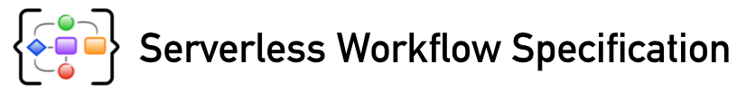
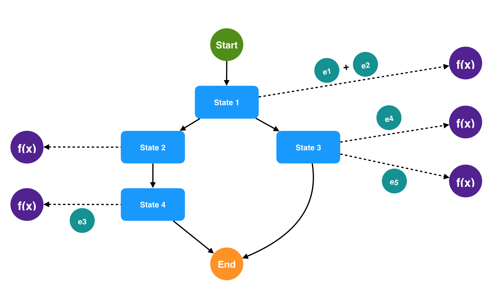
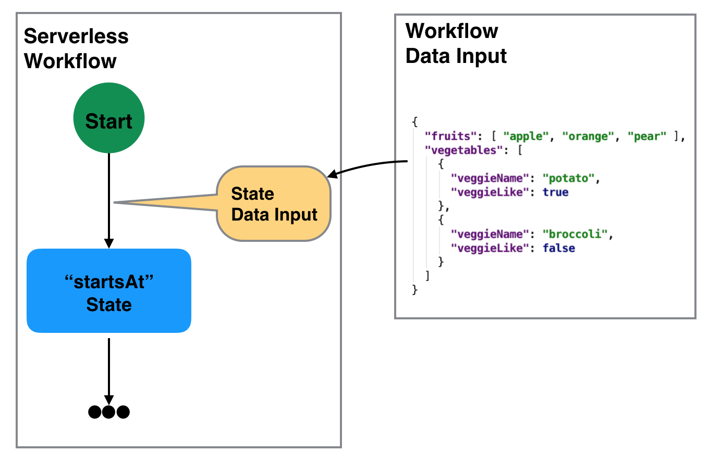
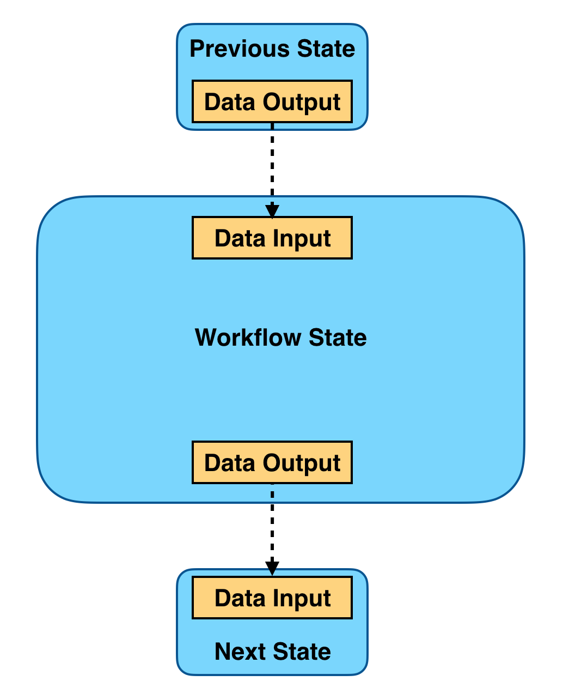
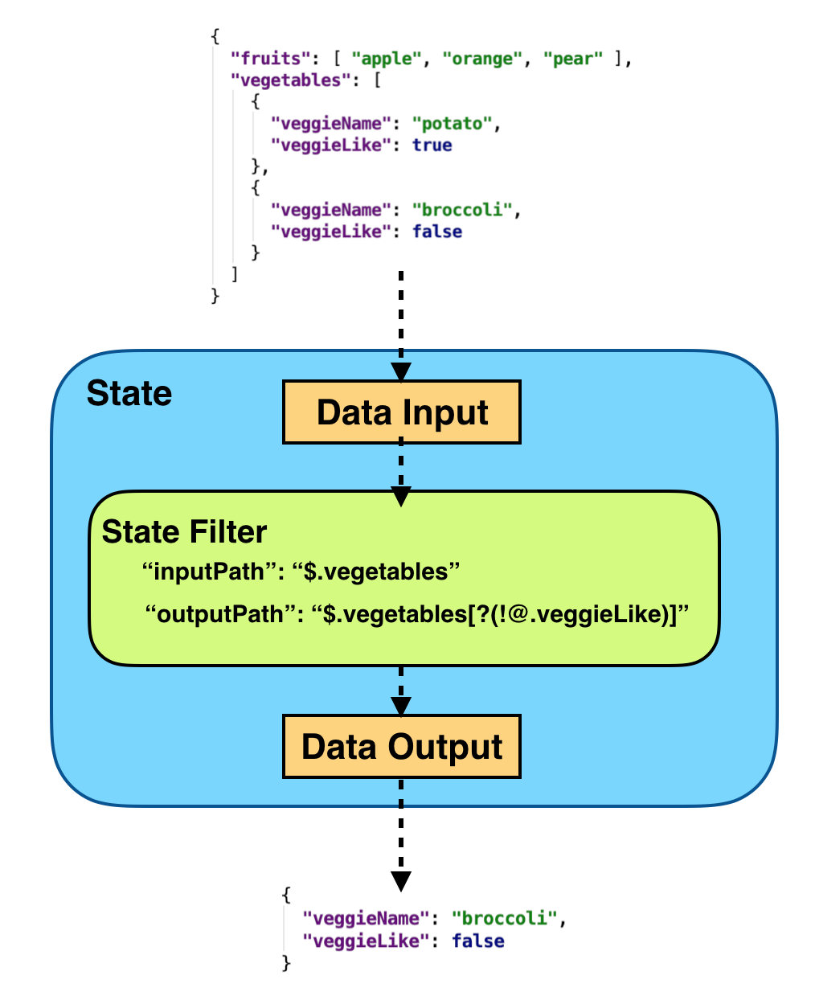
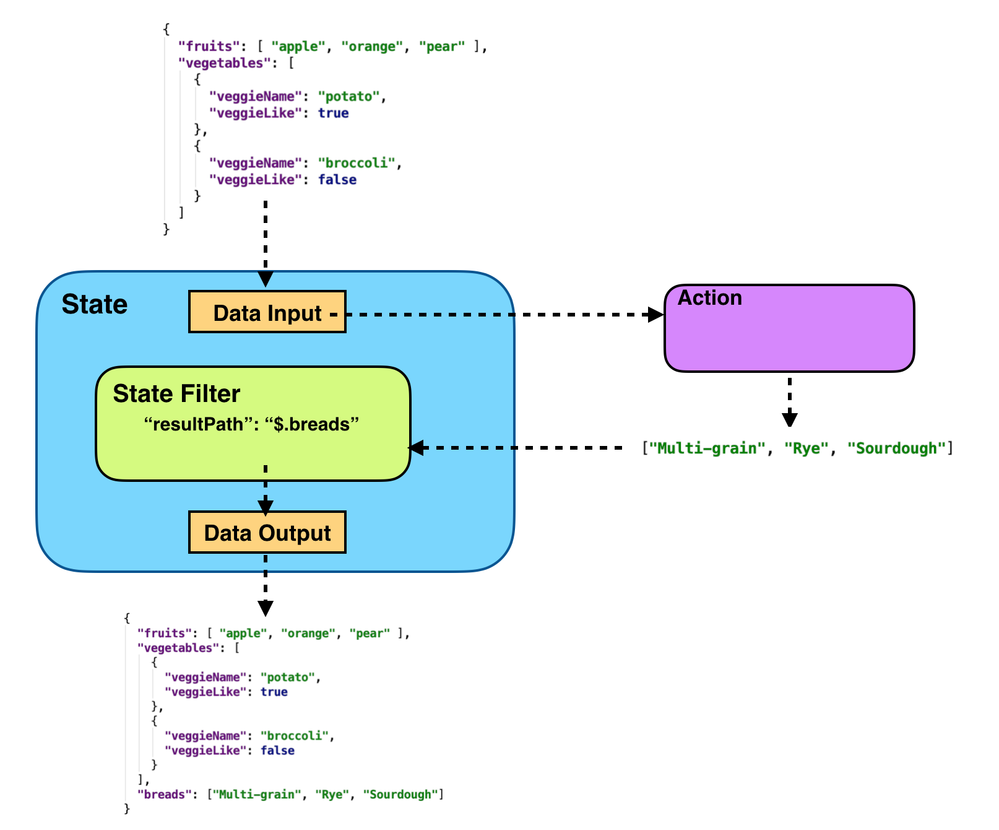
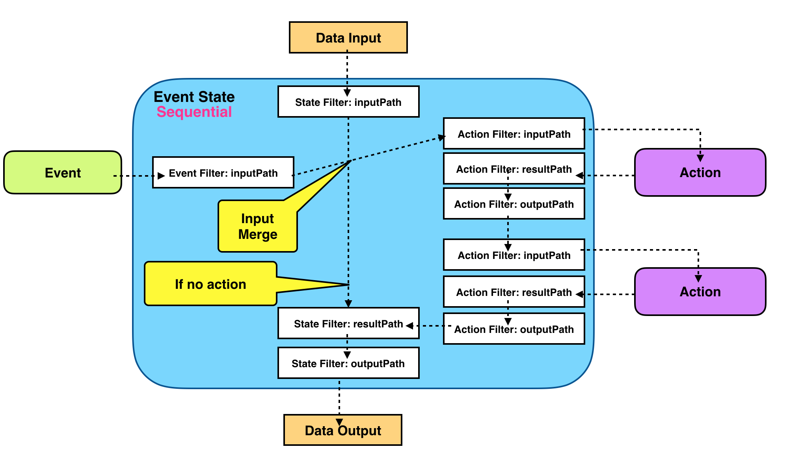
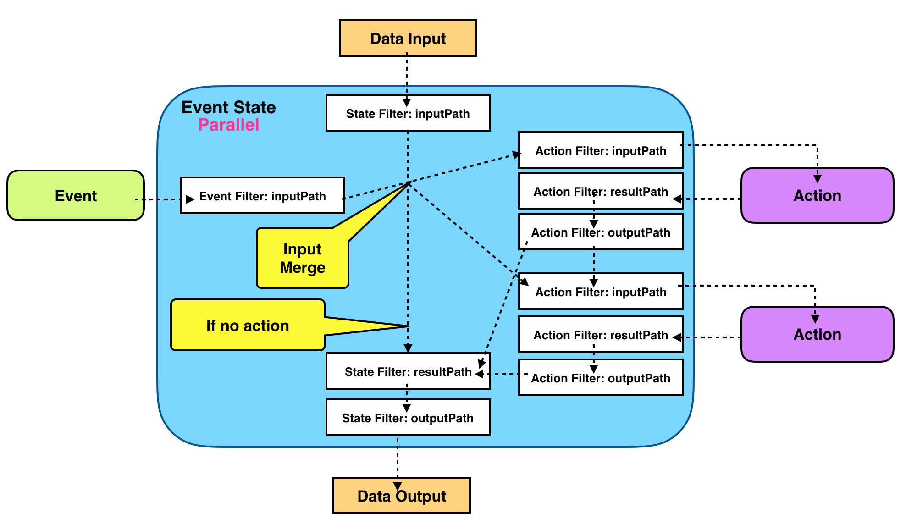
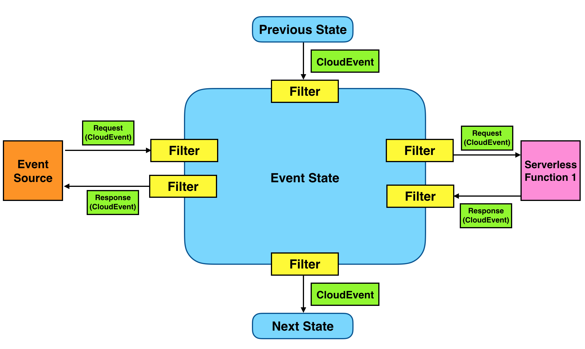

<p align="center"></p>


## Abstract

Serverless applications are becoming increasingly complex and are rarely composed 
of a single function call triggered by an event. 
Often they contain complex business logic to coordinate, manage, and define the execution order of a large amount 
of serverless functions and events that can trigger those functions.
 
Workflows have become a key component of serverless applications as they automate
 orchestration and coordination of serverless applications functional flow. 

Some of many benefits using workflows in serverless applications include:
- Allow you to develop new application much faster by taking the complex execution logic out of your application.
- Externalize workflow execution logic and management such as parallel execution, branching, timeouts, compensation, and other flow control
 logic out of many serverless function implementations into a single workflow definition.
- Allow you to write less code in your serverless apps/functions
- Significantly reduce the amount of time and effort to make changes in large serverless apps.

Many different workflow implementations (both proprietary and open-source) exist today, each with it's own set of features
and capabilities. When picking a current implementations, it is very difficult to later on switch to a different one
without investing a lot of time and cost

The goal of the Serverless Workflow sub-group is to:
- Standardize Serverless Worfkflow model and definition
- Facilitate Serverless Workflow portability
- Be completely vendor neutral
- Support both stateless and stateful Serverless Workflow implementations

The Serverless Workflow specification defined in this document incorporates all of these goals.

## Status of this document

This document is a working draft.

## Table of Contents

- [Introduction](#Introduction)
- [Functional Scope](#Functional-Scope)
- [Specification Details](#Specification-Details)
    - [Workflow Model](#Workflow-Model)
    - [Workflow Definition](#Workflow-Definition)
- [Workflow Data](#Workflow-Data)
- [Workflow Error Handling](#Workflow-Error-Handling)
- [Extending](#Extending)
- [Examples](#Examples)
- [Reference](#Reference)
- [Use Cases](#Use-Cases)

## Introduction

Serverless Workflow can be used to:

* **Orchestrate serverless application logic**: serverless applications are typically event-driven and can be 
very hard to manage. Serverless Workflow groups the application events and functions into a coherent unit and 
simplifies orchestration of the app logic.
* **Define and coordinate application control flow**: allow the users to define the execution/operation
control flow and how/which functions are to be invoked on arrival of events.
* **Define and manage application data flow**: allows the users to define how data is passed and filtered from incoming events to states, 
from states to functions, from one function to another function, and from one state to another state.

### Functional Scope

Serverless Workflow allows users to:

1. Define and orchestrate steps/states involved in a serverless application.
2. Define which functions are executed in each step.
3. Define which event or combination of events trigger function execution.
4. Define function execution behavior (sequential, parallel, etc).
5. Specify information filtering throughout the execution of the serverless workflow.
6. Define error conditions with retries.
7. If a function is triggered by two or more events, define what label/key should be used to correlate those events to the same serverless workflow instance.
8. Make decisions based on results of cloud functions, such as initiate retry operations, determine what other cloud functions to execute, or what state to transition to.

Following diagram illustrates functional flow that involves states, events and functions. It shows that
incoming events can trigger function calls during flow execution.

<p align="center">

</p>

## Specification Details

Following sections provide detailed descriptions of the Serverless Workflow Model. For each part of the model we provide:
- Parameter description in table format
- [JSON Schema](https://json-schema.org/) definition 

You can find the entire Serverless Workflow JSON Schema [here](schema/serverless-workflow-schema-01.json).
Note that this schema reflects the current status of the specification as is updated alongside this document. 

### Workflow Model

Serverless Workflow can be viewed as a collection of [states](#State-Definition) and the [transitions](#Transitions) and branching between these states.
Individual states can make control flow decisions based on their data inputs, perform different actions, as well
as pass their data outputs to other states. 
States can wait on the arrival events from different event sources to perform their actions. When states 
complete their tasks, they can transition to other states or stop workflow execution.
See the [Transitions](#Transitions) section for more details on workflow state progressions.

A Serverless Workflow can be naturally modeled as a state machine. 
Specification of a workflow is called a workflow template. 
Instantiation of the workflow template is called a workflow instance.

Serverless Workflow may be invoked from a CLI command or be triggered dynamically upon arrival of events from event sources. 

### Workflow Definition

Here we define details of the Serverless Workflow definitions:

| Parameter | Description | Type | Required |
| --- | --- |  --- | --- |
| id | Workflow unique identifier. | string |yes |
| name | Workflow name | string |yes |
| description | Workflow description | string |no |
| version | Workflow version | string |no |
| schemaVersion | Workflow schema version | string |no |
| startsAt | Workflow starting state | string |yes |
| execStatus |Workflow execution status | string |no |
| expressionLanguage |Default expression language to be used throughout the workflow definition | string |no |
| [triggers](#Trigger-Definition) |Workflow trigger events | array | no |
| [functions](#Function-Definition) |Workflow functions | array | no |
| [states](#State-Definition) | Workflow states | array | yes |
| [onError](#Error-Handling) |Workflow error handling definitions | array | no |
| [extensions](#Extending) | Workflow custom extensions | array | no |

<details><summary><strong>Click to view JSON Schema</strong></summary>
<p>

```json
{
    "$id": "https://wg-serverless.org/workflow.schema",
    "$schema": "http://json-schema.org/draft-07/schema#",
    "description": "Vendor-neutral and portable specification that standardizes the definition of serverless application flows",
    "type": "object",
    "properties": {
        "id": {
          "type": "string",
          "description": "Workflow unique identifier",
          "minLength": 1
        },
        "name": {
          "type": "string",
          "description": "Workflow name",
          "minLength": 1
        },
        "description": {
          "type": "string",
          "description": "Workflow description"
        },
        "version": {
          "type": "string",
          "description": "Workflow version",
          "minLength": 1
        },
        "schemaVersion": {
          "type": "string",
          "description": "Serverless Workflow schema version"
        },
        "startsAt": {
            "type": "string",
            "description": "State name which is the starting state"
        },
        "execStatus": {
            "type" : "string",
            "enum": ["Success", "Fail", "Timeout", "Invalid"],
            "description": "Execution status"
        },
        "expressionLanguage": {
          "type": "string",
          "description": "Default expression language to be used throughout the workflow definition"
        },
        "triggers": {
            "type": "array",
            "description": "Workflow trigger events",
            "items": {
                "type": "object",
                "$ref": "#/definitions/triggerevent"
            }
        },
        "functions": {
            "type": "array",
            "description": "Workflow functions",
            "items": {
                "type": "object",
                "$ref": "#/definitions/function"
            }
        },
        "states": {
            "type": "array",
            "description": "State Definitions",
            "items": {
                "type": "object",
                "anyOf": [
                    { "$ref": "#definitions/delaystate" },
                    { "$ref": "#definitions/eventstate" },
                    { "$ref": "#definitions/operationstate" },
                    { "$ref": "#definitions/parallelstate" },
                    { "$ref": "#definitions/switchstate" }
                ]
            }
        },
        "onError": {
          "type": "array",
          "description": "Workflow runtime error handling definitions",
          "items": {
            "type": "object",
            "$ref": "#/definitions/error"
          }
        },
        "extensions": {
          "type": "array",
          "description": "Workflow Extensions",
          "items": {
            "type": "object"
          }
        }
    },
    "required": ["id", "name", "version", "startsAt", "states"]
}
```

</p>
</details>

### Trigger Definition

Triggers define incoming events from various event sources that are asscociated with
a serverless application and will invoke transition to one or more states of the application workflow.

If there are a group of events involved in an application workflow, a token,
which is embedded in the event message, must be specified to correlate one event with
the other events for the same workflow instance. Since the token is embedded in the event message,
the location path of the token must be specified so that the backend implementation can
extract the token and map the event instance to the correct application workflow instance.
Different application workflow specifications will have different tokens.

| Parameter | Description | Type | Required |
| --- | --- | --- | --- |
| name | Unique trigger name | string |yes |
| source |CloudEvent source | string | yes |
| type | CloudEvent type | string | yes |
| correlationToken | Location Path in the event message used to retrieve a token for event correlation | string | no |

<details><summary><strong>Click to view JSON Schema</strong></summary>


```json
{
    "type": "object",
    "properties": {
        "name": {
            "type": "string",
            "description": "Trigger unique name"
        },
        "source": {
            "type": "string",
            "description": "CloudEvent source"
        },
        "type": {
            "type": "string",
            "description": "CloudEvent type"
        },
        "correlationToken": {
            "type": "string",
            "description": "Path used for event correlation."
        }
    },
    "required": ["name", "source", "type"]
}
```

</details>

#### Function Definition

Allows you to define a reusable function definition. It can be referenced in [actions](#Action-Definition) defined in [event](#Event-State) and [operation](#Operation-State)
workflow states. Functions must have an unique name. The resource parameter of a function evaluates to execution of
an existing serverless function. Implementations can use the type parameter to define communication information such as protocols. 

Since function definitions are reusable, their parameters are defined within actions that declare to use them.

| Parameter | Description | Type | Required |
| --- | --- | --- | --- |
| name |Function name | string | yes |
| resource |Function resource (URI) | string | yes |
| type |Function type. Can be defined by implementations | string | no |

<details><summary><strong>Click to view JSON Schema</strong></summary>

```json
{
  "type": "object",
  "properties": {
    "name": {
      "type": "string",
      "description": "Function unique name"
      "minLength": 1 
    },
    "resource": {
      "type": "string",
      "description": "Function resource (URI)"
    },
    "type": {
      "type": "string",
      "description": "Type of function to implement. Can be defined by implementations"
    }
  },
  "required": ["name", "resource"]
}
```

</details>

### Error Definition

Error definitions define runtime errors that can occur during workflow execution and how to handle them. For more information
see the [Workflow Error Handling section](#Workflow-Error-Handling). 


| Parameter | Description | Type | Required |
| --- | --- | --- | --- |
| [condition](#Condition-Definition) | Condition that matches against the error in the state data input | string |yes |
| [filter](#Filter-Definition) | Error data filter | object | yes |
| [transition](#Transitions) | Next transition of the workflow when condition matches | string | yes |

<details><summary><strong>Click to view JSON Schema</strong></summary>


```json
{
  "type": "object",
  "properties": {
     "condition": {
       "description": "Boolean expression which consists of one or more Error operands and the Boolean operators",
       "$ref": "#/definitions/condition"
     },
     "filter": {
      "$ref": "#/definitions/filter",
      "description": "Error data filter"
    },
    "transition": {
      "description": "Next transition of the workflow when condition matches",
      "$ref": "#/definitions/transition"
    }
  },
  "required": ["condition", "transition"]
}
```

</details>

#### Condition Definition

| Parameter | Description | Type | Required |
| --- | --- | --- | --- |
| expressionLanguage | Expression language. For example 'spel', 'jexl', 'cel', etc| string | no |
| body | Expression body | string | yes |


<details><summary><strong>Click to view JSON Schema</strong></summary>

```json
{
  "type": "object",
  "description": "Defines the language and body of expression.",
  "properties": {
    "expressionLanguage": {
      "type": "string",
      "description": "Expression language. For example 'spel', 'jexl', 'cel', etc"
    },
    "body": {
      "type": "string",
      "description": "The expression body. For example, (event1 or event2) and event3"
    }
  },
  "required": ["body"]
}
```

</details>

Serverless workflow does not limit implementors to use any expression language they choose to
evaluate expressions with. 
Expressions define a "expressionLanguage" parameter which uniquely identifies the expression language to be used
 for evaluation, and a "body" parameter which defines the actual expression.
 
Note that top-level workflow "expressionLanguage" property can be set to define the default
expression language used for all defined expressions.

### State Definition

States define building blocks of the Serverless Workflow. The specification defines the following states:

- **[Event State](#Event-State)**: Used to wait for events from event sources and
    then to invoke one or more functions to run in sequence or in parallel.

- **[Operation State](#Operation-State)**: Allows one or more functions to run in sequence
    or in parallel without waiting for any event.

- **[Switch State](#Switch-State)**: Permits transitions to multiple other states (eg.
    Different function results in the previous state trigger
    branching/transition to different next states).

- **[Delay State](#Delay-State)**: Causes the workflow execution to delay for a
    specified duration or until a specified time/date.

- **[Parallel State](#Parallel-State)**: Allows a number of states to execute in
    parallel.
    
- **[SubFlow State](#SubFlow-State)**: Allows execution of a sub-workflow. 
  
- **[Relay State](#Relay-State)**: Used to relay state's data input to output without executing any actions. State's data input can be filtered. 
    
We will start defining each individual state:

### Event State

| Parameter | Description | Type | Required |
| --- | --- | --- | --- |
| id | Unique state id | string | no |
| name | State name | string | yes |
| type | State type | string | yes |
| end |Is this state an end state | boolean | no |
| [onReceive](#eventstate-onreceivedef) | Define what events to act upon and actions to be performed | array | yes |
| [filter](#Filter-Definition) | State data filter | object | yes |
| [loop](#Loop-Definition) | State loop information | object | yes |
| [onError](#Workflow-Error-Handling) |States error handling definitions | array | no |
 
<details><summary><strong>Click to view JSON Schema</strong></summary>
<p>

```json
{
    "type": "object",
    "description": "This state is used to wait for events from event sources and then to invoke one or more actions to run in sequence or parallel.",
    "properties": {
        "id": {
            "type": "string",
            "description": "Unique state id",
            "minLength": 1
        },
        "name": {
            "type": "string",
            "description": "State name"
        },
        "type": {
            "type" : "string",
            "enum": ["EVENT"],
            "description": "State type"
        },
        "end": {
            "type": "boolean",
            "default": false,
            "description": "Is this an end state"
        },
        "onReceive": {
            "type": "array",
            "description": "Define what events to act upon and actions to be performed",
            "items": {
                "type": "object",
                "$ref": "#/definitions/onreceive"
            }
        },
        "filter": {
          "$ref": "#/definitions/filter"
        },
        "loop": {
          "$ref": "#/definitions/loop"
        }, 
        "onError": {
            "type": "array",
            "description": "States error handling definitions",
            "items": {
                "type": "object",
                "$ref": "#/definitions/error"
            }
        }
    },
    "required": ["name", "type", "onReceive"]
}
```

</p>
</details>

Event state can hold one or more onReceive definitions:

#### <a name="eventstate-onreceivedef"></a> Event State: onReceive Definitions

| Parameter | Description | Type | Required |
| --- | --- | --- | --- |
| [condition](#Condition-Definition) | Boolean expression matching received events with one or more defined triggers. If matched all defined actions are executed | object | yes |
| timeout | Time period to wait for incoming events which match the condition (ISO 8601 format). For example: "PT15M" (wait 15 minutes), or "P2DT3H4M" (wait 2 days, 3 hours and 4 minutes)| string | no |
| actionMode | Specifies how actions are to be performed (in sequence of parallel) | string | no |
| [actions](#Action-Definition) | Actions to be performed if condition matches | array | yes |
| [filter](#Filter-Definition) |Event data filter | object | yes |
| [transition](#Transitions) | Next transition of the workflow after all the actions have been performed | string | yes |

<details><summary><strong>Click to view JSON Schema</strong></summary>

```json
{
    "type": "object",
    "description": "Defines what events to act upon and actions to be executed",
    "properties": {
        "condition": {
          "description": "Boolean expression matching a received event with one or more defined triggers",
          "$ref": "#/definitions/condition"
        },
        "timeout": {
            "type": "string",
            "description": "Time period to wait for incoming events which match the condition (ISO 8601 format)"
        }, 
        "actionMode": {
            "type" : "string",
            "enum": ["SEQUENTIAL", "PARALLEL"],
            "description": "Specifies how actions are to be performed (in sequence of parallel)"
            "default": "SEQUENTIAL" 
        },
        "actions": {
            "type": "array",
            "description": "Actions to be performed if condition matches",
            "items": {
                "type": "object",
                "$ref": "#/definitions/action"
            }
        },
        "filter": {
          "$ref": "#/definitions/filter"
        },
        "transition": {
          "description": "Next transition of the workflow after all the actions have been performed",
          "$ref": "#/definitions/transition"
        }
    },
    "required": ["condition", "actions", "transition"]
}
```

</details>

As events are received the event state can use the "condition" parameter to match the event with one or 
more defined [triggers](#Trigger-Definition). If the condition evaluates to true, 
a set of defined actions can be performed in sequence or in parallel.

Once all defined actions have been performed, a transition to another state can occur.

#### Condition Definition

| Parameter | Description | Type | Required |
| --- | --- | --- | --- |
| expressionLanguage |Expression language. For example 'spel', 'jexl', 'cel', etc| string | no |
| body |Expression body | string | yes |


<details><summary><strong>Click to view JSON Schema</strong></summary>

```json
{
  "type": "object",
  "description": "Defines the language and body of expression.",
  "properties": {
    "expressionLanguage": {
      "type": "string",
      "description": "Expression language. For example 'spel', 'jexl', 'cel', etc"
    },
    "body": {
      "type": "string",
      "description": "The expression body. For example, (event1 or event2) and event3"
    }
  },
  "required": ["body"]
}
```

</details>

Serverless workflow does not limit implementors to use any expression language they choose to
evaluate expressions with. Expressions define a "language" and a "body". 
Note that top-level workflow "expressionLanguage" property can be set to define the default
expression language used for all expressions defined.

#### Action Definition

| Parameter | Description | Type | Required |
| --- | --- | --- | --- |
| [functionref](#Functionref-Definition) | References a reusable function definition to be invoked | object | yes |
| timeout |Max amount of time (ISO 8601 format) to wait for the completion of the function's execution. For example: "PT15M" (wait 15 minutes), or "P2DT3H4M" (wait 2 days, 3 hours and 4 minutes) | integer | no |
| [retry](#Retry-Definition) |Defines if function execution needs a retry | array | no |
| [filter](#Filter-Definition) |Action data filter | object | yes |

<details><summary><strong>Click to view JSON Schema</strong></summary>

```json
{
    "type": "object",
    "description": "Action Definition",
    "properties": {
        "functionref": {
            "$ref": "#/definitions/functionref",
            "description": "References a reusable function definition to be invoked"
        },
        "timeout": {
            "type": "string",
            "description": "Specifies the maximum amount of time (ISO 8601 format) to wait for the completion of the function's execution. The function timer is started when the request is sent to the invoked function"
        },
        "retry": {
            "type": "array",
            "description": "Array of retry definitions",
            "items": {
                "type": "object",
                "$ref": "#/definitions/retry"
            }
        },
        "filter": {
          "$ref": "#/definitions/filter"
        }
    },
    "required": ["functionref"]
}
```

</details>
 
Actions reference a reusable function definition to be invoked when this action is executed.
They define a timeout wait period as well as a retry policy.

#### Functionref Definition

| Parameter | Description | Type | Required |
| --- | --- | --- | --- |
| refname | Name of the referenced function | string | yes |
| parameters | Parameters to be passed to the referenced function | object | no |

<details><summary><strong>Click to view JSON Schema</strong></summary>

```json
{
  "type": "object",
  "description": "Function Reference",
  "properties": {
    "refname": {
      "type": "string",
      "desription": "Name of the referenced function"
    },
    "parameters": {
      "type": "object",
      "description": "Function parameters"
    }
  },
  "required": [
    "refname"
  ]
}
```
</details>

Used by actions to reference a defined serverless function by its unique name. Parameters are values passed to the
function. They can include either static values or reference the states data input. 

#### Retry Definition

| Parameter | Description | Type | Required |
| --- | --- | --- | --- |
| [condition](#Condition-Definition) | Boolean condition that matches against the function results. Must be evaluated to true for retry policy to trigger | string |yes |
| interval |Interval value for retry (ISO 8601 repeatable format). For example: "R5/PT15M" (Starting from now repeat 5 times with 15 minute intervals)| integer | no |
| max |Max retry value | integer | no |
| [transition](#Transitions) |Next transition of the workflow when exceeding max limit | string | yes |

<details><summary><strong>Click to view JSON Schema</strong></summary>

```json
{
    "type": "object",
    "description": "Retry Definition",
    "properties": {
        "condition": {
          "description": "Boolean condition that matches against the function results. Must be evaluated to true for retry policy to trigger",
          "$ref": "#/definitions/condition"
        },
        "interval": {
            "type": "string",
            "description": "Specifies retry interval (ISO 8601 format)"
        },
        "max": {
            "type": "integer",
            "default":"0",
            "minimum": 0,
            "description": "Specifies the max retry"
        },
        "transition": {
          "description": "Next transition of the workflow when exceeding max retry limit",
          "$ref": "#/definitions/transition"
        }
    },
    "required": ["match", "transition"]
}
```

</details>

Defines a retry policy for an action. The Condition parameter is a condition that matches against 
the functions results. If it is evaluated to true, the retry policy is triggers.

#### Transition Definition

| Parameter | Description | Type | Required |
| --- | --- | --- | --- |
| [condition](#Condition-Definition) | Boolean expression evaluated against state's data output. Must evaluate to true for the transition to be valid. | object | no |
| [nextState](#Transitions) | State to transition to next | string | yes |

<details><summary><strong>Click to view JSON Schema</strong></summary>

```json
{
  "type": "object",
  "properties": {
    "condition": {
      "description": "Boolean expression evaluated against state's data output. Must evaluate to true for the transition to be valid.",
      "$ref": "#/definitions/condition"
    },
    "nextState": {
      "type": "string",
      "description": "State to transition to next",
      "minLength": 1
    }
  },
  "required": [
    "nextState"
  ]
}
```

</details>

Defines a transition from point A to point B in the serverless workflow. For more information see the
[Transitions section](#Transitions).

### Operation State

| Parameter | Description | Type | Required |
| --- | --- | --- | --- |
| id |  Unique state id | string | no |
| name | State name | string | yes |
| type | State type | string | yes |
| end | Is this state an end state | boolean | no |
| actionMode | Should actions be performed sequentially or in parallel | string | no |
| [actions](#Action-Definition) | Actions to be performed | array | yes |
| [filter](#Filter-Definition) | State data filter | object | yes |
| [loop](#Loop-Definition) | State loop information | object | yes |
| [onError](#Error-Handling) | States error handling definitions | array | no |
| [transition](#Transitions) | Next transition of the workflow after all the actions have been performed | string | yes (if end is set to false) |

<details><summary><strong>Click to view JSON Schema</strong></summary>

```json
{
    "type": "object",
    "description": "Defines actions be performed. Does not wait for incoming events",
    "properties": {
        "id": {
            "type": "string",
            "description": "Unique state id",
            "minLength": 1
        },
        "name": {
            "type": "string",
            "description": "State name"
        },
        "type": {
            "type" : "string",
            "enum": ["OPERATION"],
            "description": "State type"
        },
        "end": {
            "type": "boolean",
            "default": false,
            "description": "Is this state an end state"
        },
        "actionMode": {
            "type" : "string",
            "enum": ["SEQUENTIAL", "PARALLEL"],
            "description": "Specifies whether actions are performed in sequence or in parallel",
            "default": "SEQUENTIAL" 
        },
        "actions": {
            "type": "array",
            "description": "Actions to be performed",
            "items": {
                "type": "object",
                "$ref": "#/definitions/action"
            }
        },
        "filter": {
          "$ref": "#/definitions/filter"
        },
        "loop": {
          "$ref": "#/definitions/loop"
        }, 
        "onError": {
            "type": "array",
            "description": "States error handling definitions",
            "items": {
                "type": "object",
                "$ref": "#/definitions/error"
            }
        },
        "transition": {
          "description": "Next transition of the workflow after all the actions have been performed",
          "$ref": "#/definitions/transition"
        }
    },
    "if": {
      "properties": {
        "end": { "const": true }
      }
    },
    "then": {
      "required": ["name", "type", "actions"]
    },
    "else": {
      "required": ["name", "type", "actions", "transition"]
    }
}
```

</details>

Operation state defines a set of actions to be performed in sequence or in parallel. 
Once all actions have been performed, a transition to another state can occur.

### Switch State

| Parameter | Description | Type | Required |
| --- | --- | --- | --- |
| id | Unique state id | string | no |
| name | State name | string | yes |
| type | State type | string | yes |
| end | Is this state an end start | boolean | no | 
| [choices](#switch-state-choices) | Ordered set of matching rules to determine which state to trigger next | array | yes |
| [filter](#Filter-Definition) | State data filter | object | yes |
| [loop](#Loop-Definition) | State loop information | object | no |
| [onError](#Workflow-Error-Handling) | States error handling definitions | array | no |
| default | Next transition of the workflow if there is no match for any choices | object | yes (if end is set to false) |

<details><summary><strong>Click to view JSON Schema</strong></summary>

```json
{
    "type": "object",
    "description": "Permits transitions to other states based on criteria matching.",
    "properties": {
        "id": {
            "type": "string",
            "description": "Unique state id",
            "minLength": 1
        },
        "name": {
            "type": "string",
            "description": "State name"
        },
        "type": {
            "type" : "string",
            "enum": ["SWITCH"],
            "description": "State type"
        },
        "end": {
            "type": "boolean",
            "default": false,
            "description": "Is this state an end start"
        },
        "choices": {
            "type": "array",
            "description": "Defines an ordered set of Match Rules against the input data to this state",
            "items": {
                "type": "object",
                "anyOf": [
                    { "$ref": "#/definitions/singlechoice" },
                    { "$ref": "#/definitions/andchoice" },
                    { "$ref": "#/definitions/notchoice" },
                    { "$ref": "#/definitions/orchoice" }
                ]
            }
        },
        "filter": {
          "$ref": "#/definitions/filter"
        },
        "loop": {
          "$ref": "#/definitions/loop"
        }, 
        "onError": {
            "type": "array",
            "description": "States error handling definitions",
            "items": {
                "type": "object",
                "$ref": "#/definitions/error"
            }
        },
        "default": {
            "description": "Next transition of the workflow if there is no match for any choices",
            "$ref": "#/definitions/transition"
        }
    },
    "if": {
      "properties": {
        "end": { "const": true }
      }
    },
    "then": {
      "required": ["name", "type", "choices"]
    },
    "else": {
      "required": ["name", "type", "choices", "default"]
    }
}
```

</details>

Switch states can be viewed as gateways. They define choices that trigger workflow transitions based on 
JSONPath matches on the states data input.

#### <a name="switch-state-choices"></a>Switch State: Choices

There are four types of choices defined:

* [Single Choice](#switch-state-single-choice)
* [And Choice](#switch-state-and-choice)
* [Not Choice](#switch-state-not-choice)
* [Or Choice](#switch-state-or-choice)

##### <a name="switch-state-single-choice"></a>Switch State Choices: Single Choice

| Parameter | Description | Type | Required |
| --- | --- | --- | --- |
| path | Path that selects the data input value to be matched | string | yes |
| value | Matching value | string | yes |
| operator | Data Input comparator | string | yes |
| [transition](#Transitions) | Next transition of the workflow if there is valid matches | string | yes |

<details><summary><strong>Click to view JSON Schema</strong></summary>

```json
{
    "type": "object",
    "description": "Single Choice",
    "properties": {
        "path": {
            "type": "string",
            "description": "JSONPath that selects the data input value to be matched"
        },
        "value": {
            "type": "string",
            "description": "Matching value"
        },
        "operator": {
            "type" : "string",  
            "enum": ["Exists", "Equals", "LessThan", "LessThanEquals", "GreaterThan", "GreaterThanEquals"],
            "description": "Specifies how data input is compared with the value"
        },
        "transition": {
          "description": "Next transition of the workflow if there is valid matches",
          "$ref": "#/definitions/transition"
        }
    },
    "required": ["path", "value", "operator", "transition"]
}
```

</details>

##### <a name="switch-state-and-choice"></a>Switch State Choices: And Choice

| Parameter | Description | Type | Required |
| --- | --- | --- | --- |
| and | List of choices | array | yes |
| path | Path that selects the data input value to be matched | string | yes |
| value | Matching value | string | yes |
| operator | Data Input comparator | string | yes |
| [transition](#Transitions) | Next transition of the workflow if there is valid matches | string | yes |

<details><summary><strong>Click to view JSON Schema</strong></summary>

```json
{
    "type": "object",
    "description": "And Choice",
    "properties": {
        "and": {
            "type": "array",
            "description": "List of choices",
            "items": {
                "path": {
                    "type": "string",
                    "description": "JSONPath that selects the data input value to be matched"
                },
                "value": {
                    "type": "string",
                    "description": "Matching value"
                },
                "operator": {
                    "type" : "string",
                    "enum": ["Exists", "Equals", "LessThan", "LessThanEquals", "GreaterThan", "GreaterThanEquals"],
                    "description": "Specifies how data input is compared with the value"
                }
            }
        },
        "transition": {
          "description": "Next transition of the workflow if there is valid matches",
          "$ref": "#/definitions/transition"
        }
    },
    "required": ["and", "path", "value", "operator", "transition"]
}
```

</details>

##### <a name="switch-state-not-choice"></a>Switch State Choices: Not Choice

| Parameter | Description | Type | Required |
| --- | --- | --- | --- |
| not | State choice | object | yes |
| path | Path that selects the data input value to be matched | string | yes |
| value | Matching value | string | yes |
| operator | Data Input comparator | string | yes |
| [transition](#Transitions) | Next transition of the workflow if there is valid matches | string | yes |

<details><summary><strong>Click to view JSON Schema</strong></summary>

```json
{
    "type": "object",
    "description": "Not Choice",
    "properties": {
        "not": {
            "type": "object",
            "properties": {
                "path": {
                    "type": "string",
                    "description": "JSONPath that selects the data input value to be matched"
                },
                "value": {
                    "type": "string",
                    "description": "Matching value"
                },
                "operator": {
                    "type" : "string",
                    "enum": ["Exists", "Equals", "LessThan", "LessThanEquals", "GreaterThan", "GreaterThanEquals"],
                    "description": "Specifies how data input is compared with the value"
                }
            }
        },
        "transition": {
          "description": "Next transition of the workflow if there is valid matches",
          "$ref": "#/definitions/transition"
        }
    },
    "required": ["not", "path", "value", "operator", "transition"]
}
```

</details>

##### <a name="switch-state-or-choice"></a>Switch State Choices: Or Choice

| Parameter | Description |  Type | Required |
| --- | --- | --- | --- |
| or | State choices | array | yes | 
| path | Path that selects the data input value to be matched | string | yes |
| value | Matching value | string | yes |
| operator | Data Input comparator | string | yes |
| [transition](#Transitions) |Next transition of the workflow if there is valid matches | string | yes |

<details><summary><strong>Click to view JSON Schema</strong></summary>

```json
{
    "type": "object",
    "description": "Or Choice",
    "properties": {
        "or": {
            "type": "array",
            "description": "List of choices",
            "items": {
                "path": {
                    "type": "string",
                    "description": "JSONPath that selects the data input value to be matched"
                },
                "value": {
                    "type": "string",
                    "description": "Matching value"
                },
                "operator": {
                    "type" : "string",
                    "enum": ["Exists", "Equals", "LessThan", "LessThanEquals", "GreaterThan", "GreaterThanEquals"],
                    "description": "Specifies how data input is compared with the value"
                }                              
            }
        },
        "transition": {
          "description": "Next transition of the workflow if there is valid matches",
          "$ref": "#/definitions/transition"
        }
    },
    "required": ["or",  "path", "value", "operator", "transition"]
}
```
</details>

### Delay State

| Parameter | Description | Type | Required |
| --- | --- | --- | --- |
| id | Unique state id | string | no |
| name | State name | string | yes |
| type | State type | string | yes |
| end | If this state an end state | boolean | no |
| timeDelay | Amount of time (ISO 8601 format) to delay when in this state. For example: "PT15M" (delay 15 minutes), or "P2DT3H4M" (delay 2 days, 3 hours and 4 minutes) | integer | yes |
| [filter](#Filter-Definition) | State data filter | object | yes |
| [loop](#Loop-Definition) | State loop information | object | no |
| [onError](#Error-Handling) | States error handling definitions | array | no |
| [transition](#Transitions) | Next transition of the workflow after the delay | string | yes (if end is set to false) |

<details><summary><strong>Click to view JSON Schema</strong></summary> 

```json
{
    "type": "object",
    "description": "Causes the workflow execution to delay for a specified duration",
    "properties": {
        "id": {
            "type": "string",
            "description": "Unique state id",
            "minLength": 1
        },
        "name": {
            "type": "string",
            "description": "State name"
        },
        "type": {
            "type" : "string",
            "enum": ["DELAY"],
            "description": "State type"
        },
        "end": {
            "type": "boolean",
            "default": false,
            "description": "Is this state an end state"
        },
        "timeDelay": {
            "type": "string",
            "description": "Amount of time (ISO 8601 format) to delay"
        },
        "filter": {
          "$ref": "#/definitions/filter"
        },
        "loop": {
          "$ref": "#/definitions/loop"
        }, 
        "onError": {
            "type": "array",
            "description": "States error handling definitions",
            "items": {
                "type": "object",
                "$ref": "#/definitions/error"
            }
        },
        "transition": {
          "description": "Next transition of the workflow after the delay",
          "$ref": "#/definitions/transition"
        }
    },
    "if": {
        "properties": {
          "end": { "const": true }
        }
    },
    "then": {
      "required": ["name", "type", "timeDelay", "end"]
    },
    "else": {
      "required": ["name", "type", "timeDelay", "transition"]
    }
}
```

</details>

Delay state simply waits for a certain amount of time before transitioning to a next state.


### Parallel State

| Parameter | Description | Type | Required |
| --- | --- | --- | --- |
| id | Unique state id | string | no |
| name | State name | string | yes | 
| type | State type | string | yes | 
| end | If this state and end state | boolean | no |
| [branches](#parallel-state-branch) | List of branches for this parallel state| array | yes |
| [filter](#Filter-Definition) | State data filter | object | yes |
| [loop](#Loop-Definition) | State loop behavior | object | no |
| [onError](#Error-Handling) | States error handling definitions | array | no |
| [transition](#Transitions) | Next transition of the workflow after all branches have completed execution | string | yes (if end is set to false) |

<details><summary><strong>Click to view JSON Schema</strong></summary>

```json
{
    "type": "object",
    "description": "Consists of a number of states that are executed in parallel",
    "properties": {
        "id": {
            "type": "string",
            "description": "Unique State id",
            "minLength": 1
        },
        "name": {
            "type": "string",
            "description": "State name"
        },
        "type": {
            "type" : "string",
            "enum": ["PARALLEL"],
            "description": "State type"
        },
        "end": {
            "type": "boolean",
            "default": false,
            "description": "Is this state an end state"
        },  
        "branches": {
            "type": "array",
            "description": "Branch Definitions",
            "items": {
                "type": "object",
                "$ref": "#/definitions/branch"
            }
        },
        "filter": {
          "$ref": "#/definitions/filter"
        },
        "loop": {
          "$ref": "#/definitions/loop"
        }, 
        "onError": {
            "type": "array",
            "description": "States error handling definitions",
            "items": {
                "type": "object",
                "$ref": "#/definitions/error"
            }
        },
        "transition": {
          "description": "Next transition of the workflow after all branches have completed execution",
          "$ref": "#/definitions/transition"
        }
    },
    "if": {
      "properties": {
       "end": { "const": true }
      }
    },
    "then": {
      "required": ["name", "type", "branches"]
    },
    "else": {
      "required": ["name", "type", "branches", "transition"]
    }
}
```

</details>

Parallel state defines a collection of branches which are to be executed in parallel.
Branches contain one or more states. Each branch must define a starting state via its "startsAt" property
 as well as include at least one end state (state with its "end" property set to true).

#### <a name="parallel-state-branch"></a>Parallel State: Branch

| Parameter | Description | Type | Required |
| --- | --- | --- | --- |
| name | Branch name | string | yes |
| startsAt | Branch start state | string | yes |
| [states](#State-Definition) | States to be executed in this branch | array | yes |
| waitForCompletion | If workflow execution must wait for this branch to finish before continuing | boolean | yes |

<details><summary><strong>Click to view JSON Schema</strong></summary>

```json
{
    "type": "object",
    "description": "Branch Definition",
    "properties": {
        "name": {
            "type": "string",
            "description": "Branch name"
        },
        "startsAt": {
            "type": "string",
            "description": "State name which is the starting state"
        },
        "states": {
            "type": "array",
            "description": "State Definitions",
            "items": {
                        "type": "object",
                        "anyOf": [
                            { "$ref": "#definitions/delaystate" },
                            { "$ref": "#definitions/eventstate" },
                            { "$ref": "#definitions/operationstate" },
                            { "$ref": "#definitions/parallelstate" },
                            { "$ref": "#definitions/switchstate" }
                        ]
                    }
        },
        "waitForCompletion": {
            "type": "boolean",
            "default": false,
            "description": "Workflow execution must wait for this branch to finish before continuing"
        }
    },
    "required": ["name", "startsAt", "states", "waitForCompletion"]
}
```

</details>


Each branch receives a copy of the Parallel state's input data.
States within each branch are only allowed to transition to states defined in the same branch. 
Transitions to other branches or workflow states are not allowed.
States outside a parallel state cannot transition to a state within a branch of a parallel state.

Data output of the Parallel state includes the data output of each executed branch.

The "waitForCompletion" property allows the parallel state to manage branch executions. 
Parallel state must wait for all branches which have this property set to "true" before triggering a transition.

### SubFlow State

| Parameter | Description | Type | Required |
| --- | --- | --- | --- |
| id | Unique state id | string | no |
| name | State name | string | yes | 
| type | State type | string | yes | 
| end | If this state and end state | boolean | no |
| waitForCompletion | If workflow execution must wait for sub-workflow to finish before continuing | boolean | yes |
| workflowId | Sub-workflow unique id | boolean | no |
| [filter](#Filter-Definition) | State data filter | object | yes |
| [loop](#Loop-Definition) | State loop information | object | no |
| [onError](#State-Exception-Handling) | States error handling definitions | array | no |
| [transition](#Transitions) | Next transition of the workflow after subflow has completed | string | yes (if end is set to false) |

<details><summary><strong>Click to view JSON Schema</strong></summary>

```json
{
    "type": "object",
    "description": "Defines a sub-workflow to be executed",
    "properties": {
        "id": {
            "type": "string",
            "description": "Unique State id",
            "minLength": 1
        },
        "name": {
            "type": "string",
            "description": "State name"
        },
        "type": {
            "type" : "string",
            "enum": ["SUBFLOW"],
            "description": "State type"
        },
        "end": {
            "type": "boolean",
            "default": false,
            "description": "Is this state an end state"
        },  
        "waitForCompletion": {
            "type": "boolean",
            "default": false,
            "description": "Workflow execution must wait for sub-workflow to finish before continuing."
        },
        "workflowId": {
            "type": "string",
            "description": "Sub-workflow unique id."
        },
        "filter": {
          "$ref": "#/definitions/filter"
        },
        "loop": {
            "$ref": "#/definitions/loop"
        },
        "onError": {
            "type": "array",
            "description": "States error handling definitions",
            "items": {
                "type": "object",
                "$ref": "#/definitions/error"
           }
        },
        "transition": {
          "description": "Next transition of the workflow after subflow has completed",
          "$ref": "#/definitions/transition"
        }
    },
    "if": {
      "properties": {
        "end": { "const": true }
      }
    },
    "then": {
      "required": ["name", "type", "workflowId"]
    },
    "else": {
      "required": ["name", "type", "workflowId", "transition"]
    }
}
```

</details>

It is often the case that you want to group your workflows into small, **reusable** logical units that perform certain needed functionality.
Even though you can use the Event state to call an externally deployed services (via function), at times
there is a need to include/inject another serverless workflow (from classpath/local file system etc, depending on the implementation logic). 
In that case you would use the SubFlow State.
It also allows users to model their workflows with reusability and logical grouping in mind.

This state allows you to include/inject a uniquely identified sub-workflow and start its execution. 
Another use of this state is within [branches](#parallel-state-branch) of the [Parallel State](#Parallel-State). Instead of having to define all states
in each branch, you could separate the branch states into individual sub-workflows and call the SubFlow state
as a single state in each.

Sub-workflows must have a defined start and end states. 
The waitForCompletion property defines if the SubFlow state should wait until execution of the sub-workflow
is completed or not. 

Each sub-workflow receives a copy of the SubFlow state's input data.
If waitForCompletion property is set to true, sub-workflows have the ability to edit the parent's workflow data.
If this property is set to false, data access to parent's workflow should not be allowed.

### Relay State

| Parameter | Description | Type | Required |
| --- | --- | --- | --- |
| id | Unique state id | string | no |
| name | State name | string | yes | 
| type | State type | string | yes | 
| inject | JSON object which can be set as state's data input and can be manipulated via filter | object | no |
| [filter](#Filter-Definition) | State data filter | object | no |
| [transition](#Transitions) | Next transition of the workflow after subflow has completed | string | yes (if end is set to false) |

<details><summary><strong>Click to view JSON Schema</strong></summary>

```json
{
    "type": "object",
    "description": "Set up and relay the state's data input to data output. Does not perform any actions",
    "properties": {
        "id": {
            "type": "string",
            "description": "Unique State id",
            "minLength": 1
        },
        "name": {
            "type": "string",
            "description": "State name"
        },
        "type": {
            "type" : "string",
            "enum": ["RELAY"],
            "description": "State type"
        },
        "end": {
            "type": "boolean",
            "default": false,
            "description": "Is this state an end state"
        },  
        "inject": {
            "type": "object",
            "description": "JSON object which can be set as states data input and can be manipulated via filters"
        },
        "filter": {
          "$ref": "#/definitions/filter"
        },
        "transition": {
          "description": "Next transition of the workflow after subflow has completed",
          "$ref": "#/definitions/transition"
        }
    },
    "if": {
      "properties": {
        "end": { "const": true }
      }
    },
    "then": {
      "required": ["name", "type"]
    },
    "else": {
      "required": ["name", "type", "transition"]
    }
}
```

</details>

Relay state can be used to statically set up and relay the state's data input to data output.
It is very useful for debugging for example as you can test/simulate workflow execution with pre-set data that would typically 
be dynamic in nature (e.g. function calls, events etc). 

It is also useful for production workflows where you want to just relay workflow data without performaing any actions (function calls).

The relay state "inject" property allows you to statically define a JSON object which gets added to the states data input.
You can use the filter property to control the states data output to the transition state.

Here is a typical example of how to use the relay state to inject static data into its data input, which then will be passed
as data output to the transition state:

```json
{  
     "name":"SimpleRelayState",
     "type":"RELAY",
     "inject": {
        "person": {
          "fnam": "John",
          "lname": "Doe",
          "address": "1234 SomeStreet",
          "age": 40
        }
     },
     "transition": {
        "nextState": "GreetPersonState"
     }
}
```

The data output of the "SimpleRelayState" which then is passed as input to the transition state would be:

```json
{
 "person": {
      "fnam": "John",
      "lname": "Doe",
      "address": "1234 SomeStreet",
      "age": 40
 }
}

```

If the relay state already receives a data input from the previous transition state, the inject data will be merged 
with its data input.

You can also use the filter property to further relay the set-up data input and pass only
what you need as data output of the state. Let's say we have:

```json
{  
     "name":"SimpleRelayState",
     "type":"RELAY",
     "inject": {
        "people": [
          {
             "fnam": "John",
             "lname": "Doe",
             "address": "1234 SomeStreet",
             "age": 40
          },
          {
             "fnam": "Marry",
             "lname": "Allice",
             "address": "1234 SomeStreet",
             "age": 25
          },
          {
             "fnam": "Kelly",
             "lname": "Mill",
             "address": "1234 SomeStreet",
             "age": 30
          }
        ]
     },
     "filter": {
        "outputPath": "$.people[?(@.age < 40)]"
     },
     "transition": {
        "nextState": "GreetPersonState"
     }
}
```

In which case the states data output would include people whos age is less than 40. You can then easily during testing 
change your output path to for example:

```
$.people[?(@.age >= 40)]
```
to test if your workflow behaves properly for the case when there are people who's age is greater or equal 40.


### Filter Definition

| Parameter | Description | Type | Required |
| --- | --- | --- | --- |
| inputPath | Input path (JSONPath) | string | yes |
| resultPath | Result Path (JSONPath) | string | no |
| outputPath | Output Path (JSONPath) | string | no |


<details><summary><strong>Click to view JSON Schema</strong></summary>

```json
{
  "type": "object",
  "properties": {
    "inputPath": {
      "type": "string",
      "description": "Select input data of either Event, State or Action as JSONPath"
    },
    "resultPath": {
      "type": "string",
      "description": "Specify result JSON node of Action Output as JSONPath"
    },
    "outputPath": {
      "type": "string",
      "description": "Specify output data of State or Action as JSONPath"
    }
  },
  "required": ["inputPath"]
}
```

</details>

Filters are used for managing workflow data flow. 
This is described in detail in the [Information Passing](#Information-Passing) section.

### Loop Definition

| Parameter | Description | Type | Required |
| --- | --- | --- | --- |
| inputCollection | Selects a collection of the states inputPath | string | yes |
| outputCollection | Selects a collection of the states outputPath | string | no |
| completionCondition | Boolean expression (evaluated after each iteration) that controls the loop. If this expression is true looping stops even if not all collection elements are processesd | string | no |
| timeDelay | Amount of time (ISO 8601 format) to wait between each loop | string | no |

<details><summary><strong>Click to view JSON Schema</strong></summary>

```json
{
  "type": "object",
  "description": "Defines state Looping Information",
  "properties": {
    "inputCollection": {
      "type": "string",
      "description": "JSONPath, selects a collection of the states inputPath"
    },
    "outputCollection": {
      "type": "string",
      "description": "JSONPath, selects a collection of the states outputPath"
    },
    "completionCondition": {
      "type": "string",
      "description": "Boolean expression (evaluated after each iteration) that controls the loop. If this expression is true looping stops even if not all collection elements are processesd."
    },
    "timeDelay": {
        "type": "string",
        "description": "|Amount of time (ISO 8601 format) to wait between each loop "
    }
  },
  "required": ["inputCollection"]
}
```

</details>

Loop definition allows states to be executed in a loop until a completion condition becomes true. 

Looping happens over each element of the inputCollection parameter. This parameter must evaluate to a collection
of the states input data.

If the completionCondition expression is defined, this expression must be checked after each loop iteration.
If it evaluates to true, looping must stop even if looping over all elements of the inputCollection have not finished. 
In addtion, the time delay property defines a wait period betwen each loop iteration.

If the state defines a result, the outputCollection parameter must resolve to a collection element of the states
output data. After each iteration the state data result is added to the collection evaluated by this expression.

Once looping has completed the state may transition to the next state defined, or end the workflow in case of an end state.

Here is an example of an Operation state which sends a confirmation email for each completed sales order

```json
{  
   "name": "Send order confirmation email",
   "description": "Send email for each confirmed order",
   "startsAt": "sendConfirmationEmail",
   "functions": [
      {
       "name": "sendConfirmationEmailFunction",
       "resource": "functionResourse"
      }
   ],
   "states":[  
      {  
         "name":"sendConfirmationEmail",
         "type":"OPERATION",
         "actionMode":"SEQUENTIAL",
         "actions": [  
            {  
               "functionref": {
                  "refname": "sendConfirmationEmailFunction"
               }
            }
         ],
         "end": true,
         "loop": {
            "inputCollection": "$.orders[?(@.completed == true)]"
         }
      }
   ]
}
```

The data input to the "sendConfirmationEmail" state could be for example:

```json
{
    "orders": [
        {
            "orderNumber": "1234",
            "completed": true,
            "email": "firstBuyer@buyer.com"
        },
        {
            "orderNumber": "5678",
            "completed": true,
            "email": "secondBuyer@buyer.com"
        },
        {
            "orderNumber": "9910",
            "completed": false,
            "email": "thirdBuyer@buyer.com"
        }
    ]
}
```

in which case this state will loop two times for each of the completed orders.

### Transitions

Serverless workflow states can have one or more incoming and outgoing transitions (from/to other states).
Each state has a "transition" definition that is used to determines which 
state to transition to next. 

To define a transition, set the "nextState" property in your transition definitions.

Implementers can choose to use the states "name" string property
for determining the transition, however we realize that in most cases this is not an
optimal solution that can lead to ambiguity. This is why each state also include an "id"
property. Implementers can choose their own id generation strategy to populate the id property
for each of the states and use it as the unique state identifier that is to be used as the "nextState" value. 

So the options for next state transitions are:
* Use the state name property
* Use the state id property
* Use a combination of name and id properties

#### Restricting Transitions based on state output

In addition to specifying the "nextState" property a transition also defines a "condition" which must 
evaluate to true for the transition to happen. Having this data-based restriction capabilities can help 
 stop transitions within workflow execution that can have serious and harmful business impacts.

State Transitions have access to the states data output. Conditions 
can define an expression against the states output data to make sure that this transition only happens 
if the expression evaluates to true.

Here is an example of a restricted transition which only allows transition to the "highRiskState" if the 
output of the state to transition from includes an user with the title "MANAGER".

```json
{  
   "startsAt": "lowRiskState",
   "functions": [
      {
         "name": "doLowRistOperationFunction",
         "resource": "functionResourse"
      },
      {
         "name": "doHighRistOperationFunction",
         "resource": "functionResourse"
      }
   ],
   "states":[  
      {  
         "name":"lowRiskState",
         "type":"OPERATION",
         "actionMode":"Sequential",
         "actions":[  
          {  
            "functionref":{
               "refname": "doLowRistOperationFunction"
            }
          }
         ],
         "transition": {
            "nextState":"highRiskState",
            "condition": {
               "expressionLanguage": "spel",
               "body": "#jsonPath(stateOutputData,'$..user.title') eq 'MANAGER'"
            }
         }
      },
      {  
         "name":"highRiskState",
         "type":"OPERATION",
         "end":true,
         "actionMode":"Sequential",
         "actions":[  
            {  
              "functionref":{
                "refname": "doHighRistOperationFunction"
              }
           }
         ]
      }
   ]
}
```

Implementers should decide how to handle data-base transitions which return false (do not proceed).
The default should be that if this happens workflow execution should halt and a detailed message
 on why the transition failed should be provided.

## Workflow Data

Serverless Workflow data is represented in [JSON](https://www.json.org/json-en.html) format. 
Flow of data during workflow execution can be divided into:

- [Workfow data input](#Workflow-data-input)
- [Information passing between states](#Information-passing-between-states)
- [Workflow data output](#Workflow-data-output)

### Workflow data input

The initial data input into a workflow instance must be a valid [JSON object](https://tools.ietf.org/html/rfc7159#section-4). 
If no input is provided the default data input is the empty object:

```json
{

}
```

Workflow data input is passed to the workflow's "startsAt" state (the starting state) as data input.

<p align="center">

</p>

### Information passing between states

States in Serverless workflow can receive data (data input) as well as produce a data result (data output).
The states data input is typically the previous states data output. 
When a state completes its tasks, its data output is passed to the data input of the state it
transitions to.

There are two of rules to consider here:

- If the state is the starting state its data input is the [workflow data input](#Workflow-data-input).
- If the state is an end state ("end" property set to true), its data output is the [workflow data output](#Workflow-data-output).  

<p align="center">

</p>

Within states the [JSON](https://tools.ietf.org/html/rfc7159) data can be accessed and manipulated via [filters](#Filter-Definition). 
Filters are also used within [actions](#Action-Definition) and [events]((#eventstate-eventdef)). 
Filters use [JSONPath](https://github.com/json-path/JsonPath) to do things like select a portion of data that you care about, filter unwanted information, 
or combine/merge data to pass to the next state or action. The [JSONPath](https://github.com/json-path/JsonPath) expression must start with "$.". 
 
Filters have three properties namely inputPath, outputPath, an resultPath.

**InputPath** is used to select a portion of the states, event, or action data input.

<p align="center">

</p>

**OutputPath** is used to select a portion of the states or actions data output.

<p align="center">

</p>

**ResultPath** is used to select a portion of the actions output and use it to replace or combine it with the states data output.

<p align="center">

</p>
 
Serverless workflow defines four types of data filters:

- **Event Filter**
  - Invoked when data is passed from an event to the current state
- **State Filter**
  - Invoked when data is passed from the previous state to the current state
  - Invoked when data is passed from the current state to the next state
- **Action Filter** 
  - Invoked when data is passed from the current state to the first action
  - Invoked when data is passed from an action to another action
  - Invoked when data is passed from the last action to the current state
- **Error Filter** 
  - Invoked when a state encounters runtime exceptions

The following diagrams show different filters in an Event state. Note that data merging can depend on the "actionModel" of
the event states actions (sequential or parallel).

<p align="center">

</p>

<p align="center">

</p>

As previously mentioned [CloudEvents](https://cloudevents.io/) are first-class citizens of serverless workflows. Filters can be used
just as previously mentioned to filter CloudEvents seamlessly.  

The diagram below shows data flow through a Serverless Workflow that includes an
Event state that invokes two serverless functions. Output data from one state is
passed as input data to the next state. Filters are used to filter and transform
the data on ingress to and egress from each state. Input data from a previous
state may be delivered to serverless function when it is invoked from an
Operation state in the Workflow.

Data contained in a response from a serverless function is sent as output data
to the next state. If a state (Operation state or Event state) includes a list
of sequential actions, data contained in the response from one serverless
function is filtered and then sent in the request to the next function.

In an Event state, CloudEvent metadata received in a request from an event
source may be transformed and combined with data received from a previous state
before it is delivered to a serverless function. Likewise CloudEvent metadata
received in a response from a serverless function may be transformed and
combined with data received from a previous state before it is delivered in a
response sent to the event source.

<p align="center">

</p>

There may be cases where an event source such as an API gateway expects to
receive a response from the workflow. In this case CloudEvent metadata received
in a response from a serverless function may be transformed and combined with
data received from a previous state before it is delivered in a response sent to
the event source as shown below.

<p align="center">

</p>

### Workflow data output

Once a workflow instance reaches an end state (where the "end" parameter is set to true) and the workflow finishes its execution
the data output of that result state becomes the workflow data output. This output can be logged or indexed depending on the
implementation details. 

## Workflow Error Handling

Serverless Workflow allows you to explicitly model what should happen in case of runtime errors during workflow execution.
Explicit error handling is done via the "onError" property which you can place inside a state as well as the main workflow
definition.

Let's first look at error handling inside states. 
The states "onError" property is an array containing 
one ore more error handling definitions. These describe the types of errors which can happen and how serverless workflow
execution should handle them. 

Let's take a look at a small example:

```json
{
  ...
  "startsAt": "HandleErrors",
  "functions": [
      {
         "name": "throwRuntimeErrorFunction",
         "resource": "functionResource"
      }
  ],
  "states": [
    {  
       "name":"HandleErrors",
       "type":"OPERATION",
       "end": false,
       "actionMode":"SEQUENTIAL",
       "actions":[  
          {  
             "functionref": {
               "refname": "throwRuntimeErrorFunction"
             }
          }
       ],
       "onError": [
          {
            "condition": {
              "expressionLanguage": "spel",
              "body": "$.exception.name matches '^\w+Exception$'"
            },
            "filter": {
              "resultPath": "$.trace",
              "outputPath": "$.stateerror"
            },
            "transition": {
              "nextState": "afterErrorState"
            }
          }
       ],
       "transition": {
          "nextState":"doSomethingElse"
       }
    },
    ...
  ]
}
```

Here we have an operation state with one action that executes a function call. For our example the function call
results in a runtime exception. In the "onError" definition we state we want to catch all errors whose name ends in "Exception".
If that happens, we want to workflow to continue execution with the "afterErrorState" state. 

Note that errors that don't match the "condition" may not be caught
by this explicit error handling. In those cases a "fallback" or "catch-all" error definition inside the onError block may be necessary.

Having to define explicit error handling inside every state of your workflow might lead to repetitive definitions as can become
hard to maintain. To alleviate this the workflow model also allows you to define the "onError" parameter as part of the main
workflow definition. Let's take a look:

```json
{
  ...
  "startsAt": "HandleErrors1",
  "onError": [
     {
       "condition": {
         "expressionLanguage": "spel",
         "body": "$.exception.name matches '^\w+Exception$'"
       },
       "filter": {
         "resultPath": "$.trace",
         "outputPath": "$.stateerror"
       },
       "transition": {
          "nextState": "afterErrorState"
       }
     }
  ],
  "functions": [
    {
       "name": "throwRuntimeErrorFunction",
       "resource": "functionResource"
    }
  ],
  "states": [
    {  
       "name":"HandleErrors1",
       "type":"OPERATION",
       "end": false,
       "actionMode":"SEQUENTIAL",
       "actions":[  
          {  
             "functionref": {
               "refname": "throwRuntimeErrorFunction"
             }
          }
       ],
       "transition": {
          "nextState": "doSomethingElse"
       }
    },
    {  
       "name":"HandleErrors2",
       "type":"OPERATION",
       "end": false,
       "actionMode":"SEQUENTIAL",
       "actions":[  
          {  
             "functionref": {
               "refname": "throwRuntimeErrorFunction"
             }
          }
       ],
       "transition": {
          "nextState": "doSomethingElse"
       }
    },
    ...
  ]
}
```

Here we define our error handling as a top-level workflow property and will handle errors that happen in all states 
of the workflow, in this example both the "HandleErrors1" and "HandleErrors2" states.

In cases where there is error handling on both workflow level and state level that catches the same specific error, the state level (local)
error handling should have precedence. In this case the top level error handling definition should be ignored. 

## Extending

Serverless Workflows are build with extensibility in mind. The extension mechanism allows
users and implementers to extend the standard workflow elements with additional ones. This can be used 
for example to satisfy some unique requirements and remain being compliant with the workflow specification.

The extension mechanism can be used to define custom workflow elements. It is targeted to
solving custom requirements that go beyond the core of the workflow specification, for example
logging, simulation, debugging, tracing, etc.

You can find more info and examples of element extensions [here](spec-extending.md).

## Examples

You can find different Serverless Workflow examples [here](spec-examples.md)

## Reference

You can find a list of other languages, technologies and specifications related to workflows [here](references.md)

## Use Cases

You can find different Serverless Workflow use cases [here](spec-usecases.md)

