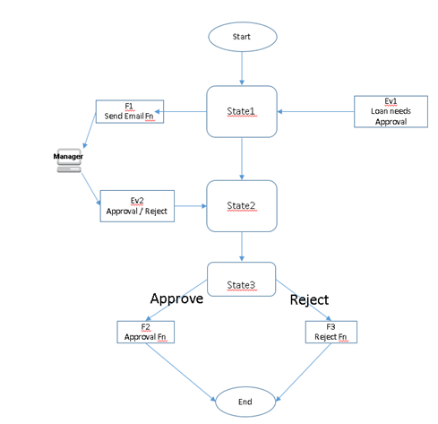
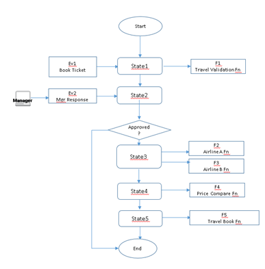
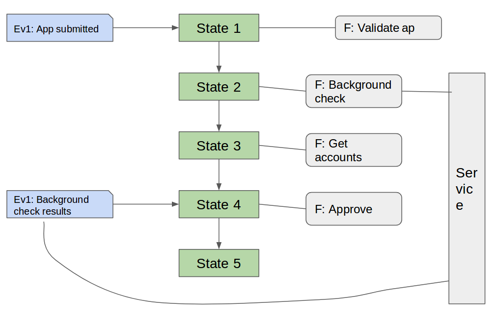
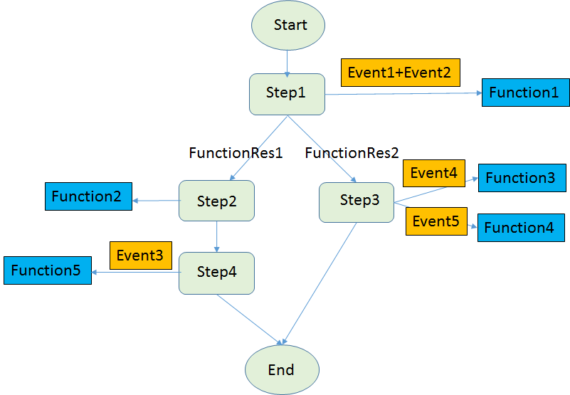
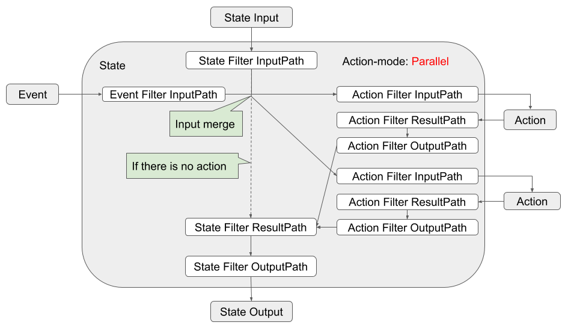
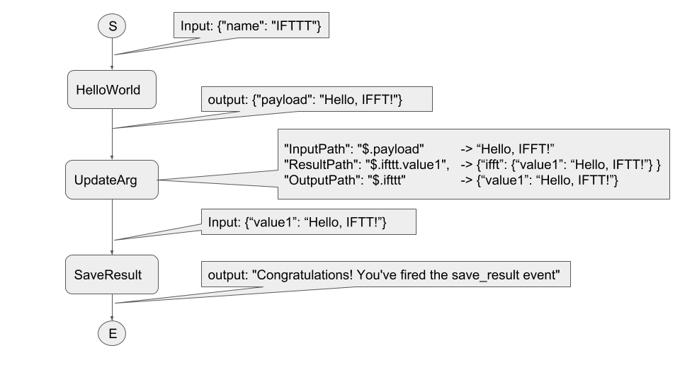

# Workflow - Version 0.1

# Abstract #

Workflow is a vendor-neutral specification for defining the format/primitives
that the users can use to specify/describe their serverless application flow.

# Status of this document #

This document is a working draft.

# Table of Contents #
- [Introduction](#Introduction)
- [Use Case Examples](#Use Case Examples)
- [Functional Scope](#Functional Scope)
- [Workflow Model](#Wokrflow Model)
- [Workflow Specification](#Wokrflow Specification)

# Introduction #

Many serverless applications are not a simple function triggered by a single
event, instead they are composed of multiple steps of function execution with
functions in different steps triggered by different events. If a step involves
multiple functions, the functions in that step might execute in sequence or in
parallel or in branches depending on different event triggers. In order for a
serverless platform to execute a serverless application’s function workflow
correctly, the application developer needs to provide a workflow specification.

The goal of the Serverless Workflow sub-group is to come up with a standard way
for the users to specify their serverless application workflow to help
facilitate portability of the Serverless application across different vendors’
platforms.

This specification will meet the above goals as it describes a complete
contract such that a given event timeline and workflow always produces the same
set of side-effects.

# Use Case Examples #

## Home Monitoring Use Case ##

A home security and monitoring system involves exterior door open sensor,
window open sensor, exterior motion detectors, etc. in the house. The system
could work as follows.

1. When the door open or window open is triggered, it will wait to see whether
there will be a motion event. If there is no motion event, then it is a false
alarm. If a motion event is received, face recognition is done. If it is a
family member, it is a false alarm. Otherwise a text and email with the face
image are sent to the two contacts on file. Then it will wait for response
from the contacts. 
---If there is no response within the predefined time period, it will initiate
an auto-call to the customer and do voice recognition to get the customer’s
response. If the customer’s response is OK, it is a false alarm. If the
customer’s response is NOT OK or the customer gives the wrong secret code,
a notification message is sent to the Emergency Services (fire, police and
ambulance). 
---If a response is received within the predefined time period, natural language
processing on the response will be initiated. If the response is OK, it is a
false alarm. If the response is NOT OK or the customer gives the wrong secret
code, a notification message is sent to the Emergency Services (fire, police
and ambulance).
 
1. When the motion sensor is triggered, face recognition is done. If it is a
family member, it is a false alarm. Otherwise it will wait to see whether there
will be a door open or window open event. If there is no door open or window
open event, then it is a false alarm. If a door/window open event is received,
a text and email message with the face image are sent to the two contacts on
file. Then it will wait for response from the contacts.
---If there is no response within the predefined time period, it will initiate
an auto-call to the customer and do voice recognition to get the customer’s
response. If the customer’s response is OK, it is a false alarm. If the
customer’s response is NOT OK or the customer gives the wrong secret code,
a notification message is sent to the Emergency Services (fire, police and
ambulance).
---If a response is received within the predefined time period, natural language
processing on the response will be initiated. If the response is OK, it is a
false alarm. If the response is NOT OK or the customer gives the wrong secret
code, a notification message is sent to the Emergency Services (fire, police
and ambulance).

The following diagram shows the flow for a basic home monitoring application


## Loan Approval Use Case ##

Every loan approval process begins with a customer entering his/her particulars
along with the desired loan information. This information is typically entered
via the web and the resulting form data is then stored in a DB or storage.

The following diagram shows the flow for a basic loan approval application.  



**‘Ev1’** illustrates the resulting storage or DB event.
**‘Ev1’** causes **‘State1’** to invoke function **‘F1’**. Function **‘F1’**
sends an email to an approving authority (Manager) and the flow transitions
to **‘State2’**. The approving authority reaches a decision (based upon credit
scores and other factors) and updates the decision via storage/DB/API GW.

**‘Ev2’** illustrates the decision event.**‘Ev2’** causes the flow to
transition to **‘State3’**.

**‘State3’** invokes function ‘**F2’** (loan approval function) if **‘Ev2’**
indicated loan approval or function **‘F3’** (loan rejection function) if
**‘Ev2’** indicated loan rejection. After executing either **‘F2’** or **‘F3’**,
the flow transitions to **‘End’** state.

## Employee Travel Booking Use Case ##

The following diagram shows the basic flow for an employee travel booking.



The flow waits in **‘State1’** waiting for an event. **‘Ev1’** is typically
a storage or DB event when an employee submits the travel request form. Upon
receiving **‘Ev1’**, **‘State1’** executes function **‘F1’** and transitions to
**‘State2’**.

In **‘State2’**, the flow is waiting for an approval / rejection event
**‘Ev2’** from the employee’s manager. **‘Ev2’** could be a storage/DB/API GW
event depending on the implementation. Upon receiving **‘Ev2’**, the workflow
transitions to the next state **‘Approved ?’**.

In this state, the flow checks the results of **‘Ev2’**. If **‘Ev2’** result
is “Reject”, the flow ends. If **‘Ev2’** result is “**Approved**”, then the
flow transitions to **‘State3’**.

**‘State3’** invokes multiple functions **‘F2’** and **‘F3’** to check the
prices of various airlines. Once **‘F2’** and **‘F3’** complete, the flow
transitions to **‘State4’** with the results of **‘F2’** and **‘F3’**

In **‘State4’**, function **‘F4’** is invoked. **‘F4’** does a comparison of the
results obtained from **‘State3’**. In addition to price, other factors such as
time may be considered in evaluating the best flight. Once **‘F4’** completes,
the flow transitions to **‘State5’**.

**‘State5’** invoked **‘F5’** which completes the travel booking. After **‘F5’**
completes the flow ends.

## Streaming Video-on-Demand Use Case ##

The following diagram illustrates the basic flow for streaming VOD.


**‘Ev1’** occurs when video with metadata has been uploaded to storage. This
causes **‘State1’** to invoke the ingestion function **‘F1’** and transition to
**‘State2’**. Function **‘F1’** is responsible for parsing the metadata file,
validate metadata file (E.g. make sure the source video file exists), analyze
the source video file and finally pass the results of the analysis to
**‘State2’**.

**‘State2’**executes function **‘F2’**. Function **‘F2’** queues the video file
to different transcoding services (specified in the metadata) and then
transitions to **‘State3’**.

Events **‘Ev3’, ‘Ev4’ and ‘Ev5**’ are all event completion events from the
transcoding services. This could be a notification event, etc. When either of
**‘Ev3’**, **‘Ev4’** or **‘Ev5’** is received, **‘State3’** executes function
**‘F3’** which updates a database with success/failure depending upon the
results present in the event. When all the events **‘Ev3’**, **‘Ev4’** and
**‘Ev5’** are received, the flow ends.

## Loan Approval With a Long-Running Service Use Case##

A loan approval process begins when a user submits an online form. Then it
performs some steps such as validating customer details, etc. At a certain
stage, it is necessary to perform a background check on the customer, which is
done by invoking an external service. This service can take a long time to
complete (e.g. 2 days). Until this step is completed, the flow can continue
performing other steps in the process and waits when the results of background
check is required. Once the background check is completed, that service sends
back the results with a correlation Id, which is used by the runtime to inject
the message into the correct process instance.

The following diagram illustrates the basic flow for the loan approval
long-running service.



## Translation Service Evaluation Use Case##

In case of Artificial Intelligence services, specific service has different
characteristics, strength, and weakness among providers. As an
example, this use case presents translation service evaluation flow among
providers using an ambiguous sentence.

In order to evaluate Translation Service in each provider, the flow uses an
ambiguous sentence, "[the professor lectures to the student with the
cat](about:blank)", it may be that the professor is lecturing with the cat, or
that the student has the cat.

The flow translates this ambiguous sentence into another language once, and
translate it back to English again.

Then user compares the original ambiguous sentence with the final result to see
if the ambiguous semantics is retained.

The following diagram illustrates the basic flow for the translation service.


Flow:

1.  Parallel branch for AWS

    -   Sequence of Action: [ translate forward -\> translate backward -\> post
        result to slack ]

2.  Parallel branch for Azure

    -   Sequence of Action: [ translate forward -\> translate backward -\> post
        result to slack ]

3.  Parallel branch for GCP

    -   Sequence of Action: [ translate forward -\> translate backward -\> post
        result to slack ]

4.  Parallel branch for IBM

    -   Sequence of Action: [ translate forward -\> translate backward -\> post
        result to slack ]

# Functional Scope #

Function Workflow is used to orchestrate cloud functions into a coordinated
micro-service application. Each function in the Function Workflow may be driven
by events from a wide variety of sources. Function Workflow groups the functions
and trigger events into a coherent unit and describe the execution of cloud
functions and information passing in a prescribed manner. Specifically Function
Workflow permits the user to:

1.  Define the steps/states and workflow involved in a serverless application.

2.  Define which functions are involved in each step.

3.  Define which event or combination of events trigger the function or
    functions.

4.  Define how to arrange those functions to execute in sequence or in parallel
    if multiple functions are triggered.

5.  Specify how information is filtered and passed from the event to the
    function or between functions or between states.

6.  Define error conditions with retries.

7.  If a function is triggered by two or more events, define what label/key
    should be used to correlate those events to the same function workflow
    instance.

The following is an example of a user’s Function Workflow that involves events
and functions. Using such a Function Workflow, the user can easily specify the
interaction between events and functions as well as how information can be
passed in the workflow.



Function Workflow allows the user to define rendezvous points (states) to wait
for predefined events before executing one or more cloud functions and
progressing through the Function Workflow.

# Workflow Model #


Function Workflow can be viewed as a collection of states and the transitions
and branching between these states, and each state could have associated events
and/or functions. Function Workflow may be invoked from a CLI command or
triggered dynamically on arrival of an event from an event source. An event from
an event source may also be associated with a specific state within a Function
Workflow. These states within a Function Workflow will wait on the arrival of an
event or events from one or more event sources before performing their
associated action and progressing to the next state. Additional workflow
functionality includes:

-   Results from a cloud function can be used to initiate retry operations or
    determine which function to execute next or which state to transition to.

-   Function Workflow provides a way to filter and transform the JSON event
    payload as it progresses through the Function Workflow.

-   Function Workflow provides a way for the application developer to specify a
    unique field in the event that can be used to correlate events from the
    event sources to the same function workflow instance

A Function Workflow can be naturally modeled as a state machine. The following
is a list of states provided by the definition/specification of a Function
Workflow. The specification of a workflow is called a workflow template. The
instantiation of the workflow template is called a workflow instance.

-   Event State: This state is used to wait for events from event sources and
    then to invoke one or more functions to run in sequence or in parallel.

-   Operation State: This state allows one or more functions to run in sequence
    or in parallel without waiting for any event.

-   Switch State: This state permits transitions to multiple other states (eg.
    Different function results in the previous state trigger
    branching/transition to different next states).

-   Delay State: This state causes the workflow execution to delay for a
    specified duration or until a specified time/date.

-   End State: This state terminates the workflow with Fail/Success.

-   Parallel State. The Parallel state allows a number of states to execute in
    parallel.

Function Workflow is described by a Workflow Specification which is
described in the following section.

# Workflow Specification #


The Function Workflow specification defines the behavior and operation of a
Function Workflow. The Function Workflow specification constructs should allow
the user to define the execution of functions as triggered by the arrival of
events. It should be sufficiently flexible to cover a wide range of
micro-service applications, from a simple invocation of one cloud function to
complex applications involving many cloud functions and multiple events.

At high level, the Function Workflow specification consists of two parts:
trigger definitions and state definitions.

``` JSON
"trigger-defs": {
   TRIGGER-DEFINITION
},

"states": {
   STATE-DEFINITION
}
```

The trigger-defs field (Optional, only required if there are events associated
with the workflow) is an array of event triggers associated with a Function
Workflow. If there are multiple events involved in an application workflow, a
correlation-token, which is used to correlate an event with other events for
same workflow instance, must be specified in that event trigger.

The states field (Required) is an array of states associated with a Function
Workflow.

The following is an example of a Function Workflow in JSON format, which
involves an Event State and the triggers for this Event State:

{

	"trigger-defs": {
		"OBS-EVENT": {
			"source": CloudEvent source
			“eventID”: CloudEvent eventID
			“correlation-token”: a path string to an identification label field in the event message
		},
		"TIMER-EVENT": {
			"source": CloudEvent source
			“eventID”: CloudEvent eventID
			“correlation-token”: a path string to an identification label field in the event message
		},
	},
	"states": [
		"STATE-OBS": {
			"start": Boolean, ----specify this is a start state
			"type": EVENT,
			"events": [
				{
					"event-expression": boolean expression 1 of triggering events
					"action-mode": Sequential or Parallel
					"actions": [
						{
							"function": function name 1
						},
						{
							"function": function name 2
						}
					],
					"next-state": STATE-END
				},
				{
					"event-expression": boolean expression 2 of triggering events
					"action-mode": Sequential or Parallel
					"actions": [
						{
							"function": function name 3
						},
						{
							"function": function name 4
						}
					],
					"next-state": STATE-END
				}
			]
		},
		"STATE-END": {
			"type": END
		}
	]
}

The following is another example of a Function Workflow with an Operation State:

{ 

	"states": {
		"STATE-ALARM-NOTIFY": {
			"start": Boolean, ----specify this is a start state
			"type": OPERATION,
			"action-mode": Sequential or Parallel,
			"actions": [
				{
					"function": function name 1
				},
				{
					"function": function name 2
				}
			],
			"next-state": "STATE-END"
		}
	}
}

## Trigger Definition(TRIGGER-DEFINITION) ##

The TRIGGER-DEFINITION consists of one or more event triggers. 

An event trigger is defined in JSON as shown below.
``` JSON
"EVENT-NAME": {
   "source": CloudEvent source UUID
   "correlation-token": a path string to an identification label field in the event message
}
```

The "EVENT-NAME” is used by the EVENTS-EXPRESSION in an Event state.
Note that the event itself is defined according to the [CloudEvents Specification]
(https://cloudevents.io/). The workflow only has a reference to the event name.

The field "source" specifies the event source UUID that identifies an event source.
The field "correlation-token" specifies a path string to an identification label
field in the event message that is used to correlate this event to other events
associated with the same application workflow instance. For different events,
this token could sit in different field location of the event message.

A workflow could have a single event trigger or an array of event triggers. If
it has an array of event triggers, a correlation-token specified as a JSON path
in the event message must be specified.

## State Definition(STATE-DEFINITION) ##
### Event State ###
``` JSON
"STATE-NAME": {
	"type": EVENT,
	"start": Boolean,
	"events": [
	     {
			"event-expression": EVENTS-EXPRESSION,
			"timeout": TIMEOUT-VALUE,
			"action-mode": ACTION-MODE,
			"actions": [
				ACTION-DEFINITION,
			],
			"next-state": STATE-NAME
		}
	]
}
```
An Event State will have the "type" field set to value "EVENT".

If the "start" field (Optional) is true, this is the start state. This must be
true for one state only. If the "start" field is not present, the default value
is false.

The field, "events", is composed of one or more event structs associated with
the event state.

The "event-expression" field is a Boolean expression which consists of one or
more Event operands and the Boolean operators. For example, an EVENTS-EXPRESSION
could be “Event1 or Event2”. The first event that arrives and matches the
EVENTS-EXPRESSION will cause all actions for this state to be executed followed
by a transition to the next state.

The field “timeout” specifies the time period waiting for the events in the
EVENTS-EXPRESSION. If the events do not come within the timeout period, the
workflow will transit to end state.

The field "action-mode" specifies whether functions are executed in sequence or
in parallel and could either be SEQUENTIAL or PARALLEL.

The "actions" field is a list of **ACTION-DEFINITION** constructs that specify
the list of functions to be performed when the event that matches the
event-expression is received.

The "next-state" field specifies the name of the next state to transition to
after all the actions for the matching event have been successfully executed.

**ACTION-DEFINITION**

This is defined in JSON as shown below.
``` JSON
{ 
	"function": FUNCTION-NAME,
	"timeout": TIMEOUT-VALUE,
	"retry": [
		{ 
			"match": RESULT-VALUE,
			"retry-interval": INTERVAL-VALUE,
			"max-retry": MAX-RETRY,
			"next-state": STATE-NAME
		}
	],
}
```

The "function" field specifies the function that must be invoked.

The "timeout" field specifies the maximum amount of time in seconds to wait for
the completion of the function’s execution. This must be a positive integer. The
function timer is started when the request is sent to the invoked function.

The "retry" field specifies how the result from a function is to be handled.

The "match" field specifies the matching value for the result.

The "retry-interval" and "max-retry" fields are used in case of an error result.

The "next-state" field specifies the name of the next state to transition to
when exceeding max-retry limit.

### Operation State
``` JSON
"STATE-NAME": {

	"type": OPERATION,
	"start": Boolean,
		{
			"action-mode": ACTION-MODE,
			"actions": [
				ACTION-DEFINITION,
			],
			"next-state": STATE-NAME
		}
}
```

The field "action-mode" specifies whether functions are executed in sequence or
in parallel and could either be SEQUENTIAL or PARALLEL.

The "actions" field is a list of ACTION-DEFINITION constructs that specify the
list of functions to be performed when the event that matches the
event-expression is received.

The "next-state" field specifies the name of the next state to transition to
after all the actions for the matching event have been successfully executed.

### Switch State

``` JSON
"STATE-NAME": {

	"type": SWITCH,
	"start": Boolean,
	"choices": [
		{
			"path": PAYLOAD-PATH,
			"value": VALUE,
			"operator": COMPARISON-OPERATOR,
			"next-state": STATE-NAME
		},
		{ 
			"Not": {
				"path": PAYLOAD-PATH,
				"value": VALUE,
				"operator": COMPARISON-OPERATOR
			},
			"next-state": STATE-NAME
		},
		{
			"And": [
				{
					"path": PAYLOAD-PATH,
					"value": VALUE,
					"operator": COMPARISON-OPERATOR
				},
				{
					"path": PAYLOAD-PATH,
					"value": VALUE,
					"operator": COMPARISON-OPERATOR
				}
			],
			"next-state": STATE-NAME
		},
		{
			"Or": [
				{
					"path": PAYLOAD-PATH,
					"value": VALUE,
					"operator": COMPARISON-OPERATOR
				},
				{
					"path": PAYLOAD-PATH,
					"value": VALUE,
					"operator": COMPARISON-OPERATOR
				}
			],
			"next-state": STATE-NAME
		},
	],
	"default": STATE-NAME
}
```

The "choices" field defines an ordered set of Match Rules against the input data
to this state, and the next state to transition to for each match.

>   The "path" field is a JSON Path that selects the value of the input data to
>   be matched.

>   The "value” field is the matching value.

>   The "operator” field specifies how the input data is compared with the
>   value, such as “EQ”, “LT”, “LTEQ”, “GT”, “GTEQ”,

>   “StrEQ”, “StrLT”, “StrLTEQ”, “StrGT”, “StrGTEQ” .

>   The "next-state" field specifies the name of the next state to transition to
>   if there is a value match.

>   The “Not” field must be a single Match Rule that must not contain
>   “next-state” fields.

>   The “And” or “Or” field must be non-empty arrays of Match Rules that must
>   not themselves contain “next-state” fields.

The "default" field specifies the name of the next state if there is no match
for any choices value.

The order of evaluation is form the top to the bottom, and if a match happens,
go to “next-state” and ignore the rest of condition.

### Delay State
``` JSON
"STATE-NAME": {

	"type": DELAY,
	"start": Boolean,
	"time-delay": TIME-VALUE,
	"next-state": STATE-NAME
}
```

The "time-delay" field specifies a time delay. The TIME-VALUE is the amount of
time in seconds to delay in this state. This must be a positive integer.

The "next-state" field specifies the name of the next state to transition to.
STATE-NAME must be a valid State name within the Function Workflow.

### End State
``` JSON
"STATE-NAME": {

	"type": END,
	"status": STATUS
}

The “status” field specifies the workflow termination status: SUCCESS or
FAILURE.
```

### PARALLEL State

The Parallel state consists of a number of states that are executed in parallel.
A Parallel state has a number of branches that execute concurrently. Each branch
has a list of states with one state as the start state. Each branch continues
its execution until it reaches a state that has no next state within the branch.
When all branches have completed execution, the parallel state will transit to
its next state. This is in essence the nesting of a set of states within a
Parallel state.

A Parallel state is defined by a state type Parallel and includes an array of
parallel branches, each of which has its own separate states. Each branch
receives a copy of the Parallel state’s input data. Any type of state may be
used in a branch except an END state.

"next-state" transitions for states within a branch can only be to other states
in that branch. In addition, states outside a Parallel state cannot transition
to a state within a branch of a Parallel state.

The Parallel state generates an output array in which each element is the output
for a branch. The elements of the output array need not be of the same type.
``` JSON
"STATE-NAME": {

	"type": PARALLEL,
	"start": Boolean,
	"branches": {
		BRANCH-NAME {
			"states": {
				STATE-DEFINITION
			}
		},
		BRANCH-NAME {
			"states": {
				STATE-DEFINITION
			}
		}
	},
	"next-state": "STATE-NAME"
}
```
The "branches" field is a list of branches that are executed concurrently. Each
named branch has a list of "states". The "next-state" field for each
of the states within a branch must either be valid state name within that
branch, or be absent to indicate that the state terminates execution of the
branch. The branch execution starts at the state within the branch that has
"start": true.

The "next-state": STATE-NAME field for the Parallel state itself specifies the
name of the next state to transition to after all branches have completed
execution. The STATE-NAME must be a valid State name within the Function
Workflow, but it must not be a state within the Parallel state itself.

## Information Passing ##

The diagram below shows data flow through a Function Workflow that includes an
Event state that invokes two serverless functions. Output data from one state is
passed as input data to the next state. Filters are used to filter and transform
the data on ingress to and egress from each state. Input data from a previous
state may be delivered to serverless function when it is invoked from an
Operation state in the Workflow.

Data contained in a response from a serverless function is sent as output data
to the next state. If a state (Operation state or Event state) includes a list
of sequential actions, data contained in the response from one serverless
function is filtered and then sent in the request to the next function.

In an Event state, CloudEvent metadata received in a request from an event
source may be transformed and combined with data received from a previous state
before it is delivered to a serverless function. Likewise CloudEvent metadata
received in a response from a serverless function may be transformed and
combined with data received from a previous state before it is delivered in a
response sent to the event source.


There may be cases where an event source such as an API gateway expects to
receive a response from the workflow. In this case CloudEvent metadata received
in a response from a serverless function may be transformed and combined with
data received from a previous state before it is delivered in a response sent to
the event source as shown below.


## Filter Mechanism ##

The state machine maintains an implicit JSON data which is accessed from each
filter as JSONPath expression ‘\$’.

There are three kinds of filters

-   Event Filter

    -   Invoked when data is passed from an event to the current state

-   State Filter

    -   Invoked when data is passed from the previous state to the current state

    -   Invoked when data is passed from the current state to the next state

-   Action Filter (Action means ACTION-DEFINITION which defines Serverless
    Function)

    -   Invoked when data is passed from the current state to the first action

    -   Invoked when data is passed from an action to action

    -   Invoked when data is passed from the last action to the current state

Each Filter has three kinds of path filters

-   InputPath

    -   Select input data of either Event, State or Action as JSONPath

    -   Default value is ‘\$’

-   ResultPath

    -   Specify result JSON node of Action Output as JSONPath

    -   Default value is ‘\$’

-   OutputPath

    -   Specify output data of State or Action as JSONPath

    -   Default value is ‘\$’




Example

Compose the following two function “hello” and “save_result”. 
The second function “save_result” cannot take the first function “hello” output as input.

- Function “hello”: 
input {“name”: String}
output {“payload”: String}
- Function “save_result”:
input {“value1: String}
output String

CNCF Function Workflow Language
``` JSON
  "states": {
    "HelloWorld": {
      "start": true,		
      "type": OPERATION,
      "action-mode": Sequential,
      "actions": [
        {
          "function": “hello”
        }
      ],
      "next-state": "UpdateArg"
    },
    "UpdateArg": {
      "start": false,		
      "type": OPERATION,
      "action-mode": Sequential,
      "InputPath":"$.payload",
      "ResultPath":"$.ifttt.value1",
      "OutputPath":"$.ifttt",
      "actions": [
      ],
      "next-state": "SaveResult"
    },
    "SaveResult": {
      "start": false,		
      "type": OPERATION,
      "action-mode": Sequential,
      "actions": [
          "function": “save_result”
      ],
      "next-state": "STAE_END"
    },
    "STATE-END": {
      "type": END
    }
  }
```



## Errors ##

The state machine returns the following predefined Error Code during runtime.
Typically it is used in the “retry” field of ACTION-DEFINITION.

-   SYS.Timeout

-   SYS.Fail

-   SYS.MatchAny

-   SYS.Permission

-   SYS.InvalidParameter

-   SYS.FilterError
