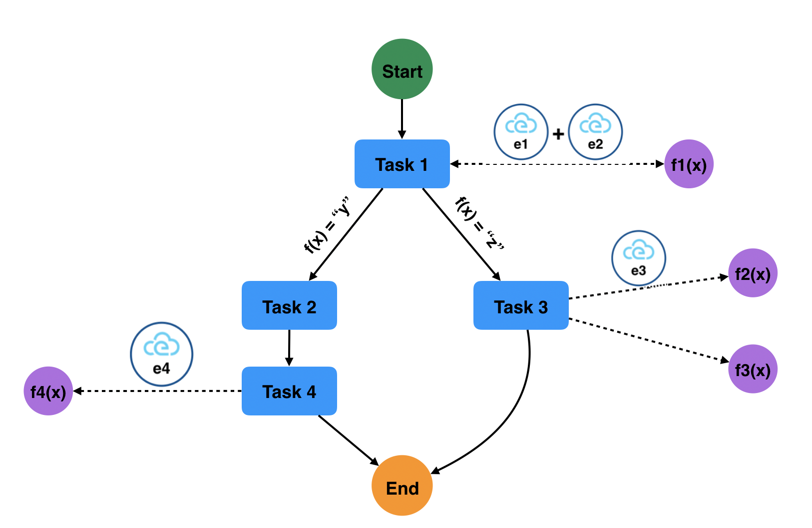
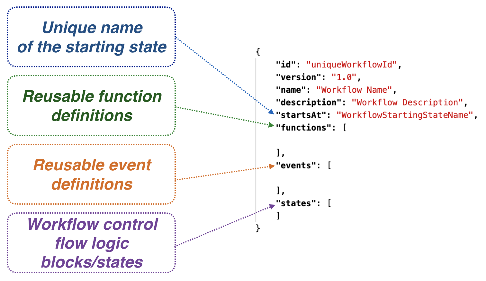
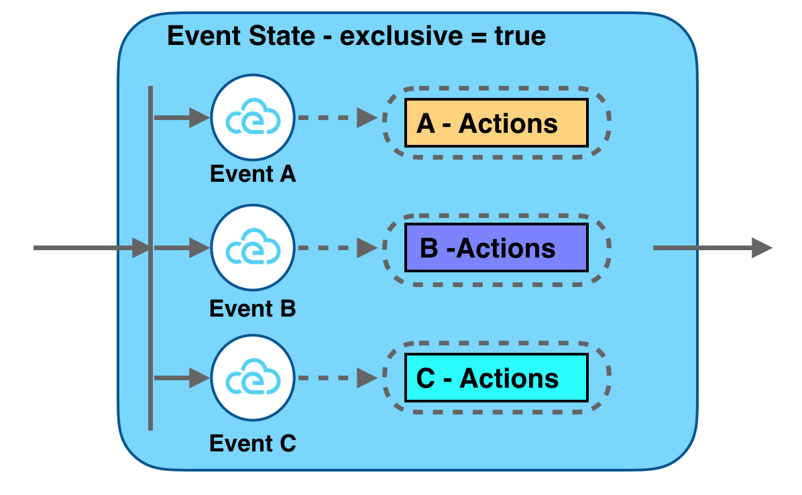
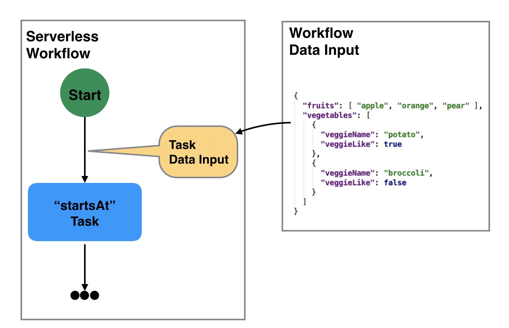
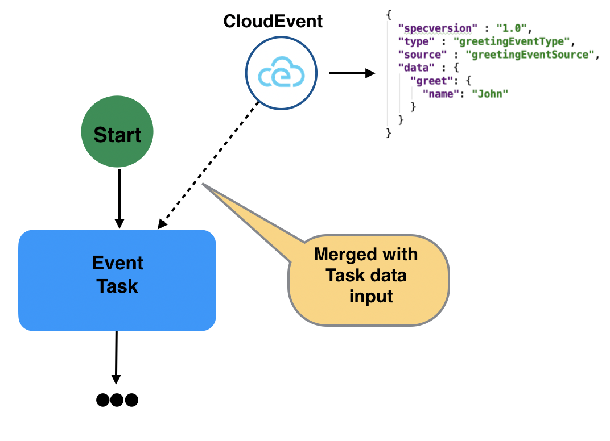
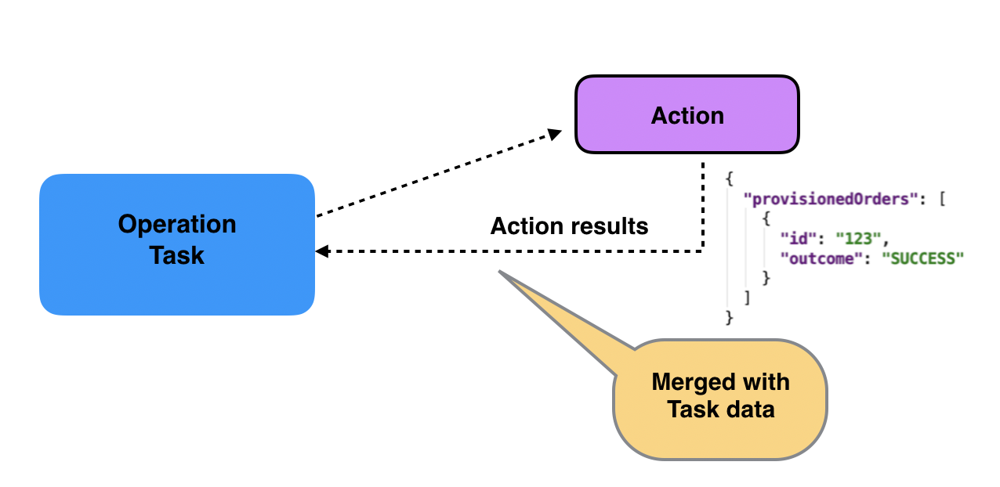
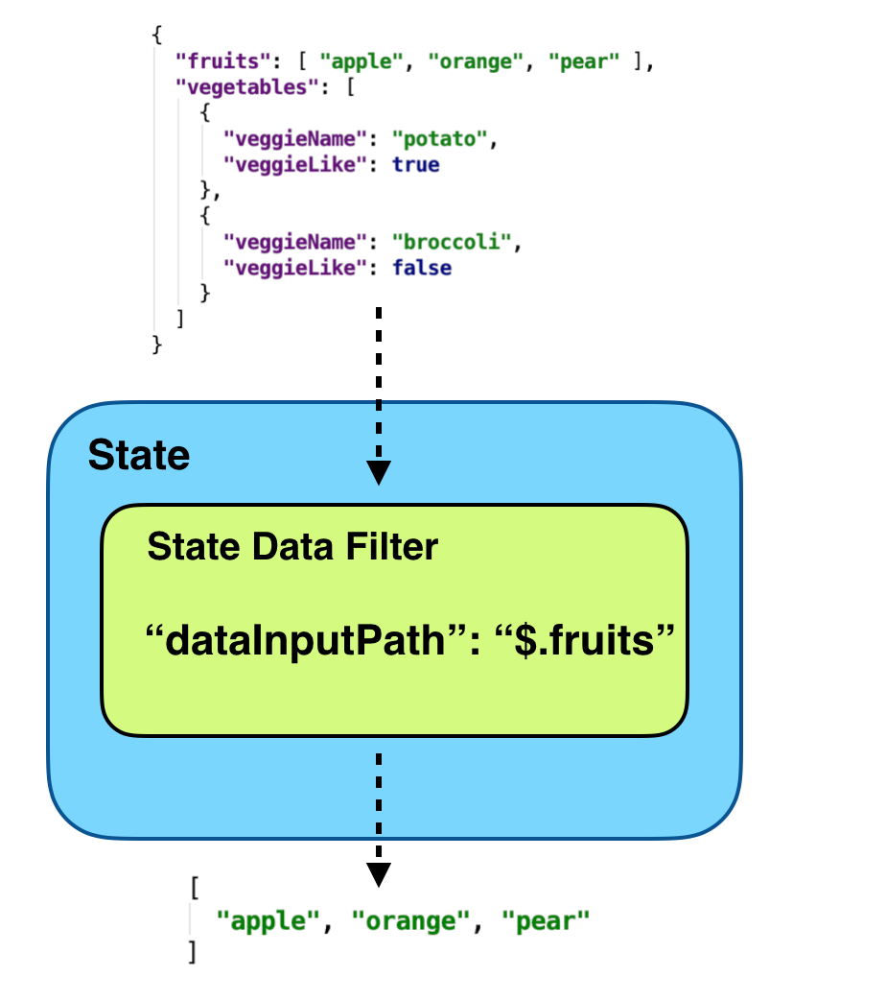
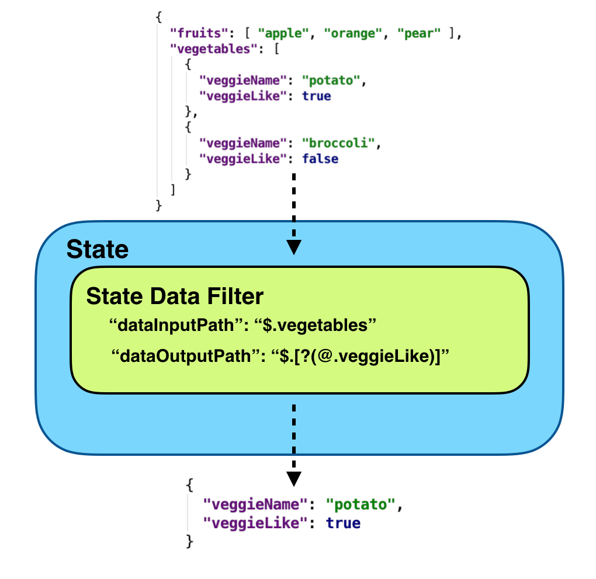
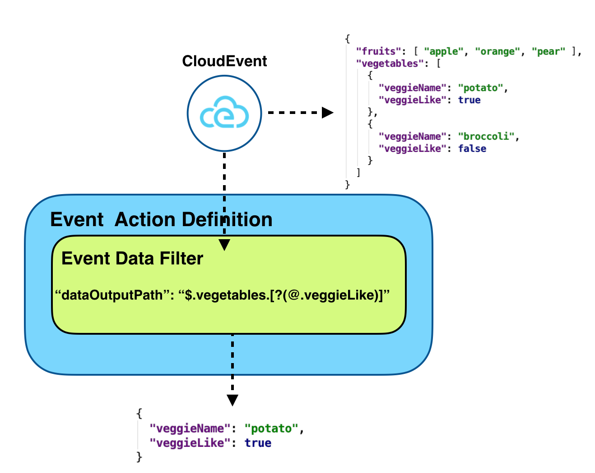
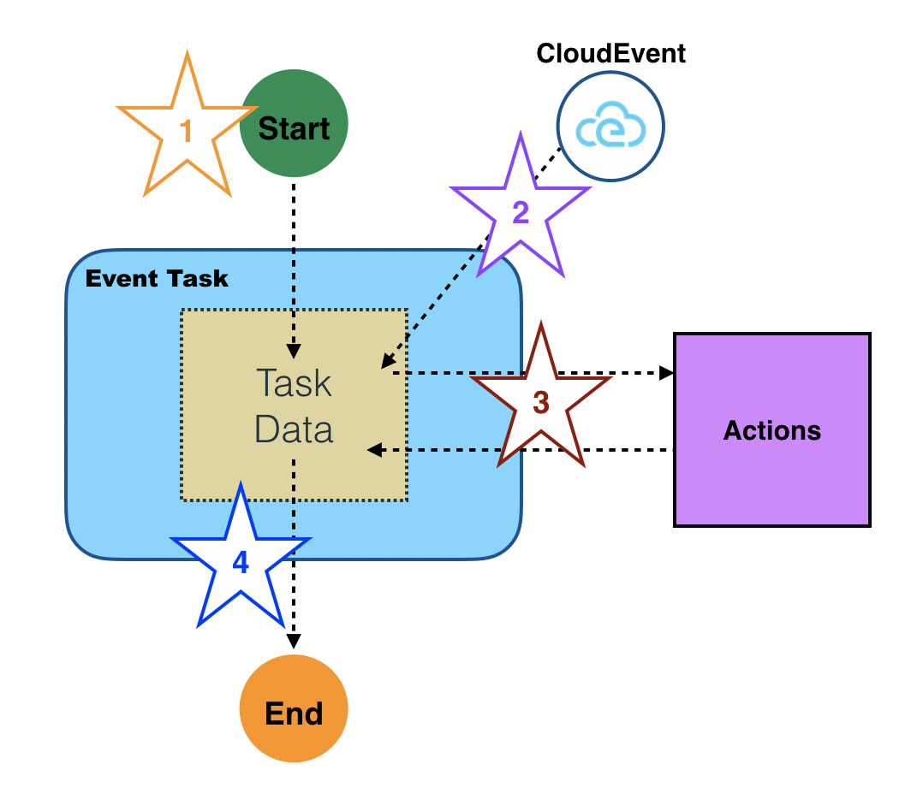

# Serverless Workflow

## Abstract

Serverless Workflow is a vendor-neutral specification for defining the model of
workflows responsible for orchestrating event-driven serverless applications.

## License

Serverless Workflow specification is free and open-source, operating under the
[Apache License version 2.0](LICENSE).

## Status of this document

This document is a working draft.

## Table of Contents

- [Overview](#Overview)
- [Workflow Format](#Workflow-Format)
- [Functional Scope](#Functional-Scope)
- [Specification Details](#Specification-Details)
  - [Workflow Model](#Workflow-Model)
  - [Workflow Definition](#Workflow-Definition)
  - [Workflow Data](#Workflow-Data)
  - [Workflow Error Handling](#Workflow-Error-Handling)
  - [Workflow Metadata](#Workflow-Metadata)
- [Extending](#Extending)
- [Use Cases](#Use-Cases)
- [Examples](#Examples)
- [Reference](#Reference)

## Overview

Serverless applications are becoming increasingly complex and are rarely composed
of a single function call triggered by an event.
Often they contain complex business logic to define, coordinate, and manage the execution order of a large amount
of serverless functions and events that can trigger those functions.

Workflows have become a key component of serverless applications as they provide
clear separation between business and orchestration logic.

Some of the many benefits using workflows in serverless applications include:

- Allow developers to focus on business requirements and not orchestration logic.
- Externalize cross-cutting concerns such as parallel execution, branching, timeouts, compensation, callbacks, etc.
thus allowing clear focus on business requirements in functions.
- Greatly reduce the amount of code developers have to write, maintain, and test.
- Reduce the amount of time and effort to make changes/updates in large serverless applications.
- Allow for definition of reusable and clearly defined workflow orchestration patterns.

Many different workflow implementations (both proprietary and open-source) exist today, each with it's own set of features
and capabilities. When picking a current implementations, it is very difficult to later on switch to a different one
without investing a lot of time, and effort.

Serverless Workflow is a specification that defines the model for workflows
responsible for orchestrating event-driven serverless applications.

Main goals of the specification include:

- To facilitate Serverless Workflow portability across different vendor platforms
- To be completely vendor neutral
- To support both stateless and stateful Serverless Workflow orchestration
- To define a light-weight and powerful Serverless Workflow model

Workflows defined using the serverless workflow specification can be used to:

- **Orchestrate serverless application logic**: serverless applications are typically event-driven and can be
very hard to manage. Serverless Workflow groups the application events and functions into a coherent unit and
simplifies orchestration of the app logic.
- **Define and coordinate application control flow**: allow the users to define the execution/operation
control flow and how/which functions are to be invoked on arrival of events.
- **Define and manage application data flow**: allows the users to define how data is passed and filtered from incoming events to states,
from states to functions, from one function to another function, and from one state to another state.

## Workflow Format

The Serverless workflow format is defined with [JSON](https://www.json.org/json-en.html) or [YAML](https://yaml.org/).
Structure of serverless workflows is described via [JSON Schema](https://json-schema.org/).

Serverless Workflow definitions are considered specification-compliant if they conform to the [workflow schema](schema/serverless-workflow-schema.json).

Note that this schema reflects the current status of the specification as is updated alongside this document.

## Functional Scope

Serverless Workflow allows users to:

1. Define and orchestrate steps/states involved in a serverless application.
2. Define which functions are executed in each step.
3. Define which event or combination of events trigger function execution.
4. Define function execution behavior (sequential, parallel, etc).
5. Specify manual decision steps during workflow execution.
6. Specify information filtering throughout the execution of the serverless workflow.
7. Define error conditions with retries.
8. Correlate trigger events with workflow instances.

Following diagram illustrates functional flow that involves states, events and functions. It shows that
incoming events can trigger function invocations during workflow execution.

<p align="center">

</p>

## Specification Details

Following sections provide detailed descriptions of the Serverless Workflow Model. For each part of the model we provide:

- Parameter description in table format.
- [JSON Schema](https://json-schema.org/) definition.

### Workflow Model

Serverless Workflow can be viewed as a collection of [states](#State-Definition) and [transitions](#Transitions) between states.
Individual states can make control flow decisions based on their data inputs, perform different actions, as well
as pass their data to other states.

States can wait on the arrival events to perform their actions. When states
complete their tasks, they can transition to other states or stop workflow execution.
See the [Transitions](#Transitions) section for more details on workflow progression.

A Serverless Workflow can be naturally implemented as a state machine or a workflow engine.
This specification does not mandate a specific implementation decision in this regard.
As mentioned, implementation compliance is based on the workflow definition language only.

### Workflow Definition

| Parameter | Description | Type | Required |
| --- | --- |  --- | --- |
| id | Workflow unique identifier | string | yes |
| name | Workflow name | string | yes |
| description | Workflow description | string | no |
| version | Workflow version | string | no |
| schemaVersion | Workflow schema version | string | no |
| expressionLanguage | Default expression language to be used throughout the workflow definition | string | no |
| [dataInputSchema](#Workflow-Data-Input) | URI to JSON Schema that workflow data input adheres to | string | no |
| [dataOutputSchema](#Workflow-data-output) | URI to JSON Schema that workflow data output adheres to | string | no |
| [events](#Event-Definition) | Workflow event definitions. Defines events that can be consumed or produced | array | no |
| [functions](#Function-Definition) | Workflow function definitions | array | no |
| [states](#State-Definition) | Workflow states | array | yes |
| [extensions](#Extending) | Workflow custom extensions | array | no |
| [metadata](#Workflow-Metadata) | Metadata information| object | no |

<details><summary><strong>Click to view JSON Schema</strong></summary>
<p>

```json
{
    "$id": "https://wg-serverless.org/workflow.schema",
    "$schema": "http://json-schema.org/draft-07/schema#",
    "description": "Serverless Workflow is a vendor-neutral specification for defining the model of workflows responsible for orchestrating event-driven serverless application",
    "type": "object",
    "properties": {
        "id": {
          "type": "string",
          "description": "Workflow unique identifier",
          "minLength": 1
        },
        "name": {
          "type": "string",
          "description": "Workflow name",
          "minLength": 1
        },
        "description": {
          "type": "string",
          "description": "Workflow description"
        },
        "version": {
          "type": "string",
          "description": "Workflow version",
          "minLength": 1
        },
        "schemaVersion": {
          "type": "string",
          "description": "Serverless Workflow schema version",
          "minLength": 1
        },
        "expressionLanguage": {
          "type": "string",
          "description": "Default expression language to be used throughout the workflow definition"
        },
        "dataInputSchema": {
          "type": "string",
          "format": "uri",
          "description": "URI to JSON Schema that workflow data input adheres to"
        },
        "events": {
            "type": "array",
            "description": "Workflow event definitions. Defines events that can be consumed or produced",
            "items": {
                "type": "object",
                "$ref": "#/definitions/eventdef"
            }
        },
        "functions": {
            "type": "array",
            "description": "Workflow function definitions",
            "items": {
                "type": "object",
                "$ref": "#/definitions/function"
            }
        },
        "states": {
            "type": "array",
            "description": "State Definitions",
            "items": {
                "type": "object",
                "anyOf": [
                    {
                      "title": "Delay State",
                      "$ref": "#/definitions/delaystate"
                    },
                    {
                      "title": "Event State",
                      "$ref": "#/definitions/eventstate"
                    },
                    {
                      "title": "Operation State",
                      "$ref": "#/definitions/operationstate"
                    },
                    {
                      "title": "Parallel State",
                      "$ref": "#/definitions/parallelstate"
                    },
                    {
                      "title": "Switch State",
                      "$ref": "#/definitions/switchstate"
                    },
                    {
                      "title": "SubFlow State",
                      "$ref": "#/definitions/subflowstate"
                    },
                    {
                      "title": "Inject State",
                      "$ref": "#/definitions/injectstate"
                    },
                    {
                      "title": "ForEach State",
                      "$ref": "#/definitions/foreachstate"
                    },
                    {
                      "title": "Callback State",
                      "$ref": "#/definitions/callbackstate"
                    }
                ]
            }
        },
        "extensions": {
          "type": "array",
          "description": "Workflow Extensions",
          "items": {
            "type": "object"
          }
        },
        "metadata": {
          "$ref": "#/definitions/metadata"
        }
    },
    "required": ["id", "name", "version", "states"]
}
```

</p>
</details>

Defines the top-level structure of a serverless workflow model.
Following figure describes the main workflow definition blocks.

<p align="center">

</p>

#### Function Definition

| Parameter | Description | Type | Required |
| --- | --- | --- | --- |
| name | Unique function name | string | yes |
| resource | Function resource (URI) | string | yes |
| type | Function type | string | no |
| [metadata](#Workflow-Metadata) | Metadata information | object | no |

<details><summary><strong>Click to view JSON Schema</strong></summary>

```json
{
  "type": "object",
  "properties": {
    "name": {
      "type": "string",
      "description": "Unique function name",
      "minLength": 1
    },
    "resource": {
      "type": "string",
      "description": "Function resource (URI)"
    },
    "type": {
      "type": "string",
      "description": "Function type"
    },
    "metadata": {
       "$ref": "#/definitions/metadata",
       "description": "Metadata information"
    }
  },
  "required": ["name", "resource"]
}
```

</details>

Allows you to define a reusable function definition. It can be referenced in [actions](#Action-Definition) defined in [Event](#Event-State), [Operation](#Operation-State), or [Callback](#Callback-State) workflow states. Each function definition must have an unique name.
The "resource" parameter of a function evaluates to execution of an existing serverless function.
Implementations can use the "type" parameter to define communication information such as protocols.

Since function definitions are reusable, their data input parameters are defined within [actions](#Action-Definition) that reference them.

#### Event Definition

| Parameter | Description | Type | Required |
| --- | --- | --- | --- |
| name | Unique event name | string | yes |
| source | CloudEvent source | string | yes |
| type | CloudEvent type | string | yes |
| correlationToken | Context attribute name of the CloudEvent which value is to be used for event correlation | string | no |
| [metadata](#Workflow-Metadata) | Metadata information | object | no |

<details><summary><strong>Click to view JSON Schema</strong></summary>

```json
{
    "type": "object",
    "properties": {
        "name": {
            "type": "string",
            "description": "Unique event name"
        },
        "source": {
            "type": "string",
            "description": "CloudEvent source"
        },
        "type": {
            "type": "string",
            "description": "CloudEvent type"
        },
        "correlationToken": {
            "type": "string",
            "description": "Context attribute name of the CloudEvent which value is to be used for event correlation"
        },
        "metadata": {
          "$ref": "#/definitions/metadata",
          "description": "Metadata information"
        }
    },
    "required": ["name", "source", "type"]
}
```

</details>

Defines events that can be consumed or produced during workflow execution.
Consumed events can trigger actions to be executed. Events can also be produced during workflow
execution to be consumed by clients.

As serverless workflow definitions are vendor neutral, so should be the events definitions that they consume and produce.
As such event format within serverless workflows uses the [CloudEvents](https://github.com/cloudevents/spec) specification to describe events.

To support use case where serverless workflows need to perform actions across multiple types
of events, users can specify a correlation token to correlate these events.
The "correlationToken" must specify a context attribute in the event which contains a business key to be
used for event correlation. An event "context attribute" can be defined as any event attribute except the event payload (the event "data" attribute).

For example let's say we have two CloudEvent which set their correlation via the "patientId" context attribute:

```json
{
    "specversion" : "1.0",
    "type" : "com.hospital.patient.heartRateMonitor",
    "source" : "hospitalMonitorSystem",
    "subject" : "HeartRateReading",
    "id" : "A234-1234-1234",
    "time" : "2020-01-05T17:31:00Z",
    "patientId" : "PID-12345",
    "data" : {
      "value": "80bpm"
    }
}
```

and

```json
{
    "specversion" : "1.0",
    "type" : "com.hospital.patient.bloodPressureMonitor",
    "source" : "hospitalMonitorSystem",
    "subject" : "BloodPressureReading",
    "id" : "B234-1234-1234",
    "time" : "2020-02-05T17:31:00Z",
    "patientId" : "PID-12345",
    "data" : {
      "value": "110/70"
    }
}
```

If we then correlate these two events with event definitions:

```json
{
"events": [
 {
  "name": "HeartRateReadingEvent",
  "type": "com.hospital.patient.heartRateMonitor",
  "source": "hospitalMonitorSystem",
  "correlationToken": "patientId"
 },
 {
   "name": "BloodPressureReadingEvent",
   "type": "com.hospital.patient.bloodPressureMonitor",
   "source": "hospitalMonitorSystem",
   "correlationToken": "patientId"
  }
]
}
```

Workflow implementations can use this token to map events to particular workflow instances, or use it
to correlate multiple events that are needed to start a workflow instance.

#### State Definition

States define building blocks of the Serverless Workflow. The specification defines following states:

| Name | Description | Consumes events? | Produces events? | Executes actions? | Handles errors? | Allows parallel execution? | Makes data-based transitions? | Can be workflow start state? | Can be workflow end state? |
| --- | --- | --- | --- | --- | --- | --- | --- | --- | --- |
| **[Event](#Event-State)** | Define events that trigger action execution | yes | yes | yes | yes (includes retries) | yes | no | yes | yes |
| **[Operation](#Operation-State)** | Execute one or more actions | no | yes | yes | yes (includes retries) | yes | no | yes | yes |
| **[Switch](#Switch-State)** | Define data-based or event-based workflow transitions | no | yes | no | yes | no | yes | yes | no |
| **[Delay](#Delay-State)** | Delay workflow execution | no | yes | no | yes | no | no | yes | yes |
| **[Parallel](#Parallel-State)** | Causes parallel execution of branches (set of states) | no | yes | no | yes (includes retries) | yes | no | yes | yes |
| **[SubFlow](#SubFlow-State)** | Represents the invocation of another workflow from within a workflow | no | yes | no | yes | no | no | yes | yes |
| **[Inject](#Inject-State)** | Inject static data into state data | no | yes | no | yes | no | no | yes | yes |
| **[ForEach](#ForEach-State)** | Parallel execution of states for each element of a data array | no | yes | no | yes (includes retries) | yes | no | yes | yes |
| **[Callback](#Callback-State)** | Manual decision step. Executes a function and waits for callback event that indicates completion of the manual decision | yes | yes | yes (including retries) | yes | no | no | yes | yes |

Following is a detailed description of each of the defined states:

#### Event State

| Parameter | Description | Type | Required |
| --- | --- | --- | --- |
| id | Unique state id | string | no |
| name | State name | string | yes |
| type | State type | string | yes |
| exclusive | If true consuming one of the defined events causes its associated actions to be performed. If false all of the defined events must be consumed in order for actions to be performed. Default is "true"  | boolean | no |
| [eventsActions](#eventstate-eventactions) | Define the events to be consumed and one or more actions to be performed | array | yes |
| [timeout](#eventstate-timeout) | Time period to wait for incoming events (ISO 8601 format). For example: "PT15M" (wait 15 minutes), or "P2DT3H4M" (wait 2 days, 3 hours and 4 minutes)| string | no |
| [stateDataFilter](#state-data-filter) | State data filter definition| object | no |
| [dataInputSchema](#Information-Passing-Between-States) | URI to JSON Schema that state data input adheres to | string | no |
| [dataOutputSchema](#Information-Passing-Between-States) | URI to JSON Schema that state data output adheres to | string | no |
| [transition](#Transitions) | Next transition of the workflow after all the actions have been performed | object | yes |
| [retry](#workflow-retrying) | States retry definitions | array | no |
| [onError](#Workflow-Error-Handling) | States error handling definitions | array | no |
| [start](#Start-Definition) | Is this state a starting state | object | no |
| [end](#End-Definition) | Is this state an end state | object | no |
| [metadata](#Workflow-Metadata) | Metadata information| object | no |

<details><summary><strong>Click to view JSON Schema</strong></summary>
<p>

```json
{
    "type": "object",
    "description": "This state is used to wait for events from event sources, then consumes them and invoke one or more actions to run in sequence or parallel",
    "properties": {
        "id": {
            "type": "string",
            "description": "Unique state id",
            "minLength": 1
        },
        "name": {
            "type": "string",
            "description": "State name"
        },
        "type": {
            "type" : "string",
            "enum": ["event"],
            "description": "State type"
        },
        "exclusive": {
            "type": "boolean",
            "default": true,
            "description": "If true consuming one of the defined events causes its associated actions to be performed. If false all of the defined events must be consumed in order for actions to be performed"
        },
        "eventsActions": {
            "type": "array",
            "description": "Define what events to be consumed and one or more actions to be performed",
            "items": {
                "type": "object",
                "$ref": "#/definitions/eventactions"
            }
        },
        "timeout": {
            "type": "string",
            "description": "Time period to wait for incoming events (ISO 8601 format)"
        },
        "stateDataFilter": {
          "$ref": "#/definitions/statedatafilter"
        },
        "retry": {
            "type": "array",
            "description": "States retry definitions",
            "items": {
                "type": "object",
                "$ref": "#/definitions/retry"
            }
        },
        "onError": {
            "type": "array",
            "description": "States error handling definitions",
            "items": {
                "type": "object",
                "$ref": "#/definitions/error"
            }
        },
        "dataInputSchema": {
          "type": "string",
          "format": "uri",
          "description": "URI to JSON Schema that state data input adheres to"
        },
        "dataOutputSchema": {
          "type": "string",
          "format": "uri",
          "description": "URI to JSON Schema that state data output adheres to"
          },
        "transition": {
          "description": "Next transition of the workflow after all the actions have been performed",
          "$ref": "#/definitions/transition"
        },
        "start": {
          "$ref": "#/definitions/start",
          "description": "State start definition"
        }
        "end": {
          "$ref": "#/definitions/end",
          "description": "State end definition"
        },
        "metadata": {
          "$ref": "#/definitions/metadata"
        }
    },
    "oneOf": [
      {
        "required": [
          "name",
          "type",
          "eventsActions",
          "end"
        ]
      },
      {
        "required": [
          "name",
          "type",
          "eventsActions",
          "transition"
        ]
      },
      {
        "required": [
          "start",
          "name",
          "type",
          "eventsActions",
          "transition"
        ]
      },
      {
        "required": [
          "start",
          "name",
          "type",
          "eventsActions",
          "end"
        ]
      }
   ]
}
```

</p>
</details>

Event states await one or more events and perform actions when they are received.
If defined as the workflow starting state, the event state definition controls when the workflow
instances should be created.

The "exclusive" property determines if the state should wait for any of the defined events in the eventsActions array, or
 if all defined events must be present for their associated actions to be performed.

Following two figures illustrate the "exclusive" property:

<p align="center">

</p>

If the event state in this case is a starting state, any of the defined events would start a new workflow instance.

<p align="center">

</p>

If the event state in this case is a starting state, occurrence of all defined events would start a new
 workflow instance.
  
In order to consider only events that are related to each other, we need to set the "correlationToken" property in the workflow
 [events definitions](#Event-Definition). This token points to a context attribute of the events that defines the
 token to be used for event correlation.

The timeout property defines the time duration from the invocation of the event state. If the defined events
have not been received during this time, the state should transition to the next state or end workflow execution (if it is an end state).

#### <a name="eventstate-eventactions"></a> Event State: Event Actions

| Parameter | Description | Type | Required |
| --- | --- | --- | --- |
| eventRefs | References one or more unique event names in the defined workflow [events](#Event-Definition) | array | yes |
| actionMode | Specifies how actions are to be performed (in sequence of parallel) | string | no |
| [actions](#Action-Definition) | Actions to be performed if expression matches | array | yes |
| [eventDataFilter](#event-data-filter) | Event data filter definition | object | no |

<details><summary><strong>Click to view JSON Schema</strong></summary>

```json
{
    "type": "object",
    "description": "Defines what events to act upon and actions to be performed",
    "properties": {
        "eventRefs": {
          "type" : "array",
          "description": "References one or more unique event names in the defined workflow events"
        },
        "actionMode": {
            "type" : "string",
            "enum": ["sequential", "parallel"],
            "description": "Specifies how actions are to be performed (in sequence of parallel)",
            "default": "sequential"
        },
        "actions": {
            "type": "array",
            "description": "Actions to be performed if expression matches",
            "items": {
                "type": "object",
                "$ref": "#/definitions/action"
            }
        },
        "eventDataFilter": {
          "$ref": "#/definitions/eventdatafilter"
        }
    },
    "required": ["eventRefs", "actions"]
}
```

</details>

Event actions reference one or more events in the workflow [events definitions](#Event-Definition).
Both the source and type of incoming events must match the ones defined in the references events in order for
the event to be considered. In case of multiple events the event definition "correlationToken" context attribute
value must also match between events. If a correlation token is not defined, all events that match the other attributes
can be considered.

The actions array defined a list of actions to be performed.

#### <a name="eventstate-timeout"></a> Event State: Timeout

The event state timeout period is described in the ISO 8601 data and time format.
You can specify for example "PT15M" to represent 15 minutes or "P2DT3H4M" to represent 2 days, 3 hours and 4 minutes.
Timeout values should always be represented as durations and not as time/repeating intervals.

The timeout property needs to be described in detail as it depends on whether or not the event state is a starting workflow
state or not.

If the event state is a starting state, incoming events may trigger workflow instances. If the event waits for
any of the defined events (exclusive property is set to true), the timeout property should be ignored.

If exclusive property is set to false (all defined events must occur) the defined timeout represents the time
between arrival of specified events. To give an example let's say we have:

```json
{
"states": [
{
    "name": "ExampleEventState",
    "type": "event",
    "exclusive": false,
    "timeout": "PT2M",
    "eventsActions": [
        {
            "eventRefs": [
                "ExampleEvent1",
                "ExampleEvent2",
                "ExampleEvent3"
            ],
            "actions": [
            ]
        }
    ],
    "end": {
        "kind": "terminate"
    }
}
]
}
```

The first timeout would starts once any of the referenced events are consumed. If the next event does not occur within
the defined timeout no workflow instance should be created. Otherwise the timeout
resets while we are waiting for the next defined event.

If the event state is not a starting state, the timeout property defines the time period from when the
state becomes active. If the defined event conditions (regardless of the value of the exclusive property)
are not satisfied within the defined timeout period, the event state should transition to the next state or end the workflow
instance in case it is an end state without performing any actions.

#### Action Definition

| Parameter | Description | Type | Required |
| --- | --- | --- | --- |
| name | Unique action name | string | no |
| [functionRef](#FunctionRef-Definition) | References a reusable function definition | object | yes |
| timeout | Time period to wait for function execution to complete (ISO 8601 format). For example: "PT15M" (15 minutes), or "P2DT3H4M" (2 days, 3 hours and 4 minutes)| string | no |
| [actionDataFilter](#action-data-filter) | Action data filter definition | object | no |

<details><summary><strong>Click to view JSON Schema</strong></summary>

```json
{
    "type": "object",
    "description": "Action Definition",
    "properties": {
        "name": {
            "type": "string",
            "description": "Unique action definition name"
        },
        "functionRef": {
            "$ref": "#/definitions/functionref",
            "description": "References a reusable function definition"
        },
        "timeout": {
          "type": "string",
          "description": "Time period to wait for function execution to complete"
        },
        "actionDataFilter": {
          "$ref": "#/definitions/actiondatafilter"
        }
    },
    "required": ["functionRef"]
}
```

</details>

Actions reference a reusable function definition to be invoked when this action is executed.

The "timeout" property defines the amount of time to wait for function execution to complete. It
is described in ISO 8601 format, so for example "PT2M" would mean the maximum time for the function to complete
its execution is two minutes. 
If the set timeout period is exceeded, the state should handle this via its [retry and onError definitions](#workflow-retrying).
In the case they are not defined, the state should proceed with transitioning to the next state, or ending 
the workflow execution in case it is an end state. 

#### FunctionRef Definition

| Parameter | Description | Type | Required |
| --- | --- | --- | --- |
| refName | Name of the referenced function | string | yes |
| parameters | Parameters to be passed to the referenced function | object | no |

<details><summary><strong>Click to view JSON Schema</strong></summary>

```json
{
  "type": "object",
  "description": "Function Reference",
  "properties": {
    "refName": {
      "type": "string",
      "description": "Name of the referenced function"
    },
    "parameters": {
      "type": "object",
      "description": "Function parameters"
    }
  },
  "required": [
    "refName"
  ]
}
```

</details>

Used by actions to reference a defined serverless function by its unique name. Parameters are values passed to the
function. They can include either static values or reference the states data input.

#### Error Definition

Error definitions define runtime errors that can occur during workflow execution and how to handle them. For more information
see the [Workflow Error Handling section](#Workflow-Error-Handling).

| Parameter | Description | Type | Required |
| --- | --- | --- | --- |
| [expression](#Expression-Definition) | Boolean expression which consists of one or more Error operands and the Boolean operators | string | yes |
| [errorDataFilter](#error-data-filter) | Error data filter definition | object | yes |
| [transition](#Transitions) | Next transition of the workflow when expression matches | object | yes |

<details><summary><strong>Click to view JSON Schema</strong></summary>

```json
{
  "type": "object",
  "properties": {
     "expression": {
       "description": "Boolean expression which consists of one or more Error operands and the Boolean operators",
       "$ref": "#/definitions/expression"
     },
     "errorDataFilter": {
      "$ref": "#/definitions/errordatafilter",
      "description": "Error data filter"
    },
    "transition": {
      "description": "Next transition of the workflow when expression matches",
      "$ref": "#/definitions/transition"
    }
  },
  "required": ["expression", "transition"]
}
```

</details>

#### Expression Definition

| Parameter | Description | Type | Required |
| --- | --- | --- | --- |
| language | Expression language. For example 'spel', 'jexl', 'cel', etc| string | no |
| body | Expression body, for example "(event1 or event2) and event3" | string | yes |

<details><summary><strong>Click to view JSON Schema</strong></summary>

```json
{
  "type": "object",
  "description": "Defines the language and body of expression",
  "properties": {
    "language": {
      "type": "string",
      "description": "Expression language. For example 'spel', 'jexl', 'cel', etc"
    },
    "body": {
      "type": "string",
      "description": "The expression body. For example, (event1 or event2) and event3"
    }
  },
  "required": ["body"]
}
```

</details>

Serverless workflow does not limit implementors to use any expression language they choose to
evaluate expressions with.
Expressions define "language" parameter to be used
 for evaluation, and a "body" parameter which defines the actual expression.

Note that top-level workflow "expressionLanguage" property can be set to define the default
expression language used for all defined expressions.

#### Retry Definition

| Parameter | Description | Type | Required |
| --- | --- | --- | --- |
| [expression](#Expression-Definition) | Expression that matches against states data output | string | yes |
| interval | Interval value for retry (ISO 8601 repeatable format). For example: "R5/PT15M" (Starting from now repeat 5 times with 15 minute intervals)| string | no |
| multiplier | Multiplier value by which interval increases during each attempt (ISO 8601 time format). For example: "PT3S" meaning the second attempt interval is increased by 3 seconds, the third interval by 6 seconds and so on | string | no |
| maxAttempts | Maximum number of retry attempts (1 by default). Value of 0 means no retries are performed | integer | no |

<details><summary><strong>Click to view JSON Schema</strong></summary>

```json
{
    "type": "object",
    "description": "Retry Definition",
    "properties": {
        "expression": {
          "description": "Expression that matches against states data output",
          "$ref": "#/definitions/expression"
        },
        "interval": {
            "type": "string",
            "description": "Interval value for retry (ISO 8601 repeatable format)"
        },
        "multiplier": {
            "type": "string",
            "description": "Multiplier value by which interval increases during each attempt (ISO 8601 time format)"
        },
        "maxAttempts": {
            "type": "integer",
            "default": 1,
            "minimum": 0,
            "description": "Maximum number of retry attempts (1 by default). Value of 0 means no retries are performed"
        }
    },
    "required": ["expression"]
}
```

</details>

Defines the state retry policy. The "expression" parameter is en expression definition which can be evaluated against state data.
This assures that both execution errors as well as actions error results can be used during evaluation.

The interval parameter specifies the retry interval (in ISO 8601 repeatable format). For example: "R5/PT15M" would mean repeat 5 times with 1 minute intervals before each retry.

The multiplier parameter specifies value by which the interval time is increased for each of the retry attempts.
To explain this better, let's say we have:

```json
{
  "expression": "...",
  "interval": "R4/PT1M",
  "multiplier": "PT2M",
  "maxAttempts": 4
}
```

which means that we will retry 4 times after waiting 1, 3 (1 + 2), 5 (1 + 2 + 2), and 7 (1 + 2 + 2 + 2) minutes.  

The maxAttempts property determines the maximum number of retry attempts allowed. If this property is set to 0 no retries are performed.

For more information reference the [Workflow Error Handling - Retrying](#workflow-retrying) section.

#### Transition Definition

| Parameter | Description | Type | Required |
| --- | --- | --- | --- |
| [expression](#Expression-Definition) | Boolean expression evaluated against state's data output. Must evaluate to true for the transition to be valid | object | no |
| [produceEvent](#ProduceEvent-Definition) | Event to be produced when this transition happens | object | no |
| [nextState](#Transitions) | State to transition to next | string | yes |

<details><summary><strong>Click to view JSON Schema</strong></summary>

```json
{
  "type": "object",
  "properties": {
    "expression": {
      "description": "Boolean expression evaluated against state's data output. Must evaluate to true for the transition to be valid",
      "$ref": "#/definitions/expression"
    },
    "produceEvent": {
      "description": "Reference one of the defined events by name and set its data",
      "$ref": "#/definitions/produceevent"
    },
    "nextState": {
      "type": "string",
      "description": "State to transition to next",
      "minLength": 1
    }
  },
  "required": [
    "nextState"
  ]
}
```

</details>

Defines a transition from point A to point B in the serverless workflow. For more information see the
[Transitions section](#Transitions).

#### Operation State

| Parameter | Description | Type | Required |
| --- | --- | --- | --- |
| id |  Unique state id | string | no |
| name | State name | string | yes |
| type | State type | string | yes |
| actionMode | Should actions be performed sequentially or in parallel | string | no |
| [actions](#Action-Definition) | Actions to be performed | array | yes |
| [stateDataFilter](#state-data-filter) | State data filter | object | no |
| [retry](#workflow-retrying) | States retry definitions | array | no |
| [onError](#Workflow-Error-Handling) | States error handling definitions | array | no |
| [transition](#Transitions) | Next transition of the workflow after all the actions have been performed | object | yes (if end is not defined) |
| [dataInputSchema](#Information-Passing-Between-States) | URI to JSON Schema that state data input adheres to | string | no |
| [dataOutputSchema](#Information-Passing-Between-States) | URI to JSON Schema that state data output adheres to | string | no |
| [metadata](#Workflow-Metadata) | Metadata information| object | no |
| [start](#Start-Definition) | Is this state a starting state | object | no |
| [end](#End-Definition) | Is this state an end state | object | no |

<details><summary><strong>Click to view JSON Schema</strong></summary>

```json
{
    "type": "object",
    "description": "Defines actions be performed. Does not wait for incoming events",
    "properties": {
        "id": {
            "type": "string",
            "description": "Unique state id",
            "minLength": 1
        },
        "name": {
            "type": "string",
            "description": "State name"
        },
        "type": {
            "type" : "string",
            "enum": ["operation"],
            "description": "State type"
        },
        "actionMode": {
            "type" : "string",
            "enum": ["sequential", "parallel"],
            "description": "Specifies whether actions are performed in sequence or in parallel",
            "default": "sequential"
        },
        "actions": {
            "type": "array",
            "description": "Actions to be performed",
            "items": {
                "type": "object",
                "$ref": "#/definitions/action"
            }
        },
        "stateDataFilter": {
          "$ref": "#/definitions/statedatafilter"
        },
        "retry": {
            "type": "array",
            "description": "States retry definitions",
            "items": {
                "type": "object",
                "$ref": "#/definitions/retry"
            }
        },
        "onError": {
            "type": "array",
            "description": "States error handling definitions",
            "items": {
                "type": "object",
                "$ref": "#/definitions/error"
            }
        },
        "transition": {
          "description": "Next transition of the workflow after all the actions have been performed",
          "$ref": "#/definitions/transition"
        },
        "dataInputSchema": {
          "type": "string",
          "format": "uri",
          "description": "URI to JSON Schema that state data input adheres to"
        },
        "dataOutputSchema": {
          "type": "string",
          "format": "uri",
          "description": "URI to JSON Schema that state data output adheres to"
        },
        "metadata": {
          "$ref": "#/definitions/metadata"
        },
        "start": {
          "$ref": "#/definitions/start",
          "description": "State start definition"
        },
        "end": {
          "$ref": "#/definitions/end",
          "description": "State end definition"
        }
    },
    "oneOf": [
     {
       "required": [
         "name",
         "type",
         "actionMode",
         "actions",
         "end"
       ]
     },
     {
       "required": [
         "name",
         "type",
         "actionMode",
         "actions",
         "transition"
       ]
     }
   ]
}
```

</details>

Operation state defines a set of actions to be performed in sequence or in parallel.
Once all actions have been performed, a transition to another state can occur.

#### Switch State

| Parameter | Description | Type | Required |
| --- | --- | --- | --- |
| id | Unique state id | string | no |
| name | State name | string | yes |
| type | State type | string | yes |
| [dataConditions](#switch-state-dataconditions) or [eventConditions](#switch-state-eventconditions)| Defined if the Switch state evaluates conditions and transitions based on state data, or arrival of events. | array | yes (one) |
| [stateDataFilter](#state-data-filter) | State data filter | object | no |
| [onError](#Workflow-Error-Handling) | States error handling definitions | array | no |
| eventTimeout | If eventConditions is used, defines the time period to wait for events (ISO 8601 format). For example: "PT15M" (15 minutes), or "P2DT3H4M" (2 days, 3 hours and 4 minutes)| string | yes only if eventConditions is defined |
| [default](#Transitions) | Next transition of the workflow if there is no matching data conditions, or event timeout is reached | object | yes |
| [dataInputSchema](#Information-Passing-Between-States) | URI to JSON Schema that state data input adheres to | string | no |
| [dataOutputSchema](#Information-Passing-Between-States) | URI to JSON Schema that state data output adheres to | string | no |
| [metadata](#Workflow-Metadata) | Metadata information| object | no |
| [start](#Start-Definition) | Is this state a starting state | object | no |

<details><summary><strong>Click to view JSON Schema</strong></summary>

```json
{
    "type": "object",
    "description": "Permits transitions to other states based on matched data condition or events",
    "properties": {
        "id": {
            "type": "string",
            "description": "Unique state id",
            "minLength": 1
        },
        "name": {
            "type": "string",
            "description": "State name"
        },
        "type": {
            "type" : "string",
            "enum": ["switch"],
            "description": "State type"
        },
        "conditions": {
            "type": "array",
            "description": "Defines conditions evaluated against state data",
            "items": {
                "type": "object",
                "$ref": "#/definitions/condition"
            }
        },
        "stateDataFilter": {
          "$ref": "#/definitions/statedatafilter"
        },
        "onError": {
            "type": "array",
            "description": "States error handling definitions",
            "items": {
                "type": "object",
                "$ref": "#/definitions/error"
            }
        },
        "default": {
            "description": "Next transition of the workflow if there is no match for any conditions",
            "$ref": "#/definitions/transition"
        },
        "dataInputSchema": {
          "type": "string",
          "format": "uri",
          "description": "URI to JSON Schema that state data input adheres to"
        },
        "dataOutputSchema": {
          "type": "string",
          "format": "uri",
          "description": "URI to JSON Schema that state data output adheres to"
        },
        "metadata": {
          "$ref": "#/definitions/metadata"
        },
        "start": {
          "$ref": "#/definitions/start",
          "description": "State start definition"
        }
    },
>>>>>>> Change all uppercase properties and enum types to lowercase
    "oneOf": [
      {
        "$ref": "#/definitions/databasedswitch"
      },
      {
        "$ref": "#/definitions/eventbasedswitch"
      } 
    ]
}
```

</details>

Switch states can be viewed as workflow gateways, they can direct transitions of a workflow based on certain conditions.
There are two types of conditions for switch states:
* Data-based conditions
* Event conditions

These are exclusive, meaning that a switch state can define one or the other condition type, not both.

In case of data-based conditions definition, switch state controls workflow transitions based on the states data.
If no defined conditions can be matched, the state transitions based on the defined "default" transition property.

For the case of event conditions, switch state acts as a workflow wait state, waiting for one of the defined 
events to arrive, making a transition depending on that event definition.
If events defined in event based conditions do not arrive before the states "timeout" property expires, 
the state transitions based on the defined "default" transition property.

Switch states cannot be workflow ending states.

#### <a name="switch-state-dataconditions"></a>Switch State: Data Conditions

| Parameter | Description | Type | Required |
| --- | --- | --- | --- |
| path | JSONPath expression that selects elements of state data | string | yes |
| value | Matching value | string | yes |
| operator | Condition operator | string | yes |
| [transition](#Transitions) | Next transition of the workflow if condition is matched | object | yes |
| [metadata](#Workflow-Metadata) | Metadata information| object | no |

<details><summary><strong>Click to view JSON Schema</strong></summary>

```json
{
    "type": "object",
    "description": "Switch state condition",
    "properties": {
        "path": {
            "type": "string",
            "description": "JSONPath expression that selects elements of state data"
        },
        "value": {
            "type": "string",
            "description": "Matching value"
        },
        "operator": {
            "type" : "string",  
            "enum": ["exists", "notexists", "null", "notnull",
                     "equals", "notequals", "lessthan", "lessthanorequals", 
                     "greaterthan", "greaterthanorequals", "matches", "notmatches",
                     "custom"],
            "description": "Condition operator"
        },
        "transition": {
          "description": "Next transition of the workflow if there is valid matches",
          "$ref": "#/definitions/transition"
        }
    },
    "metadata": {
       "$ref": "#/definitions/metadata"
    },
    "required": ["path", "value", "operator", "transition"]
}
```

</details>

Switch state data conditions specify a data-based condition statement which if true causes a transition to another 
workflow state.
The "path" property of the condition defines a JSONPath expression, for example "$.person.name" which selects
parts of the state data input.
The "value" property defines the matching value of this condition, for example "John", or "10", or "\b[A-Z0-9._%+-]+@[A-Z0-9.-]+\.[A-Z]{2,}\b" etc. 
The "operator" property defines how the path should be matched with the defined value. If the operator
is "Custom", the information about custom operator info must be defined via the condition definition metadata property.
Note that in this case you may run into vendor specific implementations of the condition which may not be portable, 
so use of one of the operators other than "Custom" are if possible preferred.

#### <a name="switch-state-eventconditions"></a>Switch State: Event Conditions

| Parameter | Description | Type | Required |
| --- | --- | --- | --- |
| eventRef | References an unique event name in the defined workflow events | string | yes |
| [transition](#Transitions) | Next transition of the workflow if condition is matched | object | yes |
| [eventDataFilter](#event-data-filter) | Event data filter definition | object | no |
| [metadata](#Workflow-Metadata) | Metadata information| object | no |

<details><summary><strong>Click to view JSON Schema</strong></summary>

```json
{
     "type": "object",
      "description": "Switch state data event condition",
      "properties": {
        "eventRef": {
          "type" : "string",
          "description": "References an unique event name in the defined workflow events"
        },
        "transition": {
          "description": "Next transition of the workflow if there is valid matches",
          "$ref": "#/definitions/transition"
        }
      },
      "eventDataFilter": {
        "description": "Event data filter definition",
        "$ref": "#/definitions/eventdatafilter"
      },
      "metadata": {
        "$ref": "#/definitions/metadata"
      },
      "required": ["eventRef", "transition"]
}
```

</details>

Switch state event conditions specify events which the switch states must wait for. Each condition
can reference one workflow defined event. Upon arrival of this event, the associated transition is taken.
The "eventRef" property refenreces a name of one of the defined workflow events. 
The "transition" property defines the workflow transition to be taken when the references event arrives.
the "eventDataFilter" defines the event data filter to be used to filter event data before the transition is executed.

#### Delay State

| Parameter | Description | Type | Required |
| --- | --- | --- | --- |
| id | Unique state id | string | no |
| name |State name | string | yes |
| type |State type | string | yes |
| timeDelay |Amount of time (ISO 8601 format) to delay when in this state. For example: "PT15M" (delay 15 minutes), or "P2DT3H4M" (delay 2 days, 3 hours and 4 minutes) | integer | yes |
| [stateDataFilter](#state-data-filter) | State data filter | object | no |
| [onError](#Workflow-Error-Handling) | States error handling definitions | array | no |
| [transition](#Transitions) | Next transition of the workflow after the delay | object | yes (if end is not defined) |
| [dataInputSchema](#Information-Passing-Between-States) | URI to JSON Schema that state data input adheres to | string | no |
| [dataOutputSchema](#Information-Passing-Between-States) | URI to JSON Schema that state data output adheres to | string | no |
| [start](#Start-Definition) | Is this state a starting state | object | no |
| [end](#End-Definition) |If this state an end state | object | no |

<details><summary><strong>Click to view JSON Schema</strong></summary>

```json
{
    "type": "object",
    "description": "Causes the workflow execution to delay for a specified duration",
    "properties": {
        "id": {
            "type": "string",
            "description": "Unique state id",
            "minLength": 1
        },
        "name": {
            "type": "string",
            "description": "State name"
        },
        "type": {
            "type" : "string",
            "enum": ["delay"],
            "description": "State type"
        },
        "timeDelay": {
            "type": "string",
            "description": "Amount of time (ISO 8601 format) to delay"
        },
        "stateDataFilter": {
          "$ref": "#/definitions/statedatafilter"
        },
        "onError": {
            "type": "array",
            "description": "States error handling definitions",
            "items": {
                "type": "object",
                "$ref": "#/definitions/error"
            }
        },
        "transition": {
          "description": "Next transition of the workflow after the delay",
          "$ref": "#/definitions/transition"
        },
        "dataInputSchema": {
          "type": "string",
          "format": "uri",
          "description": "URI to JSON Schema that state data input adheres to"
        },
        "dataOutputSchema": {
          "type": "string",
          "format": "uri",
          "description": "URI to JSON Schema that state data output adheres to"
        },
        "metadata": {
          "$ref": "#/definitions/metadata"
        },
        "start": {
          "$ref": "#/definitions/start",
          "description": "State start definition"
        },
        "end": {
          "$ref": "#/definitions/end",
          "description": "State end definition"
        }
    },
   "oneOf": [
    {
      "required": [
        "name",
        "type",
        "timeDelay",
        "end"
      ]
    },
    {
      "required": [
        "name",
        "type",
        "timeDelay",
        "transition"
      ]
    },
    {
      "required": [
        "start",
        "name",
        "type",
        "timeDelay",
        "transition"
      ]
    },
    {
      "required": [
        "start",
        "name",
        "type",
        "timeDelay",
        "end"
      ]
    }
  ]
}
```

</details>

Delay state waits for a certain amount of time before transitioning to a next state.

#### Parallel State

| Parameter | Description | Type | Required |
| --- | --- | --- | --- |
| id | Unique state id | string | no |
| name | State name | string | yes |
| type | State type | string | yes |
| [branches](#parallel-state-branch) | List of branches for this parallel state| array | yes |
| completionType | Option types on how to complete branch execution. | enum | no |
| n | Used when branchCompletionType is set to 'n_of_m' to specify the 'N' value. | integer | no |
| [stateDataFilter](#state-data-filter) | State data filter | object | no |
| [retry](#workflow-retrying) | States retry definitions | array | no |
| [onError](#Workflow-Error-Handling) | States error handling definitions | array | no |
| [transition](#Transitions) | Next transition of the workflow after all branches have completed execution | object | yes (if end is not defined) |
| dataInputSchema | URI to JSON Schema that state data input adheres to | string | no |
| dataOutputSchema | URI to JSON Schema that state data output adheres to | string | no |
| [metadata](#Workflow-Metadata) | Metadata information| object | no |
| [start](#Start-Definition) | Is this state a starting state | object | no |
| [end](#End-Definition) | If this state and end state | object | no |

<details><summary><strong>Click to view JSON Schema</strong></summary>

```json
{
    "type": "object",
    "description": "Consists of a number of states that are executed in parallel",
    "properties": {
        "id": {
            "type": "string",
            "description": "Unique State id",
            "minLength": 1
        },
        "name": {
            "type": "string",
            "description": "State name"
        },
        "type": {
            "type" : "string",
            "enum": ["parallel"],
            "description": "State type"
        },
        "branches": {
            "type": "array",
            "description": "Branch Definitions",
            "items": {
                "type": "object",
                "$ref": "#/definitions/branch"
            }
        },
        "completionType": {
            "type" : "string",  
            "enum": ["and", "xor", "n_of_m"],
            "description": "Option types on how to complete branch execution.",
            "default": "and"
        },
        "n": {
           "type": "integer",
            "default": 0,
            "minimum": 0,
            "description": "Used when completionType is set to 'n_of_m' to specify the 'N' value"
        },
        "stateDataFilter": {
          "$ref": "#/definitions/statedatafilter"
        },
        "retry": {
            "type": "array",
            "description": "States retry definitions",
            "items": {
                "type": "object",
                "$ref": "#/definitions/retry"
            }
        },
        "onError": {
            "type": "array",
            "description": "States error handling definitions",
            "items": {
                "type": "object",
                "$ref": "#/definitions/error"
            }
        },
        "transition": {
          "description": "Next transition of the workflow after all branches have completed execution",
          "$ref": "#/definitions/transition"
        },
        "dataInputSchema": {
          "type": "string",
          "format": "uri",
          "description": "URI to JSON Schema that state data input adheres to"
        },
        "dataOutputSchema": {
          "type": "string",
          "format": "uri",
          "description": "URI to JSON Schema that state data output adheres to"
        },
        "metadata": {
          "$ref": "#/definitions/metadata"
        },
         "start": {
          "$ref": "#/definitions/start",
          "description": "State start definition"
        },
         "end": {
          "$ref": "#/definitions/end",
          "description": "State end definition"
        }
    },
    "oneOf": [
    {
      "required": [
        "name",
        "type",
        "branches",
        "end"
      ]
    },
    {
      "required": [
        "name",
        "type",
        "branches",
        "transition"
      ]
    },
    {
      "required": [
        "start",
        "name",
        "type",
        "branches",
        "transition"
      ]
    },
    {
      "required": [
        "start",
        "name",
        "type",
        "branches",
        "transition",
        "end"
      ]
    }
  ]
}
```

</details>

Parallel state defines a collection of branches which are to be executed in parallel.
Branches contain one or more states. Each branch must define one [starting state](#Start-Definition) as well as 
include at least one [end state](#End-Definition).

The "completionType" enum specifies the different ways of completing branch execution:
* and: All branches must complete execution before state can perform its transition
* xor: State can transition when one of the branches completes execution
* n_of_m: State can transition once N number of branches have completed execution. In this case you should also
specify the "n" property to define this number.

Exceptions may occur during execution of branches of the Parallel state, this is described in detail in [this section](#parallel-state-exceptions).

#### <a name="parallel-state-branch"></a>Parallel State: Branch

| Parameter | Description | Type | Required |
| --- | --- | --- | --- |
| name | Branch name | string | yes |
| [states](#State-Definition) | States to be executed in this branch | array | yes |

<details><summary><strong>Click to view JSON Schema</strong></summary>

```json
{
    "type": "object",
    "description": "Branch Definition",
    "properties": {
        "name": {
            "type": "string",
            "description": "Branch name"
        },
        "states": {
            "type": "array",
            "description": "State Definitions",
            "items": {
                        "type": "object",
                        "anyOf": [
                            {
                              "title": "Delay State",
                              "$ref": "#/definitions/delaystate"
                            },
                            {
                              "title": "Event State",
                              "$ref": "#/definitions/eventstate"
                            },
                            {
                              "title": "Operation State",
                              "$ref": "#/definitions/operationstate"
                            },
                            {
                              "title": "Switch State",
                              "$ref": "#/definitions/switchstate"
                            },
                            {
                              "title": "SubFlow State",
                              "$ref": "#/definitions/subflowstate"
                            },
                            {
                              "title": "Inject State",
                              "$ref": "#/definitions/injectstate"
                            },
                            {
                              "title": "ForEach State",
                              "$ref": "#/definitions/foreachstate"
                            },
                            {
                              "title": "Callback State",
                              "$ref": "#/definitions/callbackstate"
                            }
                        ]
                    }
        }
    },
    "required": ["name", "states"]
}
```

</details>

Each branch receives the same copy of the Parallel state's data input.
States within each branch are only allowed to transition to states defined in the same branch.
Transitions to other branches or workflow states are not allowed.
States outside a parallel state cannot transition to a states declared within branches.

#### <a name="parallel-state-exceptions"></a>Parallel State: Handling Exceptions

Exceptions that occur during execution of Parallel state branch execution.
By default exceptions that are not handled within states of branches stop branch execution and are propagated 
to the Parallel state.

Exceptions can be handled in the following ways:

* Don't handle exceptions inside states of branches: in this case exceptions should be propagated to the 
Parallel state and can be handled with the Parallel states "onError" definition, for example:

```json
{
  "id": "exceptionInParallelState",
  "name": "Exception In Parallel State",
  "version": "1.0",
  "functions": [
    {
      "name": "throwsExceptionFunction",
      "resource": "throwExceptionFunctionResource"
    }
  ],
  "states": [
    {
      "name": "parallelState",
      "type":"parallel",
      "start": {
        "kind":"default"
      },
      "completionType": "and",
      "branches": [
        {
          "name": "invokeExceptionFunctionBranch",
          "states": [
            {
              "name": "exceptionOperation",
              "type":"operation",
              "start": {
                "kind":"default"
              },
              "actions": [
                {
                  "functionRef": {
                    "refName": "throwsExceptionFunction"
                  }
                }
              ],
              "end": {
                "kind":"default"
              }
            }
          ]
        }
      ],
      "onError": [
        {
          "expression": {
            "language": "spel",
            "body": "$.error ne null"
          },
          "transition": {
            "nextState": "exceptionHandlingState"
          }
        }
      ],
      "end": {
        "kind": "default"
      }
    },
    {
      "name": "exceptionHandlingState",
      "type":"operation",
      "actionMode": "sequential",
      "actions": [

      ],
      "end": {
        "kind":"default"
      }
    }
  ]
}
```

In this example our Parallel state branch the "throwsExceptionFunction" function execution throws an exception
which is propagated to the Parallel state and handled with its "onError" definition.
For the sake of the example we left the "actions" array of the "exceptionHandlingState" empty. In a real scenario
it would include actions needed to be executed.

* Handle exceptions inside branch states: States inside branches can define their own onError definition.
In this case the exceptions can be handled by the states and they will not be propagated to the Parallel state.

```json
{
  "id": "errorInParallelState",
  "name": "Error In Parallel State",
  "version": "1.0",
  "functions": [
    {
      "name": "ThrowsErrorFunction",
      "resource": "throwErrorFunctionResource"
    }
  ],
  "states": [
    {
      "name": "parallelState",
      "type":"parallel",
      "start": {
        "kind":"default"
      },
      "completionType": "and",
      "branches": [
        {
          "name": "invokeFunctionBranch",
          "states": [
            {
              "name": "exceptionOperation",
              "type":"operation",
              "start": {
                "kind":"default"
              },
              "actions": [
                {
                  "functionRef": {
                    "refName": "ThrowsErrorFunction"
                  }
                }
              ],
              "onError": [
                {
                  "expression": {
                    "language": "spel",
                    "body": "$.error ne null"
                  },
                  "transition": {
                    "nextState": "errorHandlingBranchState"
                  }
                }
              ],
              "end": {
                "kind":"default"
              }
            },
            {
              "name": "errorHandlingBranchState",
              "type":"operation",
              "actionMode": "sequential",
              "actions": [
        
              ],
              "end": {
                "kind":"default"
              }
            }
          ]
        }
      ],
      "end": {
        "kind": "default"
      }
    }
  ]
}
```

In this example the branches "exceptionOperation" state handles the thrown exception locally.
For the sake of the example we left the "actions" array of the "errorHandlingBranchState" empty. In a real scenario
it would include actions needed to be executed.

Action timeouts follow the same rules as stated above. They can be handled either by the branch states themselves, otherwise are to be propagated to the Parallel state.
For more information see the [workflow error handling and retrying section](#workflow-retrying).

#### SubFlow State

| Parameter | Description | Type | Required |
| --- | --- | --- | --- |
| id | Unique state id | string | no |
| name |State name | string | yes |
| type |State type | string | yes |
| waitForCompletion |If workflow execution must wait for sub-workflow to finish before continuing | boolean | yes |
| workflowId |Sub-workflow unique id | boolean | no |
| [stateDataFilter](#state-data-filter) | State data filter | object | no |
| [onError](#Workflow-Error-Handling) | States error handling definitions | array | no |
| [transition](#Transitions) |Next transition of the workflow after subflow has completed | object | yes (if end is not defined) |
| dataInputSchema | URI to JSON Schema that state data input adheres to | string | no |
| dataOutputSchema | URI to JSON Schema that state data output adheres to | string | no |
| [metadata](#Workflow-Metadata) | Metadata information| object | no |
| [start](#Start-Definition) | Is this state a starting state | object | no |
| [end](#End-Definition) | If this state and end state | object | no |

<details><summary><strong>Click to view JSON Schema</strong></summary>

```json
{
    "type": "object",
    "description": "Defines a sub-workflow to be executed",
    "properties": {
        "id": {
            "type": "string",
            "description": "Unique state id",
            "minLength": 1
        },
        "name": {
            "type": "string",
            "description": "State name"
        },
        "type": {
            "type" : "string",
            "enum": ["subflow"],
            "description": "State type"
        },
        "waitForCompletion": {
            "type": "boolean",
            "default": false,
            "description": "Workflow execution must wait for sub-workflow to finish before continuing"
        },
        "workflowId": {
            "type": "string",
            "description": "Sub-workflow unique id"
        },
        "stateDataFilter": {
          "$ref": "#/definitions/statedatafilter"
        },
        "onError": {
            "type": "array",
            "description": "States error handling definitions",
            "items": {
                "type": "object",
                "$ref": "#/definitions/error"
           }
        },
        "transition": {
          "description": "Next transition of the workflow after subflow has completed",
          "$ref": "#/definitions/transition"
        },
        "dataInputSchema": {
          "type": "string",
          "format": "uri",
          "description": "URI to JSON Schema that state data input adheres to"
        },
        "dataOutputSchema": {
          "type": "string",
          "format": "uri",
          "description": "URI to JSON Schema that state data output adheres to"
        },
        "metadata": {
          "$ref": "#/definitions/metadata"
        },
        "start": {
          "$ref": "#/definitions/start",
          "description": "State start definition"
        },
        "end": {
          "$ref": "#/definitions/end",
          "description": "State end definition"
        }
    },
    "oneOf": [
    {
      "required": [
        "name",
        "type",
        "workflowId",
        "end"
      ]
    },
    {
      "required": [
        "name",
        "type",
        "workflowId",
        "transition"
      ]
    },
    {
      "required": [
        "start",
        "name",
        "type",
        "workflowId",
        "transition"
      ]
    },
    {
      "required": [
        "start",
        "name",
        "type",
        "workflowId",
        "end"
      ]
    }
  ]
}
```

</details>

It is often the case that you want to group your workflows into small, reusable logical units that perform certain needed functionality.
Even though you can use the Event or Callback states to call externally deployed services (via function), at times
there is a need to include/inject another serverless workflow (from classpath/local file system etc, depending on the implementation logic).
In that case you would use the SubFlow State.
It also allows users to model their workflows with reusability and logical grouping in mind.

This state allows you to include/inject a uniquely identified sub-workflow and start its execution.
Another use of this state is within [branches](#parallel-state-branch) of the [Parallel State](#Parallel-State). Instead of having to define all states
in each branch, you could separate the branch states into individual sub-workflows and call the SubFlow state
as a single state in each.

Sub-workflows must have a defined start and end states.
The waitForCompletion property defines if the SubFlow state should wait until execution of the sub-workflow
is completed or not.

Each sub-workflow receives the same copy of the SubFlow state's data input.
If waitForCompletion property is set to true, sub-workflows have the ability to edit the parent's workflow data.
If this property is set to false, data access to parent's workflow should not be allowed.

#### Inject State

| Parameter | Description | Type | Required |
| --- | --- | --- | --- |
| id | Unique state id | string | no |
| name | State name | string | yes |
| type | State type | string | yes |
| data | JSON object which can be set as state's data input and can be manipulated via filter | object | no |
| [stateDataFilter](#state-data-filter) | State data filter | object | no |
| [transition](#Transitions) | Next transition of the workflow after subflow has completed | object | yes (if end is set to false) |
| dataInputSchema | URI to JSON Schema that state data input adheres to | string | no |
| dataOutputSchema | URI to JSON Schema that state data output adheres to | string | no |
| [metadata](#Workflow-Metadata) | Metadata information| object | no |
| [start](#Start-Definition) | Is this state a starting state | object | no |
| [end](#End-Definition) | If this state and end state | object | no |

<details><summary><strong>Click to view JSON Schema</strong></summary>

```json
{
    "type": "object",
    "description": "Inject static data into state data. Does not perform any actions",
    "properties": {
        "id": {
            "type": "string",
            "description": "Unique state id",
            "minLength": 1
        },
        "name": {
            "type": "string",
            "description": "State name"
        },
        "type": {
            "type" : "string",
            "enum": ["inject"],
            "description": "State type"
        },
        "data": {
            "type": "object",
            "description": "JSON object which can be set as states data input and can be manipulated via filters"
        },
        "stateDataFilter": {
          "$ref": "#/definitions/statedatafilter"
        },
        "transition": {
          "description": "Next transition of the workflow after subflow has completed",
          "$ref": "#/definitions/transition"
        },
        "dataInputSchema": {
          "type": "string",
          "format": "uri",
          "description": "URI to JSON Schema that state data input adheres to"
        },
        "dataOutputSchema": {
          "type": "string",
          "format": "uri",
          "description": "URI to JSON Schema that state data output adheres to"
        },
        "metadata": {
          "$ref": "#/definitions/metadata"
        },
        "start": {
          "$ref": "#/definitions/start",
          "description": "State start definition"
        },
        "end": {
          "$ref": "#/definitions/end",
          "description": "State end definition"
        }
    },
    "oneOf": [
    {
      "required": [
        "name",
        "type",
        "end"
      ]
    },
    {
      "required": [
        "name",
        "type",
        "transition"
      ]
    },
    {
      "required": [
        "start",
        "name",
        "type",
        "transition"
      ]
    },
    {
      "required": [
        "start",
        "name",
        "type",
        "end"
      ]
    }
  ]
}
```

</details>

Inject state can be used to inject static data into state data input. Inject state does not perform any actions.
It is very useful for debugging for example as you can test/simulate workflow execution with pre-set data that would typically
be dynamic in nature (e.g. function calls, events etc).

The inject state "data" property allows you to statically define a JSON object which gets added to the states data input.
You can use the filter property to control the states data output to the transition state.

Here is a typical example of how to use the inject state to add static data into its state data input, which then is passed
as data output to the transition state:

<table>
<tr>
    <th>JSON</th>
    <th>YAML</th>
</tr>
<tr>
<td valign="top">

  ```json
  {  
   "name":"SimpleInjectState",
   "type":"inject",
   "data": {
      "person": {
        "fname": "John",
        "lname": "Doe",
        "address": "1234 SomeStreet",
        "age": 40
      }
   },
   "transition": {
      "nextState": "GreetPersonState"
   }
  }
  ```

</td>
<td valign="top">

```yaml
  name: SimpleInjectState
  type: inject
  data:
    person:
      fname: John
      lname: Doe
      address: 1234 SomeStreet
      age: 40
  transition:
    nextState: GreetPersonState
```

</td>
</tr>
</table>

The data output of the "SimpleInjectState" which then is passed as input to the transition state would be:

```json
{
 "person": {
      "fname": "John",
      "lname": "Doe",
      "address": "1234 SomeStreet",
      "age": 40
 }
}

```

If the inject state already receives a data input from the previous transition state, the inject data should be merged
with its data input.

You can also use the filter property to filter the state data after data is injected. Let's say we have:

<table>
<tr>
    <th>JSON</th>
    <th>YAML</th>
</tr>
<tr>
<td valign="top">

```json
  {  
     "name":"SimpleInjectState",
     "type":"inject",
     "data": {
        "people": [
          {
             "fname": "John",
             "lname": "Doe",
             "address": "1234 SomeStreet",
             "age": 40
          },
          {
             "fname": "Marry",
             "lname": "Allice",
             "address": "1234 SomeStreet",
             "age": 25
          },
          {
             "fname": "Kelly",
             "lname": "Mill",
             "address": "1234 SomeStreet",
             "age": 30
          }
        ]
     },
     "stateDataFilter": {
        "dataOutputPath": "$.people[?(@.age < 40)]"
     },
     "transition": {
        "nextState": "GreetPersonState"
     }
    }
```

</td>
<td valign="top">

```yaml
  name: SimpleInjectState
  type: inject
  data:
    people:
    - fname: John
      lname: Doe
      address: 1234 SomeStreet
      age: 40
    - fname: Marry
      lname: Allice
      address: 1234 SomeStreet
      age: 25
    - fname: Kelly
      lname: Mill
      address: 1234 SomeStreet
      age: 30
  stateDataFilter:
    dataOutputPath: "$.people[?(@.age < 40)]"
  transition:
    nextState: GreetPersonState
```

</td>
</tr>
</table>

In which case the states data output would include people who's age is less than 40.
You can change your output path easily during testing, for example:

```text
$.people[?(@.age >= 40)]
```

This allows you to test if your workflow behaves properly for cases when there are people who's age is greater or equal 40.

#### ForEach State

| Parameter | Description | Type | Required |
| --- | --- | --- | --- |
| id | Unique state id | string | no |
| name | State name | string | yes |
| type | State type | string | yes |
| inputCollection | JSONPath expression selecting an JSON array element of the states data input | string | yes |
| outputCollection | JSONPath expression specifying where in the states data output to place the final data output of each iteration of the executed states | string | no |
| inputParameter | JSONPath expression specifying a JSON object field of the states data input. For each parallel iteration, this field will get populated with an unique element of the inputCollection array | string | yes |
| max | Specifies how upper bound on how many iterations may run in parallel | integer | no |
| timeDelay | Amount of time (ISO 8601 format) to wait between each iteration | string | no |
| [states](#State-Definition) | States to be executed for each of the elements of inputCollection | array | yes |
| [stateDataFilter](#state-data-filter) | State data filter definition | object | no |
| [retry](#workflow-retrying) | States retry definitions | array | no |
| [onError](#Workflow-Error-Handling) | States error handling definitions | array | no |
| [transition](#Transitions) | Next transition of the workflow after state has completed | object | yes (if end is not defined) |
| dataInputSchema | URI to JSON Schema that state data input adheres to | string | no |
| dataOutputSchema | URI to JSON Schema that state data output adheres to | string | no |
| [metadata](#Workflow-Metadata) | Metadata information| object | no |
| [start](#Start-Definition) | Is this state a starting state | object | no |
| [end](#End-Definition) | Is this state an end state | object | no |

<details><summary><strong>Click to view JSON Schema</strong></summary>

```json
{
    "type": "object",
    "description": "Execute a set of defined states for each element of the data input array",
    "properties": {
        "id": {
            "type": "string",
            "description": "Unique State id",
            "minLength": 1
        },
        "name": {
            "type": "string",
            "description": "State name"
        },
        "type": {
            "type" : "string",
            "enum": ["foreach"],
            "description": "State type"
        },
        "inputCollection": {
           "type": "string",
           "description": "JSONPath expression selecting a JSON array element of the states data input"
         },
         "outputCollection": {
           "type": "string",
           "description": "JSONPath expression specifying where in the states data output to place the final data output of each iteration of the executed states"
         },
         "inputParameter": {
            "type": "string",
             "description": "JSONPath expression specifying a JSON object field of the states data input. For each parallel iteration, this field will get populated with a unique element of the inputCollection array"
         },
         "max": {
           "type": "integer",
            "default": 0,
            "minimum": 0,
            "description": "Specifies how upper bound on how many iterations may run in parallel"
         },
         "timeDelay": {
             "type": "string",
             "description": "Amount of time (ISO 8601 format) to wait between each iteration "
         },
        "states": {
            "type": "array",
            "description": "States to be executed for each of the elements of inputCollection",
            "items": {
                "type": "object",
                "anyOf": [
                    {
                      "title": "Delay State",
                      "$ref": "#/definitions/delaystate"
                    },
                    {
                      "title": "Event State",
                      "$ref": "#/definitions/eventstate"
                    },
                    {
                      "title": "Operation State",
                      "$ref": "#/definitions/operationstate"
                    },
                    {
                      "title": "Switch State",
                      "$ref": "#/definitions/switchstate"
                    },
                    {
                      "title": "SubFlow State",
                      "$ref": "#/definitions/subflowstate"
                    },
                    {
                      "title": "Inject State",
                      "$ref": "#/definitions/injectstate"
                    },
                    {
                      "title": "ForEach State",
                      "$ref": "#/definitions/foreachstate"
                    },
                    {
                      "title": "Callback State",
                      "$ref": "#/definitions/callbackstate"
                    }
                ]
            }
        },
        "stateDataFilter": {
          "$ref": "#/definitions/statedatafilter"
        },
        "retry": {
            "type": "array",
            "description": "States retry definitions",
            "items": {
                "type": "object",
                "$ref": "#/definitions/retry"
            }
        },
        "onError": {
            "type": "array",
            "description": "States error handling definitions",
            "items": {
                "type": "object",
                "$ref": "#/definitions/error"
            }
        },
        "transition": {
          "description": "Next transition of the workflow after state has completed",
          "$ref": "#/definitions/transition"
        },
        "dataInputSchema": {
          "type": "string",
          "format": "uri",
          "description": "URI to JSON Schema that state data input adheres to"
        },
        "dataOutputSchema": {
          "type": "string",
          "format": "uri",
          "description": "URI to JSON Schema that state data output adheres to"
        },
        "metadata": {
          "$ref": "#/definitions/metadata"
        },
        "start": {
          "$ref": "#/definitions/start",
          "description": "State start definition"
        },
        "end": {
          "$ref": "#/definitions/end",
          "description": "State end definition"
        }
    },
    "oneOf": [
    {
      "required": [
        "name",
        "type",
        "inputCollection",
        "inputParameter",
        "states",
        "end"
      ]
    },
    {
      "required": [
        "name",
        "type",
        "inputCollection",
        "inputParameter",
        "states",
        "transition"
      ]
    },
    {
      "required": [
        "start",
        "name",
        "type",
        "inputCollection",
        "inputParameter",
        "states",
        "end"
      ]
    },
    {
      "required": [
        "start",
        "name",
        "type",
        "inputCollection",
        "inputParameter",
        "states",
        "transition"
      ]
    }
  ]
}
```

</details>

The ForEach state can be used to execute a defined set of states for each element of an array (defined in the states data input).
While the [Parallel state](#Parallel-State) performs multiple branches of states using the
same data input, the ForEach state performs the defined steps for multiple entries of an array in the states data input.

Note that each iteration of the ForEach state should be executed in parallel.
You can use the "max" property to set the upper bound on how many iterations may run in parallel. The default
of the "max" property is zero, which places no limit on number of parallel executions.

States defined in the "states" property of the ForEach state can only transition to each other and
cannot transition to states outside of this state.
Similarly other workflow states cannot transition to one of the states defined within the ForEach state.

States defined in the "states" property must contain at least one state which is an end state (has the end property defined).

Let's take a look at a simple ForEach state example through which we can explain this state:

In this example the data input to our ForEach state is an array of orders:

```json
{
    "orders": [
        {
            "orderNumber": "1234",
            "completed": true,
            "email": "firstBuyer@buyer.com"
        },
        {
            "orderNumber": "5678",
            "completed": true,
            "email": "secondBuyer@buyer.com"
        },
        {
            "orderNumber": "9910",
            "completed": false,
            "email": "thirdBuyer@buyer.com"
        }
    ]
}
```

and the state is defined as:

<table>
<tr>
    <th>JSON</th>
    <th>YAML</th>
</tr>
<tr>
<td valign="top">

```json
{
  "functions": [
  {
    "name": "sendConfirmationFunction",
    "resource": "functionResourse"
  }
  ],
  "states": [
  {
   "name":"SendConfirmationForEachCompletedhOrder",
   "type":"foreach",
   "inputCollection": "$.orders[?(@.completed == true)]",
   "inputParameter": "$.completedorder",
   "states": [
      {  
      "start": {
         "kind": "default"
      },
      "name":"SendConfirmation",
      "type":"operation",
      "actionMode":"sequential",
      "actions":[  
      {  
       "functionRef": {
         "refName": "sendConfirmationFunction",
         "parameters": {
           "orderNumber": "$.completedorder.orderNumber",
           "email": "$.completedorder.email"
         }
       }
    }],
    "end": {
      "kind": "default"
    }
    }
 ],
 "end": {
    "kind": "default"
 }
}
]
}
```

</td>
<td valign="top">

```yaml
functions:
- name: sendConfirmationFunction
  resource: functionResourse
states:
- name: SendConfirmationForEachCompletedhOrder
  type: foreach
  inputCollection: "$.orders[?(@.completed == true)]"
  inputParameter: "$.completedorder"
  states:
  - start:
      kind: default
    name: SendConfirmation
    type: operation
    actionMode: sequential
    actions:
    - functionRef:
        refName: sendConfirmationFunction
        parameters:
          orderNumber: "$.completedorder.orderNumber"
          email: "$.completedorder.email"
    end:
      kind: default
  end:
    kind: default
```

</td>
</tr>
</table>

This ForEach state will first look at its inputCollection path to determine which array in the states data input
to iterate over.
In this case it will be "orders" array which contains orders information. The states inputCollection property
then further filters this array, only selecting elements of the orders array which have the completed property
set to true.

For each of the completed order the state will then execute the defined set of states in parallel.

For this example, the data inputs of staring states for the two iterations would be: 

```json
{
    "orders": [
        {
            "orderNumber": "1234",
            "completed": true,
            "email": "firstBuyer@buyer.com"
        },
        {
            "orderNumber": "5678",
            "completed": true,
            "email": "secondBuyer@buyer.com"
        },
        {
            "orderNumber": "9910",
            "completed": false,
            "email": "thirdBuyer@buyer.com"
        }
    ],
    "completedorder": {
        "orderNumber": "1234",
        "completed": true,
        "email": "firstBuyer@buyer.com"
    }
}
```

and:

```json
{
    "orders": [
        {
            "orderNumber": "1234",
            "completed": true,
            "email": "firstBuyer@buyer.com"
        },
        {
            "orderNumber": "5678",
            "completed": true,
            "email": "secondBuyer@buyer.com"
        },
        {
            "orderNumber": "9910",
            "completed": false,
            "email": "thirdBuyer@buyer.com"
        }
    ],
    "completedorder": {
        "orderNumber": "5678",
        "completed": true,
        "email": "secondBuyer@buyer.com"
    }
}
```

Once iterations over the completed orders complete, workflow execution finishes as our ForEach state is an end state (has the end property defined).

So in this example, our ForEach state will send two confirmation emails, one for each of the completed orders
defined in the orders array of its data input.

#### Callback State

| Parameter | Description | Type | Required |
| --- | --- | --- | --- |
| id | Unique state id | string | no |
| name | State name | string | yes |
| type | State type | string | yes |
| [action](#Action-Definition) | Defines the action to be executed | object | yes |
| eventRef | References an unique callback event name in the defined workflow [events](#Event-Definition) | string | yes |
| [timeout](#eventstate-timeout) | Time period to wait from when action is executed until the callback event is received (ISO 8601 format). For example: "PT15M" (wait 15 minutes), or "P2DT3H4M" (wait 2 days, 3 hours and 4 minutes)| string | yes |
| [eventDataFilter](#event-data-filter) | Callback event data filter definition | object | no |
| [stateDataFilter](#state-data-filter) | State data filter definition | object | no |
| [retry](#workflow-retrying) | States retry definitions | array | no |
| [onError](#Workflow-Error-Handling) | States error handling definitions | array | no |
| [dataInputSchema](#Information-Passing-Between-States) | URI to JSON Schema that state data input adheres to | string | no |
| [dataOutputSchema](#Information-Passing-Between-States) | URI to JSON Schema that state data output adheres to | string | no |
| [transition](#Transitions) | Next transition of the workflow after callback event has been received | object | yes |
| [start](#Start-Definition) | Is this state a starting state | object | no |
| [end](#End-Definition) | Is this state an end state | object | no |
| [metadata](#Workflow-Metadata) | Metadata information| object | no |

<details><summary><strong>Click to view JSON Schema</strong></summary>
<p>

```json
{
    "type": "object",
    "description": "This state performs an action, then waits for the callback event that denotes completion of the action",
    "properties": {
        "id": {
            "type": "string",
            "description": "Unique state id",
            "minLength": 1
        },
        "name": {
            "type": "string",
            "description": "State name"
        },
        "type": {
            "type" : "string",
            "enum": ["callback"],
            "description": "State type"
        },
        "action": {
            "description": "Defines the action to be executed",
            "$ref": "#/definitions/callbackaction"
        },
        "eventRef": {
          "type" : "string",
          "description": "References an unique callback event name in the defined workflow events"
        },
        "timeout": {
            "type": "string",
            "description": "Time period to wait for incoming events (ISO 8601 format)"
        },
        "eventDataFilter": {
          "description": "Callback event data filter definition",
          "$ref": "#/definitions/eventdatafilter"
        },
        "stateDataFilter": {
          "description": "State data filter definition",
          "$ref": "#/definitions/statedatafilter"
        },
        "retry": {
            "type": "array",
            "description": "States retry definitions",
            "items": {
                "type": "object",
                "$ref": "#/definitions/retry"
            }
        },
        "onError": {
            "type": "array",
            "description": "States error handling definitions",
            "items": {
                "type": "object",
                "$ref": "#/definitions/error"
            }
        },
        "dataInputSchema": {
          "type": "string",
          "format": "uri",
          "description": "URI to JSON Schema that state data input adheres to"
        },
        "dataOutputSchema": {
          "type": "string",
          "format": "uri",
          "description": "URI to JSON Schema that state data output adheres to"
          },
        "transition": {
          "description": "Next transition of the workflow after all the actions have been performed",
          "$ref": "#/definitions/transition"
        },
         "start": {
          "$ref": "#/definitions/start",
          "description": "State start definition"
        },
        "end": {
          "$ref": "#/definitions/end",
          "description": "State end definition"
        },
        "metadata": {
          "$ref": "#/definitions/metadata"
        }
    },
    "oneOf": [
    {
      "required": [
        "name",
        "type",
        "action",
        "eventRef",
        "timeout",
        "end"
      ]
    },
    {
      "required": [
        "name",
        "type",
        "action",
        "eventRef",
        "timeout",
        "transition"
      ]
    },
    {
      "required": [
        "start",
        "name",
        "type",
        "action",
        "eventRef",
        "timeout",
        "end"
      ]
    },
    {
      "required": [
        "start",
        "name",
        "type",
        "action",
        "eventRef",
        "timeout",
        "transition"
      ]
    }
  ]
}
```

</p>
</details>

Serverless orchestration can at times require manual steps/decisions to be made. While some work performed
in a serverless workflow can be executed automatically, some decisions must involve manual steps (human decisions for example.
Callback state allows you to explicitly model manual decision steps during workflow execution.

The action property defines a function call which triggers an external activity/service. Once the action executes,
the callback state will wait for a CloudEvent (defined via the eventRef property) which indicates the completion
of the manual decision by the called service.

Note that the called decision services is responsible for emitting the callback CloudEvent indicating the completion of the
decision and including the decision results as part of the event payload. This event must be correlated to the
workflow instance using the callback events context attribute defined in the correlationToken parameter of the
referenced [Event Definition](#Event-Definition).

Once the completion (callback) event is received, the callback state completes its execution and transitions to the next
defined workflow state or completes workflow execution in case it is an end state.

The callback event payload is merged with the callback state data and can be filtered via the eventDataFilter definition.

The callback state timeout parameter defines a time period from the action execution until the callback event should be received.

If the defined callback event has not been received during this time period, the state should transition to the next state or end workflow execution (if it is an end state).

#### Start Definition

| Parameter | Description | Type | Required |
| --- | --- | --- | --- |
| kind | End kind ("default", "scheduled") | enum | yes |
| [schedule](#Schedule-Definition) | If kind is "scheduled", define when the starting state is or becomes active | object | yes only if kind is "scheduled" |

<details><summary><strong>Click to view JSON Schema</strong></summary>

```json
{
  "type": "object",
  "description": "State start definition",
  "properties": {
    "kind": {
      "type": "string",
      "enum": [
        "default",
        "scheduled"
      ],
      "description": "Kind of start definition"
    },
    "schedule": {
      "description": "If kind is scheduled, define when the starting state is or becomes active",
      "$ref": "#/definitions/schedule"
    }
  },
  "if": {
    "properties": {
      "kind": {
        "const": "scheduled"
      }
    }
  },
  "then": {
    "required": [
      "kind",
      "schedule"
    ]
  },
  "else": {
    "required": [
      "kind"
    ]
  }
}
```

</details>

Any state can declare to be the start state of the workflow, meaning that when a workflow intance is created it will be the initial
state to be executed. A workflow definition can declare one workflow start state.

The start definition provides a "kind" parameter which describes the starting options:

- **default** - The start state is always "active" and there are no restrictions imposed on its execution.
- **scheduled** -  The start state is only "active" as described in the schedule definition. Workflow instance creation can only be performed for this workflow
as described by the provided schedule.

Defining a schedule for the start definition allows you to model workflows which are only "active" during certain time intervals. For example let's say
we have a workflow that orchestrates an online auction and should be valid only from when the auction starts until it ends. Before the auction starts or after
it is completed, new submissions are allowed and thus no new workflow instances should be created.

There are two cases to discuss when dealing with scheduled start states:

1. **Starting States in [Parallel](#Parallel-State) state [branches](#parallel-state-branch)**: if a state in a parallel state branch defines a scheduled start state which is not "active" at the time the branch is executed, the parent workflow should not wait until it becomes active and just complete execution of the branch.
2. **Starting states in [SubFlow](#SubFlow-State) states**: if a state in a workflow definition (referenced by SubFlow state) defines a scheduled start state that is not "active" at the time the SubFlow state is executed, the parent workflow should not wait until it becomes active and simply complete execution of the SubFlow state.

For more information about the schedule definition see the next section.

#### Schedule Definition

| Parameter | Description | Type | Required |
| --- | --- | --- | --- |
| interval | Time interval describing when the workflow starting state is active. (ISO 8601 time interval format). | string | yes |

<details><summary><strong>Click to view JSON Schema</strong></summary>

```json
{
  "type": "object",
  "description": "Start state schedule definition",
  "properties": {
    "interval": {
      "type": "string",
      "description":  "Time interval describing when the workflow starting state is active"
    }
  },
  "required": [
    "interval"
  ]
}
```

</details>

The interval property uses the ISO 8601 time interval format to describe when the starting state is active.
There is a number of ways to express the time interval:

1. **Start** + **End**: Defines the start and end time, for example "2020-03-20T13:00:00Z/2021-05-11T15:30:00Z", meaning this start state is active
from March 20th 2020 at 1PM UTC, to May 11th 2021 at 3:30pm UTC.
2. **Start** + **Duration**: Defines the start time and the duration, for example: "2020-03-20T13:00:00Z/P1Y2M10DT2H30M", meaning this start state is ative
from March 20th 2020 at 1pm UTC and is valid for 1 year, 2 months, 10 days 2 hours and 30 minutes.
3. **Duration** + **End**: Defines the duration and an end, for example: "P1Y2M10DT2H30M/2020-05-11T15:30:00Z", meaning that this start state is active for
1 year, 2 months, 10 days 2 hours and 30 minutes, or until May 11th 2020 at 3:30PM UTC, whichever comes first.
4. **Duration**: Defines the duration only, for example: ""P1Y2M10DT2H30M"", meaning this start state is active for 1 year, 2 months, 10 days 2 hours and 30 minutes.
Implementations have to provide the context in this case on when the duration should start to be counted, as it may be the workflow deployment time or the first time this workflow instance is created, for example.

A case to consider here is when an [Event](#Event-State) state is also a workflow start state and the schedule definition is defined. Let's say we have a starting exclusive [Event](#Event-State) state
which waits to consume event "X", meaning that the workflow instance should be created when event "X" occurs. If we also in the start schedule definition define
a specific interval, the "waiting" for event "X" should only be started when the starting state becomes active.

Once a workflow instance is created, the start state schedule can be ignored for that particular workflow instance. States should from then on rely on their timeout properties for example to restrict the waiting time of incoming events, function executions, etc.  

#### End Definition

| Parameter | Description | Type | Required |
| --- | --- | --- | --- |
| kind | End kind ("default", "terminate", or "event") | enum | yes |
| [produceEvent](#ProduceEvent-Definition) | If kind is "event", define what type of event to produce | object | yes only if kind is "EVENT" |

<details><summary><strong>Click to view JSON Schema</strong></summary>

```json
{
  "type": "object",
  "description": "State end definition",
  "properties": {
    "kind": {
      "type": "string",
      "enum": [
        "default",
        "terminate",
        "event"
      ],
      "description": "Kind of end definition"
    },
    "produceEvent": {
      "description": "If end kind is event, select one of the defined events by name and set its data",
      "$ref": "#/definitions/produceevent"
    }
  },
  "if": {
    "properties": {
      "kind": {
        "const": "event"
      }
    }
  },
  "then": {
    "required": [
      "kind",
      "produceEvent"
    ]
  },
  "else": {
    "required": [
      "kind"
    ]
  }
}
```

</details>

Any state with the exception of the [Switch](#Switch-State) state can declare to be the end state of the workflow, meaning that after the execution of this state is completed, workflow execution ends. Switch states require a transition to happen after their execution, thus cannot be workflow end states.

The end definitions provides different ways to complete workflow execution, which is set by the "kind" property:

- **default** - Default workflow execution completion, no other special behavior
- **terminate** - Completes all execution flows in the given workflow instance. All activities/actions being executed
are completed. If a terminate end is reached inside a ForEach, Parallel, or SubFlow state, the entire workflow instance is terminated.
- **event** - Workflow executions completes, and a Cloud Event is produced according to the [produceEvent](#ProduceEvent-Definition) definition.

#### ProduceEvent Definition

| Parameter | Description | Type | Required |
| --- | --- | --- | --- |
| eventRef | Reference to a defined unique event name in the [events](#Event-Definition) definition | string | yes |
| data | If String, JSONPath expression which selects parts of the states data output to become the data of the produced event. If object a custom object to become the data of produced event. | string or object | no |

<details><summary><strong>Click to view JSON Schema</strong></summary>

```json
{
  "type": "object",
  "description": "Produce an event and set its data",
  "properties": {
    "eventRef": {
      "type": "string",
      "description": "References a name of a defined event"
    },
    "data": {
      "type": ["string", "object"],
      "description": "JSONPath expression which selects parts of the states data output to become the data of the produced event"
    }
  },
  "required": [
    "eventRef"
  ]
}
```

</details>

Defines the CloudEvent to produce when workflow execution completes or during a workflow transition. 
The "eventRef" property must match the name of
one of the defined events in the [events](#Event-Definition) definition. From this the event type can be determined.
The data property defines a JSONPath expression which selects elements of the states data output to be placed into the
data section of the produced CloudEvent.

Being able to produce an event when workflow execution completes or during state transition
allows for event-based orchestration communication.

For example, completion of an orchestration workflow can notify other orchestration workflows to decide if they need to act upon
 the produced event. This can create very dynamic orchestration scenarios.

#### Filter Definition

| Parameter | Description | Type | Required |
| --- | --- | --- | --- |
| inputPath |Input path (JSONPath) | string | yes |
| resultPath |Result Path (JSONPath) | string | no |
| outputPath |Output Path (JSONPath) | string | no |

<details><summary><strong>Click to view JSON Schema</strong></summary>

```json
{
  "type": "object",
  "properties": {
    "inputPath": {
      "type": "string",
      "description": "Select input data of either Event, State or Action as JSONPath"
    },
    "resultPath": {
      "type": "string",
      "description": "Specify result JSON node of Action Output as JSONPath"
    },
    "outputPath": {
      "type": "string",
      "description": "Specify output data of State or Action as JSONPath"
    }
  },
  "required": ["inputPath"]
}
```

</details>

Filters are used for data flow through the workflow. This is described in detail in the [Information Passing](#Information-Passing-Between-States) section.

#### Transitions

Serverless workflow states can have one or more incoming and outgoing transitions (from/to other states).
Each state has a "transition" definition that is used to determines which
state to transition to next.

To define a transition, set the "nextState" property in your transition definitions.

Implementers can choose to use the states "name" string property
for determining the transition, however we realize that in most cases this is not an
optimal solution that can lead to ambiguity. This is why each state also include an "id"
property. Implementers can choose their own id generation strategy to populate the id property
for each of the states and use it as the unique state identifier that is to be used as the "nextState" value.

So the options for next state transitions are:

- Use the state name property
- Use the state id property
- Use a combination of name and id properties

Events can be produced during state transitions. The "produceEvent" property allows you
to reference one of the defined workflow events and select the state data to be sent as the event payload.

#### Restricting Transitions based on state output

In addition to specifying the "nextState" property a transition also defines a boolean expression which must
evaluate to true for the transition to happen. Having this data-based restriction capabilities can help
 stop transitions within workflow execution that can have serious and harmful business impacts.

State Transitions have access to the states data output. Expressions
are evaluated against the states output data to make sure that this transition only happens
if the expression evaluates to true.

Here is an example of a restricted transition which only allows transition to the "highRiskState" if the
output of the state to transition from includes an user with the title "MANAGER".

<table>
<tr>
    <th>JSON</th>
    <th>YAML</th>
</tr>
<tr>
<td valign="top">

```json
{  
"functions": [
  {
   "name": "doLowRistOperationFunction",
   "resource": "functionResourse"
  },
  {
   "name": "doHighRistOperationFunction",
   "resource": "functionResourse"
  }
],
"states":[  
  {  
   "start": {
     "kind": "default"
   },
   "name":"lowRiskState",
   "type":"operation",
   "actionMode":"Sequential",
   "actions":[  
    {  
     "functionRef":{
        "refName": "doLowRistOperationFunction"
     }
    }
    ],
    "transition": {
      "nextState":"highRiskState",
      "expression": {
         "language": "spel",
         "body": "#jsonPath(stateOutputData,'$..user.title') eq 'MANAGER'"
      }
    }
  },
  {  
   "name":"highRiskState",
   "type":"operation",
   "end": {
     "kind": "default"
   },
   "actionMode":"Sequential",
   "actions":[  
    {  
     "functionRef":{
       "refName": "doHighRistOperationFunction"
     }
    }
   ]
  }
]
}
```

</td>
<td valign="top">

```yaml
functions:
- name: doLowRistOperationFunction
  resource: functionResourse
- name: doHighRistOperationFunction
  resource: functionResourse
states:
- start:
    kind: default
  name: lowRiskState
  type: operation
  actionMode: Sequential
  actions:
  - functionRef:
      refName: doLowRistOperationFunction
  transition:
    nextState: highRiskState
    expression:
      language: spel
      body: "#jsonPath(stateOutputData,'$..user.title') eq 'MANAGER'"
- name: highRiskState
  type: operation
  end:
    kind: default
  actionMode: Sequential
  actions:
  - functionRef:
      refName: doHighRistOperationFunction
```

</td>
</tr>
</table>

Implementers should decide how to handle data-base transitions which return false (do not proceed).
The default should be that if this happens workflow execution should halt and a detailed message
 on why the transition failed should be provided.

### Workflow Data

Serverless Workflow data is represented in [JSON](https://www.json.org/json-en.html) format.
Flow of data during workflow execution can be divided into:

- [Workfow data input](#Workflow-data-input)
- [Event data](#Event-data)
- [Action data](#Action-data)
- [Information passing between states](#Information-passing-Between-States)
- [State information filtering](#State-information-filtering)
- [Workflow data output](#Workflow-data-output)

#### Workflow Data Input

The initial data input into a workflow instance must be a valid [JSON object](https://tools.ietf.org/html/rfc7159#section-4).
If no input is provided the default data input is the empty object:

```json
{

}
```

Workflow data input is passed to the workflow's [start state](#Start-Definition) state as data input.

<p align="center">

</p>

In order to define the structure of expected workflow data input you can use the workflow
"dataInputSchema" property. This property allows you to link to a [JSON Schema](https://json-schema.org/) definition
that describes the expected workflow data input. This can be used for documentation purposes or implementations may
decide to strictly enforce it.

#### Event Data

[Event states](#Event-State) wait for arrival of defined CloudEvents, and when consumed perform a number of defined actions.
CloudEvents can contain data which is needed to make further orchestration decisions. Data from consumed CloudEvents
is merged with the data input of the Event state, so it can be used inside defined actions
or be passed as data output to transition states.

<p align="center">

</p>

Similarly for Callback states, the callback event data is merged with the data input of the Callback state.

#### Action Data

[Event](#Event-State), [Callback](#Callback-State), and [Operation](#Operation-State) states can execute [actions](#Action-Definition). Actions can invoke different services (functions). Functions can return results that may be needed to make
further orchestration decisions. Results data from function invocations is merged with the state data.

<p align="center">

</p>

#### Information Passing Between States

States in Serverless workflow can receive data (data input) as well as produce a data result (data output). The states data input is
typically the previous states data output.
When a state completes its tasks, its data output is passed to the data input of the state it transitions to.

There are two of rules to consider here:

- If the state is the starting state its data input is the [workflow data input](#Workflow-data-input).
- If the state is an end state ("end" property is defined), its data output is the [workflow data output](#Workflow-data-output).  

<p align="center">

</p>

In order to define the structure of expected state data input and output you can use the workflow
"dataInputSchema" and "dataOutputSchema" properties. These property allows you to link to [JSON Schema](https://json-schema.org/) definitions
that describes the expected workflow data input/output. This can be used for documentation purposes or implementations may
decide to strictly enforce it.

#### State Information Filtering

States can access and manipulate data via data filters. Since all data during workflow execution is described
in [JSON](https://tools.ietf.org/html/rfc7159) format, data filters use [JSONPath](https://github.com/json-path/JsonPath) queries
to do data manipulation/selection.

There are several types of data filters defined:

- [State Data Filter](#state-data-filter)
- [Action Data Filter](#action-data-filter)
- [Event Data Filter](#event-data-filter)
- [Error Data Filter](#error-data-filter)

All states can define state and error data filters. States which can consume events ([Event states](#Event-State), [Callback states](#Callback-State)) can define event data filters, and states
that can perform actions ([Event states](#Event-State), [Operation states](#Operation-State)) can define action data filters for each of the
actions they perform.

#### <a name="state-data-filter"></a> State information filtering - State Data Filter

| Parameter | Description | Type | Required |
| --- | --- | --- | --- |
| dataInputPath | JSONPath definition that selects parts of the states data input | string | no |
| dataOutputPath | JSONPath definition that selects parts of the states data output | string | no |

<details><summary><strong>Click to view JSON Schema</strong></summary>

```json
{
  "type": "object",
  "properties": {
    "dataInputPath": {
      "type": "string",
      "description": "JSONPath definition that selects parts of the states data input"
    },
    "dataOutputPath": {
      "type": "string",
      "description": "JSONPath definition that selects parts of the states data output"
    }
  },
  "required": []
}
```

</details>

State data filters defines the states data input and data output filtering.

The state data filters inputPath is applied when the workflow transitions to the current state and it receives its data input.
It filters this data input selecting parts of it (only the selected data is considered part of the states data during its execution).
If inputPath is not defined, or it does not select any parts of the states data input, the states data input is not filtered.

The state data filter outputPath is applied right before the state transitions to the next state defined. It filters the states data
output to be passed as data input to the transitioning state. If outputPath is not defined, or it does not
select any parts of the states data output, the states data output is not filtered.

Let's take a look at some examples of state filters. For our example the data input to our state is as follows:

```json
{
  "fruits": [ "apple", "orange", "pear" ],
  "vegetables": [
    {
      "veggieName": "potato",
      "veggieLike": true
    },
    {
      "veggieName": "broccoli",
      "veggieLike": false
    }
  ]
}
```

For the first example our state only cares about fruits data, and we want to disregard the vegetables. To do this
we can define a state filter:

```json
{
  "name": "FruitsOnlyState",
  "type": "inject",
  "stateDataFilter": {
    "dataInputPath": "$.fruits"
  },
  "transition": {
     "nextState": "someNextState"
  }
}
```

The state data output then would include only the fruits data.

<p align="center">

</p>

For our second example lets say that we are interested in only vegetable that are "veggie like".
Here we have two ways of filtering our data, depending on if actions within our state need access to all vegetables, or
only the ones that are "veggie like".
The first way would be to use both dataInputPath, and dataOutputPath:

```json
{
  "name": "VegetablesOnlyState",
  "type": "inject",
  "stateDataFilter": {
    "dataInputPath": "$.vegetables",
    "dataOutputPath": "$.[?(@.veggieLike)]"
  },
  "transition": {
     "nextState": "someNextState"
  }
}
```

The states data input filter selects all the vegetables from the main data input. Once all actions have performed, before the state transition
or workflow execution completion (if this is an end state), the dataOutputPath of the state filter selects only the vegetables which are "veggie like".

<p align="center">

</p>

The second way would be to directly filter only the "veggie like" vegetables with just the data input path:

```json
{
  "name": "VegetablesOnlyState",
  "type": "inject",
  "stateDataFilter": {
    "dataInputPath": "$.vegetables.[?(@.veggieLike)]"
  },
  "transition": {
     "nextState": "someNextState"
  }
}
```

#### <a name="action-data-filter"></a> State information filtering - Action Data Filter

| Parameter | Description | Type | Required |
| --- | --- | --- | --- |
| dataInputPath | JSONPath definition that selects parts of the states data input to be the action data | string | no |
| dataResultsPath | JSONPath definition that selects parts of the actions data result, to be merged with the states data | string | no |

<details><summary><strong>Click to view JSON Schema</strong></summary>

```json
{
  "type": "object",
  "properties": {
    "dataInputPath": {
      "type": "string",
      "description": "JSONPath definition that selects parts of the states data input to be the action data"
    },
    "dataResultsPath": {
      "type": "string",
      "description": "JSONPath definition that selects parts of the actions data result, to be merged with the states data"
    }
  },
  "required": []
}
```

</details>

[Actions](#Action-Definition) have access to the state data. They can filter this data using an action data filter (dataInputPath) before executing any functions.
This is useful if you want to restrict the data to be passed as parameters to serverless functions during action executions.

Actions can define [functions](#Function-Definition). The results data of these functions is considered the output of the action which is then after completion
merged back into the state data. You can filter the results of actions with the dataResultsPath parameter, to only select
parts of the action results that need to be merged back into the state data.

To give an example, let's say we have an action which returns a list of breads and we want to add this list our fruits and vegetables data:

<p align="center">

</p>

#### <a name="event-data-filter"></a> State information filtering - Event Data Filter

| Parameter | Description | Type | Required |
| --- | --- | --- | --- |
| dataOutputPath | JSONPath definition that selects parts of the event data, to be merged with the states data | string | no |

<details><summary><strong>Click to view JSON Schema</strong></summary>

```json
{
  "type": "object",
  "properties": {
    "dataOutputPath": {
      "type": "string",
      "description": "JSONPath definition that selects parts of the event data, to be merged with the states data"
    }
  },
  "required": []
}
```

</details>

CloudEvents can be consumed by [Event states](#Event-State) and trigger one or more [actions](#Action-Definition) to be performed. CloudEvents
can include data which needs to be merged with the state data before associated actions are executed.
You can filter the event data with the dataOutputPath parameter, selecting only the portion of the event data
that you need to be merged with the state data.

Here is an example using an event filter:

<p align="center">

</p>

Similarly the consumed callback CloudEvent in [Callback states](#Callback-State) can be filtered using
an event filter.

#### <a name="error-data-filter"></a> State information filtering - Error Data Filter

| Parameter | Description | Type | Required |
| --- | --- | --- | --- |
| dataOutputPath | JSONPath definition that selects parts of the error data, to be merged with the states data | string | no |

<details><summary><strong>Click to view JSON Schema</strong></summary>

```json
{
  "type": "object",
  "properties": {
    "dataOutputPath": {
      "type": "string",
      "description": "JSONPath definition that selects parts of the error data, to be merged with the states data"
    }
  },
  "required": []
}
```

</details>

States can define [error handling](#Workflow-Error-Handling) with the onError property. The runtime error contains data
which is merged with the states data. You can use the error data filter to select portion of the error data to be merged
with the states data.

Here is an example using an error filter:

<p align="center">

</p>

#### <a name="error-data-filter"></a> State information filtering - Using multiple filters

As [Event states](#Event-State) can take advantage of all defined data filters, it is probably the best way to
show how we can combine them all to filter state data.

Let's say we have a workflow which consumes events defining a customer arrival (to your store for example),
and then lets us know how to greet this customer in different languages. We could model this workflow as follows:

```json
{
    "name": "Greet Customers when they arrive",
    "events": [{
        "name": "CustomerArrivesEvent",
        "type": "customer-arrival-type",
        "source": "customer-arrival-event-source"
     }],
    "functions": [{
        "name": "greetingFunction",
        "resource": "functionResourse"
    }],
    "states":[
        {
            "start": {
               "kind": "default"
            },
            "name": "WaitForCustomerToArrive",
            "type": "event",
            "eventsActions": [{
                "eventRefs": ["CustomerArrivesEvent"],
                "eventDataFilter": {
                    "dataInputPath": "$.customer"
                },
                "actions":[
                    {
                        "functionRef": {
                            "refName": "greetingFunction",
                            "parameters": {
                                "greeting": "$.languageGreetings.spanish",
                                "customerName": "$.customer.name"
                            }
                        },
                        "actionDataFilter": {
                            "dataInputPath": "$.",
                            "dataResultsPath": "$.finalCustomerGreeting"
                        }
                    }
                ]
            }],
            "stateDataFilter": {
                "dataInputPath": "$.hello",
                "dataOutputPath": "$.finalCustomerGreeting"
            },
            "end": {
              "kind": "default"
            }
        }
    ]
}
```

The example workflow contains an event state which consumes CloudEvents of type "customer-arrival-type", and then
calls the "greetingFunction" serverless function passing in the greeting in Spanish and the name of the customer to greet.

The workflow data input when starting workflow execution is assumed to include greetings in different languages:

```json
{
  "hello": {
    "english": "Hello",
    "spanish": "Hola",
    "german": "Hallo",
    "russian": "Здравствуйте"
  },
  "goodbye": {
    "english": "Goodbye",
    "spanish": "Adiós",
    "german": "Auf Wiedersehen",
    "russian": "Прощай"
  }
}
```

We also assume for this example that the CloudEvent that our event state is set to consume (has the "customer-arrival-type" type) include the data:

```json
{
  "data": {
     "customer": {
       "name": "John Michaels",
       "address": "111 Some Street, SomeCity, SomeCountry",
       "age": 40
     }
  }
}
```

Here is a sample diagram showing our workflow, each numbered step on this diagram shows a certain defined point during
workflow execution at which data filters are invoked and correspond to the numbered items below.

<p align="center">

</p>

**(1) Workflow execution starts**: Workflow data is passed to our "WaitForCustomerToArrive" event state as data input.
Workflow transitions to its starting state, namely the "WaitForCustomerToArrive" event state.

The event state **stateDataFilter** is invoked to filter this data input. Its "dataInputPath" is evaluated and filters
 only the "hello" greetings in different languages. At this point our event state data contains:

```json
{
  "hello": {
      "english": "Hello",
      "spanish": "Hola",
      "german": "Hallo",
      "russian": "Здравствуйте"
    }
}
```

**(2) CloudEvent of type "customer-arrival-type" is consumed**: First the eventDataFilter is triggered. Its "dataInputPath"
expression selects the "customer" object from the events data and places it into the state data.

At this point our event state data contains:

```json
{
  "hello": {
      "english": "Hello",
      "spanish": "Hola",
      "german": "Hallo",
      "russian": "Здравствуйте"
    },
    "customer": {
       "name": "John Michaels",
       "address": "111 Some Street, SomeCity, SomeCountry",
       "age": 40
     }
}
```

**(3) Event state performs its actions**:
Before the first action is executed, its actionDataFilter is invoked. Its "dataInputPath" expression selects
the entire state data as the data available to functions that should be executed. Its "dataResultsPath" expression
specifies that results of all functions executed in this action should be placed back to the state data as part
of a new "finalCustomerGreeting" object.

The action then calls the "greetingFunction" serverless function passing in as parameters the spanish greeting and the name of the customer that arrived.

We assume that for this example "greetingFunction" returns:

```text
"Hola John Michaels!"
```

Which becomes the result of the action.

**(4) Event State Completes Workflow Execution**: The results of action executions as defined in the actionDataFilter are placed into the
states data under the "finalCustomerGreeting" object. So at this point our event state data contains:

```json
{
  "hello": {
      "english": "Hello",
      "spanish": "Hola",
      "german": "Hallo",
      "russian": "Здравствуйте"
    },
    "customer": {
       "name": "John Michaels",
       "address": "111 Some Street, SomeCity, SomeCountry",
       "age": 40
     },
     "finalCustomerGreeting": "Hola John Michaels!"
}
```

Since our event state has performed all actions it is ready to either transition to the next state or end workflow execution if it is an end state.
Before this happens though, the stateDataFilter is again invoked to filter this states data, specifically the "dataOutputPath" expression
selects only the "finalCustomerGreeting" object to make it the data output of the state.

Because our event state is also an end state, its data output becomes the final [workflow data output](#Workflow-data-output) namely:

```text
"Hola John Michaels!"
```

Note that in case of multiple actions with each containing an actionDataFilter, you must be careful for their results
not to overwrite each other after actions complete and their results are added to the state data.
Also note that in case of parallel execution of actions, the results of only those that complete before the state
transitions to the next one or ends workflow execution (end state) can be considered to be added to the state data.

#### Workflow data output

Once a workflow instance reaches an end state (where the "end" parameter is defined) and the workflow finishes its execution
the data output of that result state becomes the workflow data output. This output can be logged or indexed depending on the
implementation details.

In order to define the structure of expected workflow data output you can use the workflow
"dataOutputSchema" property. This property allows you to link to a [JSON Schema](https://json-schema.org/) definition
that describes the expected workflow data output. This can be used for documentation purposes or implementations may
decide to strictly enforce it.

### Workflow Error Handling

Any state can encounter runtime errors. Errors can arise from state failures such as exceptions thrown during function
execution, network errors, or errors in the workflow definition (incorrect paths for example).
If a runtime error is not explicitly handled within the state definition, the default course of action should be to
halt workflow execution.

In the case of runtime errors, implementations should expose these errors to the workflow state via the "error" JSON object.
This object should include properties "name", "message", and "trace".
Here is an example of such error object:

```json
{
  "error": {
    "name": "FunctionExecutionError",
     "message": "Write permission denied on file: '/xxx/yyy'",
     "trace": "Exception in thread 'main' java.lang.RuntimeException:\nat com.MyFunction.methodXYZ(MyFunction.java:13)"
  }
}
```

Each state can explicitly "catch" runtime errors via its "onError" property. This property includes one or more
definitions matching the error object properties and defining a transition to a workflow state representing the
workflow execution flow in case of that particular error.

Let's take a look an an example "onError" definition inside a state:

<table>
<tr>
    <th>JSON</th>
    <th>YAML</th>
</tr>
<tr>
<td valign="top">

```json
{
"onError": [
  {
    "expression": {
      "language": "spel",
      "body": "name eq 'FunctionExecutionError'"
    },
    "transition": {
      "nextState": "afterFunctionErrorState"
    }
  },
  {
    "expression": {
      "language": "spel",
      "body": "name ne 'FunctionExecutionError'"
    },
    "transition": {
      "nextState": "afterAnyOtherErrorState"
    }
  }
]
}
```

</td>
<td valign="top">

```yaml
onError:
- expression:
    language: spel
    body: name eq 'FunctionExecutionError'
  transition:
    nextState: afterFunctionErrorState
- expression:
    language: spel
    body: name ne 'FunctionExecutionError'
  transition:
    nextState: afterAnyOtherErrorState
```

</td>
</tr>
</table>

Here we define onError with two elements. The first one handles the error which name property is "FunctionExecutionError" and
declares to transition to the "afterFunctionErrorState" state in case this error is encountered.
The second element handles all errors except "FunctionExecutionError".

#### <a name="workflow-retrying"></a> Workflow Error Handling - Retrying

[Operation](#Operation-State), [Event](#Event-State), [Parallel](#Parallel-State), [ForEach](#ForEach-State), and [Callback](#Callback-State)
 states can define a retry policy in case of errors. A retry policy defines that execution
of that state should be retried if an error occurs during its execution. The retry definition expression
is evaluated against states data output. This assures that both execution errors as well as error results of actions can be evaluated against.

Let's take a look at a retry definition:

<table>
<tr>
    <th>JSON</th>
    <th>YAML</th>
</tr>
<tr>
<td valign="top">

```json
{
"retry": [
  {
    "expression": {
      "language": "spel",
      "body": "$.error.name eq 'FunctionExecutionError'"
    },
    "maxAttempts": 3,
    "interval": "PT2M"
  },
  {
    "expression": {
      "language": "spel",
      "body": "$.error.name ne 'FunctionExecutionError'"
    },
    "maxAttempts": 0
  }
]
}
```

</td>
<td valign="top">

```yaml
retry:
- expression:
    language: spel
    body: $.error.name eq 'FunctionExecutionError'
  maxAttempts: 3
  interval: PT2M
- expression:
    language: spel
    body: $.error.name ne 'FunctionExecutionError'
  maxAttempts: 0
```

</td>
</tr>
</table>

Here we have two retry definitions. The first one matches an error with name "FunctionExecutionError" and defines
the maximum number of attempts to be 3. The interval value defines the amount of time to wait before each
retry attempt, in this case two minutes. The second retry definition defines that for any errors other than "FunctionExecutionError",
no retries should be performed (maxAttempts is set to zero).

You can combine retry and onError definitions to define powerful error handling inside your state. For example:

<table>
<tr>
    <th>JSON</th>
    <th>YAML</th>
</tr>
<tr>
<td valign="top">

```json
{
"retry": [
  {
    "expression": {
      "language": "spel",
      "body": "$.error.name eq 'FunctionExecutionError'"
    },
    "maxAttempts": 3,
    "interval": "PT2M"
  },
  {
    "expression": {
      "language": "spel",
      "body": "$.error.name ne 'FunctionExecutionError'"
    },
    "maxAttempts": 2,
    "interval": "PT1M"
  }
],
"onError": [
  {
    "expression": {
      "language": "spel",
      "body": "name eq 'FunctionExecutionError'"
    },
    "transition": {
      "nextState": "afterFunctionErrorState"
    }
  },
  {
    "expression": {
      "language": "spel",
      "body": "name ne 'FunctionExecutionError'"
    },
    "transition": {
      "nextState": "afterAnyOtherErrorState"
    }
  }
]
}
```

</td>
<td valign="top">

```yaml
retry:
- expression:
    language: spel
    body: name eq 'FunctionExecutionError'
  maxAttempts: 3
  interval: PT2M
- expression:
    language: spel
    body: name ne 'FunctionExecutionError'
  maxAttempts: 2
  interval: PT1M
onError:
- expression:
    language: spel
    body: name eq 'FunctionExecutionError'
  transition:
    nextState: afterFunctionErrorState
- expression:
    language: spel
    body: name ne 'FunctionExecutionError'
  transition:
    nextState: afterAnyOtherErrorState
```

</td>
</tr>
</table>

In this example in case the "FunctionExecutionError" occurs, first it will be retried 3 times with 2 minute intervals.
If the error occurs after the maxAttempts is reached, the onError definition kicks in transitioning the workflow to
the "afterFunctionErrorState" state. In case of any other errors, they will be retried 2 times with 1 minute intervals.
If those errors occur after two max 2 retries, the onError definition states that workflow should transition to the
"afterAnyOtherErrorState" state.

### Workflow Metadata

Metadata enables you to enrich the serverless workflow model with information beyond its core definitions.
It is intended to be used by clients such as tools and libraries, as well as users that find this information relevant.

Metadata should not affect workflow execution. Implementations may chose to use metadata information or ignore it.
Note however that using metadata to control workflow execution can lead to vendor-locked implementations which do comply with the main goals of this specification, which is to be completely vendor-neutral.

Metadata includes key/value pairs (string types). Both keys and values are completely arbitrary and non-identifying.

Metadata can be added to:

- [Core Workflow definition](#Workflow-Definition)
- [Function definitions](#Function-Definition)
- [Event definitions](#Event-Definition)
- [State definitions](#State-Definition)
- [Switch state conditions](#switch-state-conditions)

Here is an example of metadata attached to the core workflow definition:

```json
{
  "id": "processSalesOrders",
  "name": "Process Sales Orders",
  "version": "1.0",
  "startsAt": "NewOrder",
  "metadata": {
    "loglevel": "Info",
    "environment": "Production",
    "category": "Sales",
    "giturl": "github.com/myproject",
    "author": "Author Name",
    "team": "Team Name",
    ...
  },
  "states": [
    ...
  ]
}
```

Some other examples of information that could be recorded in metadata are:

- UI tooling information such as sizing or scaling factors.
- Build, release, or image information such as timestamps, release Ids, git branches, PR numbers, etc.
- Logging, Monitoring, Analytics, or Audit repository information.
- Labels used for organizing/indexing purposes, such as "release" "stable", "track", "daily", etc.

## Extending

Serverless Workflows are build with extensibility in mind. The extension mechanism allows
users and implementers to extend the standard workflow elements with additional ones. This can be used
for example to satisfy some unique requirements and remain being compliant with the workflow specification.

The extension mechanism can be used to define custom workflow elements. It is targeted to
solving custom requirements that go beyond the core of the workflow specification, for example
logging, simulation, debugging, tracing, etc.

You can find more info and examples of element extensions [here](extending.md).

## Use Cases

You can find different Serverless Workflow use cases [here](usecases.md)

## Examples

You can find different Serverless Workflow examples [here](examples.md)

## Reference

You can find a list of other languages, technologies and specifications related to workflows [here](references.md)
