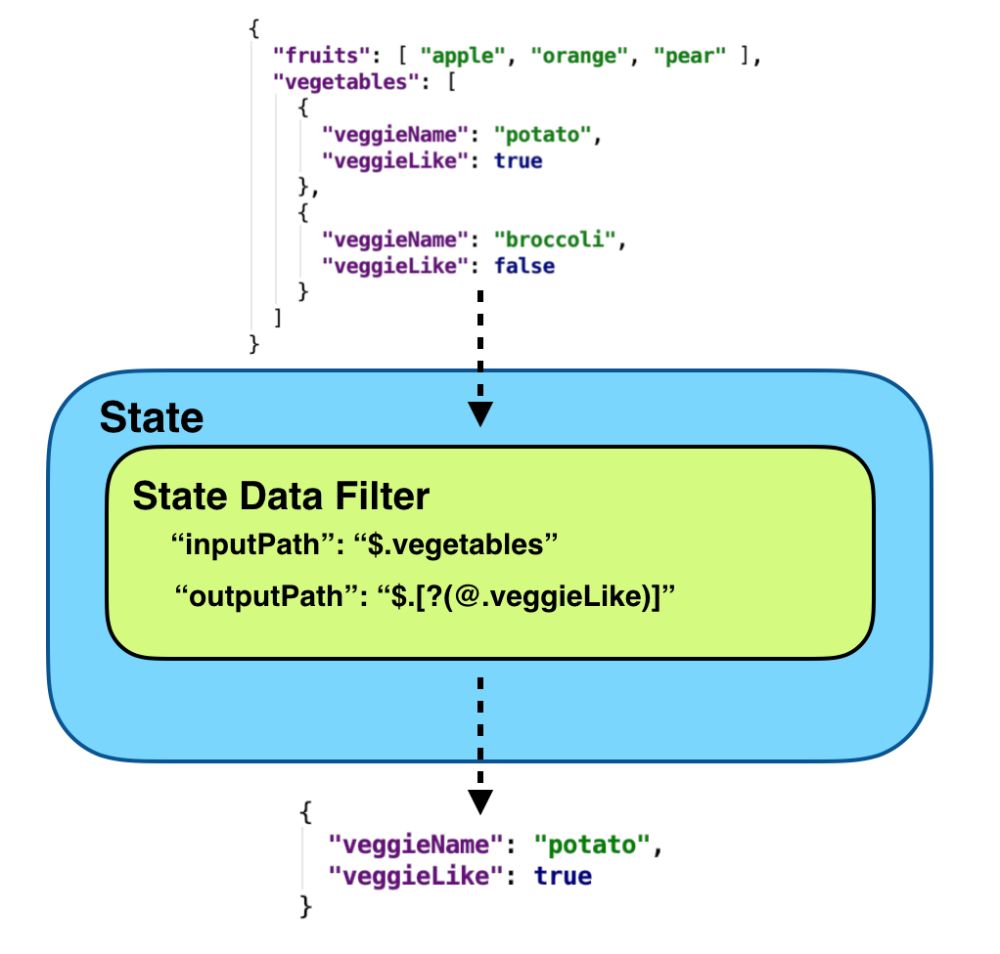
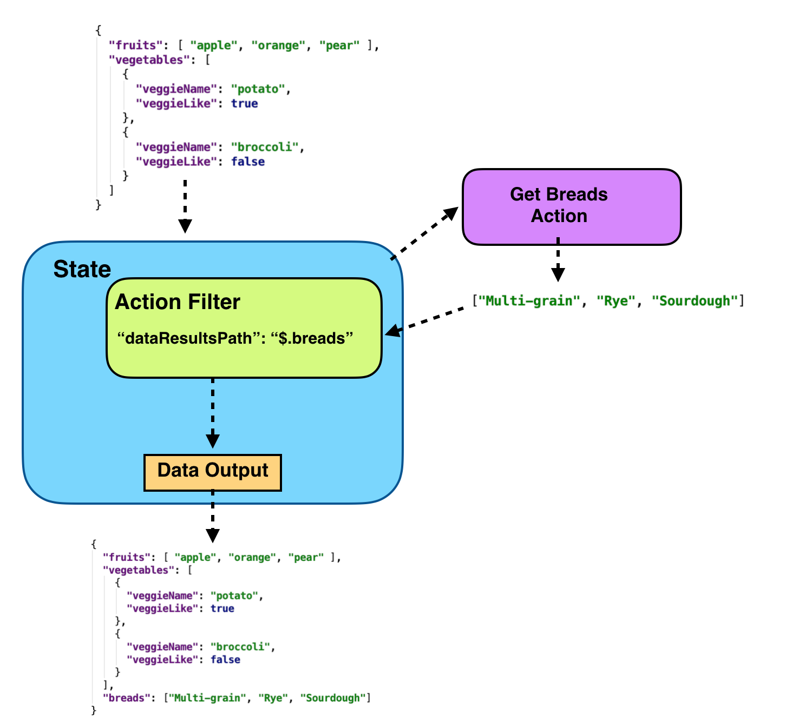
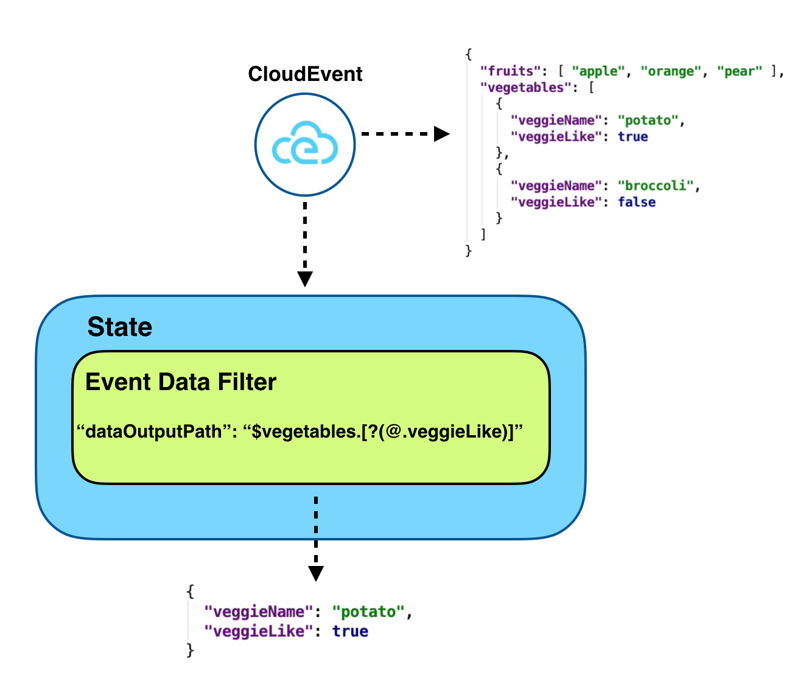
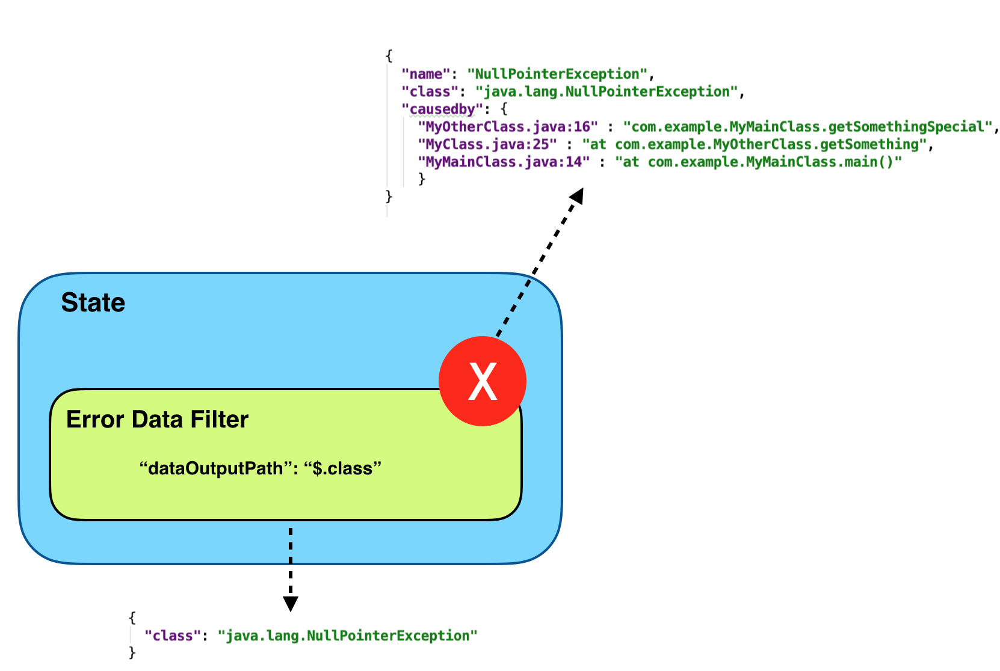
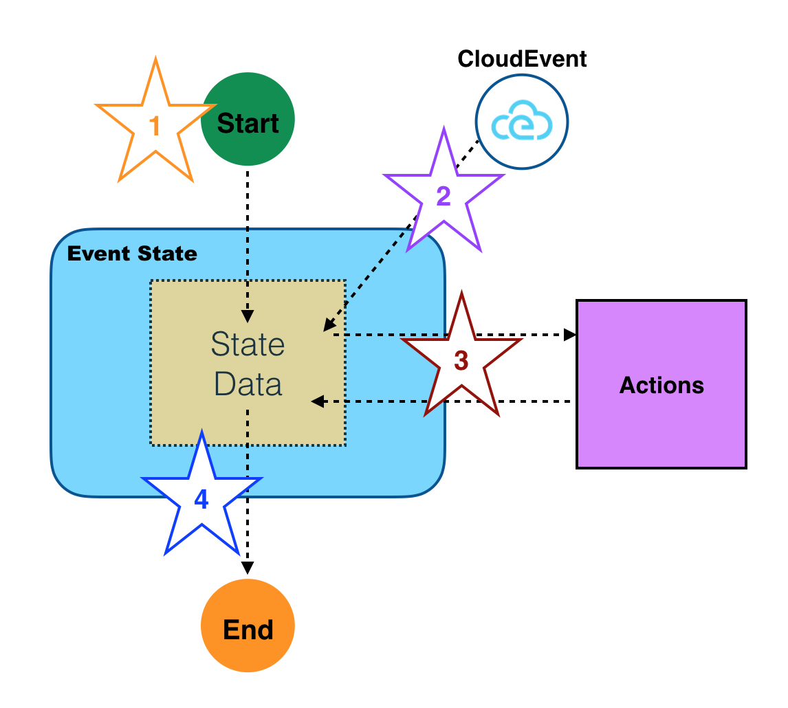

<p align="center"></p>


## Abstract

Serverless applications are becoming increasingly complex and are rarely composed 
of a single function call triggered by an event. 
Often they contain complex business logic to coordinate, manage, and define the execution order of a large amount 
of serverless functions and events that can trigger those functions.
 
Workflows have become a key component of serverless applications as they automate
 orchestration and coordination of serverless applications functional flow. 

Some of many benefits using workflows in serverless applications include:
- Allow you to develop new application much faster by taking the complex execution logic out of your application.
- Externalize workflow execution logic and management such as parallel execution, branching, timeouts, compensation, and other flow control
 logic out of many serverless function implementations into a single workflow definition.
- Allow you to write less code in your serverless apps/functions
- Significantly reduce the amount of time and effort to make changes in large serverless apps.

Many different workflow implementations (both proprietary and open-source) exist today, each with it's own set of features
and capabilities. When picking a current implementations, it is very difficult to later on switch to a different one
without investing a lot of time and cost.

The goal of the Serverless Workflow sub-group is to:
- Standardize Serverless Workflow model and definition
- Facilitate Serverless Workflow portability
- Be completely vendor neutral
- Support both stateless and stateful Serverless Workflow implementations
- Supply a light-weight, human-readable, and embeddable format for describing serverless workflows

The Serverless Workflow specification defined in this document incorporates all of these goals.

## Status of this document

This document is a working draft.

## Table of Contents

- [Introduction](#Introduction)
- [Workflow Format](#Workflow-Format)
- [Functional Scope](#Functional-Scope)
- [Specification Details](#Specification-Details)
    - [Workflow Model](#Workflow-Model)
    - [Workflow Definition](#Workflow-Definition)
- [Workflow Data](#Workflow-Data)
- [Workflow Error Handling](#Workflow-Error-Handling)
- [Extending](#Extending)
- [Examples](#Examples)
- [Reference](#Reference)
- [Use Cases](#Use-Cases)

## Introduction

Serverless Workflow can be used to:

* **Orchestrate serverless application logic**: serverless applications are typically event-driven and can be 
very hard to manage. Serverless Workflow groups the application events and functions into a coherent unit and 
simplifies orchestration of the app logic.
* **Define and coordinate application control flow**: allow the users to define the execution/operation
control flow and how/which functions are to be invoked on arrival of events.
* **Define and manage application data flow**: allows the users to define how data is passed and filtered from incoming events to states, 
from states to functions, from one function to another function, and from one state to another state.

### Workflow Format

Serverless workflows are defined with [JSON](https://www.json.org/json-en.html) or [YAML](https://yaml.org/) formats.
Structure of serverless workflows is described via [JSON Schema](https://json-schema.org/).

Serverless Workflow definitions are considered specification-compliant if they conform to the [workflow schema](schema/serverless-workflow-schema-01.json).
Note that this schema reflects the current status of the specification as is updated alongside this document. 

### Functional Scope

Serverless Workflow allows users to:

1. Define and orchestrate steps/states involved in a serverless application.
2. Define which functions are executed in each step.
3. Define which orchestration event triggers function execution.
4. Define function execution behavior (sequential, parallel, etc).
5. Specify information filtering throughout the execution of the serverless workflow.
6. Define error conditions with retries.
7. Define correlation of events to the serverless workflow instance.
8. Make decisions based on results of cloud functions, such as initiate retry operations, determine what other cloud functions to execute, or what state to transition to.

Following diagram illustrates functional flow that involves states, events and functions. It shows that
incoming events can trigger function calls during flow execution.

<p align="center">

</p>

## Specification Details

Following sections provide detailed descriptions of the Serverless Workflow Model. For each part of the model we provide:
- Parameter description in table format
- [JSON Schema](https://json-schema.org/) definition 

### Workflow Model

Serverless Workflow can be viewed as a collection of [states](#State-Definition) and [transitions](#Transitions) between states.
Individual states can make control flow decisions based on their data inputs, perform different actions, as well
as pass their data to other states. 
States can wait on the arrival events to perform their actions. When states 
complete their tasks, they can transition to other states or stop workflow execution.
See the [Transitions](#Transitions) section for more details on workflow state progressions.

A Serverless Workflow can be naturally modeled as a state machine. 
Specification of a workflow is called a workflow template. Instantiation of the workflow template is called a workflow instance.

### Workflow Definition

Defines the main structure of serverless workflows:

| Parameter | Description | Type | Required |
| --- | --- |  --- | --- |
| id | Workflow unique identifier. | string |yes |
| name | Workflow name | string |yes |
| description | Workflow description | string |no |
| version | Workflow version | string |no |
| schemaVersion | Workflow schema version | string |no |
| startsAt | Workflow starting state | string |yes |
| expressionLanguage | Default expression language | string |no |
| [events](#Event-Definition) | Workflow event definitions. Defines events that can be consumed or produced | array | no |
| [functions](#Function-Definition) | Workflow functions | array | no |
| [states](#State-Definition) | Workflow states | array | yes |
| [onError](#Error-Handling) |Workflow error handling definitions | array | no |
| [extensions](#Extending) | Workflow custom extensions | array | no |

<details><summary><strong>Click to view JSON Schema</strong></summary>
<p>

```json
{
    "$id": "https://wg-serverless.org/workflow.schema",
    "$schema": "http://json-schema.org/draft-07/schema#",
    "description": "Vendor-neutral and portable specification that standardizes the definition of serverless application flows",
    "type": "object",
    "properties": {
        "id": {
          "type": "string",
          "description": "Workflow unique identifier",
          "minLength": 1
        },
        "name": {
          "type": "string",
          "description": "Workflow name",
          "minLength": 1
        },
        "description": {
          "type": "string",
          "description": "Workflow description"
        },
        "version": {
          "type": "string",
          "description": "Workflow version",
          "minLength": 1
        },
        "schemaVersion": {
          "type": "string",
          "description": "Serverless Workflow schema version"
        },
        "startsAt": {
            "type": "string",
            "description": "State name which is the starting state"
        },
        "expressionLanguage": {
          "type": "string",
          "description": "Default expression language to be used throughout the workflow definition"
        },
        "events": {
            "type": "array",
            "description": "Workflow event definitions. Defines events that can be consumed or produced",
            "items": {
                "type": "object",
                "$ref": "#/definitions/eventdef"
            }
        },
        "functions": {
            "type": "array",
            "description": "Workflow functions",
            "items": {
                "type": "object",
                "$ref": "#/definitions/function"
            }
        },
        "states": {
            "type": "array",
            "description": "State Definitions",
            "items": {
                "type": "object",
                "anyOf": [
                    {
                      "title": "Delay State",
                      "$ref": "#/definitions/delaystate"
                    },
                    {
                      "title": "Event State",
                      "$ref": "#/definitions/eventstate"
                    },
                    {
                      "title": "Operation State",
                      "$ref": "#/definitions/operationstate"
                    },
                    {
                      "title": "Parallel State",
                      "$ref": "#/definitions/parallelstate"
                    },
                    {
                      "title": "Switch State",
                      "$ref": "#/definitions/switchstate"
                    },
                    {
                      "title": "SubFlow State",
                      "$ref": "#/definitions/subflowstate"
                    },
                    {
                      "title": "Relay State",
                      "$ref": "#/definitions/relaystate"
                    },
                    {
                      "title": "ForEach State",
                      "$ref": "#/definitions/foreachstate"
                    }
                ]
            }
        },
        "onError": {
          "type": "array",
          "description": "Workflow runtime error handling definitions",
          "items": {
            "type": "object",
            "$ref": "#/definitions/error"
          }
        },
        "extensions": {
          "type": "array",
          "description": "Workflow Extensions",
          "items": {
            "type": "object"
          }
        }
    },
    "required": ["id", "name", "version", "startsAt", "states"]
}
```

</p>
</details>

### Event Definition

Describes events that can be consumed or produced during workflow execution.
Consumed events can trigger actions to be executed. Events can also be produced during workflow
execution to be consumed by clients.

As serverless workflow definitions are vendor neutral, so should be the events definitions that they consume and produce.
As such event format within serverless workflows uses the [CloudEvents](https://github.com/cloudevents/spec) specification to describe events.

To support use case where a serverless workflows need to perform actions across multiple types
of events, users can specify a correlation token. This token is used to associate multiple events
with each other, and is embedded into the event message.
Workflow implementations can use this token to map a particular event to a particular workflow instance.

| Parameter | Description | Type | Required |
| --- | --- | --- | --- |
| name | Unique event name | string |yes |
| source | CloudEvent source | string | yes |
| type | CloudEvent type | string | yes |
| subject | CloudEvent subject | string | no |
| dataContentType | CloudEvent data content type | string | no |
| specVersion | CloudEvent specification version | string | no |
| correlationToken | Location Path in the event message used to retrieve a token for event correlation | string | no |

<details><summary><strong>Click to view JSON Schema</strong></summary>

```json
{
    "type": "object",
    "properties": {
        "name": {
            "type": "string",
            "description": "Unique event name"
        },
        "source": {
            "type": "string",
            "description": "CloudEvent source"
        },
        "type": {
            "type": "string",
            "description": "CloudEvent type"
        },
        "subject": {
          "type": "string",
          "description": "CloudEvent data subject"
        },
        "dataContentType": {
          "type": "string",
          "description": "CloudEvent data content type"
        },
        "specVersion": {
          "type": "string",
          "description": "CloudEvents specification version"
        },
        "correlationToken": {
            "type": "string",
            "description": "Path used for event correlation."
        }
    },
    "required": ["name", "source", "type"]
}
```

</details>

#### Function Definition

Allows you to define a reusable function definition. It can be referenced in [actions](#Action-Definition) defined in [event](#Event-State) and [operation](#Operation-State)
workflow states. Functions must have an unique name. The resource parameter of a function evaluates to execution of
an existing serverless function. Implementations can use the type parameter to define communication information such as protocols. 

Since function definitions are reusable, their parameters are defined within actions that reference them.

| Parameter | Description | Type | Required |
| --- | --- | --- | --- |
| name |Function name | string | yes |
| resource |Function resource (URI) | string | yes |
| type |Function type. Can be defined by implementations | string | no |

<details><summary><strong>Click to view JSON Schema</strong></summary>

```json
{
  "type": "object",
  "properties": {
    "name": {
      "type": "string",
      "description": "Function unique name",
      "minLength": 1 
    },
    "resource": {
      "type": "string",
      "description": "Function resource (URI)"
    },
    "type": {
      "type": "string",
      "description": "Type of function to implement. Can be defined by implementations"
    }
  },
  "required": ["name", "resource"]
}
```

</details>

### Error Definition

Error definitions define runtime errors that can occur during workflow execution and how to handle them. For more information
see the [Workflow Error Handling section](#Workflow-Error-Handling). 


| Parameter | Description | Type | Required |
| --- | --- | --- | --- |
| [expression](#Expression-Definition) | Boolean expression which consists of one or more Error operands and the Boolean operators | string |yes |
| [errorDataFilter](#error-data-filter) | Error data filter definition | object | yes |
| [transition](#Transitions) | Next transition of the workflow when expression matches | string | yes |

<details><summary><strong>Click to view JSON Schema</strong></summary>


```json
{
  "type": "object",
  "properties": {
     "expression": {
       "description": "Boolean expression which consists of one or more Error operands and the Boolean operators",
       "$ref": "#/definitions/expression"
     },
     "errorDataFilter": {
      "$ref": "#/definitions/errordatafilter",
      "description": "Error data filter"
    },
    "transition": {
      "description": "Next transition of the workflow when expression matches",
      "$ref": "#/definitions/transition"
    }
  },
  "required": ["expression", "transition"]
}
```

</details>

#### Expression Definition

| Parameter | Description | Type | Required |
| --- | --- | --- | --- |
| language | Expression language. For example 'spel', 'jexl', 'cel', etc| string | no |
| body | Expression body, for example "(event1 or event2) and event3" | string | yes |


<details><summary><strong>Click to view JSON Schema</strong></summary>

```json
{
  "type": "object",
  "description": "Defines the language and body of expression.",
  "properties": {
    "language": {
      "type": "string",
      "description": "Expression language. For example 'spel', 'jexl', 'cel', etc"
    },
    "body": {
      "type": "string",
      "description": "The expression body. For example, (event1 or event2) and event3"
    }
  },
  "required": ["body"]
}
```

</details>

Serverless workflow does not limit implementors to use any expression language they choose to
evaluate expressions with. 
Expressions define "language" parameter to be used
 for evaluation, and a "body" parameter which defines the actual expression.
 
Note that top-level workflow "expressionLanguage" property can be set to define the default
expression language used for all defined expressions.

### State Definition

States define building blocks of the Serverless Workflow. The specification defines following states:

- **[Event State](#Event-State)**: Used to wait for events from event sources and
    then to invoke one or more functions to run in sequence or in parallel.

- **[Operation State](#Operation-State)**: Allows one or more functions to run in sequence
    or in parallel without waiting for any event.

- **[Switch State](#Switch-State)**: Allow workflow transitions to multiple different states 
    based on data inputs.

- **[Delay State](#Delay-State)**: Causes workflow execution to delay for a
    specified duration or until a specified time/date is reached.

- **[Parallel State](#Parallel-State)**: Allows a number of states to execute in
    parallel.
    
- **[SubFlow State](#SubFlow-State)**: Allows execution of a sub-workflow. 
  
- **[Relay State](#Relay-State)**: Used to relay state's data input to output without executing any actions. 

- **[ForEach State](#ForEach-State)**: Allows a set of defined states to be executed in parallel for each element of a data input array.

### Event State

| Parameter | Description | Type | Required |
| --- | --- | --- | --- |
| id | Unique state id | string | no |
| name | State name | string | yes |
| type | State type | string | yes |
| [end](#End-Definition) | Is this state an end state | object | no |
| [eventsActions](#eventstate-eventactions) | Define what events are to be consumed and one or more actions to be performed | array | yes |
| [stateDataFilter](#state-data-filter) | State data filter definition| object | no |
| [onError](#Workflow-Error-Handling) |States error handling definitions | array | no |
 
<details><summary><strong>Click to view JSON Schema</strong></summary>
<p>

```json
{
    "type": "object",
    "description": "This state is used to wait for events from event sources, then consumes them and invoke one or more actions to run in sequence or parallel.",
    "properties": {
        "id": {
            "type": "string",
            "description": "Unique state id",
            "minLength": 1
        },
        "name": {
            "type": "string",
            "description": "State name"
        },
        "type": {
            "type" : "string",
            "enum": ["EVENT"],
            "description": "State type"
        },
        "end": {
          "$ref": "#/definitions/end",
          "description": "State end definition"
        },
        "eventsActions": {
            "type": "array",
            "description": "Define what events to be consumed and one or more actions to be performed",
            "items": {
                "type": "object",
                "$ref": "#/definitions/eventactions"
            }
        },
        "stateDataFilter": {
          "$ref": "#/definitions/statedatafilter"
        },
        "onError": {
            "type": "array",
            "description": "States error handling definitions",
            "items": {
                "type": "object",
                "$ref": "#/definitions/error"
            }
        }
    },
    "oneOf": [
    {
       "required": [
         "name",
         "type",
         "eventsActions",
         "end"
       ]
     },
     {
       "required": [
         "name",
         "type",
         "eventsActions",
         "transition"
       ]
     }
   ]
}
```

</p>
</details>

Event state waits for events from different event sources and defines one or more actions to performed when
those events are received.

#### <a name="eventstate-eventactions"></a> Event State: Event Actions

| Parameter | Description | Type | Required |
| --- | --- | --- | --- |
| [eventRef](#EventRef-Definition) | References an [event definition](#Event Definition). If incoming events match the eventRef criteria associated actions are executed | object | yes |
| timeout | Time period to wait for incoming events which match the expression (ISO 8601 format). For example: "PT15M" (wait 15 minutes), or "P2DT3H4M" (wait 2 days, 3 hours and 4 minutes)| string | no |
| actionMode | Specifies how actions are to be performed (in sequence of parallel) | string | no |
| [actions](#Action-Definition) | Actions to be performed if expression matches | array | yes |
| [eventDataFilter](#event-data-filter) | Event data filter definition | object | no |
| [transition](#Transitions) | Next transition of the workflow after all the actions have been performed | string | yes |

<details><summary><strong>Click to view JSON Schema</strong></summary>

```json
{
    "type": "object",
    "description": "Defines what events to act upon and actions to be performed",
    "properties": {
        "eventRef": {
          "description": "References an event definition. If incoming events match the eventRef criteria associated actions are executed",
          "$ref": "#/definitions/eventref"
        },
        "timeout": {
            "type": "string",
            "description": "Time period to wait for incoming events which match the eventRef (ISO 8601 format)"
        }, 
        "actionMode": {
            "type" : "string",
            "enum": ["SEQUENTIAL", "PARALLEL"],
            "description": "Specifies how actions are to be performed (in sequence of parallel)",
            "default": "SEQUENTIAL" 
        },
        "actions": {
            "type": "array",
            "description": "Actions to be performed if events match the eventRef criteria",
            "items": {
                "type": "object",
                "$ref": "#/definitions/action"
            }
        },
        "eventDataFilter": {
          "$ref": "#/definitions/eventdatafilter"
        },
        "transition": {
          "description": "Next transition of the workflow after all the actions have been performed",
          "$ref": "#/definitions/transition"
        }
    },
    "required": ["expression", "actions", "transition"]
}
```

</details>

As events are received the event state can use the "eventRef" parameter to match the event with one or 
more defined in the [events](#Event Definition) section. If the expression evaluates to true, 
a set of defined actions is performed in sequence or in parallel.

Once defined actions finished execution, a transition to the next state can occur.

#### EventRef Definition

| Parameter | Description | Type | Required |
| --- | --- | --- | --- |
| name | Name of the referenced event definition | string | yes |
| dataExpression | Expression that can be used to restrict events based on their data content | object | no |

<details><summary><strong>Click to view JSON Schema</strong></summary>

```json
{
  "type": "object",
  "description": "Event Reference",
  "properties": {
    "name": {
      "type": "string",
      "desription": "Name of the referenced event"
    },
    "dataExpression": {
      "description": "Expression that can be used to restrict events based on their data content",  
      "$ref": "#/definitions/expression"
    }
  },
  "required": [
    "name"
  ]
}
```
</details>

Defines criteria for matching events that can trigger defined actions.
The name property must reference a unique name of a a defined [event definition](#EventRef-Definition) in the workflow "events" property.
Events are matched based on properties defined in the referenced event definition, 
so if our workflow definition has for example:


```json
{  
...
"events": [
 {
  "name": "FireAlarmEvent",
  "type": "fireAlarmType",
  "source": "fireAlarmSource",
  "dataContentType": "application/json"
 }
],
...
"states":[  
  {  
     "name":"CallFireDepartment",
     "type":"EVENT",
     "eventsActions": [{
         "eventRef": {
           "name": "FireAlarmEvent"
         },
         ...
     }],
     "end": true
  }
]
}
```

event matching should be performed on the "type", "source", and "dataContentType" properties of the referenced "FireAlarmEvent" event definition.
An event that would match and trigger associated actions could be:

```json
{
    "id": "A234-1234-1234",
    "specversion": "1.0",
    "type": "fireAlarmType",
    "source": "fireAlarmSource",
    "subject": "Fire Alarm performed a check",
    "time": "2018-04-05T17:31:00Z",
    "datacontenttype": "application/json",
    "data": {
      "temp": 70,
      "scale": "Fahrenheit"
    }
}
```

You can add additional matching rules based on the data via the "dataExpression" property.
This expression is evaluated against the event payload.
Going back to our example, we can change the workflow definition to:

```json
{  
...
"events": [
 {
  "name": "FireAlarmEvent",
  "type": "fireAlarmType",
  "source": "fireAlarmSource",
  "dataContentType": "application/json"
 }
],
...
"states":[  
  {  
     "name":"CallFireDepartment",
     "type":"EVENT",
     "eventsActions": [{
         "eventRef": {
           "name": "FireAlarmEvent",
           "dataExpression": {
              "language": "spel",
              "body": "data.temp ge 90"
           }
         },
         ...
     }],
     "end": true
  }
]
}
```
In this case we only considering "FireAlarmEvent" events which define a temperature over 90 degrees in their event payload.
So an event with format:

```json
{
    "id": "A234-1234-1234",
    "specversion": "1.0",
    "type": "fireAlarmType",
    "source": "fireAlarmSource",
    "subject": "Fire Alarm performed a check",
    "time": "2018-04-05T17:31:00Z",
    "datacontenttype": "application/json",
    "data": {
      "temp": 70,
      "scale": "Fahrenheit"
    }
}
```

would not trigger actions to be performed, however this event would:

```json
{
    "id": "A234-1234-1234",
    "specversion": "1.0",
    "type": "fireAlarmType",
    "source": "fireAlarmSource",
    "subject": "Fire Alarm performed a check",
    "time": "2018-04-05T17:31:00Z",
    "datacontenttype": "application/json",
    "data": {
      "temp": 102,
      "scale": "Fahrenheit"
    }
}
```

Being able to match events based on their event payload (data) is important if your event sources
produce a high number of events and our workflow event states should not trigger actions 
on every single one.

Note that the specification does not provide means to express complex and temporal event reasoning / expressions.
In cases where you might have complex event rules it is typical to use a CEP (Complex Event Processing) middleware 
entity that handles these rules and produces a CloudEvent that can be consumed to trigger actions defined in
workflow event states.

To explain this further given our previous example, there may be many sensors and services involved that in combination make up 
the fire alarm event. Complex rules on how to reason over events send from all these different sensors and sources should be processed 
by such CEP services which then can issue the "FireAlarmEvent" event that as we defined 
should trigger actions in our workflow event state.

#### Action Definition

| Parameter | Description | Type | Required |
| --- | --- | --- | --- |
| [functionRef](#FunctionRef-Definition) | References a reusable function definition to be invoked | object | yes |
| timeout |Max amount of time (ISO 8601 format) to wait for the completion of the function's execution. For example: "PT15M" (wait 15 minutes), or "P2DT3H4M" (wait 2 days, 3 hours and 4 minutes) | integer | no |
| [retry](#Retry-Definition) |Defines if function execution needs a retry | array | no |
| [actionDataFilter](#action-data-filter) | Action data filter definition | object | no |

<details><summary><strong>Click to view JSON Schema</strong></summary>

```json
{
    "type": "object",
    "description": "Action Definition",
    "properties": {
        "functionRef": {
            "$ref": "#/definitions/functionref",
            "description": "References a reusable function definition to be invoked"
        },
        "timeout": {
            "type": "string",
            "description": "Specifies the maximum amount of time (ISO 8601 format) to wait for the completion of the function's execution. The function timer is started when the request is sent to the invoked function"
        },
        "retry": {
            "type": "array",
            "description": "Array of retry definitions",
            "items": {
                "type": "object",
                "$ref": "#/definitions/retry"
            }
        },
        "actionDataFilter": {
          "$ref": "#/definitions/actiondatafilter"
        }
    },
    "required": ["functionRef"]
}
```

</details>
 
Actions reference a reusable function definition to be invoked when this action is executed.
They define a timeout wait period as well as a retry policy.

#### FunctionRef Definition

| Parameter | Description | Type | Required |
| --- | --- | --- | --- |
| name | Name of the referenced function | string | yes |
| parameters | Parameters to be passed to the referenced function | object | no |

<details><summary><strong>Click to view JSON Schema</strong></summary>

```json
{
  "type": "object",
  "description": "Function Reference",
  "properties": {
    "name": {
      "type": "string",
      "description": "Name of the referenced function"
    },
    "parameters": {
      "type": "object",
      "description": "Function parameters"
    }
  },
  "required": [
    "name"
  ]
}
```
</details>

Used by actions to reference a defined serverless function by its unique name. Parameters are values passed to the
function. They can include either static values or reference the states data input. 

#### Retry Definition

| Parameter | Description | Type | Required |
| --- | --- | --- | --- |
| [expression](#Expression-Definition) | Boolean expression that matches against the function results. Must be evaluated to true for retry policy to trigger | string |yes |
| interval |Interval value for retry (ISO 8601 repeatable format). For example: "R5/PT15M" (Starting from now repeat 5 times with 15 minute intervals)| integer | no |
| max |Max retry value | integer | no |
| [transition](#Transitions) |Next transition of the workflow when exceeding max limit | string | yes |

<details><summary><strong>Click to view JSON Schema</strong></summary>

```json
{
    "type": "object",
    "description": "Retry Definition",
    "properties": {
        "expression": {
          "description": "Boolean expression that matches against the function results. Must be evaluated to true for retry policy to trigger",
          "$ref": "#/definitions/expression"
        },
        "interval": {
            "type": "string",
            "description": "Specifies retry interval (ISO 8601 format)"
        },
        "max": {
            "type": "integer",
            "default":"0",
            "minimum": 0,
            "description": "Specifies the max retry"
        },
        "transition": {
          "description": "Next transition of the workflow when exceeding max retry limit",
          "$ref": "#/definitions/transition"
        }
    },
    "required": ["match", "transition"]
}
```

</details>

Defines a retry policy for an action. The expression parameter defines the boolean expression that matches against 
the functions results. If it is evaluated to true, the retry policy is triggers.

#### Transition Definition

| Parameter | Description | Type | Required |
| --- | --- | --- | --- |
| [expression](#Expression-Definition) | Boolean expression evaluated against state's data output. Must evaluate to true for the transition to be valid. | object | no |
| [nextState](#Transitions) | State to transition to next | string | yes |

<details><summary><strong>Click to view JSON Schema</strong></summary>

```json
{
  "type": "object",
  "properties": {
    "expression": {
      "description": "Boolean expression evaluated against state's data output. Must evaluate to true for the transition to be valid.",
      "$ref": "#/definitions/expression"
    },
    "nextState": {
      "type": "string",
      "description": "State to transition to next",
      "minLength": 1
    }
  },
  "required": [
    "nextState"
  ]
}
```

</details>

Defines a transition from point A to point B in the serverless workflow. For more information see the
[Transitions section](#Transitions).

### Operation State

| Parameter | Description | Type | Required |
| --- | --- | --- | --- |
| id |  Unique state id | string | no |
| name | State name | string | yes |
| type | State type | string | yes |
| [end](#End-Definition) | Is this state an end state | object | no |
| actionMode | Should actions be performed sequentially or in parallel | string | no |
| [actions](#Action-Definition) | Actions to be performed | array | yes |
| [stateDataFilter](#state-data-filter) | State data filter | object | no |
| [onError](#Error-Handling) | States error handling definitions | array | no |
| [transition](#Transitions) | Next transition of the workflow after all the actions have been performed | string | yes (if end is not defined) |

<details><summary><strong>Click to view JSON Schema</strong></summary>

```json
{
    "type": "object",
    "description": "Defines actions be performed. Does not wait for incoming events",
    "properties": {
        "id": {
            "type": "string",
            "description": "Unique state id",
            "minLength": 1
        },
        "name": {
            "type": "string",
            "description": "State name"
        },
        "type": {
            "type" : "string",
            "enum": ["OPERATION"],
            "description": "State type"
        },
        "end": {
          "$ref": "#/definitions/end",
          "description": "State end definition"
        },
        "actionMode": {
            "type" : "string",
            "enum": ["SEQUENTIAL", "PARALLEL"],
            "description": "Specifies whether actions are performed in sequence or in parallel",
            "default": "SEQUENTIAL" 
        },
        "actions": {
            "type": "array",
            "description": "Actions to be performed",
            "items": {
                "type": "object",
                "$ref": "#/definitions/action"
            }
        },
        "stateDataFilter": {
          "$ref": "#/definitions/statedatafilter"
        }, 
        "onError": {
            "type": "array",
            "description": "States error handling definitions",
            "items": {
                "type": "object",
                "$ref": "#/definitions/error"
            }
        },
        "transition": {
          "description": "Next transition of the workflow after all the actions have been performed",
          "$ref": "#/definitions/transition"
        }
    },
    "oneOf": [
     {
       "required": [
         "name",
         "type",
         "actionMode",
         "actions",
         "end"
       ]
     },
     {
       "required": [
         "name",
         "type",
         "actionMode",
         "actions",
         "transition"
       ]
     }
   ]
}
```

</details>

Operation state defines a set of actions to be performed in sequence or in parallel. 
Once all actions have been performed, a transition to another state can occur.

### Switch State

| Parameter | Description | Type | Required |
| --- | --- | --- | --- |
| id | Unique state id | string | no |
| name |State name | string | yes |
| type |State type | string | yes |
| [end](#End-Definition) | Is this state an end start | object | no | 
| [choices](#switch-state-choices) |Ordered set of matching rules to determine which state to trigger next | array | yes |
| [stateDataFilter](#state-data-filter) | State data filter | object | no |
| [onError](#Workflow-Error-Handling) |States error handling definitions | array | no |
| default |Next transition of the workflow if there is no match for any choices | object | yes (if end is not defined) |

<details><summary><strong>Click to view JSON Schema</strong></summary>

```json
{
    "type": "object",
    "description": "Permits transitions to other states based on criteria matching.",
    "properties": {
        "id": {
            "type": "string",
            "description": "Unique state id",
            "minLength": 1
        },
        "name": {
            "type": "string",
            "description": "State name"
        },
        "type": {
            "type" : "string",
            "enum": ["SWITCH"],
            "description": "State type"
        },
        "end": {
          "$ref": "#/definitions/end",
          "description": "State end definition"
        },
        "choices": {
            "type": "array",
            "description": "Defines an ordered set of Match Rules against the input data to this state",
            "items": {
                "type": "object",
                "anyOf": [
                    { "$ref": "#/definitions/singlechoice" },
                    { "$ref": "#/definitions/andchoice" },
                    { "$ref": "#/definitions/notchoice" },
                    { "$ref": "#/definitions/orchoice" }
                ]
            }
        },
        "stateDataFilter": {
          "$ref": "#/definitions/statedatafilter"
        }, 
        "onError": {
            "type": "array",
            "description": "States error handling definitions",
            "items": {
                "type": "object",
                "$ref": "#/definitions/error"
            }
        },
        "default": {
            "description": "Next transition of the workflow if there is no match for any choices",
            "$ref": "#/definitions/transition"
        }
    },
    "oneOf": [
    {
      "required": [
        "name",
        "type",
        "choices",
        "end"
      ]
    },
    {
      "required": [
        "name",
        "type",
        "choices",
        "default"
      ]
    }
    ]
}
```

</details>

Switch states can be viewed as gateways. They define choices that trigger workflow transitions based on 
JSONPath matches on the states data input.

#### <a name="switch-state-choices"></a>Switch State: Choices

There are four types of choices defined:

* [Single Choice](#switch-state-single-choice)
* [And Choice](#switch-state-and-choice)
* [Not Choice](#switch-state-not-choice)
* [Or Choice](#switch-state-or-choice)

##### <a name="switch-state-single-choice"></a>Switch State Choices: Single Choice

| Parameter | Description | Type | Required |
| --- | --- | --- | --- |
| path | Path that selects the data input value to be matched | string | yes |
| value | Matching value | string | yes |
| operator | Data Input comparator | string | yes |
| [transition](#Transitions) | Next transition of the workflow if there is valid matches | string | yes |

<details><summary><strong>Click to view JSON Schema</strong></summary>

```json
{
    "type": "object",
    "description": "Single Choice",
    "properties": {
        "path": {
            "type": "string",
            "description": "JSONPath that selects the data input value to be matched"
        },
        "value": {
            "type": "string",
            "description": "Matching value"
        },
        "operator": {
            "type" : "string",  
            "enum": ["Exists", "Equals", "LessThan", "LessThanEquals", "GreaterThan", "GreaterThanEquals"],
            "description": "Specifies how data input is compared with the value"
        },
        "transition": {
          "description": "Next transition of the workflow if there is valid matches",
          "$ref": "#/definitions/transition"
        }
    },
    "required": ["path", "value", "operator", "transition"]
}
```

</details>

##### <a name="switch-state-and-choice"></a>Switch State Choices: And Choice

| Parameter | Description | Type | Required |
| --- | --- | --- | --- |
| and | List of choices | array | yes |
| path | Path that selects the data input value to be matched | string | yes |
| value | Matching value | string | yes |
| operator | Data Input comparator | string | yes |
| [transition](#Transitions) | Next transition of the workflow if there is valid matches | string | yes |

<details><summary><strong>Click to view JSON Schema</strong></summary>

```json
{
    "type": "object",
    "description": "And Choice",
    "properties": {
        "and": {
            "type": "array",
            "description": "List of choices",
            "items": {
                "path": {
                    "type": "string",
                    "description": "JSONPath that selects the data input value to be matched"
                },
                "value": {
                    "type": "string",
                    "description": "Matching value"
                },
                "operator": {
                    "type" : "string",
                    "enum": ["Exists", "Equals", "LessThan", "LessThanEquals", "GreaterThan", "GreaterThanEquals"],
                    "description": "Specifies how data input is compared with the value"
                }
            }
        },
        "transition": {
          "description": "Next transition of the workflow if there is valid matches",
          "$ref": "#/definitions/transition"
        }
    },
    "required": ["and", "path", "value", "operator", "transition"]
}
```

</details>

##### <a name="switch-state-not-choice"></a>Switch State Choices: Not Choice

| Parameter | Description | Type | Required |
| --- | --- | --- | --- |
| not | State choice | object | yes |
| path | Path that selects the data input value to be matched | string | yes |
| value | Matching value | string | yes |
| operator | Data Input comparator | string | yes |
| [transition](#Transitions) | Next transition of the workflow if there is valid matches | string | yes |

<details><summary><strong>Click to view JSON Schema</strong></summary>

```json
{
    "type": "object",
    "description": "Not Choice",
    "properties": {
        "not": {
            "type": "object",
            "properties": {
                "path": {
                    "type": "string",
                    "description": "JSONPath that selects the data input value to be matched"
                },
                "value": {
                    "type": "string",
                    "description": "Matching value"
                },
                "operator": {
                    "type" : "string",
                    "enum": ["Exists", "Equals", "LessThan", "LessThanEquals", "GreaterThan", "GreaterThanEquals"],
                    "description": "Specifies how data input is compared with the value"
                }
            }
        },
        "transition": {
          "description": "Next transition of the workflow if there is valid matches",
          "$ref": "#/definitions/transition"
        }
    },
    "required": ["not", "path", "value", "operator", "transition"]
}
```

</details>

##### <a name="switch-state-or-choice"></a>Switch State Choices: Or Choice

| Parameter | Description |  Type | Required |
| --- | --- | --- | --- |
| or | State choices | array | yes | 
| path | Path that selects the data input value to be matched | string | yes |
| value | Matching value | string | yes |
| operator | Data Input comparator | string | yes |
| [transition](#Transitions) |Next transition of the workflow if there is valid matches | string | yes |

<details><summary><strong>Click to view JSON Schema</strong></summary>

```json
{
    "type": "object",
    "description": "Or Choice",
    "properties": {
        "or": {
            "type": "array",
            "description": "List of choices",
            "items": {
                "path": {
                    "type": "string",
                    "description": "JSONPath that selects the data input value to be matched"
                },
                "value": {
                    "type": "string",
                    "description": "Matching value"
                },
                "operator": {
                    "type" : "string",
                    "enum": ["Exists", "Equals", "LessThan", "LessThanEquals", "GreaterThan", "GreaterThanEquals"],
                    "description": "Specifies how data input is compared with the value"
                }                              
            }
        },
        "transition": {
          "description": "Next transition of the workflow if there is valid matches",
          "$ref": "#/definitions/transition"
        }
    },
    "required": ["or",  "path", "value", "operator", "transition"]
}
```
</details>

### Delay State

| Parameter | Description | Type | Required |
| --- | --- | --- | --- |
| id | Unique state id | string | no |
| name |State name | string | yes |
| type |State type | string | yes |
| [end](#End-Definition) |If this state an end state | object | no |
| timeDelay |Amount of time (ISO 8601 format) to delay when in this state. For example: "PT15M" (delay 15 minutes), or "P2DT3H4M" (delay 2 days, 3 hours and 4 minutes) | integer | yes |
| [stateDataFilter](#state-data-filter) | State data filter | object | no |
| [onError](#Error-Handling) |States error handling definitions | array | no |
| [transition](#Transitions) |Next transition of the workflow after the delay | string | yes (if end is not defined) |

<details><summary><strong>Click to view JSON Schema</strong></summary> 

```json
{
    "type": "object",
    "description": "Causes the workflow execution to delay for a specified duration",
    "properties": {
        "id": {
            "type": "string",
            "description": "Unique state id",
            "minLength": 1
        },
        "name": {
            "type": "string",
            "description": "State name"
        },
        "type": {
            "type" : "string",
            "enum": ["DELAY"],
            "description": "State type"
        },
        "end": {
          "$ref": "#/definitions/end",
          "description": "State end definition"
        },
        "timeDelay": {
            "type": "string",
            "description": "Amount of time (ISO 8601 format) to delay"
        },
        "stateDataFilter": {
          "$ref": "#/definitions/statedatafilter"
        },
        "onError": {
            "type": "array",
            "description": "States error handling definitions",
            "items": {
                "type": "object",
                "$ref": "#/definitions/error"
            }
        },
        "transition": {
          "description": "Next transition of the workflow after the delay",
          "$ref": "#/definitions/transition"
        }
    },
    "oneOf": [
    {
      "required": [
        "name",
        "type",
        "timeDelay",
        "end"
      ]
    },
    {
      "required": [
        "name",
        "type",
        "timeDelay",
        "transition"
      ]
    }
    ]
}
```

</details>

Delay state waits for a certain amount of time before transitioning to a next state.

### Parallel State

| Parameter | Description | Type | Required |
| --- | --- | --- | --- |
| id | Unique state id | string | no |
| name |State name | string | yes | 
| type |State type | string | yes | 
| [end](#End-Definition) | If this state and end state | object | no |
| [branches](#parallel-state-branch) |List of branches for this parallel state| array | yes |
| [stateDataFilter](#state-data-filter) | State data filter | object | no |
| [onError](#Error-Handling) |States error handling definitions | array | no |
| [transition](#Transitions) |Next transition of the workflow after all branches have completed execution | string | yes (if end is not defined) |

<details><summary><strong>Click to view JSON Schema</strong></summary>

```json
{
    "type": "object",
    "description": "Consists of a number of states that are executed in parallel",
    "properties": {
        "id": {
            "type": "string",
            "description": "Unique State id",
            "minLength": 1
        },
        "name": {
            "type": "string",
            "description": "State name"
        },
        "type": {
            "type" : "string",
            "enum": ["PARALLEL"],
            "description": "State type"
        },
        "end": {
          "$ref": "#/definitions/end",
          "description": "State end definition"
        },
        "branches": {
            "type": "array",
            "description": "Branch Definitions",
            "items": {
                "type": "object",
                "$ref": "#/definitions/branch"
            }
        },
        "stateDataFilter": {
          "$ref": "#/definitions/statedatafilter"
        },
        "onError": {
            "type": "array",
            "description": "States error handling definitions",
            "items": {
                "type": "object",
                "$ref": "#/definitions/error"
            }
        },
        "transition": {
          "description": "Next transition of the workflow after all branches have completed execution",
          "$ref": "#/definitions/transition"
        }
    },
    "oneOf": [
    {
      "required": [
        "name",
        "type",
        "branches",
        "end"
      ]
    },
    {
      "required": [
        "name",
        "type",
        "branches",
        "transition"
      ]
    }
    ]
}
```

</details>

Parallel state defines a collection of branches which are to be executed in parallel.
Branches contain one or more states. Each branch must define a starting state via its "startsAt" property
 as well as include at least one end state (state with its "end" property defined).

#### <a name="parallel-state-branch"></a>Parallel State: Branch

| Parameter | Description | Type | Required |
| --- | --- | --- | --- |
| name | Branch name | string | yes |
| startsAt | Branch start state | string | yes |
| [states](#State-Definition) | States to be executed in this branch | array | yes |
| waitForCompletion | If workflow execution must wait for this branch to finish before continuing | boolean | yes |

<details><summary><strong>Click to view JSON Schema</strong></summary>

```json
{
    "type": "object",
    "description": "Branch Definition",
    "properties": {
        "name": {
            "type": "string",
            "description": "Branch name"
        },
        "startsAt": {
            "type": "string",
            "description": "State name which is the starting state"
        },
        "states": {
            "type": "array",
            "description": "State Definitions",
            "items": {
                        "type": "object",
                        "anyOf": [
                            {
                              "title": "Delay State",
                              "$ref": "#/definitions/delaystate"
                            },
                            {
                              "title": "Event State",
                              "$ref": "#/definitions/eventstate"
                            },
                            {
                              "title": "Operation State",
                              "$ref": "#/definitions/operationstate"
                            },
                            {
                              "title": "Switch State",
                              "$ref": "#/definitions/switchstate"
                            },
                            {
                              "title": "SubFlow State",
                              "$ref": "#/definitions/subflowstate"
                            },
                            {
                              "title": "Relay State",
                              "$ref": "#/definitions/relaystate"
                            },
                            {
                              "title": "ForEach State",
                              "$ref": "#/definitions/foreachstate"
                            }
                        ]
                    }
        },
        "waitForCompletion": {
            "type": "boolean",
            "default": false,
            "description": "Workflow execution must wait for this branch to finish before continuing"
        }
    },
    "required": ["name", "states", "waitForCompletion"]
}
```

</details>

Each branch receives the same copy of the Parallel state's data input.
States within each branch are only allowed to transition to states defined in the same branch. 
Transitions to other branches or workflow states are not allowed.
States outside a parallel state cannot transition to a states declared within branches.

Data output of the Parallel state includes the data output of each executed branch.

The "waitForCompletion" property allows the parallel state to manage branch executions. 
Parallel state must wait for all branches which have this property set to "true" before triggering a transition.

### SubFlow State

| Parameter | Description | Type | Required |
| --- | --- | --- | --- |
| id | Unique state id | string | no |
| name |State name | string | yes | 
| type |State type | string | yes | 
| [end](#End-Definition) | If this state and end state | object | no |
| waitForCompletion |If workflow execution must wait for sub-workflow to finish before continuing | boolean | yes |
| workflowId |Sub-workflow unique id | boolean | no |
| [stateDataFilter](#state-data-filter) | State data filter | object | no |
| [onError](#State-Exception-Handling) |States error handling definitions | array | no |
| [transition](#Transitions) |Next transition of the workflow after subflow has completed | string | yes (if end is not defined) |

<details><summary><strong>Click to view JSON Schema</strong></summary>

```json
{
    "type": "object",
    "description": "Defines a sub-workflow to be executed",
    "properties": {
        "id": {
            "type": "string",
            "description": "Unique State id",
            "minLength": 1
        },
        "name": {
            "type": "string",
            "description": "State name"
        },
        "type": {
            "type" : "string",
            "enum": ["SUBFLOW"],
            "description": "State type"
        },
        "end": {
          "$ref": "#/definitions/end",
          "description": "State end definition"
        }, 
        "waitForCompletion": {
            "type": "boolean",
            "default": false,
            "description": "Workflow execution must wait for sub-workflow to finish before continuing."
        },
        "workflowId": {
            "type": "string",
            "description": "Sub-workflow unique id."
        },
        "stateDataFilter": {
          "$ref": "#/definitions/statedatafilter"
        },
        "onError": {
            "type": "array",
            "description": "States error handling definitions",
            "items": {
                "type": "object",
                "$ref": "#/definitions/error"
           }
        },
        "transition": {
          "description": "Next transition of the workflow after subflow has completed",
          "$ref": "#/definitions/transition"
        }
    },
    "oneOf": [
    {
      "required": [
        "name",
        "type",
        "workflowId",
        "end"
      ]
    },
    {
      "required": [
        "name",
        "type",
        "workflowId",
        "transition"
      ]
    }
    ]
}
```

</details>

It is often the case that you want to group your workflows into small, reusable logical units that perform certain needed functionality.
Even though you can use the Event state to call an externally deployed services (via function), at times
there is a need to include/inject another serverless workflow (from classpath/local file system etc, depending on the implementation logic). 
In that case you would use the SubFlow State.
It also allows users to model their workflows with reusability and logical grouping in mind.

This state allows you to include/inject a uniquely identified sub-workflow and start its execution. 
Another use of this state is within [branches](#parallel-state-branch) of the [Parallel State](#Parallel-State). Instead of having to define all states
in each branch, you could separate the branch states into individual sub-workflows and call the SubFlow state
as a single state in each.

Sub-workflows must have a defined start and end states. 
The waitForCompletion property defines if the SubFlow state should wait until execution of the sub-workflow
is completed or not. 

Each sub-workflow receives the same copy of the SubFlow state's data input.
If waitForCompletion property is set to true, sub-workflows have the ability to edit the parent's workflow data.
If this property is set to false, data access to parent's workflow should not be allowed.

### Relay State

| Parameter | Description | Type | Required |
| --- | --- | --- | --- |
| id | Unique state id | string | no |
| name | State name | string | yes | 
| type | State type | string | yes |
| [end](#End-Definition) | If this state and end state | object | no |
| inject | JSON object which can be set as state's data input and can be manipulated via filter | object | no |
| [stateDataFilter](#state-data-filter) | State data filter | object | no |
| [transition](#Transitions) | Next transition of the workflow after subflow has completed | string | yes (if end is set to false) |

<details><summary><strong>Click to view JSON Schema</strong></summary>

```json
{
    "type": "object",
    "description": "Set up and relay the state's data input to data output. Does not perform any actions",
    "properties": {
        "id": {
            "type": "string",
            "description": "Unique State id",
            "minLength": 1
        },
        "name": {
            "type": "string",
            "description": "State name"
        },
        "type": {
            "type" : "string",
            "enum": ["RELAY"],
            "description": "State type"
        },
        "end": {
          "$ref": "#/definitions/end",
          "description": "State end definition"
        }, 
        "inject": {
            "type": "object",
            "description": "JSON object which can be set as states data input and can be manipulated via filters"
        },
        "stateDataFilter": {
          "$ref": "#/definitions/statedatafilter"
        },
        "transition": {
          "description": "Next transition of the workflow after subflow has completed",
          "$ref": "#/definitions/transition"
        }
    },
    "oneOf": [
    {
      "required": [
        "name",
        "type",
        "end"
      ]
    },
    {
      "required": [
        "name",
        "type",
        "transition"
      ]
    }
    ]
}
```

</details>

Relay state can be used to statically set up and relay the state's data input to data output.
It is very useful for debugging for example as you can test/simulate workflow execution with pre-set data that would typically 
be dynamic in nature (e.g. function calls, events etc). 

It is also useful for production workflows where you want to just relay workflow data without performing any actions (function calls).

The relay state "inject" property allows you to statically define a JSON object which gets added to the states data input.
You can use the filter property to control the states data output to the transition state.

Here is a typical example of how to use the relay state to inject static data into its data input, which then will be passed
as data output to the transition state:

<table>
<tr>
    <th>JSON</th>
    <th>YAML</th>
</tr>
<tr>
<td valign="top">

  ```json
  {  
   "name":"SimpleRelayState",
   "type":"RELAY",
   "inject": {
      "person": {
        "fname": "John",
        "lname": "Doe",
        "address": "1234 SomeStreet",
        "age": 40
      }
   },
   "transition": {
      "nextState": "GreetPersonState"
   }
  }
  ```
</td>
<td valign="top">

  ```yaml
  name: SimpleRelayState
  type: RELAY
  inject:
    person:
      fnam: John
      lname: Doe
      address: 1234 SomeStreet
      age: 40
  transition:
    nextState: GreetPersonState
  ```
</td>
</tr>
</table>

The data output of the "SimpleRelayState" which then is passed as input to the transition state would be:

```json
{
 "person": {
      "fname": "John",
      "lname": "Doe",
      "address": "1234 SomeStreet",
      "age": 40
 }
}

```

If the relay state already receives a data input from the previous transition state, the inject data will be merged 
with its data input.

You can also use the filter property to further relay the set-up data input and pass only
what you need as data output of the state. Let's say we have:

<table>
<tr>
    <th>JSON</th>
    <th>YAML</th>
</tr>
<tr>
<td valign="top">

  ```json
  {  
     "name":"SimpleRelayState",
     "type":"RELAY",
     "inject": {
        "people": [
          {
             "fname": "John",
             "lname": "Doe",
             "address": "1234 SomeStreet",
             "age": 40
          },
          {
             "fname": "Marry",
             "lname": "Allice",
             "address": "1234 SomeStreet",
             "age": 25
          },
          {
             "fname": "Kelly",
             "lname": "Mill",
             "address": "1234 SomeStreet",
             "age": 30
          }
        ]
     },
     "stateDataFilter": {
        "dataOutputPath": "$.people[?(@.age < 40)]"
     },
     "transition": {
        "nextState": "GreetPersonState"
     }
    }
  ```
</td>
<td valign="top">

  ```yaml
  name: SimpleRelayState
  type: RELAY
  inject:
    people:
    - fnam: John
      lname: Doe
      address: 1234 SomeStreet
      age: 40
    - fnam: Marry
      lname: Allice
      address: 1234 SomeStreet
      age: 25
    - fnam: Kelly
      lname: Mill
      address: 1234 SomeStreet
      age: 30
  stateDataFilter:
    dataOutputPath: "$.people[?(@.age < 40)]"
  transition:
    nextState: GreetPersonState
  ```
</td>
</tr>
</table>

In which case the states data output would include people who's age is less than 40. You can then easily during testing 
change your output path to for example:

```
$.people[?(@.age >= 40)]
```
to test if your workflow behaves properly for the case when there are people who's age is greater or equal 40.


### ForEach State

| Parameter | Description | Type | Required |
| --- | --- | --- | --- |
| id | Unique state id | string | no |
| name | State name | string | yes | 
| type | State type | string | yes | 
| [end](#End-Definition) | Is this state an end state | object | no |
| inputCollection | JSONPath expression selecting an JSON array element of the states data input | string | yes |
| outputCollection | JSONPath expression specifying where in the states data output to place the final data output of each iteration of the executed states | string | no |
| inputParameter | JSONPath expression specifying an JSON object field of the states data input. For each parallel iteration, this field will get populated with an unique element of the inputCollection array. | string | yes |
| max | Specifies how upper bound on how many iterations may run in parallel | integer | no |
| timeDelay | Amount of time (ISO 8601 format) to wait between each iteration | string | no |
| startsAt | Unique name of a states in the states array representing the starting state to be executed | string |yes |
| [states](#State-Definition) | States to be executed for each of the elements of inputCollection | array | yes |
| [stateDataFilter](#state-data-filter) | State data filter definition | object | no |
| [onError](#Error-Handling) | States error handling definitions | array | no |
| [transition](#Transitions) | Next transition of the workflow after state has completed | string | yes (if end is not defined) |

<details><summary><strong>Click to view JSON Schema</strong></summary>

```json
{
    "type": "object",
    "description": "Execute a set of defined states for each element of the data input array",
    "properties": {
        "id": {
            "type": "string",
            "description": "Unique State id",
            "minLength": 1
        },
        "name": {
            "type": "string",
            "description": "State name"
        },
        "type": {
            "type" : "string",
            "enum": ["FOREACH"],
            "description": "State type"
        },
        "end": {
          "$ref": "#/definitions/end",
          "description": "State end definition"
        }, 
        "inputCollection": {
           "type": "string",
           "description": "JSONPath expression selecting an JSON array element of the states data input"
         },
         "outputCollection": {
           "type": "string",
           "description": "JSONPath expression specifying where in the states data output to place the final data output of each iteration of the executed states"
         },
         "inputParameter": {
            "type": "string",
             "description": "JSONPath expression specifying an JSON object field of the states data input. For each parallel iteration, this field will get populated with a unique element of the inputCollection array"
         },
         "max": {
           "type": "integer",
            "default": 0,
            "minimum": 0, 
            "description": "Specifies how upper bound on how many iterations may run in parallel"
         },
         "timeDelay": {
             "type": "string",
             "description": "|Amount of time (ISO 8601 format) to wait between each iteration "
         },
         "startsAt": {
          "type": "string",
          "description": "Unique name of a states in the states array representing the starting state to be executed"
        },
        "states": {
            "type": "array",
            "description": "States to be executed for each of the elements of inputCollection",
            "items": {
                "type": "object",
                "anyOf": [
                    {
                      "title": "Delay State",
                      "$ref": "#/definitions/delaystate"
                    },
                    {
                      "title": "Event State",
                      "$ref": "#/definitions/eventstate"
                    },
                    {
                      "title": "Operation State",
                      "$ref": "#/definitions/operationstate"
                    },
                    {
                      "title": "Switch State",
                      "$ref": "#/definitions/switchstate"
                    },
                    {
                      "title": "SubFlow State",
                      "$ref": "#/definitions/subflowstate"
                    },
                    {
                      "title": "Relay State",
                      "$ref": "#/definitions/relaystate"
                    },
                    {
                      "title": "ForEach State",
                      "$ref": "#/definitions/foreachstate"
                    }
                ]
            }
        },
        "stateDataFilter": {
          "$ref": "#/definitions/statedatafilter"
        },
        "onError": {
            "type": "array",
            "description": "States error handling definitions",
            "items": {
                "type": "object",
                "$ref": "#/definitions/error"
            }
        },
        "transition": {
          "description": "Next transition of the workflow after subflow has completed",
          "$ref": "#/definitions/transition"
        }
    },
    "oneOf": [
    {
      "required": [
        "name",
        "type",
        "inputCollection",
        "inputParameter",
        "startsAt",
        "states",
        "end"
      ]
    },
    {
      "required": [
        "name",
        "type",
        "inputCollection",
        "inputParameter",
        "startsAt",
        "states",
        "transition"
      ]
    }
    ]
}
```

</details>

The ForEach state can be used to execute a defined set of states for each element of an array (defined in the states data input).
While the [Parallel state](#Parallel-State) performs multiple branches of states using the 
same data input, the ForEach state performs the defined steps for multiple entries of an array in the states data input.

Note that each iteration of the ForEach state should be executed in parallel.
You can use the "max" property to set the upper bound on how many iterations may run in parallel. The default 
of the "max" property is zero, which places no limit on number of parallel executions.
 
States defined in the "states" property of the ForEach state can only transition to each other and 
cannot transition to states outside of this state. 
Similarly other workflow states cannot transition to one of the states defined within the ForEach state.

States defined in the "states" property must contain at least one state which is an end state (has the end property defined).

Let's take a look at a simple ForEach state example through which we can explain this state:
 
In this example the data input to our ForEach state is an array of orders:

```json
{
    "orders": [
        {
            "orderNumber": "1234",
            "completed": true,
            "email": "firstBuyer@buyer.com"
        },
        {
            "orderNumber": "5678",
            "completed": true,
            "email": "secondBuyer@buyer.com"
        },
        {
            "orderNumber": "9910",
            "completed": false,
            "email": "thirdBuyer@buyer.com"
        }
    ]
}
```

and the state is defined as:


<table>
<tr>
    <th>JSON</th>
    <th>YAML</th>
</tr>
<tr>
<td valign="top">

```json
{
  "functions": [
    {
      "name": "sendConfirmationFunction",
      "resource": "functionResourse"
    }
  ],
  "states": [
    {
      "name": "SendConfirmationForEachCompletedhOrder",
      "type": "FOREACH",
      "inputCollection": "$.orders[?(@.completed == true)]",
      "inputParameter": "$.completedorder",
      "startsAt": "SendConfirmation",
      "states": [
        {
          "name": "SendConfirmation",
          "type": "OPERATION",
          "actionMode": "SEQUENTIAL",
          "actions": [
            {
              "functionRef": {
                "name": "sendConfirmationFunction",
                "parameters": {
                  "orderNumber": "$.completedorder.orderNumber",
                  "email": "$.completedorder.email"
                }
              }
            }
          ],
          "end": {
            "type": "DEFAULT"
          }
        }
      ],
      "end": {
        "type": "DEFAULT"
      }
    }
  ]
}
```
</td>
<td valign="top">

  ```yaml
functions:
- name: sendConfirmationFunction
  resource: functionResourse
states:
- name: SendConfirmationForEachCompletedhOrder
  type: FOREACH
  inputCollection: "$.orders[?(@.completed == true)]"
  inputParameter: "$.completedorder"
  startsAt: SendConfirmation
  states:
  - name: SendConfirmation
    type: OPERATION
    actionMode: SEQUENTIAL
    actions:
    - functionRef:
        name: sendConfirmationFunction
        parameters:
          orderNumber: "$.completedorder.orderNumber"
          email: "$.completedorder.email"
    end:
      type: DEFAULT
  end:
    type: DEFAULT

  ```
</td>
</tr>
</table>

This ForEach state will first look at its inputCollection path to determine which array in the states data input
to iterate over.
In this case it will be "orders" array which contains orders information. The states inputCollection property
then further filters this array, only selecting elements of the orders array which have the completed property 
set to true.

For each of the completed order the state will then execute the defined set of states in parallel.

For this example, the data inputs of staring states for the two iterations would be: 

```json
{
    "orders": [
        {
            "orderNumber": "1234",
            "completed": true,
            "email": "firstBuyer@buyer.com"
        },
        {
            "orderNumber": "5678",
            "completed": true,
            "email": "secondBuyer@buyer.com"
        },
        {
            "orderNumber": "9910",
            "completed": false,
            "email": "thirdBuyer@buyer.com"
        }
    ],
    "completedorder": {
        "orderNumber": "1234",
        "completed": true,
        "email": "firstBuyer@buyer.com"
    }
}
```    

and:

```json
{
    "orders": [
        {
            "orderNumber": "1234",
            "completed": true,
            "email": "firstBuyer@buyer.com"
        },
        {
            "orderNumber": "5678",
            "completed": true,
            "email": "secondBuyer@buyer.com"
        },
        {
            "orderNumber": "9910",
            "completed": false,
            "email": "thirdBuyer@buyer.com"
        }
    ],
    "completedorder": {
        "orderNumber": "5678",
        "completed": true,
        "email": "secondBuyer@buyer.com"
    }
}
```

Once iterations over the completed orders complete, workflow execution finishes as our ForEach state is an end state (has the end property defined).

So in this example, our ForEach state will send two confirmation emails, one for each of the completed orders
defined in the orders array of its data input.

### End Definition

| Parameter | Description | Type | Required |
| --- | --- | --- | --- |
| type | End Type ("DEFAULT", "TERMINATE", or "EVENT") | enum | yes |
| [produceEvent](#ProduceEvent-Definition) | If type is "EVENT", define what type of event to produce | object | yes only if type is "EVENT" |

<details><summary><strong>Click to view JSON Schema</strong></summary>

```json
{
  "type": "object",
  "description": "State end definition",
  "properties": {
    "type": {
      "type": "string",
      "enum": [
        "DEFAULT",
        "TERMINATE",
        "EVENT"
      ],
      "description": "Type of end definition"
    },
    "produceEvent": {
      "description": "If end type is EVENT, select one of the defined events by name and set its data",
      "$ref": "#/definitions/produceevent"
    }
  },
  "if": {
    "properties": {
      "type": {
        "const": "EVENT"
      }
    }
  },
  "then": {
    "required": [
      "type",
      "produceEvent"
    ]
  },
  "else": {
    "required": [
      "type"
    ]
  }
}
```

</details>

Any state can declare to be the end state of the workflow to declare the completion of workflow execution.
The end definitions provides different ways
to complete workflow execution, which is set by the "type" property:

* **DEFAULT** - Default workflow execution completion, no other special behavior
* **TERMINATE** - Completes all execution flows in the given workflow instance. All activities/actions being executed
are completed. If a terminate end is reached inside a ForEach, Parallel, or SubFlow state, the entire workflow instance is terminated.
* **EVENT** - Workflow executions completes, and a Cloud Event is produced according to the [produceEvent](#ProduceEvent-Definition) definition.

### ProduceEvent Definition

| Parameter | Description | Type | Required |
| --- | --- | --- | --- |
| nameRef | Reference to a defined unique event name in the [events](#Event-Definition) definition | string | yes |
| data | JSONPath expression which selects parts of the states data output to become the data of the produced event | string | no |

<details><summary><strong>Click to view JSON Schema</strong></summary>

```json
{
  "type": "object",
  "description": "Produce an event and set its data",
  "properties": {
    "nameRef": {
      "type": "string",
      "description": "References a name of a defined event"
    },
    "data": {
      "type": "object",
      "description": "JSONPath expression which selects parts of the states data output to become the data of the produced event"
    }
  },
  "required": [
    "nameRef"
  ]
}
```

</details>

Defines the CloudEvent to produce when workflow execution completes. The nameRef property must match 
one of the defined events in the [events](#Event-Definition) definition. From this the event type can be determined.
The data property defines a JSONPath expression which selects elements of the states data output to be placed into the
data section of the produced CloudEvent.

Being able to produce an event when workflow execution completes allows for event-based orchestration communication.

Completion of an orchestration workflow can notify other orchestration workflows to decide if they need to act upon 
 the produced event. This can create very dynamic orchestration scenarios.

### Filter Definition

| Parameter | Description | Type | Required |
| --- | --- | --- | --- |
| inputPath |Input path (JSONPath) | string | yes |
| resultPath |Result Path (JSONPath) | string | no |
| outputPath |Output Path (JSONPath) | string | no |

<details><summary><strong>Click to view JSON Schema</strong></summary>

```json
{
  "type": "object",
  "properties": {
    "inputPath": {
      "type": "string",
      "description": "Select input data of either Event, State or Action as JSONPath"
    },
    "resultPath": {
      "type": "string",
      "description": "Specify result JSON node of Action Output as JSONPath"
    },
    "outputPath": {
      "type": "string",
      "description": "Specify output data of State or Action as JSONPath"
    }
  },
  "required": ["inputPath"]
}
```

</details>

Filters are used for data flow through the workflow. This is described in detail in the [Information Passing](#Information-Passing) section.

### Transitions

Serverless workflow states can have one or more incoming and outgoing transitions (from/to other states).
Each state has a "transition" definition that is used to determines which 
state to transition to next. 

To define a transition, set the "nextState" property in your transition definitions.

Implementers can choose to use the states "name" string property
for determining the transition, however we realize that in most cases this is not an
optimal solution that can lead to ambiguity. This is why each state also include an "id"
property. Implementers can choose their own id generation strategy to populate the id property
for each of the states and use it as the unique state identifier that is to be used as the "nextState" value. 

So the options for next state transitions are:
* Use the state name property
* Use the state id property
* Use a combination of name and id properties

#### Restricting Transitions based on state output

In addition to specifying the "nextState" property a transition also defines a boolean expression which must 
evaluate to true for the transition to happen. Having this data-based restriction capabilities can help 
 stop transitions within workflow execution that can have serious and harmful business impacts.

State Transitions have access to the states data output. Expressions 
are evaluated against the states output data to make sure that this transition only happens 
if the expression evaluates to true.

Here is an example of a restricted transition which only allows transition to the "highRiskState" if the 
output of the state to transition from includes an user with the title "MANAGER".

<table>
<tr>
    <th>JSON</th>
    <th>YAML</th>
</tr>
<tr>
<td valign="top">

```json
{  
"startsAt": "lowRiskState",
"functions": [
  {
   "name": "doLowRistOperationFunction",
   "resource": "functionResourse"
  },
  {
   "name": "doHighRistOperationFunction",
   "resource": "functionResourse"
  }
],
"states":[  
  {  
   "name":"lowRiskState",
   "type":"OPERATION",
   "actionMode":"Sequential",
   "actions":[  
    {  
     "functionRef":{
        "name": "doLowRistOperationFunction"
     }
    }
    ],
    "transition": {
      "nextState":"highRiskState",
      "expression": {
         "language": "spel",
         "body": "#jsonPath(stateOutputData,'$..user.title') eq 'MANAGER'"
      }
    }
  },
  {  
   "name":"highRiskState",
   "type":"OPERATION",
   "end": {
     "type": "DEFAULT"
   },
   "actionMode":"Sequential",
   "actions":[  
    {  
     "functionRef":{
       "name": "doHighRistOperationFunction"
     }
    }
   ]
  }
]
}
```
</td>
<td valign="top">

  ```yaml
startsAt: lowRiskState
functions:
- name: doLowRistOperationFunction
  resource: functionResourse
- name: doHighRistOperationFunction
  resource: functionResourse
states:
- name: lowRiskState
  type: OPERATION
  actionMode: Sequential
  actions:
  - functionRef:
      name: doLowRistOperationFunction
  transition:
    nextState: highRiskState
    expression:
      language: spel
      body: "#jsonPath(stateOutputData,'$..user.title') eq 'MANAGER'"
- name: highRiskState
  type: OPERATION
  end:
      type: DEFAULT
  actionMode: Sequential
  actions:
  - functionRef:
      name: doHighRistOperationFunction
  ```
</td>
</tr>
</table>

Implementers should decide how to handle data-base transitions which return false (do not proceed).
The default should be that if this happens workflow execution should halt and a detailed message
 on why the transition failed should be provided.

## Workflow Data

Serverless Workflow data is represented in [JSON](https://www.json.org/json-en.html) format. 
Flow of data during workflow execution can be divided into:

- [Workfow data input](#Workflow-data-input)
- [Event data](#Event-data)
- [Information passing between states](#Information-passing-between-states)
- [State information filtering](#State-information-filtering)
- [Workflow data output](#Workflow-data-output)

### Workflow data input

The initial data input into a workflow instance must be a valid [JSON object](https://tools.ietf.org/html/rfc7159#section-4). 
If no input is provided the default data input is the empty object:

```json
{

}
```

Workflow data input is passed to the workflow's "startsAt" state (the starting state) as data input.

<p align="center">

</p>

### Event data

[Event states](#Event-State) wait for arrival of defined CloudEvents, and when consumed perform a number of defined actions.
CloudEvents can contain data which is needed to make further orchestration decisions. Data from consumed CloudEvents 
is merged with the data input of the Event state, so it can be used inside defined actions
or be passed as data output to transition states.

<p align="center">

</p>

### Information passing between states

States in Serverless workflow can receive data (data input) as well as produce a data result (data output). T
he states data input is typically the previous states data output. 
When a state completes its tasks, its data output is passed to the data input of the state it transitions to.

There are two of rules to consider here:

- If the state is the starting state its data input is the [workflow data input](#Workflow-data-input).
- If the state is an end state ("end" property is defined), its data output is the [workflow data output](#Workflow-data-output).  

<p align="center">

</p>

### State information filtering

States can access and manipulate data via data filters. Since all data during workflow execution is described
in [JSON](https://tools.ietf.org/html/rfc7159) format, data filters use [JSONPath](https://github.com/json-path/JsonPath) queries 
to do data manipulation/selection.

There are several types of data filters defined:

- [State Data Filter](#state-data-filter)
- [Action Data Filter](#action-data-filter)
- [Event Data Filter](#event-data-filter)
- [Error Data Filter](#error-data-filter)

All states can define state and error data filters. States which can consume events ([Event states](#Event-State)) can define event data filters, and states
that can perform actions ([Event states](#Event-State), [Operation states](#Operation-State)) can define action data filters for each of the 
actions they perform.

#### <a name="state-data-filter"></a> State information filtering - State Data Filter

| Parameter | Description | Type | Required |
| --- | --- | --- | --- |
| dataInputPath | JSONPath definition that selects parts of the states data input | string | no |
| dataOutputPath | JSONPath definition that selects parts of the states data output | string | no |

<details><summary><strong>Click to view JSON Schema</strong></summary>

```json
{
  "type": "object",
  "properties": {
    "dataInputPath": {
      "type": "string",
      "description": "JSONPath definition that selects parts of the states data input"
    },
    "dataOutputPath": {
      "type": "string",
      "description": "JSONPath definition that selects parts of the states data output"
    }
  },
  "required": []
}
```

</details>

State data filters defines the states data input and data output filtering. 

The state data filters inputPath is applied when the workflow transitions to the current state and it receives its data input. 
It filters this data input selecting parts of it (only the selected data is considered part of the states data during its execution). 
If inputPath is not defined, or it does not select any parts of the states data input, the states data input is not filtered.

The state data filter outputPath is applied right before the state transitions to the next state defined. It filters the states data
output to be passed as data input to the transitioning state. If outputPath is not defined, or it does not
select any parts of the states data output, the states data output is not filtered.

Let's take a look at some examples of state filters. For our example the data input to our state is as follows:

```json
{
  "fruits": [ "apple", "orange", "pear" ],
  "vegetables": [
    {
      "veggieName": "potato",
      "veggieLike": true
    },
    {
      "veggieName": "broccoli",
      "veggieLike": false
    }
  ]
}
```

For the first example our state only cares about fruits data, and we want to disregard the vegetables. To do this 
we can define a state filter:

```json
{
  "name": "FruitsOnlyState",
  "type": "RELAY",
  "stateDataFilter": {
    "dataInputPath": "$.fruits"
  },
  "transition": {
     "nextState": "someNextState"
  }
}
```

The state data output then would include only the fruits data. 

<p align="center">

</p>

For our second example lets say that we are interested in only vegetable that are "veggie like". 
Here we have two ways of filtering our data, depending on if actions within our state need access to all vegetables, or 
only the ones that are "veggie like". 
The first way would be to use both dataInputPath, and dataOutputPath:

```json
{
  "name": "VegetablesOnlyState",
  "type": "RELAY",
  "stateDataFilter": {
    "dataInputPath": "$.vegetables",
    "dataOutputPath": "$.[?(@.veggieLike)]"
  },
  "transition": {
     "nextState": "someNextState"
  }
}
```

The states data input filter selects all the vegetables from the main data input. Once all actions have performed, before the state transition
or workflow execution completion (if this is an end state), the dataOutputPath of the state filter selects only the vegetables which are "veggie like".

<p align="center">

</p>


The second way would be to directly filter only the "veggie like" vegetables with just the data input path:

```json
{
  "name": "VegetablesOnlyState", 
  "type": "RELAY",
  "stateDataFilter": {
    "dataInputPath": "$.vegetables.[?(@.veggieLike)]"
  },
  "transition": {
     "nextState": "someNextState"
  }
}
```

#### <a name="action-data-filter"></a> State information filtering - Action Data Filter

| Parameter | Description | Type | Required |
| --- | --- | --- | --- |
| dataInputPath | JSONPath definition that selects parts of the states data input to be the action data | string | no |
| dataResultsPath | JSONPath definition that selects parts of the actions data result, to be merged with the states data | string | no |

<details><summary><strong>Click to view JSON Schema</strong></summary>

```json
{
  "type": "object",
  "properties": {
    "dataInputPath": {
      "type": "string",
      "description": "JSONPath definition that selects parts of the states data input to be the action data"
    },
    "dataResultsPath": {
      "type": "string",
      "description": "JSONPath definition that selects parts of the actions data result, to be merged with the states data"
    }
  },
  "required": []
}
```

</details>

[Actions](#Action-Definition) have access to the state data. They can filter this data using an action data filter (dataInputPath) before executing any functions. 
This is useful if you want to restrict the data to be passed as parameters to serverless functions during action executions.

Actions can define [functions](#Function-Definition). The results data of these functions is considered the output of the action which is then after completion 
merged back into the state data. You can filter the results of actions with the dataResultsPath parameter, to only select
parts of the action results that need to be merged back into the state data. 

To give an example, let's say we have an action which returns a list of breads and we want to add this list our fruits and vegetables data:

<p align="center">

</p>


#### <a name="event-data-filter"></a> State information filtering - Event Data Filter

| Parameter | Description | Type | Required |
| --- | --- | --- | --- |
| dataOutputPath | JSONPath definition that selects parts of the event data, to be merged with the states data | string | no |

<details><summary><strong>Click to view JSON Schema</strong></summary>

```json
{
  "type": "object",
  "properties": {
    "dataOutputPath": {
      "type": "string",
      "description": "JSONPath definition that selects parts of the event data, to be merged with the states data"
    }
  },
  "required": []
}
```

</details>

CloudEvents can be consumed by [Event states](#Event-State) and trigger one or more [actions](#Action-Definition) to be performed. CloudEvents
can include data which needs to be merged with the state data before associated actions are executed. 
You can filter the event data with the dataOutputPath parameter, selecting only the portion of the event data
that you need to be merged with the state data. 

Here is an example using an even filter:

<p align="center">

</p>

#### <a name="error-data-filter"></a> State information filtering - Error Data Filter

| Parameter | Description | Type | Required |
| --- | --- | --- | --- |
| dataOutputPath | JSONPath definition that selects parts of the error data, to be merged with the states data | string | no |

<details><summary><strong>Click to view JSON Schema</strong></summary>

```json
{
  "type": "object",
  "properties": {
    "dataOutputPath": {
      "type": "string",
      "description": "JSONPath definition that selects parts of the event data, to be merged with the states data"
    }
  },
  "required": []
}
```

</details>

States can define [error handling](#Workflow-Error-Handling) with the onError property. The runtime error contains data
which is merged with the states data. You can use the error data filter to select portion of the error data to be merged
with the states data.

Here is an example using an error filter:

<p align="center">

</p>


#### <a name="error-data-filter"></a> State information filtering - Using multiple filters

As [Event states](#Event-State) can take advantage of all defined data filters, it is probably the best way to 
show how we can combine them all to filter state data. 

Let's say we have a workflow which consumes events defining a customer arrival (to your store for example), 
and then lets us know how to greet this customer in different languages. We could model this workflow as follows:

```json
{
    "name": "Greet Customers when they arrive",
    "startsAt": "WaitForCustomerToArrive",
    "events": [{
        "name": "CustomerArrivesEvent",
        "type": "customer-arrival-type",
        "source": "customer-arrival-event-source"
     }],
    "functions": [{
        "name": "greetingFunction",
        "resource": "functionResourse"
    }],
    "states":[
        {
            "name":"WaitForCustomerToArrive",
            "type":"EVENT",
            "eventsActions": [{
                "expression": {
                    "language": "spel",
                    "body": "type eq \"customer-arrival-type\""
                },
                "eventDataFilter": {
                    "dataInputPath": "$.customer"
                },
                "actions":[
                    {
                        "functionref": {
                            "refname": "greetingFunction",
                            "parameters": {
                                "greeting": "$.languageGreetings.spanish",
                                "customerName": "$.customer.name"
                            }
                        },
                        "actionDataFilter": {
                            "dataInputPath": "$.",
                            "dataResultsPath": "$.finalCustomerGreeting"
                        }
                    }
                ]
            }],
            "stateDataFilter": {
                "dataInputPath": "$.hello",
                "dataOutputPath": "$.finalCustomerGreeting"
            },
            "end": true
        }
    ]
}
```

The example workflow contains an event state which consumes CloudEvents of type "customer-arrival-type", and then 
calls the "greetingFunction" serverless function passing in the greeting in Spanish and the name of the customer to greet.

The workflow data input when starting workflow execution is assumed to include greetings in different languages:

```json
{
  "hello": {
    "english": "Hello",
    "spanish": "Hola",
    "german": "Hallo",
    "russian": "Здравствуйте"
  },
  "goodbye": {
    "english": "Goodbye",
    "spanish": "Adiós",
    "german": "Auf Wiedersehen",
    "russian": "Прощай"
  }
}
```
We also assume for this example that the CloudEvent that our event state is set to consume (has the "customer-arrival-type" type) include the data:

```json
{
  "data": {
     "customer": {
       "name": "John Michaels",
       "address": "111 Some Street, SomeCity, SomeCountry",
       "age": 40
     }
  }
}
```

Here is a sample diagram showing our workflow, each numbered step on this diagram shows a certain defined point during
workflow execution at which data filters are invoked and correspond to the numbered items below.

<p align="center">

</p>

**(1) Workflow execution starts**: Workflow data is passed to our "WaitForCustomerToArrive" event state as data input.
Workflow transitions to its starting state, namely the "WaitForCustomerToArrive" event state.

The event state **stateDataFilter** is invoked to filter this data input. Its "dataInputPath" is evaluated and filters
 only the "hello" greetings in different languages. At this point our event state data contains:
 
```json
{
  "hello": {
      "english": "Hello",
      "spanish": "Hola",
      "german": "Hallo",
      "russian": "Здравствуйте"
    }
}
```

**(2) CloudEvent of type "customer-arrival-type" is consumed**: First the eventDataFilter is triggered. Its "dataInputPath"
expression selects the "customer" object from the events data and places it into the state data.

At this point our event state data contains:

```json
{
  "hello": {
      "english": "Hello",
      "spanish": "Hola",
      "german": "Hallo",
      "russian": "Здравствуйте"
    },
    "customer": {
       "name": "John Michaels",
       "address": "111 Some Street, SomeCity, SomeCountry",
       "age": 40
     }
}
```

**(3) Event state performs its actions**: 
Before the first action is executed, its actionDataFilter is invoked. Its "dataInputPath" expression selects 
the entire state data as the data available to functions that should be executed. Its "dataResultsPath" expression
specifies that results of all functions executed in this action should be placed back to the state data as part 
of a new "finalCustomerGreeting" object.

The action then calls the "greetingFunction" serverless function passing in as parameters the spanish greeting and the name of the customer that arrived.
 
We assume that for this example "greetingFunction" returns:

```
"Hola John Michaels!"
```

Which becomes the result of the action.

**(4) Event State Completes Workflow Execution**: The results of action executions as defined in the actionDataFilter are placed into the 
states data under the "finalCustomerGreeting" object. So at this point our event state data contains:

```json
{
  "hello": {
      "english": "Hello",
      "spanish": "Hola",
      "german": "Hallo",
      "russian": "Здравствуйте"
    },
    "customer": {
       "name": "John Michaels",
       "address": "111 Some Street, SomeCity, SomeCountry",
       "age": 40
     },
     "finalCustomerGreeting": "Hola John Michaels!"
}
```

Since our event state has performed all actions it is ready to either transition to the next state or end workflow execution if it is an end state.
Before this happens though, the stateDataFilter is again invoked to filter this states data, specifically the "dataOutputPath" expression
selects only the "finalCustomerGreeting" object to make it the data output of the state.

Because our event state is also an end state, its data output becomes the final [workflow data output](#Workflow-data-output) namely:

```
"Hola John Michaels!"
```

Note that in case of multiple actions with each containing an actionDataFilter, you must be careful for their results 
not to overwrite each other after actions complete and their results are added to the state data.
Also note that in case of parallel execution of actions, the results of only those that complete before the state 
transitions to the next one or ends workflow execution (end state) can be considered to be added to the state data.

### Workflow data output

Once a workflow instance reaches an end state (where the "end" parameter is defined) and the workflow finishes its execution
the data output of that result state becomes the workflow data output. This output can be logged or indexed depending on the
implementation details. 

## Workflow Error Handling

Serverless Workflow allows you to explicitly model what should happen in case of runtime errors during workflow execution.
Explicit error handling is done via the "onError" property which you can place inside a state as well as the main workflow
definition.

Let's first look at error handling inside states. 
The states "onError" property is an array containing 
one ore more error handling definitions. These describe the types of errors which can happen and how serverless workflow
execution should handle them. 

Let's take a look at a small example:

<table>
<tr>
    <th>JSON</th>
    <th>YAML</th>
</tr>
<tr>
<td valign="top">

```json
{
  "startsAt": "HandleErrors",
  "functions": [
      {
         "name": "throwRuntimeErrorFunction",
         "resource": "functionResource"
      }
  ],
  "states": [
    {  
       "name":"HandleErrors",
       "type":"OPERATION",
       "actionMode":"SEQUENTIAL",
       "actions":[  
          {  
             "functionRef": {
               "name": "throwRuntimeErrorFunction"
             }
          }
       ],
       "onError": [
          {
            "expression": {
              "language": "spel",
              "body": "$.exception.name matches '^\\w+Exception$'"
            },
            "errorDataFilter": {
              "dataOutputPath": "$.trace"
            },
            "transition": {
              "nextState": "afterErrorState"
            }
          }
       ],
       "transition": {
          "nextState":"doSomethingElse"
       }
    }
  ]
}
```
</td>
<td valign="top">

```yaml
startsAt: HandleErrors
functions:
- name: throwRuntimeErrorFunction
  resource: functionResource
states:
- name: HandleErrors
  type: OPERATION
  end: false
  actionMode: SEQUENTIAL
  actions:
  - functionRef:
      name: throwRuntimeErrorFunction
  onError:
  - expression:
      language: spel
      body: "$.exception.name matches '^\\w+Exception$'"
    errorDataFilter:
      dataOutputPath: "$.trace"
    transition:
      nextState: afterErrorState
  transition:
    nextState: doSomethingElse
```
</td>
</tr>
</table>

Here we have an operation state with one action that executes a function call. For our example the function call
results in a runtime exception. In the "onError" definition we state we want to catch all errors with names ending in "Exception".
If that happens, we want to workflow to continue execution with the "afterErrorState" state. 

Note that errors that don't match the expression may not be caught
by this explicit error handling. In those cases a "fallback" or "catch-all" error definition inside the onError block may be necessary.

Having to define explicit error handling inside every state of your workflow might lead to repetitive definitions as can become
hard to maintain. To alleviate this the workflow model also allows you to define the "onError" parameter as part of the main
workflow definition. Let's take a look:


<table>
<tr>
    <th>JSON</th>
    <th>YAML</th>
</tr>
<tr>
<td valign="top">

```json
{
  "startsAt": "HandleErrors1",
  "onError": [
     {
       "expression": {
         "language": "spel",
         "body": "$.exception.name matches '^\\w+Exception$'"
       },
       "errorDataFilter": {
         "dataOutputPath": "$.trace"
       },
       "transition": {
          "nextState": "afterErrorState"
       }
     }
  ],
  "functions": [
    {
       "name": "throwRuntimeErrorFunction",
       "resource": "functionResource"
    }
  ],
  "states": [
    {  
       "name":"HandleErrors1",
       "type":"OPERATION",
       "actionMode":"SEQUENTIAL",
       "actions":[  
          {  
             "functionRef": {
               "name": "throwRuntimeErrorFunction"
             }
          }
       ],
       "transition": {
          "nextState": "doSomethingElse"
       }
    },
    {  
       "name":"HandleErrors2",
       "type":"OPERATION",
       "actionMode":"SEQUENTIAL",
       "actions":[  
          {  
             "functionRef": {
               "name": "throwRuntimeErrorFunction"
             }
          }
       ],
       "transition": {
          "nextState": "doSomethingElse"
       }
    }
  ]
}
```
</td>
<td valign="top">

```yaml
startsAt: HandleErrors1
onError:
- expression:
    language: spel
    body: "$.exception.name matches '^\\w+Exception$'"
  errorDataFilter:
    dataOutputPath: "$.trace"
  transition:
    nextState: afterErrorState
functions:
- name: throwRuntimeErrorFunction
  resource: functionResource
states:
- name: HandleErrors1
  type: OPERATION
  end: false
  actionMode: SEQUENTIAL
  actions:
  - functionRef:
      name: throwRuntimeErrorFunction
  transition:
    nextState: doSomethingElse
- name: HandleErrors2
  type: OPERATION
  end: false
  actionMode: SEQUENTIAL
  actions:
  - functionRef:
      name: throwRuntimeErrorFunction
  transition:
    nextState: doSomethingElse
```
</td>
</tr>
</table>

Here we define our error handling as a top-level workflow property and will handle errors that happen in all states 
of the workflow, in this example both the "HandleErrors1" and "HandleErrors2" states.

In cases where there is error handling on both workflow level and state level that catches the same specific error, the state level (local)
error handling should have precedence. In this case the top level error handling definition should be ignored. 

## Extending

Serverless Workflows are build with extensibility in mind. The extension mechanism allows
users and implementers to extend the standard workflow elements with additional ones. This can be used 
for example to satisfy some unique requirements and remain being compliant with the workflow specification.

The extension mechanism can be used to define custom workflow elements. It is targeted to
solving custom requirements that go beyond the core of the workflow specification, for example
logging, simulation, debugging, tracing, etc.

You can find more info and examples of element extensions [here](spec-extending.md).

## Examples

You can find different Serverless Workflow examples [here](spec-examples.md)

## Reference

You can find a list of other languages, technologies and specifications related to workflows [here](references.md)

## Use Cases

You can find different Serverless Workflow use cases [here](spec-usecases.md)

